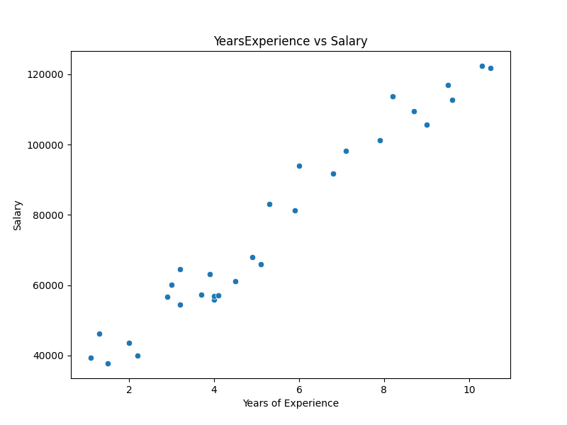
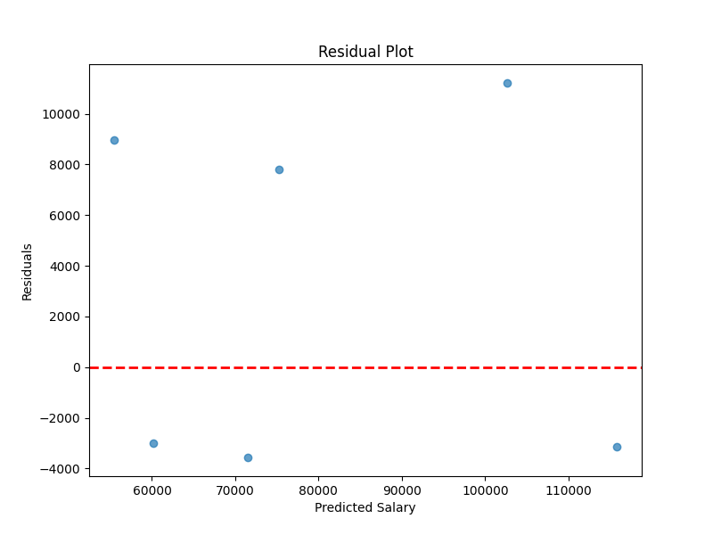

# Day 02: 線性回歸 (Linear Regression)

## 0. 歷史小故事/核心貢獻者:
線性回歸最早的數學基礎——**最小平方法 (Least Squares)**，由法國數學家 **勒讓德 (Adrien-Marie Legendre)** 於 1805 年首次發表，不過「數學王子」**高斯 (Carl Friedrich Gauss)** 聲稱他在 1795 年就已經在使用這套方法來計算天體軌道。有趣的是，「回歸 (Regression)」這個詞其實是後來由 **法蘭西斯·高爾頓 (Francis Galton)** 在研究父子身高遺傳關係時提出的；他發現極高或極矮父親的兒子，身高都會傾向於「回歸」到大眾平均值 (Regression to the mean)，這個生物學上的觀察後來與最小平方法結合，演變成了我們今日熟知的線性回歸。

## 1. 資料集來源
### 資料集來源：[Salary_Data.csv](https://github.com/krishnaik06/Simple-Linear-Regression/blob/master/Salary_Data.csv)
> 備註：原始資料來自 Kaggle 或機器學習入門教學常見的範例數據，此處使用 GitHub 公開資源作為下載點。

### 資料集特色與欄位介紹:
這是一個專為**簡單線性回歸 (Simple Linear Regression)** 設計的入門級資料集，特色如下：
1.  **極簡潔**：只有兩個欄位，非常適合初學者理解 $X$ 與 $y$ 的關係。
2.  **強相關性**：年資與薪水之間存在明顯的正相關，模型訓練效果通常很好。
3.  **無缺失值**：數據乾淨，不需要複雜的清洗步驟。
4.  **資料量少**：約 30 筆數據，運算速度極快。

**欄位說明**：
*   **YearsExperience (特徵 X)**: 工作年資 (數值型)。代表員工在該領域的工作年數。
*   **Salary (目標 y)**: 年薪 (數值型)。代表對應年資的薪資水平。

我們想知道，**年資每增加一年，薪水會增加多少？** 這就是最典型的線性回歸問題。



### 資料清理
1.  **檢查缺失值**：此資料集通常完整，無缺失值。
2.  **資料分割**：將資料分為 80% 訓練集與 20% 測試集。
3.  **特徵縮放**：雖然單變量回歸不一定需要，但為了養成好習慣，我們使用 `StandardScaler` 進行標準化。

## 2. 原理
### 核心公式與參數
線性回歸試圖找到一條直線 $y = ax + b$ 來擬合數據。
* **$a$ (Coefficient/Slope)**: 斜率，代表年資對薪水的影響力。
* **$b$ (Intercept/Bias)**: 截距，代表起薪 (年資為 0 時的薪水)。

**損失函數 (Loss Function)**：
我們使用 **均方誤差 (MSE, Mean Squared Error)** 來衡量預測值與真實值的差距：
$$MSE = \frac{1}{n} \sum_{i=1}^{n} (y_i - \hat{y}_i)^2$$
目標是找到一組 $(a, b)$ 使得 MSE 最小。這通常透過 **最小平方法 (OLS)** 或 **梯度下降 (Gradient Descent)** 來達成。

**最小平方法 (OLS, Ordinary Least Squares)**：
這是最經典的解法，直接利用微積分推導出公式解 (Normal Equation)，一步到位算出最佳的 $a$ 和 $b$。
*   **優點**：精確解，不需要調整學習率，數據量小時速度極快。
*   **本教學採用**：Scikit-Learn 的 `LinearRegression` 預設就是使用 OLS，因為我們的資料量 (30筆) 非常小，用公式解最有效率。

**梯度下降 (Gradient Descent) 直覺**：
想像你被矇住眼睛放在一座山上，目標是走到山谷最低點 (Loss 最小)。
1.  **隨機起點**：隨便猜一組 $a, b$。
2.  **試探方向**：用腳感覺一下，哪個方向是「下坡」 (計算梯度)。
3.  **走一步**：往其下坡方向走一步 (更新參數)。步伐大小由 **學習率 (Learning Rate)** 決定。
4.  **重複**：不斷重複直到走到谷底。

**隨機梯度下降 (SGD, Stochastic Gradient Descent)**：
標準的梯度下降每次都要看完「所有」資料才走一步 (Batch GD)，這在資料量大時太慢了。
SGD 的策略是：**「隨便抽一筆資料，算一下梯度就走一步」**。
*   **優點**：速度極快。
*   **缺點**：路徑會彎彎曲曲 (因為只看一筆資料不準)，但長期來看還是會往谷底走。
這就是為什麼深度學習 (Deep Learning) 幾乎都使用 SGD 或其變形 (如 Adam)。

## 3. 實戰
### Python 程式碼實作
完整程式連結：[Linear_Regression_Salary.py](Linear_Regression_Salary.py)

```python
# 核心程式碼片段
model = LinearRegression()
model.fit(X_train_scaled, y_train)
y_pred = model.predict(X_test_scaled)
```

## 4. 模型評估
### 若為回歸模型 (Regression)
*   **指標數字**：
    *   **R-Squared (R2)**: `0.9024` (非常接近 1，代表模型解釋力極佳)
    *   **MSE**: `49830096.8559` (預測誤差的平方平均)
    *   **Intercept (b)**: `74207.62` (預測起薪)
    *   **Coefficient (a)**: `27151.54` (年資每增加一年，薪水增加約 27k)

*   **圖表**：
    *   **預測結果圖**：紅線為模型預測的趨勢線。
    
    
    *   **殘差圖 (Residual Plot)**：這張圖是用來檢查「預測誤差」的分佈情況。
    *   **理想狀態**：誤差點應該像「雜訊」一樣隨機散佈在紅線 (0) 的上下，代表模型已經把能抓的規律都抓到了。
    *   **本案觀察**：在我們的圖中，誤差點大致隨機分佈，沒有明顯的 U 型或漏斗型規律，這證明了「年資」與「薪水」之間確實存在很強的**線性關係**，使用 $y=ax+b$ 來預測是合適的。
    

## 5. 戰略總結:模型訓練的火箭發射之旅

### (回歸與監督式學習適用day2-12)
引用大師-吳恩達教授的 Rocket 進行說明Bias vs Variance：


#### 5.1 流程一：推力不足，無法升空 (Underfitting 迴圈)
*   **設定**：使用簡單的線性模型 ($y=ax+b$)。
*   **第一關：訓練集表現好嗎？** 若 R2 很低，代表模型太簡單 (Underfitting)。
*   **行動 (Action)**：增加特徵 (如多項式特徵 $x^2$) 或換更強的模型。

#### 5.2 流程二：動力太強，失控亂飛 (Overfitting 迴圈)
*   **設定**：使用了過於複雜的模型 (如高階多項式)。
*   **第一關：訓練集表現好嗎？** 很好 (R2 接近 1)。
*   **第二關：測試集表現好嗎？** 很差 (R2 低，MSE 高)。
*   **行動 (Action)**：收集更多數據、減少特徵、或使用正則化 (Regularization, Day 04)。

#### 5.3 流程三：完美入軌 (The Sweet Spot)
*   **設定**：適當的模型複雜度。
*   **第一關 & 第二關**：訓練集與測試集表現都很好。
*   **結果**：完成！在此案例中，單變量線性回歸通常就能達到不錯的效果。

## 6. 總結
Day 02 我們學習了機器學習的 "Hello World" —— 線性回歸。
*   理解了 $y=ax+b$ 的幾何意義。
*   學會使用 `scikit-learn` 建立模型。
*   學會看懂 MSE 與 R2 指標。
下一章 (Day 03)，我們將挑戰更複雜的 **多元線性回歸**，處理多個特徵的情況！
