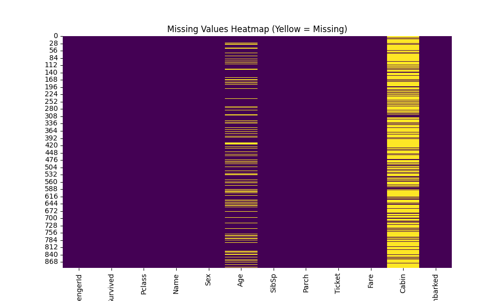

# Day 05: 數據預處理 (Data Preprocessing) - 鐵達尼號生存預測

## 0. 歷史小故事/核心貢獻者:
**鐵達尼號 (RMS Titanic)** 的沉沒是歷史上最著名的海難之一。1912 年 4 月 15 日，這艘號稱「永不沉沒」的郵輪在處女航中撞上冰山。雖然這是一場悲劇，但留下的乘客名單數據卻成為了數據科學界最經典的入門教材 (Hello World of Data Science)。這份數據集最早由 Kaggle 平台推廣，讓無數初學者學習如何從混亂的乘客資訊 (年齡、票價、艙等) 中預測生存機率。

## 1. 資料集來源
### 資料集來源：[Titanic - Machine Learning from Disaster](https://www.kaggle.com/c/titanic/data)
> 備註：本教學使用公開的 CSV 版本，方便直接下載練習。

### 資料集特色與欄位介紹:
這是一個充滿「真實世界問題」的資料集：有缺失值、有文字、有數字、有雜訊。
1.  **缺失值 (Missing Values)**：年齡 (Age) 缺了約 20%，客艙 (Cabin) 缺了 77%。
2.  **混合型特徵**：包含數值 (Age, Fare) 與類別 (Sex, Embarked)。
3.  **目標**：預測乘客是否生還 (Survived: 0=No, 1=Yes)。

**欄位說明**：
*   **Pclass (特徵)**: 艙等 (1=頭等, 2=二等, 3=三等)。社會地位的象徵。
*   **Sex (特徵)**: 性別 (male, female)。"Lady and children first" 是關鍵。
*   **Age (特徵)**: 年齡。
*   **SibSp/Parch (特徵)**: 兄弟姊妹/配偶數、父母/子女數。代表家庭大小。
*   **Fare (特徵)**: 票價。
*   **Embarked (特徵)**: 登船港口 (C=Cherbourg, Q=Queenstown, S=Southampton)。
*   **Survived (目標 y)**: 生存與否 (0=死亡, 1=生還)。

### 資料清理 (本章重點)
我們將建立一個標準的 **Scikit-Learn Pipeline** 來處理：
1.  **缺失值填補 (Imputation)**：年齡補平均值，港口補眾數。
2.  **類別編碼 (Encoding)**：性別與港口轉為 One-Hot Encoding。
3.  **特徵縮放 (Scaling)**：年齡與票價進行標準化。

## 2. 原理
### 數據預處理的三大支柱

#### 1. 缺失值處理 (Missing Data)
機器學習模型無法處理空值 (NaN)。
*   **刪除法 (Drop)**：如果缺很少，直接刪掉該筆資料。
*   **填補法 (Imputation)**：
    *   數值型：補平均數 (Mean) 或中位數 (Median)。
    *   類別型：補眾數 (Mode/Most Frequent)。

#### 2. 類別編碼 (Categorical Encoding)
機器只看得懂數字，看不懂 "Male", "Female"。
*   **Label Encoding**：轉成 0, 1, 2。缺點是會隱含大小關係 (如 2 > 1)，不適合非順序資料。
*   **One-Hot Encoding**：轉成虛擬變數 (001, 010, 100)。缺點是特徵會變多，但最安全。

#### 3. 特徵縮放 (Feature Scaling)
*   **標準化 (Standardization)**：
    $$z = \frac{x - \mu}{\sigma}$$
    將數據轉為平均值 0，標準差 1 的分佈。
*   **為什麼要做？** 避免「票價 (0-500)」的權重遠大於「年齡 (0-80)」，讓梯度下降收斂更快。

#### 4. 自動化流水線 (Pipeline)
這是 Scikit-Learn 的殺手級功能。
*   **概念**：將多個處理步驟 (填補 -> 編碼 -> 縮放 -> 模型) 串接成一個物件。
*   **好處**：
    1.  **程式碼簡潔**：不用寫一堆 `fit_transform`。
    2.  **防止資料洩漏 (Data Leakage)**：確保測試集 (Test Set) 永遠只用訓練集 (Train Set) 的統計數據 (如平均值) 來進行填補或縮放，這是新手最常犯的錯誤！
        *   **錯誤做法**：先算出「全班平均身高」，然後用這個平均值來填補「轉學生 (測試集)」的身高。這樣你就偷看了轉學生的資訊！
        *   **正確做法**：先算出「舊生平均身高」，然後用這個舊生的平均值來填補「轉學生」的身高。Pipeline 會自動幫你做到這點。

## 3. 實戰
### Python 程式碼實作
完整程式連結：[Data_Preprocessing_Titanic.py](Data_Preprocessing_Titanic.py)

```python
# 關鍵程式碼：建立預處理 Pipeline
numeric_transformer = Pipeline(steps=[
    ('imputer', SimpleImputer(strategy='mean')),
    ('scaler', StandardScaler())
])

categorical_transformer = Pipeline(steps=[
    ('imputer', SimpleImputer(strategy='most_frequent')),
    ('encoder', OneHotEncoder(drop='first'))
])
```

## 4. 模型評估 (預處理效果檢視)
本章不訓練模型，而是評估「數據品質的提升」。

*   **缺失值檢視**：
    *   **處理前**：黃色代表缺失，可以看到 Age (年齡) 有大量黃線，Cabin (客艙) 幾乎全黃。
    

*   **數據分佈比較 (Before vs After)**：
    *   **Before**：原始年齡分佈，範圍 0-80，有缺失。
    *   **After**：標準化後的年齡，中心在 0，範圍約 -2 到 +3，且無缺失值。這就是模型最喜歡吃的數據格式！
    

## 5. 戰略總結:模型訓練的火箭發射之旅

### (回歸與監督式學習適用day2-12)
引用大師-吳恩達教授的 Rocket 進行說明 Bias vs Variance：


#### 5.1 流程一：推力不足，無法升空 (Underfitting 迴圈)
*   **設定**：直接把有缺失值的原始數據丟進模型。
*   **結果**：程式直接報錯 (Crash)，連飛都飛不起來。這就是為什麼預處理是「地基」。

#### 5.2 流程二：動力太強，失控亂飛 (Overfitting 迴圈)
*   **設定**：不做標準化，直接訓練。
*   **結果**：模型可能會過度關注數值大的特徵 (如票價)，而忽略數值小的特徵 (如年齡)，導致預測失準。

#### 5.3 流程三：完美入軌 (The Sweet Spot)
*   **設定**：完整的 Pipeline (填補 -> 編碼 -> 縮放)。
*   **結果**：數據乾淨、格式統一，模型能以最高效率學習特徵間的關係。

## 6. 總結
Day 05 我們完成了機器學習最重要的一步 —— **數據預處理**。
*   **Garbage In, Garbage Out**：沒有好的預處理，再強的模型也是垃圾。
*   **Pipeline**：學會使用 Scikit-Learn 的 Pipeline 來自動化處理流程，這在未來部署時非常重要。

我們將利用處理好的鐵達尼號數據放到Day09再進行模型訓練，今天僅作資料預處理過程，下一章(Day 06)正式進入 **分類模型 (Classification)** 的世界，挑戰 **邏輯回歸 (Logistic Regression)**！
