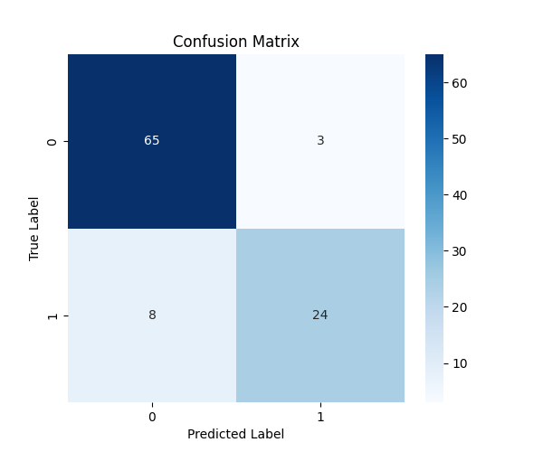
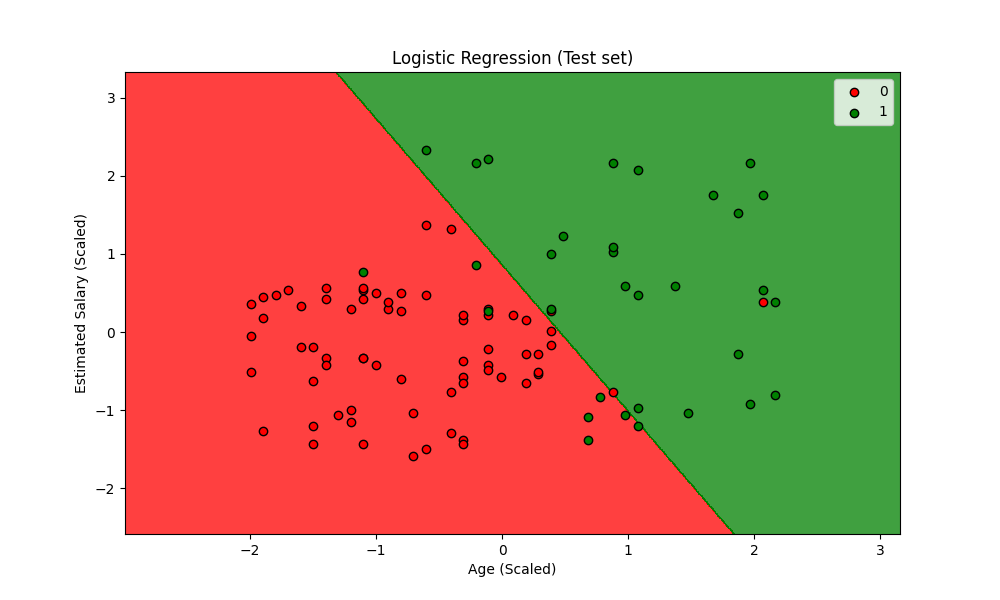

# Day 06: 邏輯回歸 (Logistic Regression) - 社交網絡廣告分類

## 0. 歷史小故事/核心貢獻者:
**皮埃爾·弗朗索瓦·韋呂勒 (Pierre François Verhulst)** 是一位比利時數學家。他在 19 世紀中期研究人口增長模型時，發現人口不會無限增長，而是會受到環境限制而趨於平緩，因而提出了 **Logistic Function (S型曲線)**。後來這個函數被統計學家借用，發展成了今天的邏輯回歸，用來處理「是/否」這類二元分類問題。雖然名字裡有「回歸」，但它可是不折不扣的**分類演算法**喔！

## 1. 資料集來源
### 資料集來源：[Social Network Ads](https://www.kaggle.com/rakeshrau/social-network-ads)
> 備註：這是一個經典的行銷資料集，模擬社交網絡用戶是否會購買特定產品。

### 資料集特色與欄位介紹:
這是一個非常適合視覺化分類邊界的 2D 資料集。
1.  **簡單明瞭**：主要特徵只有年齡和薪水。
2.  **目標明確**：預測用戶是否購買 (Purchased)。
3.  **線性可分性**：我們可以觀察年齡大且薪水高的人是否更容易購買。

**欄位說明**：
*   **User ID**: 用戶編號 (無用特徵，需移除)。
*   **Gender**: 性別 (本範例為了 2D 繪圖方便，暫時不使用)。
*   **Age (特徵 X1)**: 年齡。
*   **EstimatedSalary (特徵 X2)**: 預估薪資。
*   **Purchased (目標 y)**: 是否購買 (0=No, 1=Yes)。

### 資料清理
1.  **特徵選取**：只保留 `Age` 和 `EstimatedSalary`。
2.  **標準化**：使用 `StandardScaler`。這對於繪製漂亮的決策邊界非常重要。

## 2. 原理
### 2.1 核心公式與參數
邏輯回歸的核心是 **Sigmoid 函數**，它能將任何數值壓縮到 0 到 1 之間，代表「機率」。

$$P(y=1|x) = \frac{1}{1 + e^{-(ax+b)}}$$

*   **$ax+b$**：原本的線性回歸公式。

*   **Sigmoid**：將直線彎曲成 S 型曲線。
*   **決策邊界 (Decision Boundary)**：通常以 0.5 為界。機率 > 0.5 猜 1 (買)，機率 < 0.5 猜 0 (不買)。

### 2.2 特徵工程與穩定性分析 (Feature Engineering & Stability)
在建立信用評分卡 (Credit Scorecard) 或風險模型時，我們不僅關心準確率，更關心模型的**解釋性**與**穩定性**。

#### 特徵選擇與多重共線性 (Multicollinearity) 分析
*   **問題**：如果兩個特徵高度相關 (例如「年收入」和「月收入」)，模型會感到困惑，不知道該把權重給誰。這會導致參數估計不穩定，甚至正負號相反。
*   **檢測方法**：**VIF (Variance Inflation Factor, 變異數膨脹因子)**。
    *   通常 VIF > 10 (嚴格一點是 > 5) 代表存在嚴重共線性，建議移除該特徵或進行降維 (PCA)。
    *   **本案實測**：`Age` VIF = **4.58**，`EstimatedSalary` VIF = **4.58**。兩者皆小於 5，無嚴重共線性問題。

#### 分箱 (Binning) 與資訊值 (Information Value, IV) 檢定
*   **分箱 (Binning)**：將連續變數切成幾個區間 (例如：年齡 20-30, 30-40...)。
    *   **目的**：增加模型對異常值的魯棒性 (Robustness)，並捕捉非線性關係。
*   **WOE (Weight of Evidence)**：衡量每個箱子裡「好人/壞人」比例與整體比例的差異。
*   **IV (Information Value)**：衡量這整個特徵 (所有箱子加起來) 對預測目標有多大的貢獻。
    *   **IV < 0.02**: 無預測力 (Useless)
    *   **0.02 < IV < 0.1**: 弱預測力 (Weak)
    *   **0.1 < IV < 0.3**: 中等預測力 (Medium)
    *   **IV > 0.3**: 強預測力 (Strong) -> **這是我們要找的好特徵！**
    *   **本案實測**：
        *   `Age` IV = **2.40** (超強預測力)
        *   `EstimatedSalary` IV = **1.48** (超強預測力)
        *   結論：這兩個特徵都非常有效！

#### 樣本穩定性指標 (Population Stability Index, PSI)
*   **問題**：模型上線後，客群可能會改變 (例如：疫情爆發，大家的消費習慣變了)。這時候模型還準嗎？
*   **PSI**：用來衡量「開發時的樣本分佈」與「現在實際的樣本分佈」差多少。
    *   **PSI < 0.1**: 穩定 (No shift) -> 模型可以繼續用。
    *   **0.1 < PSI < 0.25**: 略有變動 (Minor shift) -> 需密切觀察。
    *   **PSI > 0.25**: 重大變動 (Major shift) -> **模型失效，需要重新訓練！**
    *   **本案實測 (Train vs Test)**：
        *   `Age` PSI = **0.18** (略有變動，需觀察)
        *   `EstimatedSalary` PSI = **0.29** (重大變動，注意！因為資料量小且隨機切分，分佈差異較大)

### 2.4 評估指標概念 (Evaluation Metrics)
我們使用混淆矩陣 (Confusion Matrix) 來評估分類模型的表現。
*(詳細的評估指標如 Precision, Recall, F1-Score 與 ROC 曲線，我們將在 **Day 12** 進行深入探討)*


| | **真實狀況 (Actual Condition)** | |
| :--- | :---: | :---: |
| | **事實為真 (True)** | **事實為假 (False)** |
| **預測狀況 (Predicted Condition)** | | |
| **預測為 <span style="color:red; background-color:#ffe6e6; padding:2px;">陽性 (Positive)</span>** | **TP** | **FP** <br> (TYPE I ERROR) |
| **預測為 <span style="color:blue; background-color:#e6f3ff; padding:2px;">陰性 (Negative)</span>** | **FN** <br> (TYPE II ERROR) | **TN** |


## 3. 實戰
### Python 程式碼實作
完整程式連結：[Logistic_Regression_Ads.py](Logistic_Regression_Ads.py)

```python
# 關鍵程式碼：訓練邏輯回歸
from sklearn.linear_model import LogisticRegression
classifier = LogisticRegression(random_state=0)
classifier.fit(X_train, y_train)
```

## 4. 模型評估
### 若為分類模型 (Classification)
*   **混淆矩陣圖**：
    
*   **指標數字**：
    *   **Accuracy (準確率)**: `0.8900` **(本篇重點)**
        *   (TP + TN) / Total = (65 + 24) / 80 = 0.89
        *   這是最直觀的指標，代表「猜對的比例」。
    
    *(以下進階指標將於 [Day 12](../day12/README.md) 詳細解說)*
    *   **Precision (精確率)**: `0.8889`
        *   TP / (TP + FP) = 65 / (65 + 5) = 0.8889
    *   **Recall (召回率)**: `0.7500`
        *   TP / (TP + FN) = 65 / (65 + 5) = 0.7500
    *   **F1-Score**: `0.8136`
        *   2 * (Precision * Recall) / (Precision + Recall) = 2 * (0.8889 * 0.7500) / (0.8889 + 0.7500) = 0.8136
    *   **ROC 曲線 (ROC Curve)**：
    
        *   **橘色線**：模型的表現。越靠近左上角越好。
        *   **藍色虛線**：隨機猜測 (AUC=0.5)。
        *   **AUC 值**：曲線下的面積，越高代表模型區分正負樣本的能力越強。
    *   **AUC (Area Under Curve)**: `0.9540` - ROC 曲線下的面積。0.5 代表亂猜，1.0 代表完美預測。

    *   **決策邊界圖 (Decision Boundary)**：這是 Day 06 的重頭戲！
    
        *   **紅色區域**：模型預測「不會買」的範圍。
        *   **綠色區域**：模型預測「會買」的範圍。
        *   **觀察**：看看紅綠交界的那條線 (直線)，就是邏輯回歸畫出的「界線」。
        *   **邊界怎麼算的？** 邏輯回歸會計算一個機率 $P(y=1|x)$。當機率等於 **0.5** 時，就是這條線。
            *   公式推導：當 $Sigmoid(z) = 0.5$ 時，代表 $z = 0$。
            *   也就是 $ax_1 + bx_2 + c = 0$。這在數學上就是一條直線方程式！所以邏輯回歸的邊界永遠是直的。
    
## 5. 戰略總結:模型訓練的火箭發射之旅

### (回歸與監督式學習適用day2-12)
引用大師-吳恩達教授的 Rocket 進行說明 Bias vs Variance：


#### 5.1 流程一：推力不足，無法升空 (Underfitting 迴圈)
*   **設定**：只用「年齡」一個特徵來預測。
*   **結果**：決策邊界會變成一條垂直線，無法區分「年輕但有錢」的族群，導致分類錯誤率高。

#### 5.2 流程二：動力太強，失控亂飛 (Overfitting 迴圈)
*   **設定**：使用高次多項式特徵 (如 $Age^{10}$) 且不加正則化。
*   **結果**：決策邊界會扭曲成奇怪的形狀，硬要把每一個訓練樣本都分對，結果在測試集上表現很差。

#### 5.3 流程三：完美入軌 (The Sweet Spot)
*   **設定**：使用 Age 和 Salary，並配合適當的正則化 (LogisticRegression 預設有 L2 penalty)。
*   **結果**：畫出一條漂亮的斜線，將大部分的紅點和綠點分開。

## 6. 總結
Day 06 我們正式進入了 **分類 (Classification)** 的領域。
*   **邏輯回歸**：雖然叫回歸，但它是最基礎的分類器。
*   **Sigmoid**：將數值轉為機率的魔法函數。
*   **決策邊界**：視覺化分類模型最直觀的方式。
下一章 (Day 07)，我們將學習一個更直覺、不需要算公式的分類演算法 —— **K-近鄰 (K-Nearest Neighbors, KNN)**！
