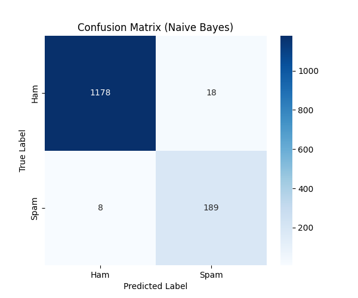
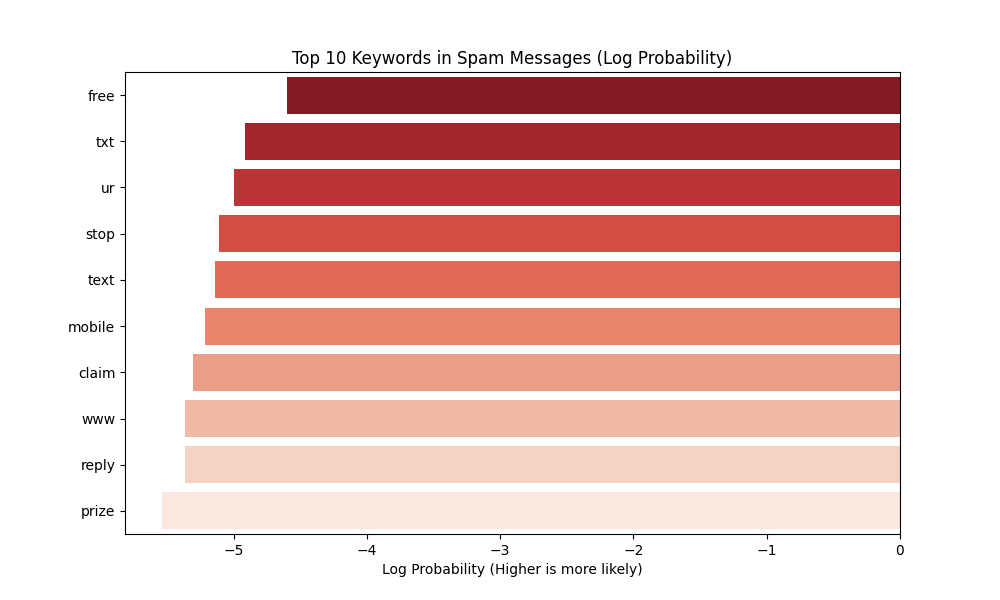

# Day 08: 樸素貝氏 (Naive Bayes) - 垃圾郵件過濾

## 0. 歷史小故事/核心貢獻者:
**Thomas Bayes (托馬斯·貝氏)** 是一位 18 世紀的英國牧師和數學家。他生前從未發表過這著名的「貝氏定理」，是在他死後由朋友整理筆記才公諸於世的。這個定理描述了「在已知某些條件下，某事件發生的機率」。雖然「樸素 (Naive)」貝氏假設特徵之間互相獨立這點在現實中很少見 (例如 "Credit" 和 "Card" 常一起出現)，但它在垃圾郵件過濾等文本分類任務上卻出奇地有效且快速。

## 1. 資料集來源
### 資料集來源：[SMS Spam Collection](https://archive.ics.uci.edu/ml/datasets/SMS+Spam+Collection)
> 備註：這是一個包含 5,574 條英文簡訊的公開資料集，標記為 Ham (正常) 或 Spam (垃圾)。

### 資料集特色與欄位介紹:
這是一個經典的 **自然語言處理 (NLP)** 入門資料集。
1.  **非結構化文字**：資料是人類語言，需要轉換成電腦看得懂的數字 (向量化)。
2.  **類別不平衡**：正常簡訊 (Ham) 遠多於垃圾簡訊 (Spam)，這在現實中很常見。

**欄位說明**：
*   **Category (目標 y)**: 類別 (ham=正常, spam=垃圾)。
*   **Message (特徵 X)**: 簡訊內容文字。

### 資料清理與前處理
1.  **文字清洗**：去除標點符號、轉小寫 (Lowercase)。
2.  **向量化 (Vectorization)**：使用 **Bag of Words (詞袋模型)**。
    *   我們使用 `CountVectorizer` 來統計每個單字在每則簡訊中出現的次數。
    *   例如："I love AI" -> [I:1, love:1, AI:1]。

## 2. 原理
### 核心公式與參數
樸素貝氏的核心就是 **貝氏定理 (Bayes' Theorem)**：

$$P(A|B) = \frac{P(B|A) \times P(A)}{P(B)}$$

在垃圾郵件過濾的情境下：
$$P(Spam|Word) = \frac{P(Word|Spam) \times P(Spam)}{P(Word)}$$

*   **P(Spam|Word)**：(後驗機率) 看到這個字，它是垃圾郵件的機率是多少？
*   **P(Word|Spam)**：(似然性) 如果是垃圾郵件，這個字出現的機率是多少？(模型從訓練資料學到的)
*   **P(Spam)**：(先驗機率) 總體來說，垃圾郵件出現的機率是多少？
*   **樸素 (Naive)**：假設每個單字出現的機率是**獨立**的 (互不影響)。這簡化了計算，讓模型跑得飛快。

### 從機率到決策 (Probability to Decision)
這就是連接「貝氏公式」與「混淆矩陣」的關鍵橋樑：
1.  模型會分別計算這封信是 Spam 的機率 $P(Spam|Message)$ 和 Ham 的機率 $P(Ham|Message)$。
2.  **比大小**：如果 $P(Spam) > P(Ham)$，模型就**預測為 1 (Spam)**；反之則預測為 0 (Ham)。
3.  **產生混淆矩陣**：
    *   如果預測為 1，且實際上真的是 1 $\rightarrow$ **TP (抓到了！)**
    *   如果預測為 1，但實際上是 0 $\rightarrow$ **FP (誤判)**
    *   這就是為什麼我們需要混淆矩陣來評估模型「比大小」的結果準不準。

### 關鍵技術：拉普拉斯平滑 (Laplace Smoothing)
*   **問題**：如果有一個字從來沒在垃圾郵件訓練集中出現過 (例如 "Pokemon")，那麼 $P("Pokemon"|Spam) = 0$。
*   **後果**：根據公式，只要有一個機率是 0，整封信是 Spam 的機率就會變成 0 (因為是連乘)。這顯然不合理！
*   **解法**：**平滑化**。就像給每個單字的計數都 **+1**。
    *   這樣就算沒出現過的字，機率也會是一個很小的數 (而不是 0)，不會讓整個計算崩潰。
    *   sklearn 的 `MultinomialNB(alpha=1.0)` 預設就開啟了這個功能。

## 3. 實戰
### Python 程式碼實作
完整程式連結：[Naive_Bayes_Spam.py](Naive_Bayes_Spam.py)

```python
# 關鍵程式碼：文字轉向量與訓練
from sklearn.feature_extraction.text import CountVectorizer
from sklearn.naive_bayes import MultinomialNB

# 1. 文字轉向量
vectorizer = CountVectorizer(stop_words='english')
X_train_counts = vectorizer.fit_transform(X_train)

# 2. 訓練樸素貝氏模型 (MultinomialNB 適合計數資料)
# alpha=1.0 代表啟用拉普拉斯平滑
clf = MultinomialNB(alpha=1.0)
clf.fit(X_train_counts, y_train)
```

## 4. 模型評估
### 若為分類模型 (Classification)
*   **混淆矩陣圖**：
    
*   **指標數字**：
    *   **Accuracy (準確率)**: `0.9835` (非常高！)
    *   **Precision (精確率)**: `0.9786` (預測是垃圾郵件中，97.8% 真的是垃圾郵件。這很重要，我們不想把重要信件誤判為垃圾。)
    *   **Recall (召回率)**: `0.9150` (實際的垃圾郵件中，抓出了 91.5%。漏掉一些垃圾信還可以接受。)
    
*   **關鍵字分析 (Top Spam Words)**：
    
    *   模型學到了什麼？看看垃圾郵件中最常出現的關鍵字：
    *   **free, txt, mobile, claim, prize, won**
    *   這完全符合我們的直覺！看到 "Free Prize" 通常就是詐騙。

## 5. 戰略總結:模型訓練的火箭發射之旅

### (回歸與監督式學習適用day2-12)
引用大師-吳恩達教授的 Rocket 進行說明 Bias vs Variance：


#### 5.1 流程一：推力不足，無法升空 (Underfitting 迴圈)
*   **設定**：只用少數幾個關鍵字 (如 "free") 來判斷。
*   **結果**：很多沒有 "free" 但依然是垃圾郵件的信會被漏掉 (High Bias)。

#### 5.2 流程二：動力太強，失控亂飛 (Overfitting 迴圈)
*   **設定**：把所有出現過的字 (包含人名、特定日期) 都當作特徵，且不做停用詞處理。
*   **結果**：模型可能會記住某個特定的人名就是垃圾郵件，導致新郵件誤判 (High Variance)。

#### 5.3 流程三：完美入軌 (The Sweet Spot)
*   **設定**：使用 Bag of Words，去除停用詞 (Stopwords)，並啟用 **拉普拉斯平滑 (Laplace Smoothing)**。
*   **結果**：模型能泛化地識別 "claim", "prize" 等高風險詞彙，且不會因為遇到新單字而當機，準確過濾垃圾郵件。

## 6. 總結
Day 08 我們進入了 **NLP (自然語言處理)** 的大門。
*   **文字向量化**：電腦看不懂字，要用 `CountVectorizer` 變成數字。
*   **貝氏定理**：利用機率來做分類，簡單暴力且有效。
*   **應用**：樸素貝氏是垃圾郵件過濾的基石，至今仍被廣泛使用。
下一章 (Day 09)，我們將學習 **決策樹 (Decision Tree)**，這是一種像人類思考一樣，畫出流程圖來做決策的模型！
