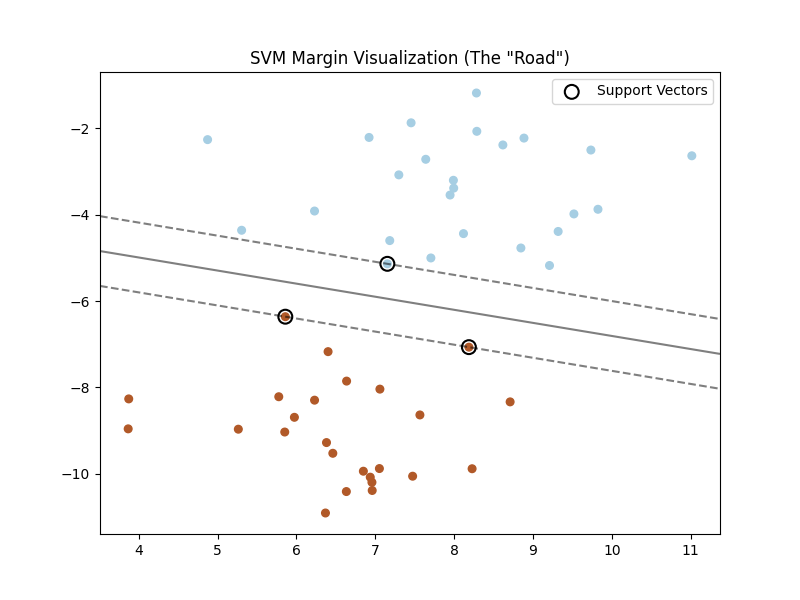
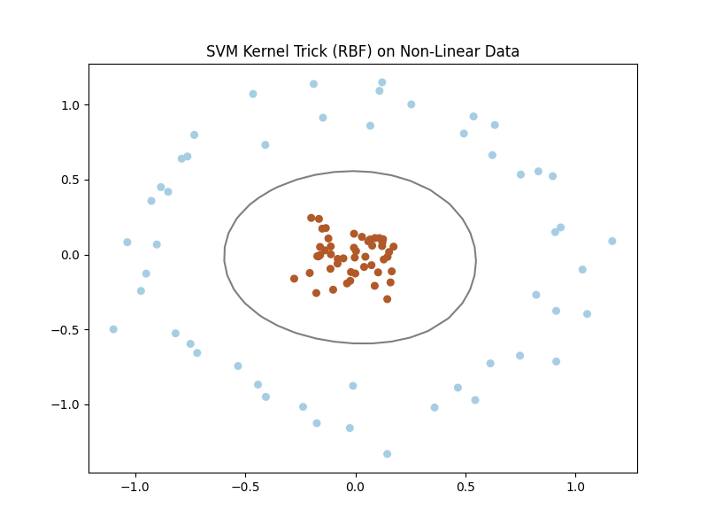
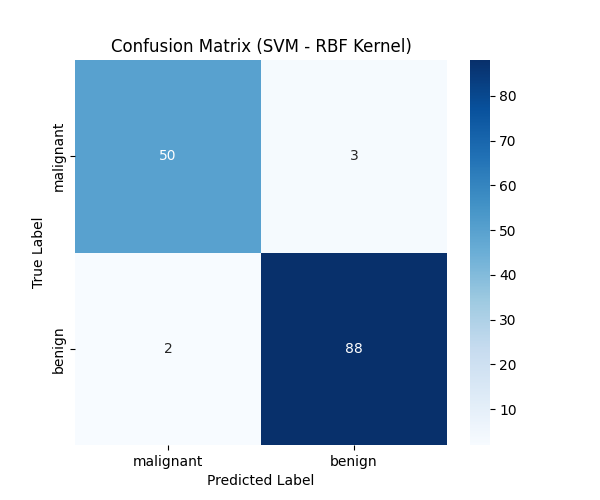
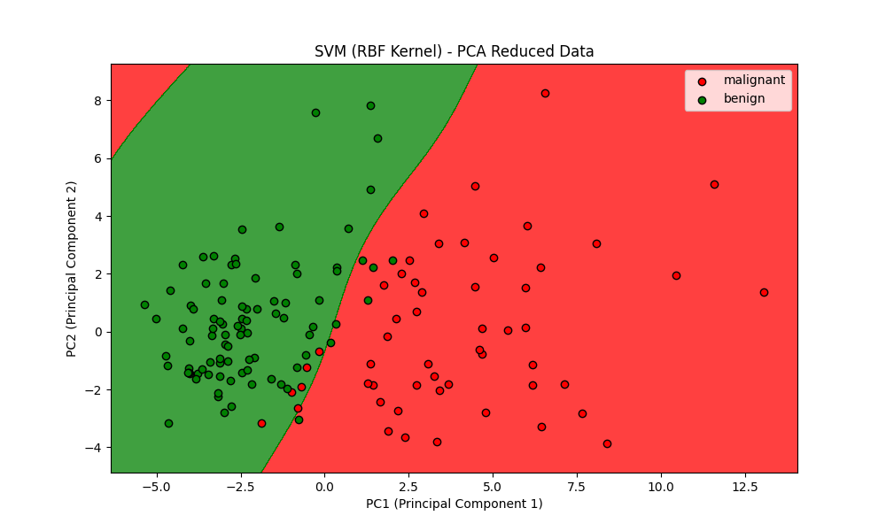

# Day 10: 支持向量機 (SVM) - 乳癌檢測

## 0. 歷史小故事/核心貢獻者:
**Vladimir Vapnik (弗拉基米爾·萬普尼克)** 是一位俄羅斯數學家。他在 1960 年代就提出了 SVM 的理論基礎，但直到 1990 年代，隨著核函數 (Kernel Trick) 的引入，SVM 才真正大放異彩。在深度學習 (Deep Learning) 爆紅之前，SVM 曾經統治了機器學習界長達 20 年，被認為是數學理論最完備、效果最好的分類器。

## 1. 資料集來源
### 資料集來源：[Breast Cancer Wisconsin (Diagnostic) Dataset](https://archive.ics.uci.edu/ml/datasets/Breast+Cancer+Wisconsin+(Diagnostic))
> 備註：這是一個非常經典的醫學診斷資料集，用於判斷腫瘤是良性還是惡性。

### 資料集特色與欄位介紹:
這是一個高維度的二元分類問題 (30 個特徵)。
1.  **高維度**：特徵是從細胞核的數位影像中計算出來的，包含半徑、紋理、周長、面積等幾何特徵。
2.  **類別不平衡**：良性樣本多於惡性樣本。

**欄位說明**：
*   **Target (目標 y)**: 0 = Malignant (惡性), 1 = Benign (良性)。
*   **Features (特徵 X)**: 30 個數值特徵 (如 mean radius, mean texture...)。

### 資料清理
1.  **無需缺失值處理**：sklearn 內建的版本非常乾淨。
2.  **標準化 (Standardization)**：**絕對必要！**
    *   SVM 是基於「距離」來尋找最佳邊界的。
    *   如果特徵尺度不同 (例如面積是 1000，平滑度是 0.1)，SVM 會被大數值的特徵拉著走，導致模型失效。

## 2. 原理
### 核心概念：畫一條最寬的馬路
SVM 的目標不只是要把紅點和綠點分開，而是要分得**越開越好**。



1.  **超平面 (Hyperplane)**：圖中的**黑色實線**。這是我們的決策邊界。
2.  **邊際 (Margin)**：兩條**黑色虛線**之間的寬度 (馬路的寬度)。SVM 的目標就是**最大化這個寬度**。
3.  **支持向量 (Support Vectors)**：圖中**被圈起來的點**。它們剛好踩在馬路的邊緣上，是「關鍵少數」。
    *   **直覺**：只有這些點重要，其他的點就算刪掉，這條馬路也不會變 (因為它們離馬路很遠，不影響邊界)。

#### 數學原理 (The Math)
如果你不怕數學，這就是 SVM 真正想解的問題：
1.  **決策邊界公式**：
    $$w \cdot x + b = 0$$
    *   $w$ 是法向量 (決定線的方向)，$b$ 是截距 (決定線的位置)。
2.  **最大化邊際**：馬路的寬度等於 $\frac{2}{||w||}$。
    *   為了讓路越寬越好，我們需要 **最小化 $||w||^2$**。
3.  **限制條件**：
    $$y_i (w \cdot x_i + b) \ge 1$$
    *   這代表所有的點都必須乖乖地待在馬路 (Margin) 的兩側，不能跑進來。

### 核函數 (Kernel Trick) - SVM 的大絕招
如果資料在 2D 空間中根本分不開 (例如下圖的同心圓，紅點被藍點包圍) 怎麼辦？



*   **想法**：把資料投影到更高維度 (3D, 4D...)，也許在那個空間就能用一個平面切開了！
*   **Kernel Trick**：這是一個數學魔法，讓我們不用真的去計算高維度的座標 (那樣計算量太大了)，就能達到「好像在高維度運算」的效果。
    *   **Linear Kernel (線性核)**：最簡單的核函數，不做投影，直接在原始空間切一刀。適合特徵已經很多的資料 (如文字分類)。
    *   **RBF Kernel (徑向基函數)**：如圖所示，它能畫出一個圓形的邊界，完美包圍住中間的紅點。這在原始 2D 空間看來是曲線，但在高維空間其實是一個平面切過了一個「山丘」。

### 核心公式與參數 (Formulas & Parameters)
SVM 的數學很深奧，但我們只要懂兩個最重要的參數：

#### 1. 核函數公式
*   **Linear Kernel**: $K(x, x') = x \cdot x'$ (單純的內積)
*   **RBF Kernel**:
    $$K(x, x') = \exp(-\gamma ||x - x'||^2)$$
    *   這裡的 **$\gamma$ (Gamma)** 就是控制高斯分佈寬度的參數。

#### 2. 關鍵參數 (C 與 Gamma)
*   **C (懲罰係數)**：出現在 **Soft Margin** 的目標函數中：
    $$min \frac{1}{2}||w||^2 + C \sum \xi_i$$
    *   $\xi_i$ 是每個點的錯誤距離 (跑進馬路的距離)。
    *   **大 C**：權重很大，代表**非常在意錯誤** $\rightarrow$ **嚴格** (Hard Margin)，容易 Overfitting。
    *   **小 C**：權重很小，代表**不太在意錯誤** $\rightarrow$ **寬鬆** (Soft Margin)，追求更寬的邊界。
*   **Gamma ($\gamma$)**：控制 RBF 核函數的「影響範圍」。
    *   **大 Gamma**：**短視近利**。只看附近的點，邊界會扭曲得很複雜 (容易 Overfitting)。
    *   **小 Gamma**：**遠見**。考慮較遠的點，邊界比較平滑。

## 3. 實戰
### Python 程式碼實作
完整程式連結：[SVM_Breast_Cancer.py](SVM_Breast_Cancer.py)

```python
# 關鍵程式碼：訓練 SVM
from sklearn.svm import SVC
# kernel='rbf': 使用非線性核函數
# random_state=0: 固定隨機種子
classifier = SVC(kernel='rbf', random_state=0)
classifier.fit(X_train_scaled, y_train)
```

## 4. 模型評估
### 若為分類模型 (Classification)
*   **混淆矩陣圖**：
    
*   **指標數字**：
    *   **Linear Kernel Accuracy**: `0.9720`
    *   **RBF Kernel Accuracy**: `0.9650`
    *   **觀察**：在這個案例中，線性核竟然比 RBF 稍微好一點點！這說明了當特徵維度很高 (30維) 時，資料往往已經是線性可分的，不需要太複雜的非線性轉換。

*   **決策邊界圖 (Visualization with PCA)**：
    
    *   **座標軸 (PC1, PC2)**：因為原本有 30 個特徵 (30維) 我們無法畫圖，所以用 PCA (主成分分析) 把它壓縮成 2 個最具代表性的新特徵 (PC1, PC2)。這就像是把一個立體的地球拍成一張平面的地圖。
    *   **顏色區域**：
        *   **紅色區域**：模型預測為「惡性 (Malignant)」的地盤。
        *   **綠色區域**：模型預測為「良性 (Benign)」的地盤。
    *   **邊界線**：紅綠交界的那條線就是 **決策邊界 (Hyperplane)**。
        *   如果是 Linear Kernel，這條線會是直的。
        *   如果是 RBF Kernel (如圖)，這條線會是彎曲的、封閉的圓圈或不規則形狀，這證明了 SVM 有能力處理複雜的非線性分類問題。

## 5. 戰略總結:模型訓練的火箭發射之旅

### (回歸與監督式學習適用day2-12)
引用大師-吳恩達教授的 Rocket 進行說明 Bias vs Variance：


#### 5.1 流程一：推力不足，無法升空 (Underfitting 迴圈)
*   **設定**：使用 Linear Kernel 處理明顯非線性的資料 (例如太極圖)。
*   **結果**：怎麼切都切不乾淨，準確率很低。

#### 5.2 流程二：動力太強，失控亂飛 (Overfitting 迴圈)
*   **設定**：使用 RBF Kernel 且把 `C` (懲罰係數) 設得非常大，或 `gamma` 設得很大。
*   **結果**：邊界會扭曲得非常誇張，硬要把每一個訓練樣本都分對，導致 Margin 變得很窄，泛化能力差。

#### 5.3 流程三：完美入軌 (The Sweet Spot)
*   **設定**：使用 RBF Kernel，並透過 Grid Search 找到合適的 `C` 和 `gamma`。
*   **結果**：畫出一條平滑且寬度適中的邊界，既能分開大部分樣本，又有足夠的容錯空間。

## 6. 總結
Day 10 我們學習了 **SVM (Support Vector Machine)**。
*   **最大化邊際 (Max Margin)**：這是 SVM 最核心的哲學，追求最寬的馬路。
*   **核函數 (Kernel)**：讓 SVM 能處理非線性問題的神奇魔法。
*   **高維度王者**：在特徵很多 (如基因數據、影像特徵) 但樣本數不多的情況下，SVM 往往是首選。
下一章 (Day 11)，我們將暫停介紹新模型，轉而探討如何讓模型變強的關鍵技術 —— **特徵工程 (Feature Engineering)**！
