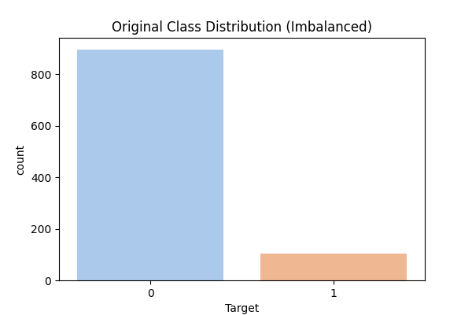
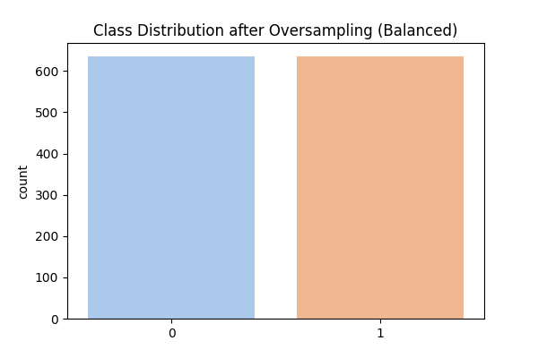
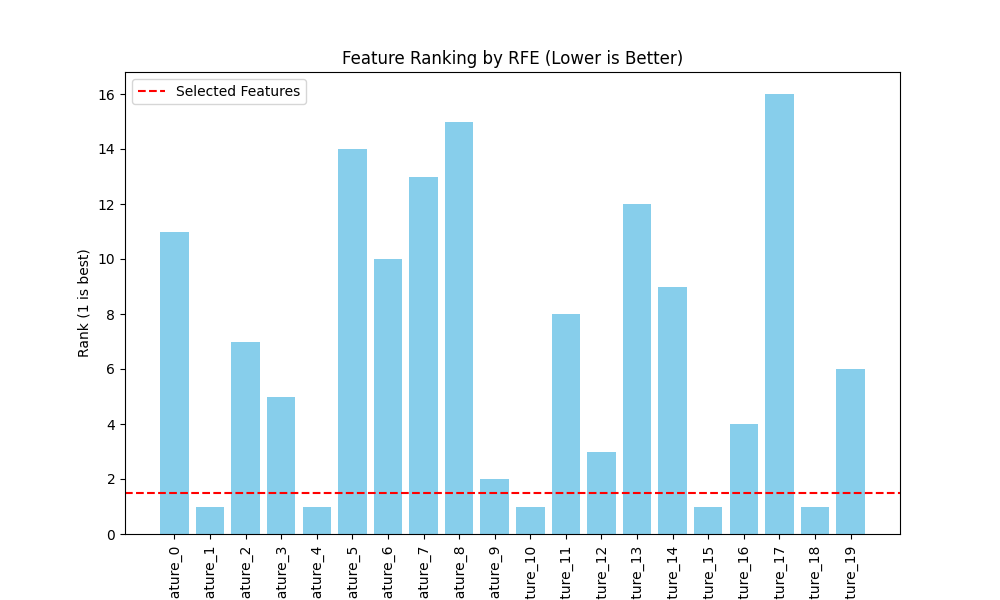
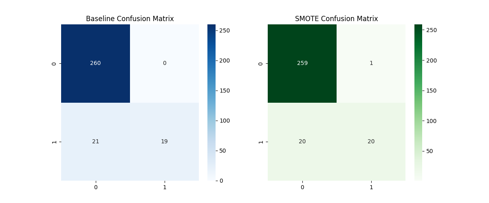

# Day 11: 特徵工程 (Feature Engineering) - 綜合案例

## 0. 歷史小故事/核心貢獻者:
**"Garbage In, Garbage Out" (GIGO)** 是電腦科學界的一句老話。在機器學習領域，這句話被演繹為：**「數據和特徵決定了機器學習的上限，而模型和演算法只是在逼近這個上限。」** 特徵工程 (Feature Engineering) 是一門藝術，它往往比調整模型參數 (Hyperparameter Tuning) 更能顯著提升模型效能。

## 1. 資料集來源
### 資料集來源：[Synthetic Imbalanced Dataset (模擬信用卡詐欺)]
> 備註：為了展示特徵工程的威力，我們使用 `sklearn.datasets.make_classification` 產生一個高度不平衡且包含雜訊特徵的模擬資料集。

### 資料集特色與欄位介紹:
這是一個模擬 **信用卡詐欺偵測** 的場景。
1.  **高度不平衡 (Imbalanced)**：正常交易 (Class 0) 佔 90%，詐欺交易 (Class 1) 僅佔 10%。
2.  **冗餘特徵 (Redundant Features)**：20 個特徵中，只有 5 個是有用的，其他都是雜訊或重複資訊。

**欄位說明**：
*   **Target (目標 y)**: 0 = Normal (正常), 1 = Fraud (詐欺)。
*   **Feature_0 ~ Feature_19**: 20 個數值特徵。

## 2. 原理
### 核心概念：如何讓模型變聰明？

#### 2.1 特徵選擇 (Feature Selection) - RFE
*   **問題**：特徵不是越多越好。雜訊特徵會讓模型分心 (Overfitting)，且增加計算量。
*   **解法**：**RFE (Recursive Feature Elimination，遞迴特徵消除)**。
    *   **原理**：像剝洋蔥一樣。
        1.  先用所有特徵訓練一個模型。
        2.  看哪個特徵最不重要 (權重最小)，把它踢掉。
        3.  重複上述步驟，直到剩下我們想要的數量 (例如 Top 5)。

#### 2.2 處理類別不平衡 (Handling Imbalance) - SMOTE
*   **問題**：如果詐欺只佔 1%，模型只要全部猜「正常」，準確率就有 99%。但這完全沒用！我們在乎的是那 1% 的詐欺。
*   **解法**：**SMOTE (Synthetic Minority Over-sampling Technique)**。
    *   **原理**：不只是單純複製少數樣本 (那樣容易 Overfitting)，而是「無中生有」。
        1.  隨機選一個少數類別樣本 A。
        2.  找它的鄰居 B (也是少數類別)。
        3.  在 A 和 B 的連線上，隨機產生一個新樣本 C。
    *   **效果**：讓少數類別的分布更豐富，模型更能學會怎麼抓詐欺。
    *   *(註：本實作因環境限制，使用隨機過採樣 Random Oversampling 替代，概念類似)*

## 3. 實戰
### Python 程式碼實作
完整程式連結：[Feature_Engineering.py](Feature_Engineering.py)

```python
# 關鍵程式碼：RFE 與 Oversampling

# 1. RFE 特徵選擇
from sklearn.feature_selection import RFE
# 每回合刪除 1 個特徵，直到剩下 5 個
selector = RFE(estimator=RandomForestClassifier(), n_features_to_select=5, step=1)
selector.fit(X_train, y_train)

# 2. 手動 Oversampling (模擬 SMOTE 效果)
minority_upsampled = minority_class.sample(n=len(majority_class), replace=True)
upsampled_data = pd.concat([majority_class, minority_upsampled])
```

## 4. 模型評估
### 比較特徵工程前後的差異

*   **原始分佈 vs 平衡後分佈**：
    
    
    *   可以看到經過處理後，詐欺樣本 (1) 的數量跟正常樣本 (0) 一樣多了。

*   **RFE 特徵排名**：
    
    *   RFE 成功識別出哪 5 個特徵是最重要的 (Rank 1)，其他雜訊特徵被排到了後面。

*   **混淆矩陣比較**：
    
    *   **Baseline (左圖)**：雖然準確率高，但可能漏抓很多詐欺 (Recall 低)。
    *   **Balanced (右圖)**：雖然可能會誤判一些正常交易 (FP 增加)，但能抓到更多的詐欺 (Recall 提升)。**在詐欺偵測中，抓到壞人通常比誤殺好人更重要！**

## 5. 戰略總結:模型訓練的火箭發射之旅

### (回歸與監督式學習適用day2-12)
引用大師-吳恩達教授的 Rocket 進行說明 Bias vs Variance：


#### 5.1 流程一：推力不足，無法升空 (Underfitting 迴圈)
*   **設定**：使用所有 20 個特徵，且不處理不平衡。
*   **結果**：模型被雜訊干擾，且因為詐欺樣本太少，模型根本學不會怎麼抓詐欺 (High Bias on Minority Class)。

#### 5.2 流程二：動力太強，失控亂飛 (Overfitting 迴圈)
*   **設定**：單純大量複製少數樣本 (沒有用 SMOTE 的插值技巧)，且特徵沒篩選。
*   **結果**：模型死記硬背那些重複的詐欺樣本，面對新的詐欺手法完全無效 (High Variance)。

#### 5.3 流程三：完美入軌 (The Sweet Spot)
*   **設定**：使用 RFE 挑出關鍵特徵 + 使用 SMOTE/Oversampling 平衡資料。
*   **結果**：模型專注於真正重要的訊號，且有足夠的樣本學習詐欺特徵，達到最佳的偵測效果。

## 6. 總結
Day 11 我們學習了 **特徵工程 (Feature Engineering)**。
*   **特徵選擇 (RFE)**：去蕪存菁，把雜訊丟掉。
*   **類別不平衡 (Imbalance)**：這是現實世界最常見的問題 (詐欺、罕見疾病)。
*   **解決方案**：透過 **Resampling (重採樣)** 技術，讓模型看到的世界是平衡的。
下一章 (Day 12)，我們將總結監督式學習，深入探討 **分類模型評估 (Evaluation Metrics)**，看懂那些複雜的成績單！
