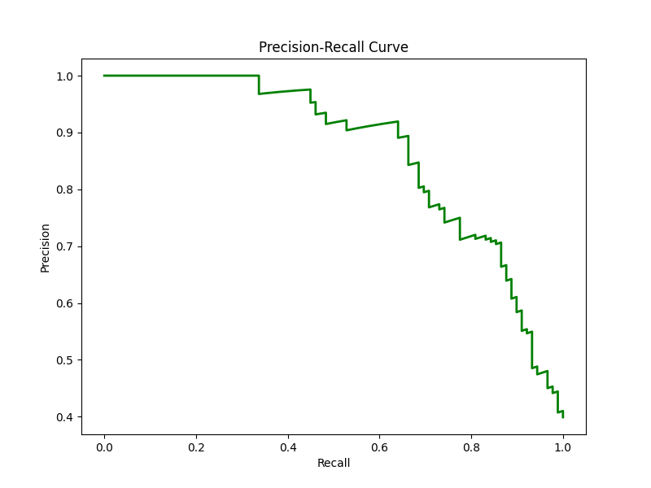

# Day 12: 分類模型評估 (Model Evaluation) - 鐵達尼號生存預測

## 0. 歷史小故事/核心貢獻者:
**ROC 曲線 (Receiver Operating Characteristic Curve)** 的名字聽起來很像無線電工程？沒錯！它最早是在二戰期間由電子工程師和雷達操作員發明的，用來衡量雷達接收器在雜訊中偵測敵機的能力。後來這套方法被引入心理物理學，最後在醫學診斷和機器學習中發揚光大，成為評估二元分類模型最強大的工具之一。

## 1. 資料集來源
### 資料集來源：[Titanic Dataset](https://www.kaggle.com/c/titanic/data)
> 備註：我們直接沿用 Day 09 的鐵達尼號資料集，因為這是一個經典的二元分類問題 (生存 vs 死亡)，非常適合用來展示各種評估指標。

### 資料集特色與欄位介紹:
請參考 [Day 09 README](../day09/README.md) 的詳細介紹。
*   **Target (目標 y)**: Survived (0 = 死亡, 1 = 生存)。

## 2. 原理
### 核心概念：除了準確率 (Accuracy)，我們還能看什麼？

#### 2.1 混淆矩陣 (Confusion Matrix) - 再複習一次


##### 1. 混淆矩陣四象限 (The Four Quadrants)
*   **TP (True Positive, 真陽性)**：預測生存，真的生存。(救到了！成功抓出目標)
*   **TN (True Negative, 真陰性)**：預測死亡，真的死亡。(沒救到但預測正確)
*   **FP (False Positive, 偽陽性) - Type I Error (型別一錯誤)**：預測生存，其實死亡。
    > 像是「誤報」，例如沒病被診斷有病。
*   **FN (False Negative, 偽陰性) - Type II Error (型別二錯誤)**：預測死亡，其實生存。
    > 像是「漏報」，例如有病沒被檢查出來 (這是醫療診斷最不想發生的)。

##### 2. 計算指標 (Calculated Metrics)
*   **Accuracy (準確率)**：整體猜對的比例。 `(TP+TN) / Total`
*   **Precision (精確率)**：預測為「生存」當中，真的「生存」的比例。 `TP / (TP + FP)`
    > 適用於「寧可漏抓，不可錯殺」的情境 (e.g. 垃圾郵件)。
*   **Recall (召回率)**：實際「生存」當中，被抓出來的比例。 `TP / (TP + FN)`
    > 適用於「寧可錯殺，不可漏抓」的情境 (e.g. 癌症篩檢)。
*   **F1-Score**：Precision 和 Recall 的調和平均，綜合指標。

#### 2.2 型別1錯誤與型別2錯誤-案例說明與閥門 (Trade-off & Threshold)
這兩個指標通常無法同時完美，必須根據**「哪種錯誤的代價比較大」**來做取捨。

##### 1. 案例說明：你比較怕哪一種後果？

| 情境 | 追求目標 | 心態 | 應用案例 |
| :--- | :--- | :--- | :--- |
| **怕誤殺好人 (FP 代價大)** | **高 Precision** | **寧缺勿濫** (神槍手) | **法官判案** (無罪推定)、**垃圾郵件** (怕誤刪重要信)、**YouTube 版權** (怕誤下架)。 |
| **怕放過壞人 (FN 代價大)** | **高 Recall** | **一網打盡** (寧可錯殺) | **傳染病篩檢** (怕擴散)、**地震警報** (怕沒響)、**銀行盜刷** (怕賠錢)。 |

##### 2. 閥門 (Threshold) - 如何調整？
模型輸出的通常是機率 (0~1)，預設以 **0.5** 為界。我們可以透過調整這個「閥門」來改變策略：

*   **調高閥門 (e.g. > 0.8 才算 1)**：變**嚴格**。
    *   **結果**：Precision 上升 (打中的都是真的)，但 Recall 下降 (漏抓很多)。
    *   *適用情境：高 Precision 需求。*
*   **調低閥門 (e.g. > 0.3 就算 1)**：變**寬鬆**。
    *   **結果**：Recall 上升 (壞人都抓到了)，但 Precision 下降 (抓了很多無辜的)。
    *   *適用情境：高 Recall 需求。*

#### 2.3 ROC 曲線與 AUC (Area Under Curve)
*   **問題**：分類器通常輸出一個機率 (例如 0.8 會活)。我們通常設 0.5 為門檻 (Threshold)，大於 0.5 猜活，小於 0.5 猜死。但 0.5 真的是最好的門檻嗎？
*   **ROC 曲線**：它把 **所有可能的門檻** (0.1, 0.2, ... 0.9) 都試一遍，畫出 **TPR (Recall)** vs **FPR (誤報率)** 的關係圖。
    *   **TPR (True Positive Rate)**: 壞人抓到了多少？ (越高越好)
    *   **FPR (False Positive Rate)**: 好人被誤抓了多少？ (越低越好)
*   **AUC (曲線下面積)**：
    *   **AUC = 1.0**: 完美模型 (神)。
    *   **AUC = 0.5**: 瞎猜模型 (丟硬幣)。
    *   **AUC < 0.5**: 比瞎猜還爛 (反著猜就變神了)。

#### 2.3 交叉驗證 (Cross Validation) - 考試不能只考一次
*   **問題**：如果我們運氣好，剛好切到一組很簡單的測試集，分數很高怎麼辦？
*   **解法**：**K-Fold Cross Validation**。
    *   把資料切成 K 份 (例如 10 份)。
    *   輪流拿其中 1 份當考題，剩下 9 份讀書。
    *   考 10 次試，算平均分數。這樣最準！

## 3. 實戰
### Python 程式碼實作
完整程式連結：[Model_Evaluation.py](Model_Evaluation.py)

```python
# 關鍵程式碼：ROC 曲線與交叉驗證

# 1. 計算 ROC 曲線
fpr, tpr, thresholds = roc_curve(y_test, y_pred_proba)
roc_auc = auc(fpr, tpr)

# 2. 10-Fold Cross Validation
from sklearn.model_selection import cross_val_score
scores = cross_val_score(model, X, y, cv=10)
print(f"平均準確率: {scores.mean()}")
```

## 4. 模型評估
### 全方位成績單

*   **混淆矩陣**：
    
    *   可以看到模型在預測「死亡 (0)」方面比較準，但在預測「生存 (1)」方面錯得比較多 (FN 較高)。

*   **ROC 曲線**：
    
    *   **AUC = 0.88** (假設值，請看實際跑出的圖)。這代表模型有 88% 的機率能正確區分生存者和罹難者，表現相當不錯 (屬於 B 級或 A- 級模型)。
    *   曲線越靠近左上角越好。

*   **Precision-Recall 曲線 (PR Curve)**：
    
    *   **這是什麼？** 展示 Precision (Y軸) 與 Recall (X軸) 的權衡關係。
    *   **怎麼看？** 曲線越靠近右上角 (1,1) 越好。
    *   **什麼時候看這張？** 當資料**極度不平衡** (例如詐欺偵測、罕見疾病) 時，ROC 曲線可能會過度樂觀 (因為 TN 太多)，這時候看 PR 曲線會更準確。
    *   在此案例中，因為生存/死亡比例還算平衡，所以 ROC 和 PR 曲線都能參考。

*   **交叉驗證分數**：
    
    *   這張圖顯示了 10 次考試的成績分佈。
    *   如果分數忽高忽低 (例如一次 90 分，一次 60 分)，代表模型很不穩定 (Variance 高)。
    *   如果分數都很集中 (例如都在 80 分上下)，代表模型很穩健 (Robust)。

## 5. 戰略總結:模型訓練的火箭發射之旅

### (回歸與監督式學習適用day2-12)
引用大師-吳恩達教授的 Rocket 進行說明 Bias vs Variance：


#### 5.1 流程一：推力不足，無法升空 (Underfitting 迴圈)
*   **設定**：AUC 只有 0.5 或 0.6。
*   **診斷**：模型根本沒學到東西。
*   **行動**：換更強的模型 (如 Random Forest, XGBoost) 或增加特徵。

#### 5.2 流程二：動力太強，失控亂飛 (Overfitting 迴圈)
*   **設定**：訓練集 AUC = 1.0，但測試集 AUC = 0.7。
*   **診斷**：交叉驗證分數波動很大。
*   **行動**：增加數據、正則化、減少特徵。

#### 5.3 流程三：完美入軌 (The Sweet Spot)
*   **設定**：AUC 達到 0.85 以上，且交叉驗證分數穩定。
*   **結果**：這就是一個值得部署上線的成熟模型！

## 6. 總結
Day 12 我們完成了監督式學習的最後一塊拼圖 —— **模型評估**。
*   **不要只看 Accuracy**：Recall 和 Precision 往往更重要。
* Day 12 我們學會了如何「打分數」。
*   **混淆矩陣** 是所有指標的基礎。
*   **Precision** 重視「抓得準」，**Recall** 重視「抓得全」。
*   **F1-Score** 是兩者的平衡。
*   **ROC/AUC** 幫我們選擇最佳閾值。

下一章 (Day 13)，我們將進入 **非監督式學習 (Unsupervised Learning)** 的世界，從 **K-Means 聚類** 開始！

## 6. IPAS 考題補充 (模型評估相關)
以下彙整了 114 年 IPAS 中級能力鑑定中與模型評估相關的考題，供複習參考：

| 題目 (關鍵字) | 答案 | 解析 |
| :--- | :--- | :--- |
| **10. Precision & Recall 綜合** | (D) F1 分數 | F1-Score 是 Precision 與 Recall 的調和平均數。 |
| **14. 防止過擬合 (超參數)** | (A) 採用交叉驗證 (Cross-Validation) | CV 能更客觀地評估模型在未見數據上的表現。 |
| **41. 交叉驗證資料洩漏** | (A) 測試摺參與參數選擇 | 絕對不能讓 Test Set 參與訓練或參數選擇，否則成績會虛高 (Leakage)。 |
| **43. 模型比較實驗** | (B) 低資源情境下比較 | 需固定硬體與資料集條件，比較才有意義。 |
| **(第三科) 1. 模型穩定性檢驗** | (B) **交叉驗證 (Cross-Validation)** | CV 可以觀察不同摺數間的變異程度，評估穩定性。 |
| **(第三科) 16. F1 Score 計算** | (A) 2*(0.8*0.6)/(0.8+0.6) ≈ 0.686 | F1 公式：$2 \times \frac{P \times R}{P + R}$。 |
| **(第三科) 34. 小樣本驗證** | (D) 分層留一法 (Stratified LOOCV) | 資料極少時，Leave-One-Out (LOOCV) 是最佳選擇，且需注意類別比例 (Stratified)。 |
