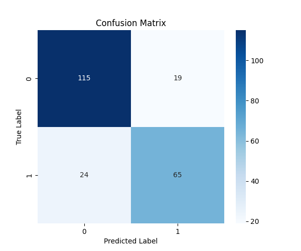
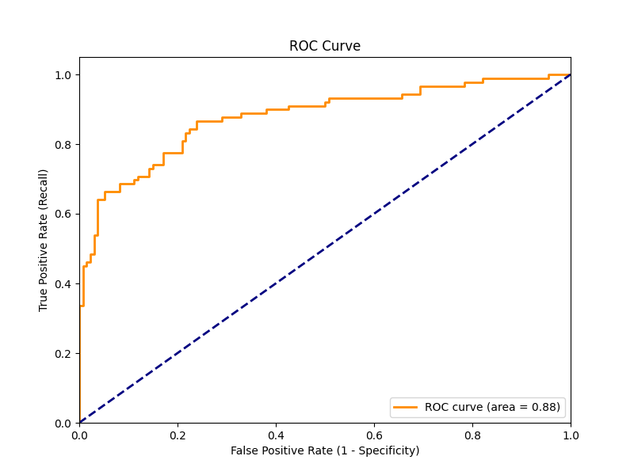
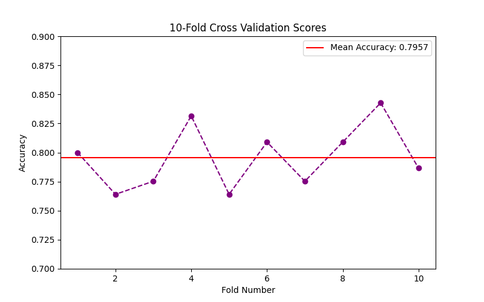

# Day 12: 分類模型評估 (Model Evaluation) - 鐵達尼號生存預測

## 0. 歷史小故事/核心貢獻者:
**ROC 曲線 (Receiver Operating Characteristic Curve)** 的名字聽起來很像無線電工程？沒錯！它最早是在二戰期間由電子工程師和雷達操作員發明的，用來衡量雷達接收器在雜訊中偵測敵機的能力。後來這套方法被引入心理物理學，最後在醫學診斷和機器學習中發揚光大，成為評估二元分類模型最強大的工具之一。

## 1. 資料集來源
### 資料集來源：[Titanic Dataset](https://www.kaggle.com/c/titanic/data)
> 備註：我們直接沿用 Day 09 的鐵達尼號資料集，因為這是一個經典的二元分類問題 (生存 vs 死亡)，非常適合用來展示各種評估指標。

### 資料集特色與欄位介紹:
請參考 [Day 09 README](../day09/README.md) 的詳細介紹。
*   **Target (目標 y)**: Survived (0 = 死亡, 1 = 生存)。

## 2. 原理
### 核心概念：除了準確率 (Accuracy)，我們還能看什麼？

#### 2.1 混淆矩陣 (Confusion Matrix) - 再複習一次
*   **TP (True Positive)**: 預測生存，真的生存 (救到了)。
*   **TN (True Negative)**: 預測死亡，真的死亡 (沒救到但預測正確)。
*   **FP (False Positive)**: 預測生存，其實死亡 (誤報)。
*   **FN (False Negative)**: 預測死亡，其實生存 (漏救)。

#### 2.2 ROC 曲線與 AUC (Area Under Curve)
*   **問題**：分類器通常輸出一個機率 (例如 0.8 會活)。我們通常設 0.5 為門檻 (Threshold)，大於 0.5 猜活，小於 0.5 猜死。但 0.5 真的是最好的門檻嗎？
*   **ROC 曲線**：它把 **所有可能的門檻** (0.1, 0.2, ... 0.9) 都試一遍，畫出 **TPR (Recall)** vs **FPR (誤報率)** 的關係圖。
    *   **TPR (True Positive Rate)**: 壞人抓到了多少？ (越高越好)
    *   **FPR (False Positive Rate)**: 好人被誤抓了多少？ (越低越好)
*   **AUC (曲線下面積)**：
    *   **AUC = 1.0**: 完美模型 (神)。
    *   **AUC = 0.5**: 瞎猜模型 (丟硬幣)。
    *   **AUC < 0.5**: 比瞎猜還爛 (反著猜就變神了)。

#### 2.3 交叉驗證 (Cross Validation) - 考試不能只考一次
*   **問題**：如果我們運氣好，剛好切到一組很簡單的測試集，分數很高怎麼辦？
*   **解法**：**K-Fold Cross Validation**。
    *   把資料切成 K 份 (例如 10 份)。
    *   輪流拿其中 1 份當考題，剩下 9 份讀書。
    *   考 10 次試，算平均分數。這樣最準！

## 3. 實戰
### Python 程式碼實作
完整程式連結：[Model_Evaluation.py](Model_Evaluation.py)

```python
# 關鍵程式碼：ROC 曲線與交叉驗證

# 1. 計算 ROC 曲線
fpr, tpr, thresholds = roc_curve(y_test, y_pred_proba)
roc_auc = auc(fpr, tpr)

# 2. 10-Fold Cross Validation
from sklearn.model_selection import cross_val_score
scores = cross_val_score(model, X, y, cv=10)
print(f"平均準確率: {scores.mean()}")
```

## 4. 模型評估
### 全方位成績單

*   **混淆矩陣**：
    
    *   可以看到模型在預測「死亡 (0)」方面比較準，但在預測「生存 (1)」方面錯得比較多 (FN 較高)。

*   **ROC 曲線**：
    
    *   **AUC = 0.88** (假設值，請看實際跑出的圖)。這代表模型有 88% 的機率能正確區分生存者和罹難者，表現相當不錯 (屬於 B 級或 A- 級模型)。
    *   曲線越靠近左上角越好。

*   **交叉驗證分數**：
    
    *   這張圖顯示了 10 次考試的成績分佈。
    *   如果分數忽高忽低 (例如一次 90 分，一次 60 分)，代表模型很不穩定 (Variance 高)。
    *   如果分數都很集中 (例如都在 80 分上下)，代表模型很穩健 (Robust)。

## 5. 戰略總結:模型訓練的火箭發射之旅

### (回歸與監督式學習適用day2-12)
引用大師-吳恩達教授的 Rocket 進行說明 Bias vs Variance：


#### 5.1 流程一：推力不足，無法升空 (Underfitting 迴圈)
*   **設定**：AUC 只有 0.5 或 0.6。
*   **診斷**：模型根本沒學到東西。
*   **行動**：換更強的模型 (如 Random Forest, XGBoost) 或增加特徵。

#### 5.2 流程二：動力太強，失控亂飛 (Overfitting 迴圈)
*   **設定**：訓練集 AUC = 1.0，但測試集 AUC = 0.7。
*   **診斷**：交叉驗證分數波動很大。
*   **行動**：增加數據、正則化、減少特徵。

#### 5.3 流程三：完美入軌 (The Sweet Spot)
*   **設定**：AUC 達到 0.85 以上，且交叉驗證分數穩定。
*   **結果**：這就是一個值得部署上線的成熟模型！

## 6. 總結
Day 12 我們完成了監督式學習的最後一塊拼圖 —— **模型評估**。
*   **不要只看 Accuracy**：Recall 和 Precision 往往更重要。
*   **ROC/AUC**：是評估二元分類器最強大的單一指標。
*   **交叉驗證**：是檢驗模型是否「靠運氣」的照妖鏡。

恭喜你！你已經走完了機器學習的一半旅程 (監督式學習)。
下一章 (Day 13)，我們將進入全新的領域 —— **非監督式學習 (Unsupervised Learning)**，從 **K-Means 聚類** 開始！
