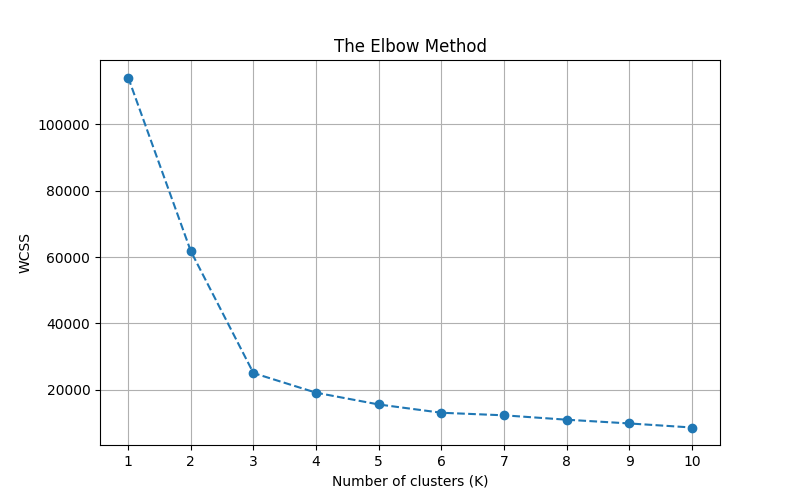
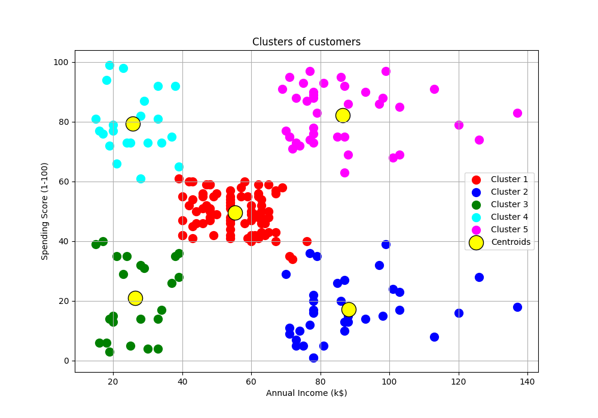

# Day 13: K-Means 聚類 (K-Means Clustering) - 商場客戶分群

## 0. 歷史小故事/核心貢獻者:
**K-Means** 演算法的歷史有點像「多重發現」。早在 1950 年代，Hugo Steinhaus、Stuart Lloyd (貝爾實驗室) 和 James MacQueen 等人就分別獨立提出了這個概念。其中 Lloyd 在 1957 年就為了脈衝編碼調變 (PCM) 提出了這個算法，但直到 1982 年才正式發表！所以有時候它也被稱為 **Lloyd's Algorithm**。它是最古老、最簡單，卻至今仍是最強大的非監督式學習算法之一。

## 1. 資料集來源
### 資料集來源：[Mall Customer Segmentation Data (Kaggle)](https://www.kaggle.com/vjchoudhary7/customer-segmentation-tutorial-in-python)
> 備註：這是一個經典的市場區隔 (Market Segmentation) 資料集。

### 資料集特色與欄位介紹:
我們擁有商場客戶的基本資料，目標是根據他們的「收入」和「消費習慣」將他們分群，以便制定行銷策略。
*   **CustomerID**: 客戶 ID (無用)。
*   **Gender**: 性別。
*   **Age**: 年齡。
*   **Annual Income (k$)**: 年收入 (千美元)。
*   **Spending Score (1-100)**: 商場根據客戶行為給出的消費分數 (越高越會買)。

**我們主要關注最後兩欄：Income vs Score。**

## 2. 原理
### 核心概念：物以類聚 (Birds of a feather flock together)

#### 2.1 非監督式學習 (Unsupervised Learning)
*   **沒有老師 (No Labels)**：以前的資料都有 $y$ (答案)，告訴模型這是貓還是狗。現在只有 $X$ (特徵)，模型要自己去發現「哪些資料長得很像」。
*   **聚類 (Clustering)**：將相似的資料歸為同一類。

#### 2.2 K-Means 演算法步驟
這是一個**迭代 (Iterative)** 的過程，目標是最小化所有點到其質心的距離平方和 (WCSS)。

**數學公式 (Objective Function)**：
$$J = \sum_{i=1}^{k} \sum_{x \in C_i} ||x - \mu_i||^2$$
*   $J$: 總誤差 (Inertia / WCSS)。
*   $k$: 群聚數量。
*   $x$: 資料點。
*   $\mu_i$: 第 $i$ 群的質心 (Centroid)。
*   **目標**：找到一組質心 $\mu$，使得 $J$ 最小。

**步驟詳解**：
1.  **隨機選將軍 (Initialization)**：隨機選 $K$ 個點當作初始的「質心 (Centroids)」。
2.  **小兵選邊站 (Assignment)**：每個資料點算出自己離哪個將軍最近，就加入那個將軍的隊伍 (Cluster)。
3.  **將軍移動 (Update)**：隊伍集合完畢後，算出隊伍的「幾何中心」，將軍移動到那個中心點。
4.  **重複 (Repeat)**：重複步驟 2 和 3，直到將軍不再移動為止。

#### 2.3 手肘法 (Elbow Method) - K 要選多少？
*   **WCSS (Within-Cluster Sum of Squares)**：群內誤差平方和。也就是「隊員離將軍的距離總和」。
*   **原理**：
    *   K 越大，WCSS 一定越小 (如果 K=N，每個點自己一群，距離為 0)。
    *   但我們不希望 K 太大 (分太細沒意義)。
    *   **手肘點**：當 K 增加時，WCSS 下降幅度突然變緩的那個點 (像手臂彎曲的手肘)，就是最佳的 K。

## 3. 實戰
### Python 程式碼實作
完整程式連結：[KMeans_Mall.py](KMeans_Mall.py)

```python
# 關鍵程式碼：K-Means 訓練

# 1. 尋找最佳 K (手肘法)
wcss = []
for i in range(1, 11):
    kmeans = KMeans(n_clusters=i, init='k-means++', random_state=42)
    kmeans.fit(X)
    wcss.append(kmeans.inertia_)

# 2. 訓練模型 (假設 K=5)
kmeans = KMeans(n_clusters=5, init='k-means++', random_state=42)
y_kmeans = kmeans.fit_predict(X)
```

## 4. 模型評估與視覺化
### 1. 手肘法結果

*   **觀察**：可以看到在 **K=5** 的地方有一個明顯的轉折 (Elbow)。所以我們選擇將客戶分成 5 群。

### 2. 分群結果 (Clusters)

*   **黃色大點**：質心 (Centroids)。
*   **五大族群分析 (基於真實資料)**：
    *(註：K-Means 的群集編號是隨機的，請對照圖片顏色與座標位置)*
    1.  **標準型 (Standard)**：**中等收入、中等消費** (Income ~55k, Score ~50)。這是人數最多的一群，代表大眾市場。
    2.  **省錢型 (Miser)**：**高收入、低消費** (Income ~88k, Score ~17)。有錢但不愛花，可能是理性消費者或潛力股。
    3.  **謹慎型 (Cautious)**：**低收入、低消費** (Income ~26k, Score ~21)。收入有限，消費也保守。
    4.  **享樂型 (Careless)**：**低收入、高消費** (Income ~26k, Score ~79)。雖然賺得不多，但很敢花錢 (月光族？)。
    5.  **VIP / 金主 (Target)**：**高收入、高消費** (Income ~86k, Score ~82)。**這就是商場最想抓住的核心客群！**

    *透過 K-Means，我們能自動把這些人分開，針對不同族群發送不同的優惠券 (例如給「省錢型」發折扣碼，給「VIP」發新品通知)。*

## 5. 戰略總結: 非監督式學習的火箭發射之旅

### (K-Means 參數調整)
雖然沒有 Bias/Variance，但我們可以用 **WCSS** 來類比：

#### 5.1 流程一：推力不足 (Underfitting)
*   **設定**：K 太小 (例如 K=2)。
*   **結果**：WCSS 很高，群組內差異很大 (把 VIP 和省錢族混在一起)，無法精準行銷。

#### 5.2 流程二：動力太強 (Overfitting)
*   **設定**：K 太大 (例如 K=20)。
*   **結果**：WCSS 很低，但分群太細碎，行銷策略變得過於複雜且不可執行。

#### 5.3 流程三：完美入軌 (The Sweet Spot)
*   **設定**：K=5 (Elbow Point)。
*   **結果**：恰到好處地抓出了最有商業價值的 5 類人。

## 6. 總結
Day 13 我們進入了 **非監督式學習**。
*   **K-Means**：最經典的聚類算法。
*   **Elbow Method**：決定 K 值的標準 SOP。
*   **商業應用**：透過分群，我們發現了「高收入高消費」的 VIP 客群，這就是數據驅動決策 (Data-Driven Decision) 的價值！

下一章 (Day 14)，我們將學習另一種聚類方法 —— **層次聚類 (Hierarchical Clustering)**，它不需要預先決定 K 值喔！
