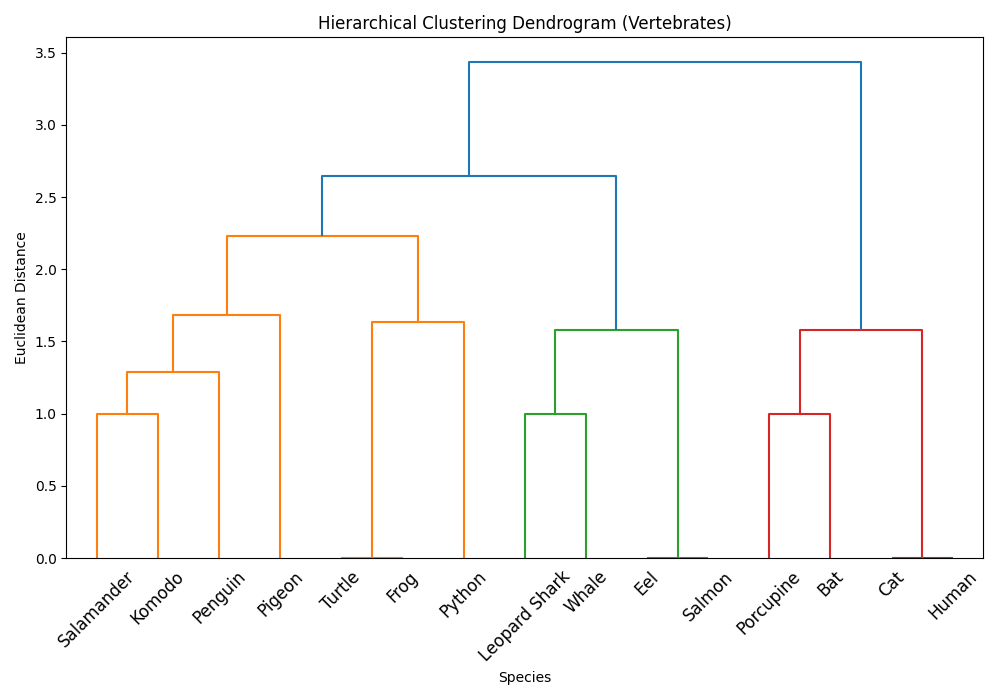
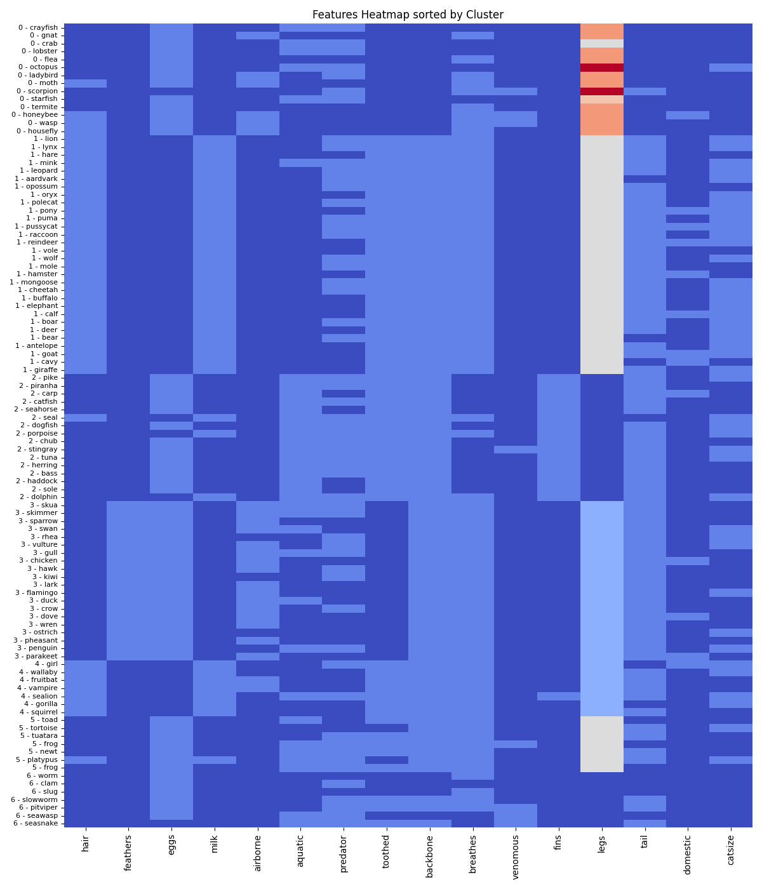

# Day 14: 層次聚類 (Hierarchical Clustering) - 脊椎動物分類

## 0. 歷史小故事/核心貢獻者:
**層次聚類 (Hierarchical Clustering)** 的概念非常直觀，早在亞里斯多德時代的生物分類學中就有了雛形。但在統計學和電腦科學領域，它的發展與 **Sokal & Sneath** 在 1963 年出版的《數值分類學 (Numerical Taxonomy)》密不可分。這本書奠定了現代生物資訊學和聚類分析的基礎，主張用數學方法來量化生物之間的相似度，並畫出親緣關係樹 (Phylogenetic Tree)。

## 1. 資料集來源
### 資料集來源：[UCI Zoo Data Set](https://archive.ics.uci.edu/ml/datasets/zoo)
> 備註：這是一個非常著名的機器學習資料集，包含 101 種動物與 17 個特徵。

### 資料集特色與欄位介紹:
目標是根據動物的特徵，將牠們分成 7 大類 (哺乳類、鳥類、爬蟲類、魚類、兩棲類、昆蟲、無脊椎動物)。
*   **animal_name**: 動物名稱。
*   **hair**: 有毛髮。
*   **feathers**: 有羽毛。
*   **eggs**: 會產卵。
*   **milk**: 會哺乳。
*   **airborne**: 會飛。
*   **aquatic**: 水生。
*   **predator**: 是掠食者。
*   **toothed**: 有牙齒。
*   **backbone**: 有脊椎。
*   **breathes**: 用肺呼吸。
*   **venomous**: 有毒。
*   **fins**: 有鰭。
*   **legs**: 腿的數量。
*   **tail**: 有尾巴。
*   **domestic**: 是家養的。
*   **catsize**: 體型像貓一樣大。
*   **class_type**: 真實類別 (1-7)。

## 2. 原理
### 核心概念：像拼圖一樣，把像的黏在一起

#### 2.1 兩大策略
1.  **聚合式 (Agglomerative, Bottom-Up)**：**這是最常用的方法**。
    *   一開始，每個點自己就是一群 (N 群)。
    *   **Step 1**: 找出距離最近的兩個點，把它們黏成一群 (剩 N-1 群)。
    *   **Step 2**: 找出距離最近的兩群 (或點)，再黏起來 (剩 N-2 群)。
    *   ... 一直黏，直到所有點都變成同一大群 (1 群)。
2.  **分裂式 (Divisive, Top-Down)**：
    *   一開始，大家都在同一大群。
    *   然後慢慢切開，直到每個人都散開。 (計算量大，較少用)。

#### 2.2 距離怎麼算？ (Linkage Methods)
當我們要合併「兩個群」時，距離怎麼定義？
*   **Single Linkage**: 群與群之間 **最近** 的點距離 (容易產生長條狀聚類)。
*   **Complete Linkage**: 群與群之間 **最遠** 的點距離 (傾向產生球狀聚類)。
*   **Average Linkage**: 群與群之間 **所有點** 的平均距離。
*   **Ward's Method**: 合併後會讓群內變異數 (Variance) 增加最少的方法 (最常用，效果通常最好)。

#### 2.3 樹狀圖 (Dendrogram)
這是層次聚類的神器！它記錄了合併的過程。
*   **X 軸**：每個樣本 (動物)。
*   **Y 軸**：距離 (Distance)。
*   **怎麼看**：Y 軸越高的地方合併，代表這兩群差異越大。我們可以在 Y 軸選一個高度「切一刀」，決定要分幾群。

## 3. 實戰
### Python 程式碼實作
完整程式連結：[Hierarchical_Clustering_Zoo.py](Hierarchical_Clustering_Zoo.py)

```python
# 關鍵程式碼：繪製樹狀圖與訓練

# 1. 繪製 Dendrogram (取樣 40 隻動物以保持清晰)
import scipy.cluster.hierarchy as sch
dendrogram = sch.dendrogram(sch.linkage(X_sample, method='ward'))

# 2. 訓練模型 (設定分 7 群)
from sklearn.cluster import AgglomerativeClustering
hc = AgglomerativeClustering(n_clusters=7, linkage='ward')
y_hc = hc.fit_predict(X)
```

## 4. 模型評估與視覺化
### 1. 樹狀圖 (Dendrogram)

*   **觀察**：這張圖顯示了隨機抽取的 40 隻動物的親緣關係。
    *   可以看到 **Crow (烏鴉)** 和 **Sparrow (麻雀)** 很早就合併了 (都是鳥類)。
    *   **Elephant (大象)** 和 **Buffalo (水牛)** 也是好朋友 (大型哺乳類)。
    *   透過觀察垂直線的高度，我們可以直觀地看到動物之間的相似程度。

### 2. 特徵熱圖 (Heatmap)

*   **觀察**：這張圖展示了 101 隻動物的所有特徵分佈，並依照我們分出的 Cluster 排序。**Y 軸標籤現在加上了 Cluster 編號，讓你更容易找到特定動物。**
*   **分群結果分析**：
    *   **Cluster 1 (哺乳類)**：特徵非常明顯 (有毛、哺乳、有脊椎)。
    *   **Cluster 3 (鳥類)**：有羽毛、產卵、會飛。
    *   **Cluster 4 (魚類)**：水生、有鰭、無腿。
    *   **Cluster 0 (無脊椎/昆蟲)**：無脊椎、無骨骼。
    *   **Cluster 2/5/6**：分別對應到了爬蟲類、兩棲類等，雖然有些微混淆，但整體而言，非監督式學習**成功還原了生物學的分類系統**！

## 5. 戰略總結: 非監督式學習的火箭發射之旅

### (層次聚類適用)

#### 5.1 流程一：切得太細 (Under-cutting)
*   **設定**：在樹狀圖很低的地方切一刀 (例如分 10 群)。
*   **結果**：每一群只有 1-2 隻動物，失去了「分類」的概括意義。

#### 5.2 流程二：切得太粗 (Over-cutting)
*   **設定**：在樹狀圖很高的地方切一刀 (例如分 2 群)。
*   **結果**：可能把「魚」和「爬蟲」混在一起，只分出「水生」和「陸生」，忽略了生物學上的細微差異。

#### 5.3 流程三：完美入軌 (The Sweet Spot)
*   **設定**：觀察樹狀圖中「最長的垂直線」段落，在那裡切一刀 (通常是 3-5 群)。
*   **結果**：成功分出了哺乳類、爬蟲類、魚類等符合生物學常識的類別。

## 6. 總結
Day 14 我們學習了 **層次聚類**。
*   **不需要預先決定 K**：這是它最大的優點，我們可以畫出樹狀圖再來決定。
*   **Dendrogram**：提供了資料結構的視覺化全貌，非常適合探索性分析。
*   **小數據神器**：對於像這樣的小型生物分類資料，層次聚類比 K-Means 更直觀好用。

下一章 (Day 15)，我們將挑戰一個形狀更複雜的資料集，學習能處理「不規則形狀」的聚類算法 —— **DBSCAN**！
