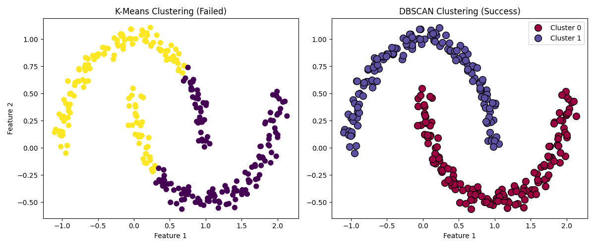
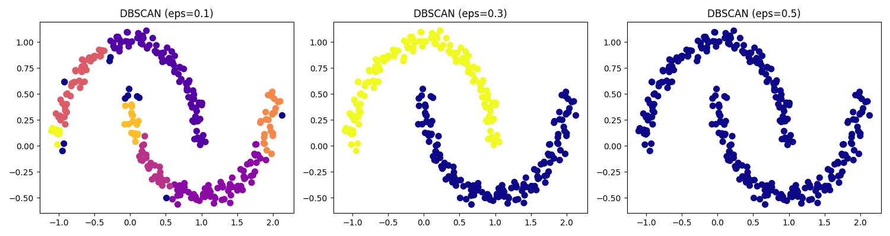

# Day 15: DBSCAN 密度聚類 (Density-Based Spatial Clustering of Applications with Noise)

## 0. 歷史小故事/核心貢獻者:
**DBSCAN** 由 **Martin Ester, Hans-Peter Kriegel, Jörg Sander 和 Xiaowei Xu** 於 1996 年提出。這篇論文是數據挖掘領域引用次數最高的論文之一！他們當時在慕尼黑大學，想要解決 K-Means 無法處理「非球形」聚類和「噪聲」的問題。這項發明讓機器學習終於能像人類一樣，一眼看出「彎彎曲曲」的形狀也是一群。

## 1. 資料集來源
### 資料集來源：[Scikit-Learn Make Moons](https://scikit-learn.org/stable/modules/generated/sklearn.datasets.make_moons.html)
> 備註：這是一個經典的合成資料集，專門用來測試聚類演算法對「非線性結構」的處理能力。

### 資料集特色與欄位介紹:
*   **形狀**：兩個互相交錯的半月形 (Double Moon)。
*   **挑戰**：這兩群數據無法用一條直線切開 (線性不可分)，且 K-Means 這種基於「圓心距離」的算法會徹底失敗。
*   **欄位說明**：
    *   **Feature 1 (X1)**: 資料點在 X 軸的座標。
    *   **Feature 2 (X2)**: 資料點在 Y 軸的座標。
    *   **Target (y)**: 所屬的月亮類別 (0 或 1)。但在非監督學習中，我們假裝看不到這個答案。

## 2. 原理
### 核心概念：朋友的朋友也是朋友 (密度相連)

#### 2.1 為什麼 K-Means 會失敗？
*   K-Means 假設群聚是**凸的 (Convex)** 且像球一樣圓。它只在乎「離圓心近不近」。
*   面對月亮形狀，K-Means 會硬切成兩半，導致頭尾分家。

#### 2.2 DBSCAN 的兩大參數與數學定義
DBSCAN 不用設 K (分幾群)，而是設：
1.  **$\epsilon$ (Epsilon, eps)**：**半徑**。以我為圓心，多遠以內算我的鄰居？
    *   **數學公式 (Epsilon Neighborhood)**：
        $$N_\epsilon(p) = \{q \in D \mid dist(p, q) \le \epsilon\}$$
    *   意思就是：所有距離點 $p$ 小於等於 $\epsilon$ 的點 $q$ 的集合。通常 $dist$ 使用歐式距離。
2.  **MinPts (min_samples)**：**最小點數**。半徑內至少要有幾個鄰居，我才算「核心人物」？

#### 2.3 三種角色
1.  **核心點 (Core Point)**：半徑 $\epsilon$ 內有超過 MinPts 個鄰居。 (聚落的中心)
2.  **邊界點 (Border Point)**：鄰居不夠多，但在核心點的半徑內。 (聚落的邊緣)
3.  **噪聲點 (Noise Point)**：既不是核心，也不在別人的半徑內。 (孤獨的邊緣人 -> **直接剔除！**)

#### 2.4 聚類過程
*   隨便選一個點，如果是核心點，就把它的鄰居都拉進來 (擴張)。
*   鄰居如果是核心點，再把鄰居的鄰居拉進來 (傳染)。
*   直到沒人可拉，這一群就完成了。
*   換下一個沒被訪問過的點，重複上述步驟。

## 3. 實戰
### Python 程式碼實作
完整程式連結：[DBSCAN_Moons.py](DBSCAN_Moons.py)

```python
# 關鍵程式碼：K-Means vs DBSCAN

# 1. K-Means (失敗)
kmeans = KMeans(n_clusters=2)
y_kmeans = kmeans.fit_predict(X)

# 2. DBSCAN (成功)
from sklearn.cluster import DBSCAN
# eps=0.3 代表半徑，min_samples=5 代表至少要有 5 個鄰居
dbscan = DBSCAN(eps=0.3, min_samples=5)
y_dbscan = dbscan.fit_predict(X)
```

## 4. 模型評估與視覺化
### 1. K-Means vs DBSCAN 比較圖

*   **左圖 (K-Means)**：慘不忍睹。它硬是用直線把月亮切成兩半，完全無視資料的幾何形狀。
*   **右圖 (DBSCAN)**：完美！它成功沿著月亮的彎曲形狀，將上下兩個月亮分開，而且還能標示出 **黑色點 (Noise)**，代表那些離群索居的異常值。

### 2. 參數敏感度 (Eps 的影響)

*   **eps = 0.1 (太小)**：大家都很孤單，被當成噪聲 (紫色點)，分不出群聚。
*   **eps = 0.3 (剛好)**：完美分出兩群。
*   **eps = 0.5 (太大)**：半徑太大，把兩個月亮黏在一起，變成同一大群了。

## 5. 戰略總結: 非監督式學習的火箭發射之旅

### (DBSCAN 適用)

#### 5.1 流程一：半徑太小 (Under-connected)
*   **設定**：eps 設太小。
*   **結果**：大部分資料都被當成噪聲 (Noise)，或者碎成幾百個小群。

#### 5.2 流程二：半徑太大 (Over-connected)
*   **設定**：eps 設太大。
*   **結果**：不同群的資料被「橋接」在一起，全部變成同一群。

#### 5.3 流程三：完美入軌 (The Sweet Spot)
*   **設定**：eps 恰到好處 (通常透過 k-distance graph 來輔助尋找)。
*   **結果**：能識別任意形狀的群聚，並自動過濾噪聲。

## 6. 總結
Day 15 我們學習了 **DBSCAN**，它是處理複雜形狀數據的神器。
*   **優點**：
    1.  不需要預先指定 K。
    2.  能處理任意形狀 (月亮、同心圓)。
    3.  能自動發現並排除噪聲 (Outliers)。
*   **缺點**：
    1.  參數 eps 和 MinPts 很難調 (非常敏感)。
    2.  如果資料密度不均勻 (有的稀疏有的密)，DBSCAN 會很難運作。

恭喜你！你已經掌握了三種最強大的聚類算法 (K-Means, Hierarchical, DBSCAN)。
下一章 (Day 16)，我們將進入 **降維 (Dimensionality Reduction)** 的世界，學習如何把高維度的複雜資料壓縮成 2D/3D，讓它「現出原形」—— **主成分分析 (PCA)**！
