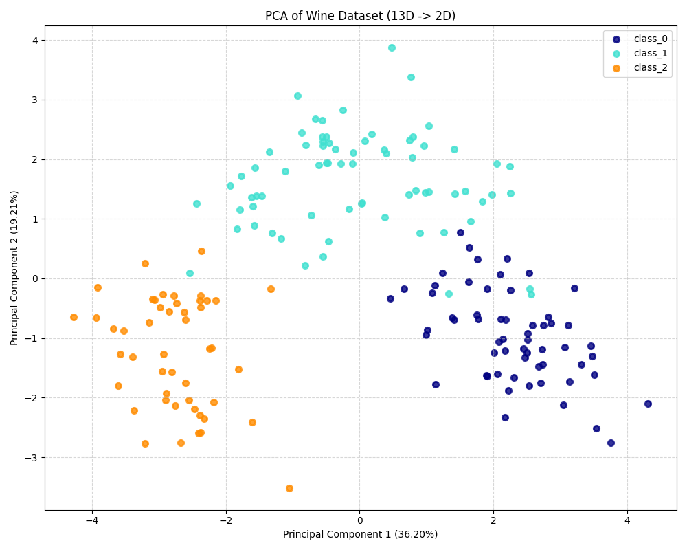
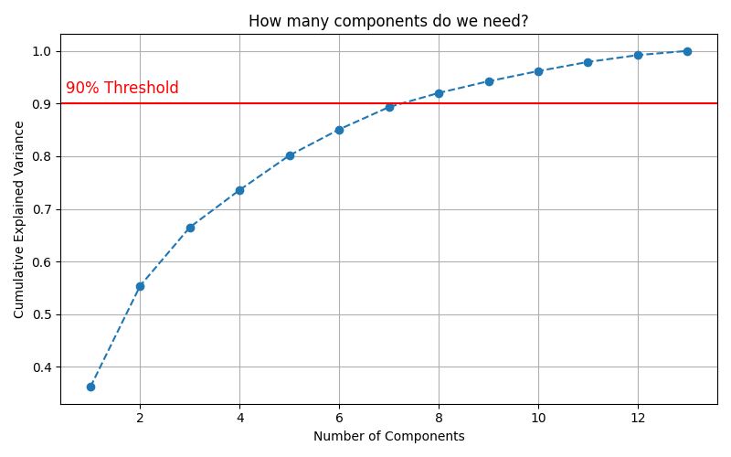
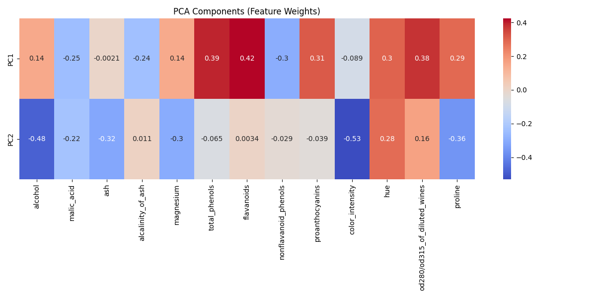

# Day 16: 主成分分析 (PCA) - 葡萄酒分類

## 0. 歷史小故事/核心貢獻者:
**PCA (Principal Component Analysis)** 的歷史非常悠久，可以追溯到 1901 年由 **Karl Pearson** (就是發明皮爾森相關係數的那位) 發明。後來在 1930 年代，**Harold Hotelling** 進一步發展並命名了它。這是一個跨越百年的經典算法，至今仍是數據科學中最重要的降維工具！

## 1. 資料集來源
### 資料集來源：[Scikit-Learn Wine Dataset](https://scikit-learn.org/stable/modules/generated/sklearn.datasets.load_wine.html)
> 備註：這是一個經典的分類資料集，包含 178 瓶葡萄酒的化學分析結果。

### 資料集特色與欄位介紹:
我們的目標是根據 13 種化學成分，將葡萄酒分成 3 個品種 (Class 0, 1, 2)。
*   **Features (13種)**：
    *   Alcohol (酒精)
    *   Malic acid (蘋果酸)
    *   Ash (灰分)
    *   Alcalinity of ash (灰分的鹼度)
    *   Magnesium (鎂)
    *   Total phenols (總酚)
    *   Flavanoids (類黃酮)
    *   Nonflavanoid phenols (非類黃酮酚)
    *   Proanthocyanins (原花青素)
    *   Color intensity (顏色強度)
    *   Hue (色調)
    *   OD280/OD315 of diluted wines (稀釋酒的 OD280/OD315)
    *   Proline (脯氨酸)
*   **Target**: 3 種葡萄酒品種。

## 2. 原理
### 核心概念：換個角度看世界 (座標轉換)

#### 2.1 為什麼要降維？ (Curse of Dimensionality)
*   **難以視覺化**：我們無法畫出 13 維的圖。
*   **計算量大**：特徵越多，模型訓練越慢。
*   **維度災難**：特徵太多時，資料會變得稀疏，距離計算會失真。

#### 2.2 PCA 怎麼做？
PCA 的目標是找到一個**新的座標系** (主成分)，讓資料投影上去後，**變異數 (Variance) 最大** (也就是資料分得最開)。
1.  **標準化**：先把大家縮放到同一個起跑線 (Mean=0, Std=1)。
2.  **找主軸 (PC1)**：找到資料分佈最廣的方向，這就是第一主成分。
3.  **找次軸 (PC2)**：在與 PC1 垂直的方向中，找分佈最廣的，這就是第二主成分。
4.  **投影**：把資料投影到這兩個新軸上，就完成了降維 (13D -> 2D)。

#### 2.3 數學公式 (SVD / Eigendecomposition)
PCA 的核心是計算共變異數矩陣 (Covariance Matrix) 的**特徵值 (Eigenvalues)** 和 **特徵向量 (Eigenvectors)**。
$$X = U \Sigma V^T$$
*   $V^T$ 的每一列就是我們的主成分 (Principal Components)。
*   $\Sigma$ (Sigma) 對角線上的值對應到解釋變異量。

## 3. 實戰
### Python 程式碼實作
完整程式連結：[PCA_Wine.py](PCA_Wine.py)

```python
# 關鍵程式碼：PCA 降維

# 1. 標準化 (非常重要！)
from sklearn.preprocessing import StandardScaler
scaler = StandardScaler()
X_scaled = scaler.fit_transform(X)

# 2. 執行 PCA
from sklearn.decomposition import PCA
pca = PCA(n_components=2) # 降到 2 維
X_pca = pca.fit_transform(X_scaled)

# 3. 查看解釋變異量
print(pca.explained_variance_ratio_)
```

## 4. 模型評估與視覺化
### 1. 2D 投影圖 (PCA Projection)

*   **觀察**：
    *   原本 13 維的資料，被壓縮到 2 維平面上。
    *   可以看到 **3 種顏色的點分得非常開**！
    *   這證明了 PCA 成功抓住了區分這 3 種酒的關鍵特徵。即使我們丟掉了 11 個維度，剩下的資訊仍然足夠做分類。

### 2. 累積解釋變異量 (Cumulative Variance)

*   **觀察**：
    *   PC1 解釋了約 36% 的變異。
    *   PC1 + PC2 解釋了約 55% 的變異。
    *   **Q: 如果要保留 90% 的資訊，能不能把這 7-8 個維度塞進 PC1 和 PC2？**
        *   **A: 不行！** PC1 和 PC2 的容量是固定的 (它們就是含金量最高的前兩名)。
        *   **取捨 (Trade-off)**：
            *   **要畫圖 (視覺化)**：我們只能選前 2 名 (2D) 或前 3 名 (3D)，忍受只看 55% 的資訊。
            *   **要準確 (機器學習)**：我們會保留前 8 名 (8D)，雖然畫不出圖，但機器可以讀取這 90% 的資訊來訓練模型。

### 3. 特徵權重 (Feature Weights)

*   **觀察**：這張熱圖告訴我們 PC1 和 PC2 到底代表什麼。
    *   **PC1 (第一列)**：與 **Flavanoids (類黃酮)**、**Total phenols (總酚)** 正相關最強。這代表 PC1 主要是在衡量酒的「多酚含量」。
    *   **PC2 (第二列)**：與 **Color intensity (顏色強度)**、**Alcohol (酒精)** 相關性較高。
    *   *結論*：原來區分這些酒的關鍵，主要在於「多酚含量」和「顏色/酒精濃度」！

## 5. 戰略總結: 非監督式學習的火箭發射之旅

### (PCA 適用)

#### 5.1 流程一：沒做標準化 (Scaling Issue)
*   **設定**：直接對原始數據做 PCA。
*   **結果**：數值大的特徵 (如 Proline ~1000) 會獨佔 PC1，導致降維失效。**PCA 前一定要做 StandardScaler！**

#### 5.2 流程二：降維太過頭 (Under-fitting)
*   **設定**：硬要把複雜資料降到 1 維。
*   **結果**：解釋變異量太低 (例如 < 20%)，重要資訊都遺失了，分類效果變差。

#### 5.3 流程三：完美入軌 (The Sweet Spot)
*   **設定**：觀察累積變異量圖，選擇保留 80%-90% 資訊的維度數。
*   **結果**：既大幅減少了計算量，又保留了資料的精髓，模型訓練更快更準！

## 6. 總結
Day 16 我們學習了 **PCA (主成分分析)**。
*   它是數據科學家的「透視鏡」，能把高維數據壓扁給你看。
*   它不僅能用來**視覺化**，還能用來**去雜訊**和**加速模型訓練**。
*   **關鍵心法**：PCA 是一種「有損壓縮」，我們是用「一點點資訊損失」換取「更清晰的結構」。

下一章 (Day 17)，我們將進入 **推薦系統 (Recommender Systems)** 的世界，學習 Netflix 和 Amazon 是如何猜到你喜歡什麼的！
