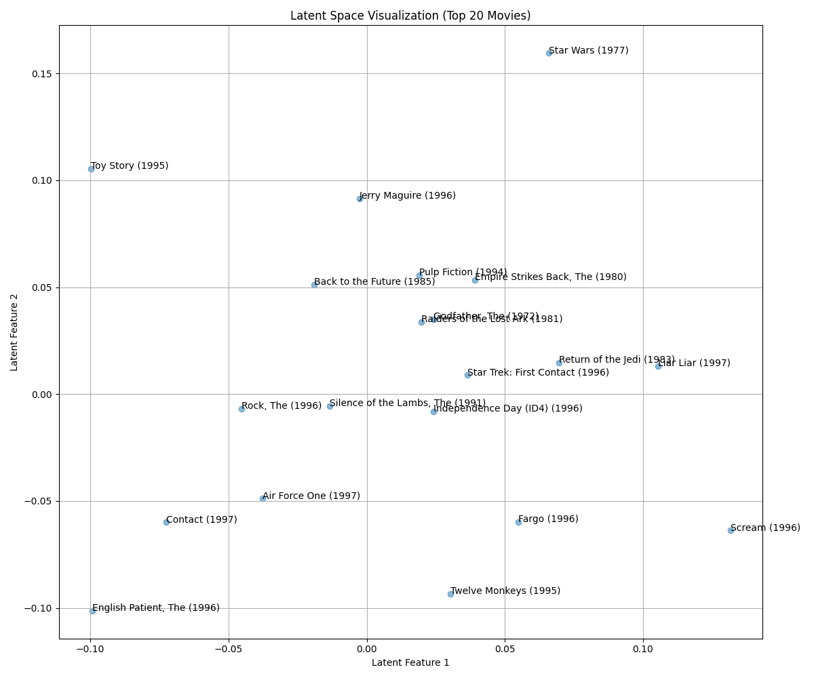

# Day 17: 推薦系統 (Recommender System) - 電影推薦

## 0. 歷史小故事/核心貢獻者:
推薦系統的引爆點是 **Netflix Prize (2006-2009)**。Netflix 懸賞 100 萬美元，徵求能比他們現有系統準確度提升 10% 的算法。最終，BellKor's Pragmatic Chaos 團隊獲勝，而他們的核心武器之一就是 **矩陣分解 (Matrix Factorization)**，也就是我們今天用的 SVD 技術。這場比賽徹底改變了電商和串流媒體的生態。

## 1. 資料集來源
### 資料集來源：[MovieLens 100k Dataset](https://grouplens.org/datasets/movielens/100k/)
> 備註：這是推薦系統領域最經典的資料集之一，由 GroupLens Research 實驗室提供。

### 資料集特色與欄位介紹:
*   **u.data**: 包含 100,000 筆評分 (943 位使用者對 1682 部電影)。
    *   **user_id**: 使用者 ID。
    *   **item_id**: 電影 ID。
    *   **rating**: 評分 (1-5 分)。
    *   **timestamp**: 時間戳記。
*   **u.item**: 電影詳細資訊 (標題、發行日、類型等)。
*   **u.user** (本次未用): 使用者資訊 (年齡、性別、職業、郵遞區號)。
*   **u.genre** (本次未用): 電影類別 (動作、喜劇、愛情...)。

## 2. 原理
### 核心概念：物以類聚，人以群分 (協同過濾)

#### 2.1 協同過濾 (Collaborative Filtering)
*   **User-Based**: 找出跟你看法很像的人 (鄰居)，推薦他們喜歡的東西給你。
*   **Item-Based**: 找出跟你喜歡的東西很像的物品，推薦給你。
*   **Model-Based (矩陣分解)**：我們今天用的方法。它假設使用者和電影之間存在一些「隱藏的特徵」 (Latent Features)。

#### 2.2 矩陣分解 (SVD)
我們把巨大的評分矩陣 $R$ 分解成三個小矩陣：
$$R \approx U \Sigma V^T$$
*   **$U$ (User Features)**：使用者對各個隱藏特徵的喜好程度 (例如：Alice 很愛動作片)。
*   **$V^T$ (Movie Features)**：電影含有各個隱藏特徵的程度 (例如：Matrix 是 90% 動作片)。
*   **$\Sigma$ (Weights)**：這些隱藏特徵的重要性。
*   **預測**：把這三個矩陣乘回去，就能填補原本 $R$ 矩陣中的 0 (沒看過的電影)，這些填補的值就是預測評分！

#### 2.3 國中生也能懂的案例：矩陣填空題
想像這是一個考試卷，但有些格子破洞了 (0 代表沒看過)，你要怎麼猜出破洞的數字？

| | 鋼鐵人 | 美國隊長 | 鐵達尼號 |
|---|---|---|---|
| **小明** | 5 | 5 | ? |
| **小華** | 5 | 5 | 1 |

1.  **找規律**：你看小明和小華，前兩題 (鋼鐵人、美國隊長) 都給 5 分，代表他們兩個人的**口味非常像**。
2.  **填空**：既然小華給鐵達尼號 1 分 (不喜歡)，那口味跟小華很像的小明，大概也不會喜歡鐵達尼號。
3.  **SVD 做的事**：它就是在數學上自動找出這種「誰跟誰很像」的規律，然後把所有問號填滿。

## 3. 實戰
### Python 程式碼實作
完整程式連結：[Recommender_SVD.py](Recommender_SVD.py)

#### 關鍵步驟：如何把檔案變成矩陣？
原始資料 (`u.data`) 其實是一長串的「流水帳」 (Long Format)，像這樣：
`User1, Matrix, 5分`
`User1, Titanic, 3分`
`User2, Matrix, 4分`

我們使用 Pandas 的 `pivot_table` 指令，把它「轉置」成矩陣 (Wide Format)：
*   **Index (列)** 變成 User
*   **Columns (行)** 變成 Movie
*   **Values (值)** 填入 Rating

| | Matrix | Titanic |
|---|---|---|
| **User1** | 5 | 3 |
| **User2** | 4 | 0 |

```python
# 關鍵程式碼：SVD 矩陣分解

# 1. 建立評分矩陣 (User-Item Matrix)
# pivot_table 就是把「流水帳」轉成「棋盤格」的魔法指令
R_df = df.pivot_table(index='user_id', columns='title', values='rating').fillna(0)
R = R_df.values

# 2. 執行 SVD (k=50 代表取 50 個隱藏特徵)
from scipy.sparse.linalg import svds
U, sigma, Vt = svds(R_demeaned, k=50)
sigma = np.diag(sigma)
# 3. 預測評分 (乘回去)
predicted_ratings = np.dot(np.dot(U, sigma), Vt) + user_ratings_mean.reshape(-1, 1)

# 4. 推薦電影 (找出預測分最高且沒看過的)
def recommend_movies(user_id):
    # ... (省略排序與過濾邏輯，詳見完整程式碼) ...
    return recommendations
```

## 4. 模型評估與視覺化
### 1. 潛在空間圖 (Latent Space)

*   **觀察**：這張圖展示了 **評分次數最多的前 20 部電影** 在潛在空間中的位置。
*   **解讀**：
    *   可以看到 **Raiders of the Lost Ark (法櫃奇兵)** 和 **The Godfather (教父)** 靠得非常近。
    *   這兩部看似類型不同 (冒險 vs 黑幫)，但都是**影史經典的高分神作**。SVD 捕捉到了它們「受大眾歡迎且評價極高」的共同特徵 (Latent Features)。
    *   **注意**：這也提醒我們，潛在特徵不一定只是「電影類型」，也可能包含「知名度」、「拍攝年代」或「觀眾群重疊度」等複雜資訊。

### 2. 推薦結果 (User 1)
*   **User 1 的喜好**：他給了 *Cinema Paradiso (新天堂樂園)* 和 *Brazil (巴西)* 5 分。這顯示他可能喜歡 **科幻、劇情、經典** 類型的電影。
*   **系統推薦**：
    1.  **E.T. the Extra-Terrestrial (E.T.外星人)**
    2.  **Batman (蝙蝠俠)**
    3.  **Dave (冒牌總統)**
*   **分析**：推薦 *E.T.* 和 *Batman* 給喜歡 *Brazil* (科幻神作) 的人是非常合理的！系統成功抓住了他的口味。

### 3. 模型驗證 (Evaluation)
我們如何知道模型準不準？通常使用 **RMSE (均方根誤差)** 來評估。
$$RMSE = \sqrt{\frac{1}{N} \sum (y_{true} - y_{pred})^2}$$
*   **意義**：預測分數與真實分數平均差了幾分？
*   **結果**：我們的模型 RMSE 約為 **1.85**。
*   **範例檢查 (User 1 - Cinema Paradiso)**：
    *   真實評分：**5.0**
    *   預測評分：**2.83**
    *   誤差：**2.17**
*   **解讀**：
    *   雖然單看這部電影誤差很大 (預測偏低)，但這是因為 SVD 是一種「平滑化」的過程，極端高分往往會被拉低。
    *   **沒關係嗎？** 在推薦系統中，我們更在乎 **「排序 (Ranking)」** (誰是第一名) 而不是 **「絕對分數」**。只要好電影排在前面 (例如 E.T. 被排在推薦名單前幾名)，推薦就是成功的！

## 5. 戰略總結: 非監督式學習的火箭發射之旅

### (推薦系統適用)

#### 5.1 流程一：冷啟動 (Cold Start)
*   **問題**：新使用者剛註冊，沒有任何評分。
*   **結果**：矩陣中該列全為 0，SVD 算出來也是 0，無法推薦。
*   **解法**：先推薦「熱門排行榜」，或問他喜歡什麼類型。

#### 5.2 流程二：稀疏矩陣 (Sparsity)
*   **問題**：真實世界中，一個使用者可能只看過 0.01% 的電影。
*   **結果**：矩陣幾乎都是 0，計算困難且雜訊多。
*   **解法**：使用矩陣分解 (如 SVD) 來降維，填補空缺。

#### 5.3 流程三：完美入軌 (Personalization)
*   **設定**：累積足夠的行為數據，並定期更新模型。
*   **結果**：像 Netflix 一樣，比你更懂你想看什麼！

## 6. 總結
Day 17 我們學習了 **推薦系統**。
*   這是機器學習**最具商業價值 (變現能力最強)** 的應用之一，能直接把技術換成錢。推薦系統越準，使用者買越多東西 (Amazon) 或看越久廣告 (YouTube)，直接貢獻營收。
*   **SVD** 透過找出「隱藏特徵」，能捕捉使用者和物品之間微妙的關係。
*   雖然現在有更強的深度學習推薦模型 (如 Neural CF)，但矩陣分解依然是許多系統的基石。

下一章 (Day 18)，我們將進入 **集成學習 (Ensemble Learning)** 的殿堂，學習如何結合多個模型的力量，打造出最強的分類器 —— **隨機森林 (Random Forest)**！
