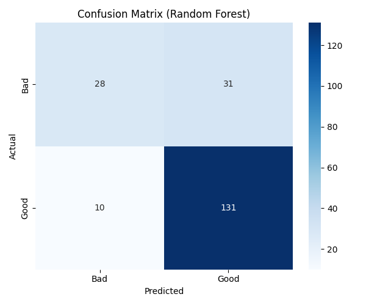
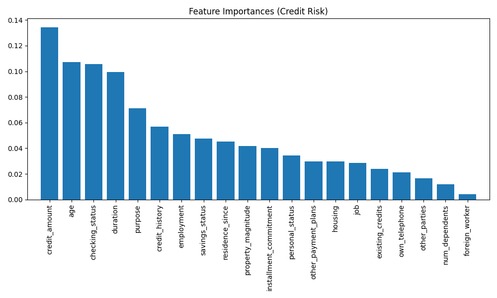
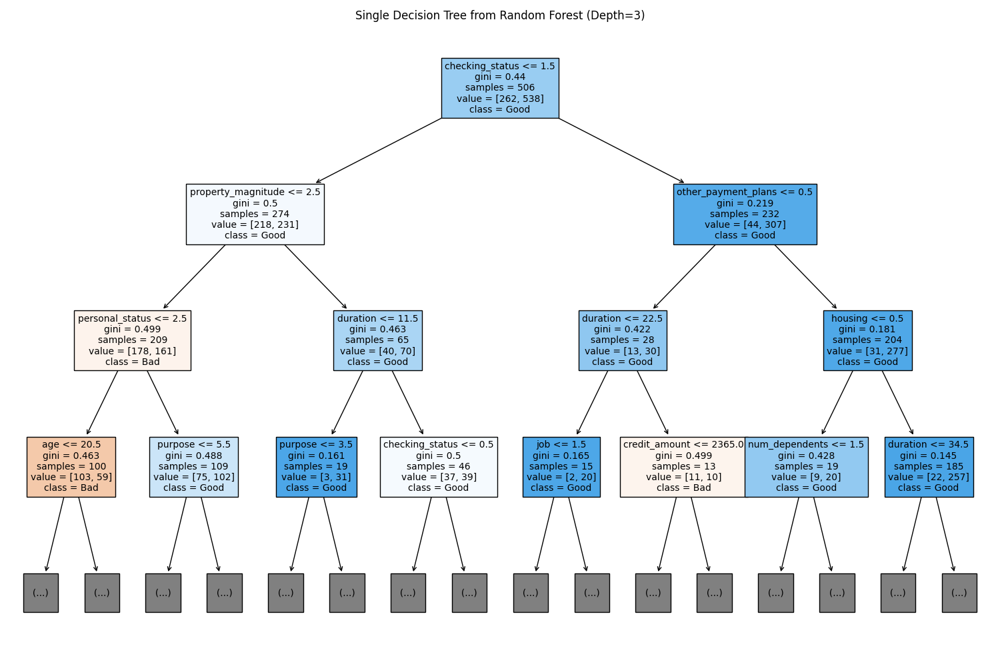

# Day 18: 隨機森林 (Random Forest) - 信用貸款風險

## 0. 歷史小故事/核心貢獻者:
**隨機森林 (Random Forest)** 由 **Leo Breiman** 和 **Adele Cutler** 於 2001 年提出。這是一個劃時代的發明，它把「三個臭皮匠，勝過一個諸葛亮」的哲學發揮得淋漓盡致。在深度學習 (Deep Learning) 流行之前，隨機森林幾乎是 Kaggle 比賽中的常勝軍，因為它**準確、抗過擬合、且不需要太多的參數調整**。

## 1. 資料集來源
### 資料集來源：[UCI German Credit Data](https://archive.ics.uci.edu/ml/datasets/statlog+(german+credit+data))
> 備註：我們使用 Scikit-Learn 的 `fetch_openml` 直接下載。

### 資料集特色與欄位介紹:
這是一個經典的銀行信用風險資料集，包含 1000 位客戶的資料。
*   **目標 (Target)**：`class` (Good=信用好, Bad=信用壞/違約)。
*   **特徵 (Features)**：共 20 個，包含：
    *   `checking_status`: 支票帳戶餘額。
    *   `duration`: 貸款期限 (月)。
    *   `credit_history`: 過去的信用紀錄。
    *   `purpose`: 貸款用途 (買車、買房、教育...)。
    *   `credit_amount`: 貸款金額。
    *   `savings_status`: 存款帳戶餘額。
    *   `employment`: 就業年資。
    *   `age`: 年齡。

## 2. 原理
### 核心概念：打群架 (Bagging + Feature Randomness)

#### 2.1 為什麼要「隨機」？ (Randomness)
單一決策樹 (Decision Tree) 很容易**過擬合 (Overfitting)**，因為它會死記硬背訓練資料的每一個細節。
隨機森林透過兩個「隨機」機制來解決這個問題：
1.  **隨機樣本 (Bootstrap)**：每棵樹只用「隨機抽出」的部分資料來訓練 (有放回抽樣)。
2.  **隨機特徵 (Feature Randomness)**：每棵樹在做決策時，只能看到「隨機抽出」的部分特徵 (例如只給你看年齡和收入，不給看存款)。

#### 2.2 森林怎麼做決策？ (Voting)
*   **分類問題**：**少數服從多數 (Majority Voting)**。100 棵樹裡面，有 80 棵說是「好客戶」，那就是好客戶。
*   **回歸問題**：**平均值 (Averaging)**。100 棵樹預測房價的平均。

##### 圖解：隨機森林的投票機制 (Voting Mechanism)

為了讓大家更直觀地理解「投票」是如何運作的，我們畫了一張示意圖：


**情境假設**：
這張圖展示了一個 **55 歲、貸款 5000 元、帳戶餘額高** 的客戶，是如何被三棵不同的樹審核的：

1.  **樹 1 (看年齡)**：因為大於 40 歲，覺得他很穩重，投 **「好人 (Good)」** 一票。
2.  **樹 2 (看金額)**：因為借款小於 8000，覺得風險可控，也投 **「好人 (Good)」** 一票。
3.  **樹 3 (看帳戶)**：這棵樹可能比較嚴格（或學到了雜訊），覺得他有風險，投了 **「壞人 (Bad)」** 一票。
4.  **最終投票**：**2 票對 1 票**，少數服從多數，隨機森林最終判定這位客戶是 **「好人 (Good Credit)」**。

這就是為什麼隨機森林比單一決策樹更準確的原因——**它容許個別的樹犯錯，只要大部分的樹是對的就好！**

---

#### 2.3 OOB Error (Out-of-Bag Error)
因為每棵樹只用了約 2/3 的資料訓練，剩下的 1/3 (稱為 Out-of-Bag 資料) 剛好可以用來做「自我驗證」。這讓我們不需要額外切分驗證集，也能知道模型準不準！

## 3. 實戰
### Python 程式碼實作
完整程式連結：[Random_Forest_Credit.py](Random_Forest_Credit.py)

```python
# 關鍵程式碼：隨機森林

# 1. 訓練模型
from sklearn.ensemble import RandomForestClassifier
# n_estimators=100: 種 100 棵樹
rf_model = RandomForestClassifier(n_estimators=100, random_state=42)
rf_model.fit(X_train, y_train)

# 2. 查看特徵重要性 (Feature Importance)
importances = rf_model.feature_importances_
# 數值越高，代表該特徵對分類越重要
```

## 4. 模型評估與視覺化
### 1. 混淆矩陣 (Confusion Matrix)

*   **準確率 (Accuracy)**：約 **79.5%**。
*   **觀察**：
    *   **Good (1)** 的預測很準 (Recall 0.93)。
    *   **Bad (0)** 的預測較差 (Recall 0.47)。這在信用風險中是個問題 (把壞人誤判成好人)，可能需要調整權重 (class_weight) 或閾值來改善。

### 2. 特徵重要性 (Feature Importance)

*   **觀察**：隨機森林告訴我們，決定一個人信用好壞的關鍵因素是：
    1.  **Credit Amount (貸款金額)**：借越多風險越高？
    2.  **Age (年齡)**：年紀大比較穩重？
    3.  **Checking Status (支票帳戶餘額)**：戶頭有沒有錢最直接。
    4.  **Duration (貸款期限)**：借越久變數越多。
*   **價值**：這張圖對銀行來說非常有價值，可以幫助他們優化審核流程。

### 3. 森林中的一棵樹 (Single Tree)

*   **觀察**：這只是森林中 100 棵樹的其中一棵 (只畫出前 3 層)。
*   **解讀**：你可以看到它用 `checking_status` 和 `duration` 做切分。每一棵樹都長得不一樣，最後大家一起投票，消除了個人的偏見。

## 5. 戰略總結: 集成學習的火箭發射之旅

### (隨機森林適用)

#### 5.1 流程一：單打獨鬥 (Decision Tree)
*   **設定**：只用一棵決策樹。
*   **結果**：容易過擬合，訓練集 100% 準，測試集卻很爛。

#### 5.2 流程二：三個臭皮匠 (Random Forest)
*   **設定**：使用 Bagging 機制，結合多棵樹。
*   **結果**：準確度大幅提升，且抗噪聲能力強。

#### 5.3 流程三：特徵篩選 (Feature Selection)
*   **設定**：利用 `feature_importances_` 找出無用的特徵並剔除。
*   **結果**：模型更輕量，且解釋性更強 (知道銀行為什麼拒絕貸款)。

## 6. 總結
Day 18 我們學習了 **隨機森林**。
*   它是機器學習界的「瑞士軍刀」，好用、耐操、準確。
*   **Bagging (Bootstrap Aggregating)** 是它的靈魂，透過「隨機取樣」和「投票」來降低變異數 (Variance)。
*   **特徵重要性** 是它附贈的超強功能，能幫我們理解數據。

下一章 (Day 19)，我們將進入 **Boosting (提升法)** 的世界，學習另一種集成策略——不是大家一起投票，而是「接力賽」，後面的模型專門修正前面的錯誤 —— **AdaBoost**！
