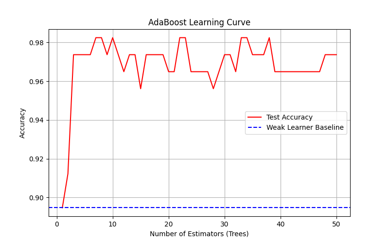
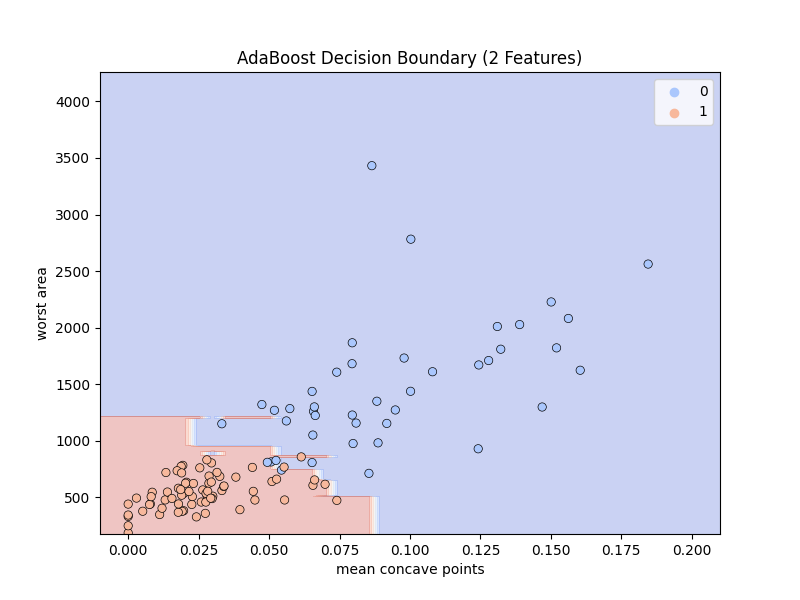

# Day 19: AdaBoost (Adaptive Boosting) - 乳癌預測

## 0. 歷史小故事/核心貢獻者:
**AdaBoost (Adaptive Boosting)** 由 **Yoav Freund** 和 **Robert Schapire** 於 1996 年提出。他們因此獲得了 2003 年的哥德爾獎 (Gödel Prize)。
這是一個革命性的想法：**「三個臭皮匠 (弱分類器) 真的能勝過一個諸葛亮 (強分類器) 嗎？」**
答案是肯定的，只要這些臭皮匠能**知錯能改**。

## 1. 資料集來源
### 資料集來源：[UCI Breast Cancer Wisconsin (Diagnostic)](https://archive.ics.uci.edu/ml/datasets/breast+cancer+wisconsin+(diagnostic))
> 備註：我們使用 Scikit-Learn 的 `load_breast_cancer` 直接載入。

### 資料集特色與欄位介紹:
這是一個非常著名的醫療數據集，用於判斷腫瘤是良性還是惡性。
*   **目標 (Target)**：
    *   0: **Malignant (惡性)** - 危險
    *   1: **Benign (良性)** - 安全
*   **特徵 (Features)**：共 30 個，包含腫瘤的半徑、質地、周長、面積、平滑度等物理特徵。

## 2. 原理
### 核心概念：知錯能改，善莫大焉 (Boosting)

#### 2.1 什麼是 Boosting？
不同於 Random Forest (Bagging) 是大家「同時」投票，Boosting 是「接力」進行的。
*   **第一棒 (Model 1)**：先試著考一次試。
*   **第二棒 (Model 2)**：**專注於複習第一棒「寫錯的題目」** (加重錯誤樣本的權重)。
*   **第三棒 (Model 3)**：再專注於前兩棒都還不會的題目。
*   ...
*   **最後**：把所有人的意見加權總合起來 (厲害的老師講話大聲點，普通的老師講話小聲點)。

#### 2.2 弱分類器 (Weak Learner)
AdaBoost 通常使用 **決策樹樁 (Decision Stump)** 作為基底。
*   **Stump**：就是只切一刀的決策樹 (深度=1)。
*   它非常笨，準確率可能只比亂猜好一點點 (例如 55%)。
*   但 AdaBoost 的魔力就在於，它能把幾百個這種「笨蛋」組合成一個「天才」。

#### 2.3 國中生也能懂的案例：錯題本複習法
想像你在準備期末考：
1.  **第一輪複習**：把課本全部看一遍，做模擬考。發現「三角函數」錯很多。
2.  **第二輪複習**：**只專攻「三角函數」**，其他會的先不管。再考一次，發現「向量」還是不太熟。
3.  **第三輪複習**：**加強「向量」** 的練習。
4.  **考試當天**：你把這三輪的經驗結合起來，就能考 100 分！

## 3. 實戰
### Python 程式碼實作
完整程式連結：[AdaBoost_Cancer.py](AdaBoost_Cancer.py)

```python
# 關鍵程式碼：AdaBoost

# 1. 設定弱分類器 (Decision Stump)
from sklearn.tree import DecisionTreeClassifier
weak_learner = DecisionTreeClassifier(max_depth=1)

# 2. 訓練 AdaBoost
from sklearn.ensemble import AdaBoostClassifier
# n_estimators=50: 接力 50 次
ada_model = AdaBoostClassifier(base_estimator=weak_learner, n_estimators=50, learning_rate=1.0)
ada_model.fit(X_train, y_train)
```

## 4. 模型評估與視覺化
### 1. 準確率比較 (Accuracy Comparison)
*   **弱分類器 (Stump)**：約 **89.5%** (只看一個特徵切一刀)。
*   **AdaBoost (50 Stumps)**：約 **97.4%**。
*   **結論**：透過 50 次的「知錯能改」，我們把準確率提升了近 **8%**！這在醫療診斷上是巨大的進步。

### 2. 學習曲線 (Learning Curve)

*   **觀察**：
    *   紅線 (AdaBoost) 一開始跟藍線 (Weak Learner) 一樣低。
    *   隨著樹的數量增加 (接力次數變多)，準確率迅速爬升。
    *   大約在 10-20 棵樹時就達到高原期 (收斂)。
*   **啟示**：這證明了 Boosting 策略的有效性。

### 3. 決策邊界 (Decision Boundary)

*   **觀察**：
    *   我們只用兩個特徵 (`mean concave points`, `worst area`) 來畫圖。
    *   背景顏色代表模型的判斷區域 (紅=惡性, 藍=良性)。
    *   可以看到邊界不再是單純的一條直線 (Stump 只能切直線)，而是呈現 **鋸齒狀** 或 **複雜的形狀**。
    *   這就是多個 Stump 疊加後的結果，能更細膩地包圍住數據點。

## 5. 戰略總結: 集成學習的火箭發射之旅

### (AdaBoost 適用)

#### 5.1 流程一：建立自信 (Weak Learner)
*   **設定**：使用簡單的模型 (如 Stump)。
*   **結果**：雖然不完美，但至少比亂猜好，建立了基礎。

#### 5.2 流程二：面對錯誤 (Reweighting)
*   **設定**：找出預測錯誤的樣本，提高它們的權重 (Weight)。
*   **結果**：模型被迫去學習那些「難搞」的案例。

#### 5.3 流程三：集思廣益 (Weighted Voting)
*   **設定**：根據每個模型的表現給予不同的發言權 (Alpha)。
*   **結果**：表現好的模型說話大聲，表現差的說話小聲，最終形成強大的決策系統。

## 6. 總結
Day 19 我們學習了 **AdaBoost**。
*   它是 Boosting 家族的開山始祖。
*   核心精神是 **「專注於錯誤」** (Focus on mistakes)。
*   它證明了簡單的模型透過正確的組合，也能達到頂尖的效果。

下一章 (Day 20)，我們將進入 Boosting 家族的完全體，也是目前 Kaggle 比賽中最統治級的算法 —— **XGBoost (Extreme Gradient Boosting)**！
