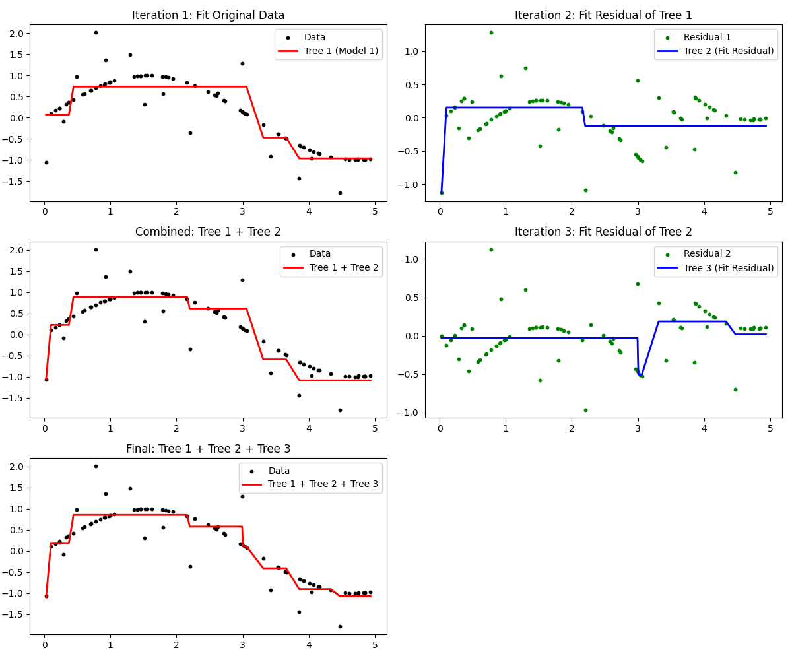
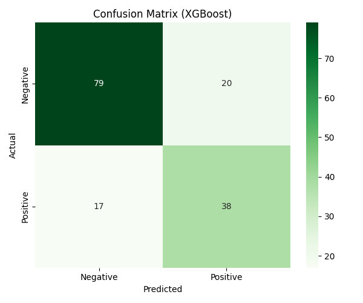
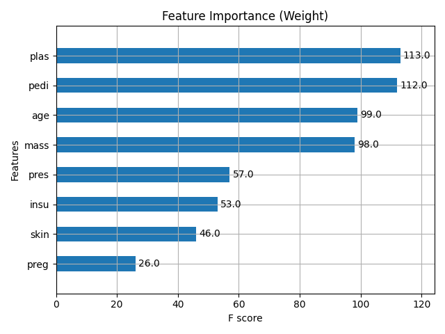
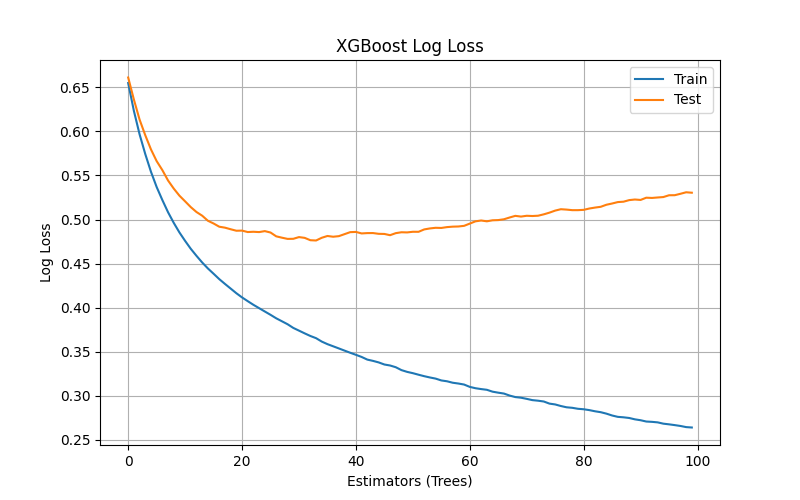

# Day 20: XGBoost (Extreme Gradient Boosting) - 糖尿病預測

## 0. 歷史小故事/核心貢獻者:
**XGBoost (eXtreme Gradient Boosting)** 由 **陳天奇 (Tianqi Chen)** 於 2014 年開發。
它一問世就橫掃了 Kaggle 各大比賽，被稱為「Kaggle 神器」。
它的核心精神是：**「天下武功，唯快不破」**。它在 Gradient Boosting 的基礎上，對系統效能做了極致的優化，讓訓練速度快了 10 倍以上，且準確度更高。

## 1. 資料集來源
### 資料集來源：[Pima Indians Diabetes Database](https://www.kaggle.com/uciml/pima-indians-diabetes-database)
> 備註：我們使用 Scikit-Learn 的 `fetch_openml` 下載。

### 資料集特色與欄位介紹:
這是一個經典的醫療數據集，用於預測皮馬印第安人是否患有糖尿病。
*   **數量 (Number of Instances)**：768 筆。
*   **特徵 (Features)**：共 8 個，包含：
    *   `plas`: 血糖濃度 (最重要的指標)。
    *   `mass`: BMI 指數。
    *   `age`: 年齡。
    *   `preg`: 懷孕次數。
    *   `pedi`: 糖尿病家族函數 (遺傳風險)。
    *   `insu`: 胰島素濃度。
    *   `pres`: 血壓。
    *   `skin`: 皮膚皺褶厚度。
*   **目標 (Target)**：`class` (1=陽性/有糖尿病, 0=陰性/健康)。


## 2. 原理
### 核心概念：改考卷的老師 (Gradient Boosting)

#### 2.1 核心公式 (Math behind the Magic)
XGBoost 的強大來自於它對數學的極致運用。它的目標函數包含兩部分：

**1. 目標函數 (Objective Function)**
$$Obj = \sum L(y_i, \hat{y}_i) + \sum \Omega(f_k)$$
*   **$L$ (Loss)**：誤差。代表模型準不準 (越小越好)。
*   **$\Omega$ (Regularization)**：正則化。代表模型簡不簡單 (越簡單越好，防止死背)。
*   **意義**：XGBoost 追求的是 **「又準又簡單」** 的模型。

**2. 泰勒展開 (Taylor Expansion) - 二階導數**
XGBoost 利用泰勒展開來近似目標函數，這就是它「看得到彎道」的秘密：
$$Obj \approx \text{const} + g_i f_t(x_i) + \frac{1}{2} h_i f_t^2(x_i)$$
*   **$g_i$ (一階導數)**：告訴我們往哪裡走會下降 (斜率)。
*   **$h_i$ (二階導數)**：告訴我們地形有多彎 (曲率)，讓我們能更精確地調整步伐。

#### 2.2 梯度提升 (Gradient Boosting) - 糖尿病預測案例
如果說 AdaBoost 是「錯題本複習」(加權重)，那 Gradient Boosting 就是 **「改考卷」** (修正殘差)。
我們以 Pima Indians Diabetes 資料集 (**共 768 個病人**) 為例，**每一輪都會看這 768 個病人**，但目標不同：

1.  **第一棒 (Model 1)**：
    *   它看了一下血糖 (Glucose)，覺得風險偏高，預測機率是 **0.6**。
    *   **殘差 (Residual)**：真實答案是 **1.0** (有病)，所以還差 **0.4** (1.0 - 0.6)。
2.  **第二棒 (Model 2)**：
    *   **任務**：它的目標**不是**預測「有沒有病」，而是去預測那個 **「差的 0.4」**。
    *   它看了一下 BMI，發現這個人很胖，覺得應該再加分。於是它預測出 **0.3**。
3.  **目前總分**：
    *   0.6 (第一棒) + 0.3 (第二棒) = **0.9**。
    *   現在只差 **0.1** 了！
4.  **接力下去**：
    *   第三棒去預測那剩下的 0.1...
    *   最後把所有人的分數加起來，就非常接近真實答案 1.0 了。

> **核心精神**：每一棒都在預測 **「上一棒還沒做到的部分」** (殘差)，而不是從頭預測。
>

**圖解：梯度提升過程 (Gradient Boosting Process)**

*   **左邊 (紅色線)**：是目前的預測結果。可以看到隨著棒次增加 (Tree 1 -> Tree 1+2 -> Tree 1+2+3)，紅線越來越貼近黑色的數據點。
*   **右邊 (藍色線)**：是每一棒要解決的「殘差」。可以看到殘差越來越小，代表誤差被一點一點修補起來了。

## 3. 實戰
### Python 程式碼實作
完整程式連結：[XGBoost_Diabetes.py](XGBoost_Diabetes.py)

```python
# 關鍵程式碼：XGBoost

# 1. 匯入 XGBoost
from xgboost import XGBClassifier

# 2. 訓練模型
# n_estimators=100: 最多打 100 桿
# learning_rate=0.1: 每一桿的力道 (太大力容易打過頭，太小力要打很久)
model = XGBClassifier(n_estimators=100, learning_rate=0.1, max_depth=3)

# 3. 邊訓練邊驗證 (Early Stopping)
# 如果打了 10 桿發現球都沒有更靠近洞口，就提早結束，省力氣
model.fit(X_train, y_train, eval_set=[(X_test, y_test)], verbose=False)
```

## 4. 模型評估與視覺化
### 1. 混淆矩陣 (Confusion Matrix)

*   **準確率 (Accuracy)**：約 **76.0%**。
*   **觀察**：
    *   對於沒有糖尿病 (0) 的預測較準 (Recall 0.80)。
    *   對於有糖尿病 (1) 的預測稍弱 (Recall 0.69)。這在醫療上是可以接受的起點，但通常我們希望 Recall 更高 (寧可誤判有病，也不要漏掉病人)。

### 2. 特徵重要性 (Feature Importance)

*   **觀察**：XGBoost 認為最重要的特徵是：
    1.  **plas (血糖濃度)**：毫無疑問，這是糖尿病最直接的指標。
    2.  **mass (BMI)**：肥胖是糖尿病的主要風險因子。
    3.  **age (年齡)**：年紀越大風險越高。
*   **價值**：這跟醫學常識完全吻合！證明模型真的學到了東西。

### 3. 學習曲線 (Learning Curve)

*   **觀察**：
    *   藍線 (Train Loss) 一路下降，代表模型一直在學習。
    *   橘線 (Test Loss) 一開始下降，但後來持平甚至微幅上升。
    *   這代表模型在後面可能開始有點 **Overfitting** (鑽牛角尖) 了。這時候 Early Stopping 就很有用，可以在橘線最低點時喊停。

## 5. 戰略總結: 集成學習的火箭發射之旅

### (XGBoost 適用)

#### 5.1 流程一：精準打擊 (Gradient Boosting)
*   **設定**：每一棵樹都專注於預測「上一棵樹的殘差」。
*   **結果**：誤差越來越小，逼近完美。

#### 5.2 流程二：極速狂飆 (System Optimization)
*   **設定**：使用 XGBoost 的平行運算和快取優化。
*   **結果**：訓練速度比傳統 GBDT 快 10 倍，能處理海量數據。

#### 5.3 流程三：自我約束 (Regularization)
*   **設定**：加入正則化項 (L1/L2)。
*   **結果**：模型不會為了考 100 分而死記硬背，泛化能力更強。

## 6. 總結
Day 20 我們學習了 **XGBoost**。
*   它是目前結構化數據 (表格資料) 的**最強模型**之一。
*   它結合了 **Gradient Boosting (不斷修正殘差)** 和 **系統優化 (速度快)** 的優點。
*   **高爾夫球推桿** 的比喻讓我們理解了它「逐步逼近目標」的原理。

下一章 (Day 21)，我們將進入 **Stacking (堆疊法)**，這是一種「集大成」的策略，把我們之前學過的 KNN, SVM, Random Forest, XGBoost 全部疊在一起，打造一個超級無敵的混合模型！
