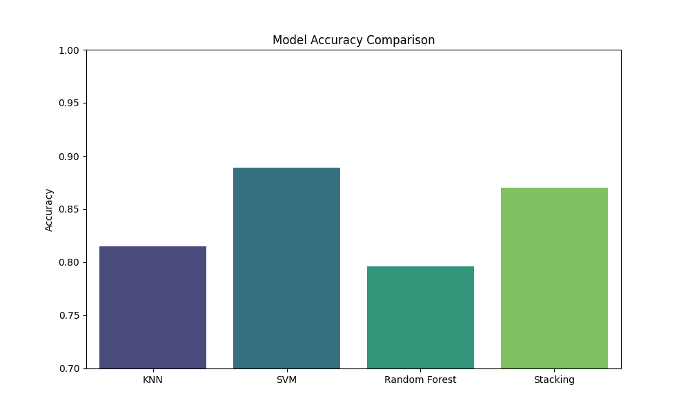
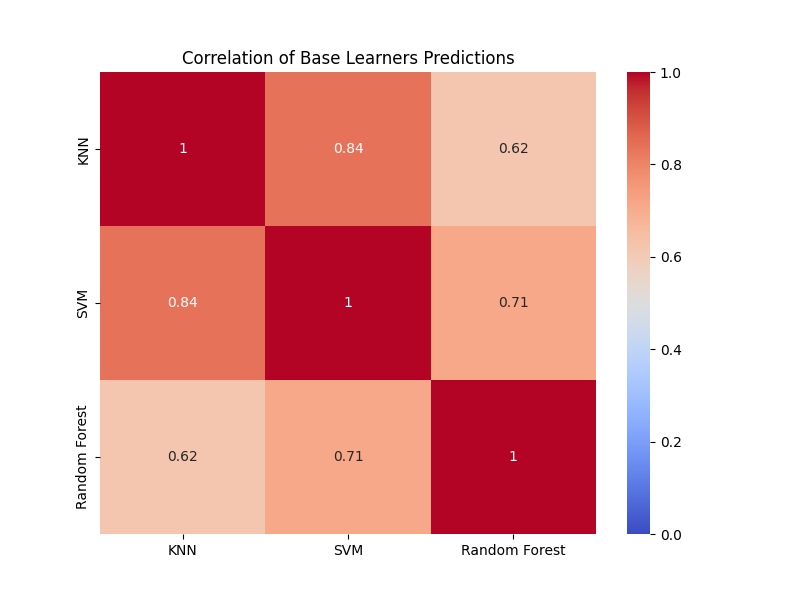
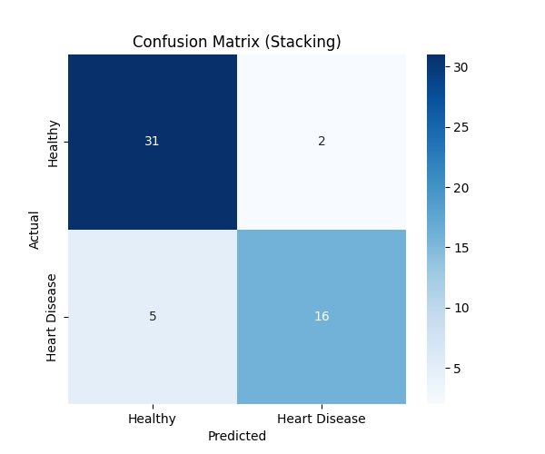

# Day 21: Stacking (Stacked Generalization) - 心臟病預測

## 0. 歷史小故事/核心貢獻者:
**Stacking (Stacked Generalization)** 由 **David H. Wolpert** 於 1992 年提出。
如果說 Bagging (Random Forest) 是「民主投票」，Boosting (XGBoost) 是「菁英接力」，那 Stacking 就是 **「超級經理人」**。
它不直接預測結果，而是去學習「如何組合別人的預測」。這在 Kaggle 比賽中是奪冠的必備技巧，往往能在最後關頭擠出那 0.001% 的準確率。

## 1. 資料集來源
### 資料集來源：[Statlog (Heart) Data Set](https://archive.ics.uci.edu/ml/datasets/statlog+(heart))
> 備註：我們使用 Scikit-Learn 的 `fetch_openml` 下載。

### 資料集特色與欄位介紹:
這是一個用於判斷心臟病風險的數據集。
*   **數量 (Samples)**：270 筆。
*   **目標 (Target)**：
    *   0: **Absence (健康)**
    *   1: **Presence (有心臟病)**
*   **特徵 (Features)**：共 13 個，包含：
    *   `age`: 年齡
    *   `sex`: 性別
    *   `cp`: 胸痛類型 (Chest Pain Type)
    *   `trestbps`: 靜止血壓
    *   `chol`: 膽固醇
    *   ...等生理指標。

## 2. 原理
### 核心概念：名醫會診 (Medical Consultation)
#### 2.1 核心公式 (Math behind the Magic)
如果我們使用 **Logistic Regression** 作為總醫師 (Meta Learner)，Stacking 的最終決策其實就是一個 **「加權平均」**：

$$ \hat{y}_{final} = \sigma (w_1 \cdot P_{KNN} + w_2 \cdot P_{SVM} + w_3 \cdot P_{RF} + b) $$

*   **$P_{KNN}, P_{SVM}, P_{RF}$**：是三位專家預測出的「患病機率」。
*   **$w_1, w_2, w_3$**：是總醫師給每位專家的 **「信任權重」**。如果 SVM 最準，它的 $w_2$ 就會最大。
*   **$\sigma$**：Sigmoid 函數，將加權後的總分轉換回 0~1 的機率。

#### 2.2 角色分配
Stacking 就像是一個醫療團隊：
1.  **基底模型 (Base Learners) - 各科專家**：
    *   **KNN 醫師**：他喜歡翻病歷，看這個病人跟以前哪個病人很像 (幾何距離)。
    *   **SVM 醫師**：他心中有一把尺，嚴格區分健康與生病 (決策邊界)。
    *   **Random Forest 醫師**：他喜歡問診，通過一系列問題來判斷 (邏輯規則)。
2.  **元模型 (Meta Learner) - 總醫師 (Chief Physician)**：
    *   他不直接看病人的數據。
    *   **他看的是「那三位專家的診斷報告」**。
    *   他知道 KNN 醫師有時候對年輕人看不太準，SVM 醫師對血壓高的病人特別敏銳。
    *   他綜合這些資訊，給出最終診斷。

#### 2.3 運作流程
1.  **第一階段 (Level 0)**：資料輸入給 KNN, SVM, RF，他們各自給出預測結果 (例如：0, 1, 1)。
2.  **第二階段 (Level 1)**：把這三個預測結果 (0, 1, 1) 當作**新的特徵 (New Features)**，輸入給 Meta Learner (通常是 Logistic Regression)。
3.  **最終輸出**：Meta Learner 根據這些專家的意見，算出最終機率。

#### 2.4 為什麼有效？ (Diversity is Key)
Stacking 要強，關鍵在於**專家要有「多樣性」**。
如果三個專家都用同一套邏輯 (例如三個都是 KNN)，那請三個跟請一個沒兩樣。
必須是「有人看形狀、有人看顏色、有人看材質」，互補性才高，總醫師才能發揮作用。

## 3. 實戰
### Python 程式碼實作
完整程式連結：[Stacking_Heart_Disease.py](Stacking_Heart_Disease.py)

```python
# 關鍵程式碼：Stacking

# 1. 準備基底模型 (專家群)
base_learners = [
    ('knn', KNeighborsClassifier(n_neighbors=5)),
    ('svm', SVC(kernel='rbf', probability=True)),
    ('rf', RandomForestClassifier(n_estimators=50))
]

# 2. 準備元模型 (總醫師)
meta_learner = LogisticRegression()

# 3. 建立 Stacking 模型
from sklearn.ensemble import StackingClassifier
stacking_model = StackingClassifier(
    estimators=base_learners,
    final_estimator=meta_learner,
    cv=5 # 內部交叉驗證，防止作弊
)

stacking_model.fit(X_train, y_train)
```

## 4. 模型評估與視覺化
### 1. 效能比較 (Accuracy Comparison)

*   **結果**：
    *   KNN: ~81.5%
    *   SVM: ~88.9%
    *   Random Forest: ~79.6%
    *   **Stacking: ~87.0%**
*   **分析：為什麼 SVM 比 Stacking 還高？**
    *   **小樣本優勢**：我們的資料只有 270 筆。SVM (特別是 RBF 核函數) 非常擅長在小樣本、高維度 (13 特徵) 的空間中找到漂亮的切分線。
    *   **Stacking 的代價**：Stacking 需要把資料切分來訓練「總醫師」(Meta Learner)。在資料量這麼少的情況下，再切分會導致訓練資料不足，總醫師可能學得不夠好。
    *   **那為什麼還要學 Stacking？** 因為它的價值在於 **「穩健性 (Robustness)」**。如果今天換了一批新的病人，SVM 可能會因為過度適應舊病人而失準，但 Stacking 因為綜合了三位專家的意見，通常能維持穩定的表現。

### 2. 預測相關性 (Prediction Correlation)

*   **觀察**：這張熱力圖顯示了三個專家意見的相似度。
    *   如果相關性是 1.0，代表兩個專家講的話一模一樣 (沒用)。
    *   我們希望看到**顏色不要太深** (相關性低)，代表大家觀點不同。
    *   這張圖可以幫助我們篩選模型：如果兩個模型太像，就踢掉一個。

### 3. 混淆矩陣 (Confusion Matrix)

*   **準確率 (Accuracy)**：約 **87.0%**。
    *   **計算過程**：`(31 + 16) / 54 ≈ 87.0%`
*   顯示了 Stacking 模型最終的分類結果。

## 5. 戰略總結: 集成學習的火箭發射之旅

### (Stacking 適用)

#### 5.1 流程一：廣納賢才 (Base Learners)
*   **設定**：選擇 **原理差異大** 的模型 (如 KNN vs SVM vs Tree)。
*   **目的**：確保觀點的多樣性。

#### 5.2 流程二：交叉驗證 (Cross Validation)
*   **設定**：在訓練 Meta Learner 時，必須使用 Cross Validation 產生的預測值 (Out-of-Fold Predictions)。
*   **目的**：防止 Meta Learner 看到「看過答案」的預測值，導致作弊 (Data Leakage)。

#### 5.3 流程三：統合決策 (Meta Learner)
*   **設定**：使用簡單的模型 (如 Logistic Regression) 來組合大家的意見。
*   **目的**：學習如何權衡各個專家的可信度。

## 6. 總結
Day 21 我們學習了 **Stacking**。
*   它是集成學習的集大成者。
*   核心概念是 **「名醫會診」**：讓總醫師 (Meta Learner) 來綜合各科專家 (Base Learners) 的意見。
*   雖然它計算成本高、結構複雜，但它是追求極致準確率時不可或缺的武器。

下一章 (Day 22)，我們將進入一個全新的領域 —— **自然語言處理 (NLP)**！我們要教電腦讀懂人類的語言了！
