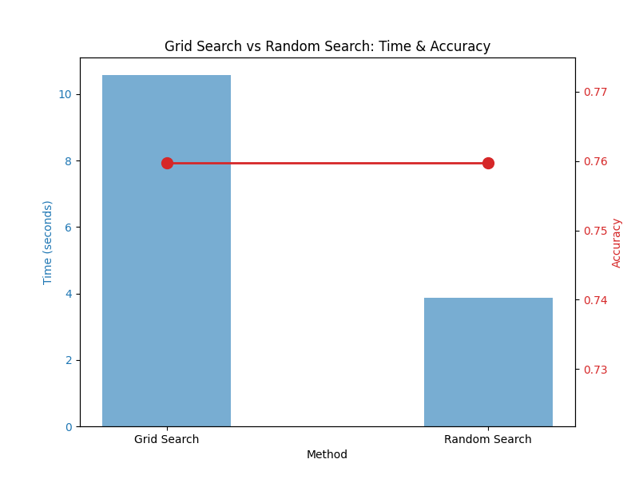

# Day 22: 模型調參 (Hyperparameter Tuning) - 尋找最佳設定

## 0. 歷史小故事/核心貢獻者:
**"All models are wrong, but some are useful." - George Box**
模型就像一台精密的賽車，出廠設定 (Default Parameters) 雖然能跑，但要跑得快，就必須針對賽道 (資料集) 進行調校。
**Grid Search** 是最古老的方法，就像地毯式轟炸；而 **Random Search** (由 James Bergstra 和 Yoshua Bengio 於 2012 年推廣) 則證明了「隨機嘗試」往往比地毯式搜索更有效率。

## 1. 資料集來源
### 資料集來源：[Pima Indians Diabetes Database](https://www.kaggle.com/uciml/pima-indians-diabetes-database)
> 備註：沿用 Day 20 的資料集。

### 資料集特色與欄位介紹:
*   **數量 (Number of Instances)**：768 筆。
*   **特徵 (Features)**：共 8 個，包含：
    *   `plas`: 血糖濃度 (最重要的指標)。
    *   `mass`: BMI 指數。
    *   `age`: 年齡。
    *   `preg`: 懷孕次數。
    *   `pedi`: 糖尿病家族函數 (遺傳風險)。
    *   `insu`: 胰島素濃度。
    *   `pres`: 血壓。
    *   `skin`: 皮膚皺褶厚度。
*   **目標 (Target)**：`class` (1=陽性/有糖尿病, 0=陰性/健康)。

## 2. 原理
### 核心概念：如何找到那一組「黃金參數」？

#### 2.1 核心公式與關鍵參數
我們這次調參的主角是 **XGBoost**，它的目標函數如下：
`Obj = Sum(Loss) + Sum(Regularization)`
(前面是誤差，後面是正則化項)

我們主要調整以下三個 **超參數 (Hyperparameters)** 來影響這個公式：
1.  **`n_estimators` (樹的數量)**：
    *   **意義**：總共要改幾次考卷？
    *   **影響**：越多越準，但也越慢，且容易 Overfitting。
2.  **`learning_rate` (學習率 $\eta$)**：
    *   **意義**：每次修正的幅度。
    *   **公式**：`y_new = y_old + learning_rate * new_prediction`
    *   **影響**：越小越穩 (慢工出細活)，但需要更多棵樹。
3.  **`max_depth` (樹的深度)**：
    *   **意義**：每棵樹可以問幾個問題？
    *   **影響**：越深越複雜 (能學到更細節的規則)，但也越容易死記硬背 (Overfitting)。

#### 2.2 兩種流派
1.  **Grid Search (網格搜索)**：
    *   **方法**：你給它一個範圍 (例如：樹的數量 [50, 100, 200])，它就**窮舉**所有可能的組合。
    *   **優點**：保證找到範圍內的最佳解。
    *   **缺點**：慢！如果參數很多，組合數會爆炸 (Curse of Dimensionality)。
    *   **比喻**：為了找遺失的鑰匙，把家裡地板每一寸都摸一遍。

2.  **Random Search (隨機搜索)**：
    *   **方法**：在範圍內**隨機抽樣**幾組參數來測。
    *   **優點**：快！通常試個幾十次就能找到很不錯的解。
    *   **缺點**：可能剛好錯過最佳解 (運氣成份)。
    *   **比喻**：為了找鑰匙，隨機翻翻沙發、桌子、櫃子，通常很快就找到了。

## 3. 實戰
### Python 程式碼實作
完整程式連結：[Tuning_XGBoost.py](Tuning_XGBoost.py)

```python
# 關鍵程式碼：Grid Search vs Random Search

# 1. 設定參數範圍
param_grid = {
    'n_estimators': [50, 100, 200],
    'learning_rate': [0.01, 0.1, 0.2],
    'max_depth': [3, 5, 7]
}

# 2. Grid Search (地毯式搜索)
# cv=3: 交叉驗證 3 次
grid_search = GridSearchCV(estimator=xgb, param_grid=param_grid, cv=3)
grid_search.fit(X_train, y_train)

# 3. Random Search (隨機搜索)
# n_iter=10: 只隨機抽 10 組
random_search = RandomizedSearchCV(estimator=xgb, param_distributions=param_grid, n_iter=10)
random_search.fit(X_train, y_train)
```

## 4. 模型評估與視覺化
### 1. 時間與效能比較 (Time vs Accuracy)

*   **藍色柱狀圖 (時間)**：可以看到 **Grid Search 的柱子非常高**，代表它花費的時間遠多於 Random Search。
*   **紅色折線圖 (準確率)**：兩者的紅點 **高度一致 (都是 75.97%)**。
*   **結論**：這張圖血淋淋地告訴我們 —— **Grid Search 雖然努力 (花時間)，但不一定比較厲害**。Random Search 用極短的時間就找到了同樣好的參數，CP 值完勝！

## 5. 戰略總結: 調參的藝術

### (模型調參適用)

#### 5.1 流程一：先廣後精 (Coarse to Fine)
*   **設定**：先用 Random Search 在大範圍內隨機搜 (例如 learning_rate: 0.001 ~ 1.0)。
*   **目的**：快速鎖定「大概在哪個區域」效果好。

#### 5.2 流程二：精細搜索 (Grid Search)
*   **設定**：在 Random Search 找到的「好區域」附近，用 Grid Search 進行地毯式搜索。
*   **目的**：在小範圍內榨出最後一點效能。

#### 5.3 流程三：不要過度調參 (Over-tuning)
*   **提醒**：如果調了半天只進步 0.0001，那可能是在浪費時間，甚至導致 Overfitting。資料品質通常比參數更重要。

## 6. 總結
Day 22 我們學習了 **模型調參**。
*   **Grid Search** 是地毯式搜索，慢但穩。
*   **Random Search** 是隨機抽樣，快且有效。
*   實戰中，推薦先用 Random Search 找大方向，再用 Grid Search 微調。

下一章 (Day 23)，我們將進入 **深度學習 (Deep Learning)** 的世界！我們要從最基本的 **感知機 (Perceptron)** 開始，一步步搭建神經網路。
