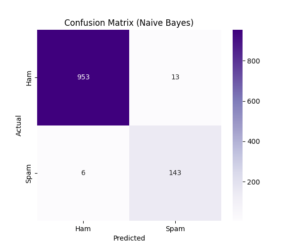
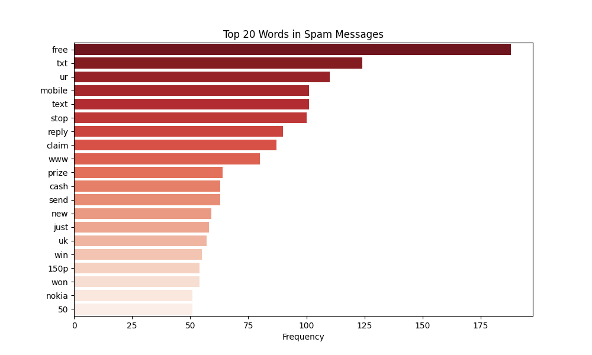

# Day 22: NLP 基礎 - 詞袋模型 (Bag of Words)

## 0. 歷史小故事/核心貢獻者:
**Bag of Words (BoW)** 是自然語言處理 (NLP) 最早期的技術之一。
它的概念源自於 1950 年代的資訊檢索 (Information Retrieval) 領域。
想像把一篇文章的所有單字剪下來，丟進一個袋子裡搖一搖。我們**不在乎單字的順序** (文法被破壞了)，我們**只在乎哪些字出現了，以及出現了幾次**。
雖然簡單粗暴，但它在垃圾郵件分類、情感分析等任務上，效果出奇的好！

## 1. 資料集來源
### 資料集來源：[SMS Spam Collection Dataset](https://archive.ics.uci.edu/ml/datasets/sms+spam+collection)
> 備註：程式會自動下載並解壓縮。

### 資料集特色與欄位介紹:
這是一個包含 5,574 則簡訊的資料集，標記了哪些是正常簡訊，哪些是垃圾簡訊。
*   **數量 (Samples)**：5,572 筆。
*   **欄位**：
    *   `label`: 標籤 (`ham`=正常, `spam`=垃圾)。
    *   `message`: 簡訊內容 (純文字)。

## 2. 原理
### 核心概念：把文字變成數字 (Text to Numbers)
電腦看不懂 "Free money"，它只看得懂數字。BoW 就是一種把文字轉成向量 (Vector) 的方法。

#### 2.1 運作流程 (Step-by-Step)
假設我們有兩句簡訊：
1.  "Free money now"
2.  "Money is not free"

**步驟一：建立字典 (Vocabulary Building)**
找出所有出現過的單字 (不重複)：
`['free', 'money', 'now', 'is', 'not']` (共 5 個字)

**步驟二：編碼 (Encoding)**
數數看每個字在句子中出現幾次：

| 句子 | free | money | now | is | not |
| :--- | :---: | :---: | :---: | :---: | :---: |
| "Free money now" | 1 | 1 | 1 | 0 | 0 |
| "Money is not free" | 1 | 1 | 0 | 1 | 1 |

這就是 **詞袋模型**！每一句話變成了一個長度為 5 的向量 `[1, 1, 1, 0, 0]`。

#### 2.2 為什麼叫「詞袋」？
因為它**丟失了順序資訊**。
"Dog bites man" 和 "Man bites dog" 在詞袋模型看起來是一模一樣的 (都有 dog, bites, man 各一次)。
但在垃圾郵件分類中，順序通常不重要，只要看到 "Free", "Winner", "Cash" 這些關鍵字，大概就是垃圾信了。

## 3. 實戰
### Python 程式碼實作
完整程式連結：[NLP_Bag_of_Words.py](NLP_Bag_of_Words.py)

```python
# 關鍵程式碼：CountVectorizer

from sklearn.feature_extraction.text import CountVectorizer
from sklearn.naive_bayes import MultinomialNB

# 1. 建立詞袋模型 (自動斷詞 + 建立字典 + 計算次數)
# stop_words='english': 去除無意義的字 (the, is, at...)
vectorizer = CountVectorizer(stop_words='english')
X = vectorizer.fit_transform(df['message'])

# 2. 訓練模型 (使用樸素貝氏 Naive Bayes)
# Naive Bayes 是 NLP 的好朋友，專門處理這種「次數統計」的問題
model = MultinomialNB()
model.fit(X_train, y_train)
```

## 4. 模型評估與視覺化
### 1. 混淆矩陣 (Confusion Matrix)

*   **準確率 (Accuracy)**：約 **98.3%**。
    *   **計算過程**：`(953 + 143) / 1115 ≈ 98.3%`
*   **觀察**：
    *   **TN (正常簡訊)**：953 封全對，只有 13 封被誤判為垃圾 (FP)。
    *   **TP (垃圾簡訊)**：143 封抓到了，只有 6 封漏網之魚 (FN)。
    *   這在垃圾郵件過濾器中是非常優秀的表現！

### 2. 垃圾關鍵字 (Top Spam Words)

*   **觀察**：這張圖列出了垃圾簡訊中最常出現的單字。
    *   `free`, `txt`, `ur`, `mobile`, `claim`, `prize`, `won`...
    *   這些字眼一看就很像詐騙！
    *   這證明了 BoW 模型成功抓住了垃圾簡訊的特徵 —— **關鍵字**。

## 5. 戰略總結: NLP 的第一步

### (Bag of Words 適用)

#### 5.1 流程一：斷詞與過濾 (Tokenization)
*   **設定**：使用 `CountVectorizer` 切分單字，並移除停用詞 (Stop Words)。
*   **目的**：把文章變成單字的集合，去除雜訊。

#### 5.2 流程二：統計頻率 (Counting)
*   **設定**：計算每個字出現的次數。
*   **結果**：將不定長的文字轉換為固定長度的數字向量。

#### 5.3 流程三：分類 (Classification)
*   **設定**：使用 Naive Bayes 進行分類。
*   **結果**：根據關鍵字出現的機率，判斷是垃圾還是正常郵件。

## 6. 總結
Day 22 我們正式進入了 **NLP (自然語言處理)** 的領域。
*   我們學習了最簡單的 **Bag of Words (詞袋模型)**。
*   雖然它不識文法、不懂順序，但光靠 **「關鍵字統計」**，就能在垃圾郵件分類上達到 98% 的準確率。
*   這告訴我們：有時候，簡單的方法就很有效！

下一章 (Day 23)，我們要解決 BoW 的一個缺點：有些字雖然常出現 (如 "is", "the") 但沒什麼用。我們將學習 **TF-IDF**，學會如何找出「真正重要」的關鍵字！
