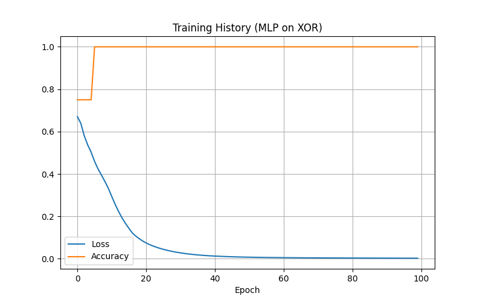
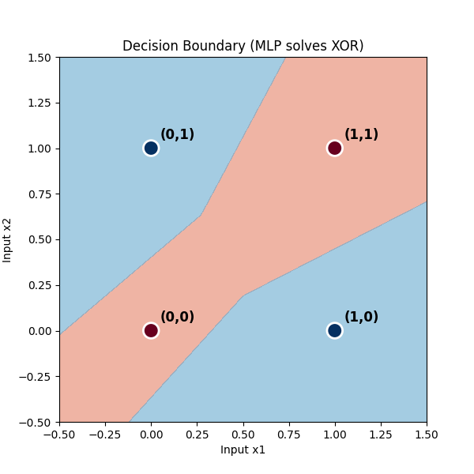

# Day 23: 深度學習基礎 - 感知機與 MLP (XOR 問題)

## 0. 歷史小故事/核心貢獻者:
**Frank Rosenblatt (1958)** 發明了 **感知機 (Perceptron)**，這是神經網路的祖先。當時人們以為它能解決所有問題。
然而，**Marvin Minsky & Seymour Papert (1969)** 在《Perceptron》一書中證明了感知機**連最簡單的 XOR (互斥或) 問題都解決不了**。這導致了 AI 進入了長達 10 年的第一次寒冬。
直到後來，人們發現只要**多加一層 (Hidden Layer)**，就能解決這個問題，這就是 **多層感知機 (MLP)** 的誕生。

## 1. 資料集來源
### 資料集來源：XOR Logic Gate (自製數據)
> 備註：這是一個邏輯運算問題，不需要外部下載。

### 資料集特色與欄位介紹:
XOR (Exclusive OR) 的規則是：**兩個一樣就是 0，不一樣就是 1**。
*   **輸入 (Features)**：
    *   (0, 0) -> **0**
    *   (0, 1) -> **1**
    *   (1, 0) -> **1**
    *   (1, 1) -> **0**

**欄位說明**：
*   **Input A ($x_1$)**: 第一個邏輯輸入 (0 或 1)。
*   **Input B ($x_2$)**: 第二個邏輯輸入 (0 或 1)。
*   **Output ($y$)**: XOR 運算結果 (0 或 1)。

## 2. 原理
### 核心概念：為什麼單層感知機切不開？
感知機就像一把刀 (線性分類器)，它只能切一條直線。
想像把 (0,0) 和 (1,1) 標為 O，把 (0,1) 和 (1,0) 標為 X。
請試著在紙上畫一條直線，把 O 和 X 分開。
**你會發現怎麼畫都畫不出來！** 這就是 **線性不可分 (Linearly Inseparable)** 問題。

#### 2.1 核心公式 (The Math of a Neuron)
神經網路其實就是無數個 **「感知機 (Perceptron)」** 串聯起來的。每一個神經元的運作可以拆解為兩步：
1.  **加權總和 (Weighted Sum)**：
    `z = w1*x1 + w2*x2 + ... + b`
    (這就是線性回歸的公式！)
2.  **激活函數 (Activation Function)**：
    `a = Activation(z)`
    (例如 ReLU 或 Sigmoid，負責把直線變彎曲，引入非線性。)

#### 2.2 神經網路架構圖 (Architecture)

*   **Input Layer**: 2 個輸入 ($x_1, x_2$)。
*   **Hidden Layer**: 8 個神經元 (負責變形空間)。
*   **Output Layer**: 1 個輸出 (機率值)。

### 解決方案：多層感知機 (MLP)
如果一把刀切不開，那就**用兩把刀**，然後再把它們拼起來！
*   **隱藏層 (Hidden Layer)**：負責把原本扭曲的空間「摺疊」或「變形」。
*   **激活函數 (Activation Function)**：如 **ReLU** 或 **Sigmoid**，提供非線性能力。如果沒有它，疊再多層也只是一條直線。

## 3. 實戰
### Python 程式碼實作
完整程式連結：[DL_XOR_MLP.py](DL_XOR_MLP.py)

```python
# 關鍵程式碼：建立 MLP 模型 (Keras)

from tensorflow.keras.models import Sequential
from tensorflow.keras.layers import Dense

model = Sequential([
    # 隱藏層：8 個神經元，使用 ReLU (這就是那把變形的刀)
    Dense(8, input_dim=2, activation='relu'),
    
    # 輸出層：1 個神經元，使用 Sigmoid (輸出機率)
    Dense(1, activation='sigmoid')
])

model.compile(optimizer='adam', loss='binary_crossentropy', metrics=['accuracy'])
model.fit(X, y, epochs=100)
```

## 4. 模型評估與視覺化
### 1. 訓練過程 (Training History)

*   **觀察**：Loss 迅速下降，Accuracy 很快就達到了 1.0 (100%)。這證明 MLP 輕鬆解決了 XOR 問題。

### 2. 決策邊界 (Decision Boundary)

*   **觀察**：
    *   可以看到決策邊界**不再是一條直線**，而是一個彎曲的區域 (或兩條線圍成的區域)。
    *   紅色區域包圍了 (0,1) 和 (1,0)，藍色區域包圍了 (0,0) 和 (1,1)。
    *   這就是 **隱藏層 + 非線性激活函數** 的威力！

## 5. 戰略總結: 深度學習的起點

### (Deep Learning 適用)

#### 5.1 流程一：搭建骨架 (Architecture)
*   **設定**：決定有幾層隱藏層？每層有幾個神經元？
*   **原則**：越深越強，但也越難訓練。對於簡單問題 (如 XOR)，一層隱藏層就夠了。

#### 5.2 流程二：注入靈魂 (Activation)
*   **設定**：選擇激活函數 (ReLU, Sigmoid, Tanh)。
*   **目的**：引入非線性，讓模型能理解複雜的邏輯。**沒有激活函數的神經網路，就只是線性回歸而已。**

#### 5.3 流程三：優化訓練 (Optimizer)
*   **設定**：選擇優化器 (SGD, Adam)。
*   **目的**：Adam 是目前的預設首選，它能自動調整學習率，收斂速度快。

## 6. 總結
Day 23 我們正式跨入了 **深度學習**。
*   我們見證了 **感知機** 的侷限 (切不開 XOR)。
*   我們用 **MLP (多層感知機)** 成功解決了這個問題。
*   關鍵在於 **隱藏層** 和 **激活函數**，它們賦予了神經網路「彎曲空間」的能力。

下一章 (Day 24)，我們將挑戰深度學習的 "Hello World" —— **MNIST 手寫數字辨識**！我們要訓練電腦看懂你寫的數字！
