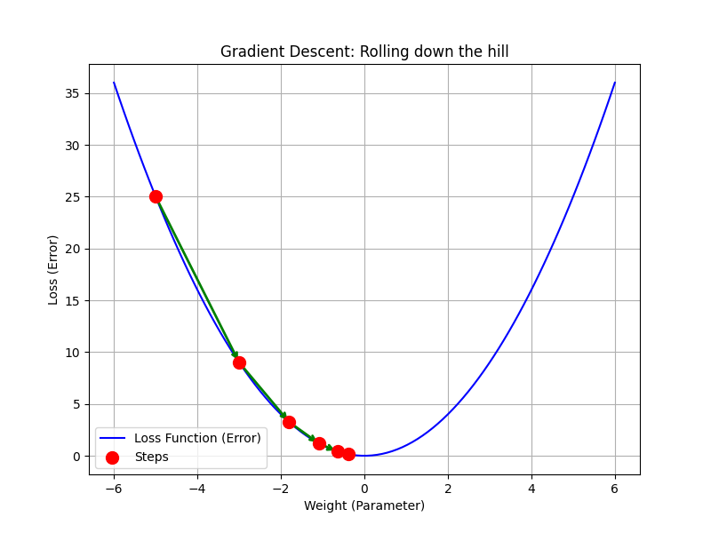
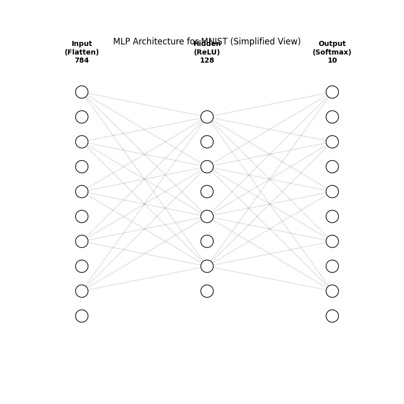
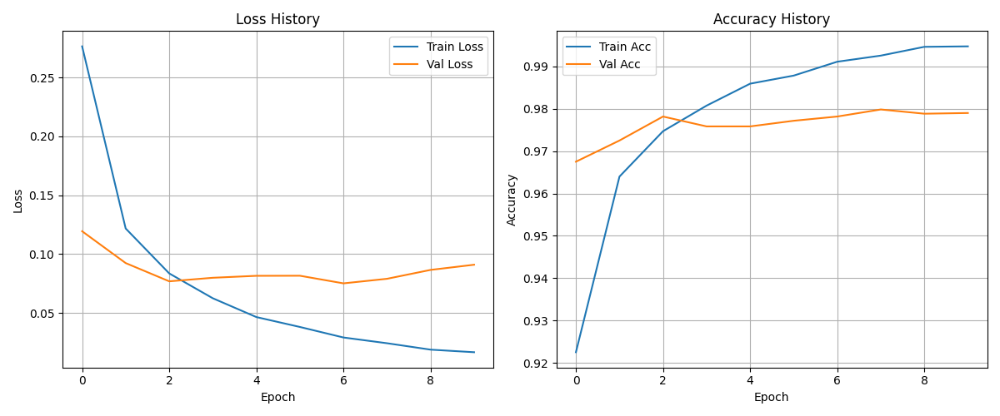
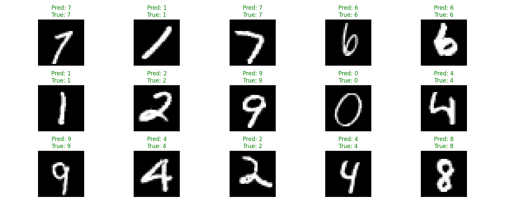

# Day 24: 神經網路訓練 - MNIST 手寫數字辨識

## 0. 歷史小故事/核心貢獻者:
**MNIST (Modified National Institute of Standards and Technology database)** 是深度學習界的 "Hello World"。
它由 **Yann LeCun** 等人於 1998 年整理發布。在那個年代，能讓電腦自動辨識手寫支票上的數字，是一項了不起的技術。
如果你提出一個新的圖像識別演算法，大家會問的第一個問題通常是：「它在 MNIST 上跑幾分？」

## 1. 資料集來源
### 資料集來源：[MNIST Database](http://yann.lecun.com/exdb/mnist/)
> 備註：Keras 已內建此資料集，程式會自動下載。

### 資料集特色與欄位介紹:
這是一個包含 0~9 手寫數字的灰階圖片資料集。
*   **數量**：訓練集 60,000 筆，測試集 10,000 筆。
*   **格式**：28x28 像素 (Pixel)，灰階值 0 (白) ~ 255 (黑)。
*   **目標 (Target)**：0, 1, 2, ..., 9 (共 10 類)。

## 2. 原理
### 2.1 核心概念：神經網路是如何學習的？ (Training Loop)
訓練一個神經網路，其實就是不斷重複以下四個步驟。
**那要重複幾次呢？** 這取決於我們設定的 `Epochs` (輪數) 和 `Batch Size` (批次大小)。
*   我們設定 `Epochs=10`，代表模型要把 60,000 題考古題 **全部做完 10 遍**。
*   每做完 **32 題 (Batch Size)**，就會執行一次「反向傳播」來修正觀念。
*   所以總共會修正：`(60000 / 32) * 10 ≈ 18,750` 次！(扣掉驗證集後約 16,880 次)

詳細步驟如下：

1.  **前向傳播 (Forward Propagation)**：
    *   **公式**：`y = Activation(W * x + b)`
    *   **說明**：資料從輸入層進去，經過層層神經元 (加權總和+激活)，最後算出預測結果。
    *   *比喻：學生寫考卷，寫出答案。*

2.  **計算損失 (Calculate Loss)**：
    *   **公式 (Cross Entropy)**：`Loss = -Sum(y_true * log(y_pred))`
    *   **說明**：比較「預測結果」和「真實答案」的差距。
    *   *比喻：老師改考卷，算出考了幾分 (或錯了幾題)。*

3.  **反向傳播 (Backpropagation)**：
    *   **公式 (Chain Rule)**：`dL/dw = (dL/dy) * (dy/dz) * (dz/dw)`
    *   **說明**：這是深度學習的靈魂！根據誤差，從最後一層往回推，計算每個神經元對誤差「貢獻」了多少 (梯度 Gradient)。
    *   *比喻：檢討考卷，發現是哪一個觀念錯了，導致最後答案寫錯。*

4.  **更新權重 (Update Weights - Optimizer)**：
    *   **公式 (Gradient Descent)**：`w_new = w_old - Learning_Rate * Gradient`
    *   **說明**：根據梯度，調整神經元的權重 (Weight) 和偏差 (Bias)。我們使用 **Adam** 優化器。
    *   *比喻：學生修正腦中的觀念，下次就不會再錯了。*
    
    
    > **圖解**：想像 Loss Function 是一個山谷，我們的目標是走到谷底 (Loss 最小)。梯度 (Gradient) 就是坡度，告訴我們往哪邊走會下坡。Learning Rate 則是我們跨出的步伐大小。

### 2.2 為什麼 Adam 這麼受歡迎？ (Momentum 機制)
你可能會好奇，為什麼我們選擇 `optimizer='adam'` 而不是最基本的 SGD？
*   **問題**：基本的 SGD 就像一個走路搖搖晃晃的醉漢，容易被路上的小石頭 (雜訊) 絆倒，或者在平坦的地方走太慢。
*   **Momentum (動量)**：Adam 引入了物理學中「慣性」的概念。
    *   **機制**：如果上一步是往東走，這一步就算梯度稍微偏北，我還是會保留一部分往東的衝力。
    *   **好處**：這讓優化過程像一顆**滾下山的重球**，遇到小坑洞 (局部最小值) 可以直接衝過去，且在平坦區域能加速前進。
    *   **Adam = Momentum + RMSProp**：Adam 其實是結合了 Momentum (慣性衝力) 和 RMSProp (自動調整步伐大小) 的集大成者。

### 2.3 圖片在電腦眼裡是什麼？ (Image Processing)
*   **矩陣 (Matrix)**：一張 28x28 的灰階圖片，其實就是一個 28x28 的數字矩陣。每個格子 (Pixel) 的值介於 0 (白) ~ 255 (黑)。
*   **拉平 (Flatten)**：MLP 只能吃「一維向量」。所以我們要把這塊 2D 的豆腐切成 28 條，然後接成一條長長的線 (784 個數字)。
    *   `[[1, 2], [3, 4]]` (2x2)  -->  `[1, 2, 3, 4]` (1x4)

### 2.4 核心公式：Softmax
在輸出層，我們使用 **Softmax** 函數，它的作用是把神經元的輸出變成 **「機率」**：
`Probability(i) = exp(z_i) / Sum(exp(z_j))`
*   它保證了所有類別的機率加起來等於 1 (例如：是 0 的機率 10%，是 1 的機率 80%...)。
*   機率最大的那個，就是模型的預測結果。

### 2.5 神經網路架構示意圖 (Architecture)

*   **Input Layer (784)**：接收拉平後的圖片像素。
*   **Hidden Layer (128)**：負責特徵提取與變形。
*   **Output Layer (10)**：輸出 0~9 每個數字的機率。

### 模型架構 (Architecture)
我們使用一個簡單的 **MLP (多層感知機)**：
*   **Input**: 28x28 圖片 -> **Flatten** -> 784 維向量。
*   **Hidden**: 128 個神經元 (**ReLU**)。
*   **Output**: 10 個神經元 (**Softmax**，輸出 0~9 的機率)。

## 3. 實戰
### Python 程式碼實作
完整程式連結：[DL_MNIST_Training.py](DL_MNIST_Training.py)

```python
# 關鍵程式碼：建立與訓練模型

from tensorflow.keras.models import Sequential
from tensorflow.keras.layers import Dense, Flatten

# 1. 建立模型
model = Sequential([
    Flatten(input_shape=(28, 28)),      # 拉平
    Dense(128, activation='relu'),      # 隱藏層
    Dense(10, activation='softmax')     # 輸出層 (10類)
])

# 2. 編譯模型 (設定學習方式)
model.compile(optimizer='adam',
              loss='sparse_categorical_crossentropy',
              metrics=['accuracy'])

# 3. 訓練模型 (開始寫考卷、改考卷、修正觀念)
model.fit(X_train, y_train, epochs=10)
```

## 4. 模型評估與視覺化
### 1. 訓練過程 (History)

*   **Loss (左圖)**：隨著訓練次數 (Epoch) 增加，誤差越來越小。
*   **Accuracy (右圖)**：準確率越來越高，最終在測試集上達到了約 **97.8%** 的準確率。

### 2. 預測結果展示 (Predictions)

*   **觀察**：
    *   模型成功辨識出了大部分的數字。
    *   標題顯示了 `Pred` (預測值) 和 `True` (真實值)。
    *   如果有寫得很醜的字 (例如像 1 的 7)，模型可能會認錯，這時候就需要更強的模型 (如 CNN)。

### 3. 成果 (Results)
*   **正確率 (Accuracy)**: 約 **97.8%**。
*   對於手寫數字辨識來說，這個分數已經相當不錯了。但如果遇到更複雜的圖片 (如貓狗)，MLP 的極限就會顯現出來 (如 Day 25 所述)。

## 5. 戰略總結: 深度學習的標準 SOP

### (Deep Learning 適用)

#### 5.1 流程一：資料預處理 (Preprocessing)
*   **設定**：將圖片像素除以 255，縮放到 0~1 之間。
*   **目的**：**正規化 (Normalization)** 能讓梯度下降跑得更順暢，加速收斂。

#### 5.2 流程二：定義模型 (Model Definition)
*   **設定**：Input -> Flatten -> Dense (ReLU) -> Dense (Softmax)。
*   **原則**：對於影像問題，MLP 破壞了空間結構 (把 2D 變 1D)，所以效果有極限。明天我們要學的 CNN 會解決這個問題。

#### 5.3 流程三：編譯與訓練 (Compile & Fit)
*   **設定**：Optimizer=Adam, Loss=CrossEntropy。
*   **目的**：讓模型自動透過反向傳播算法，找到最佳的權重參數。

## 6. 補充 常見優化演算法比較表 (Optimizer Comparison)

| 演算法 (Optimizer) | 核心機制 (Mechanism) | 優點 (Pros) | 缺點 (Cons) |
| :--- | :--- | :--- | :--- |
| **SGD** | 隨機梯度下降 (每次只看一筆) | 計算快，佔用記憶體少 | 路徑震盪 (Zigzag)，容易卡在鞍點 |
| **Momentum** | 引入「慣性」 (保留上一步衝力) | 減少震盪，加速收斂 | 需多調一個參數 (Momentum 係數) |
| **Adagrad** | 自適應學習率 (頻率高的參數更新慢) | 適合稀疏資料 (Sparse Data) | 學習率會不斷變小，最後停止學習 |
| **RMSProp** | 改進 Adagrad (只看最近的梯度平方平均) | 解決學習率消失問題，適合 RNN | 仍需設定全域學習率 |
| **Adam** | **Momentum + RMSProp** | 綜合兩者優點，免調參，收斂快且穩 | 目前最主流的選擇 (Default) |


## 7. 總結
Day 24 我們完成了深度學習的 "Hello World"。
*   我們訓練了一個 MLP 來辨識手寫數字，準確率達到 97.8%。
*   我們理解了 **Forward -> Loss -> Backward -> Update** 的訓練循環。
*   雖然 MLP 很厲害，但它把圖片「壓扁」了，丟失了像素之間的空間關係。

下一章 (Day 25)，我們將引入 **CNN (卷積神經網路)**，它能像人類眼睛一樣，看懂圖片的「特徵」！

---

