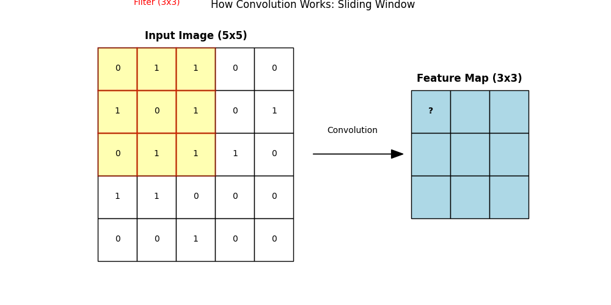
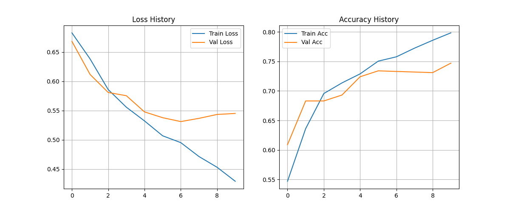
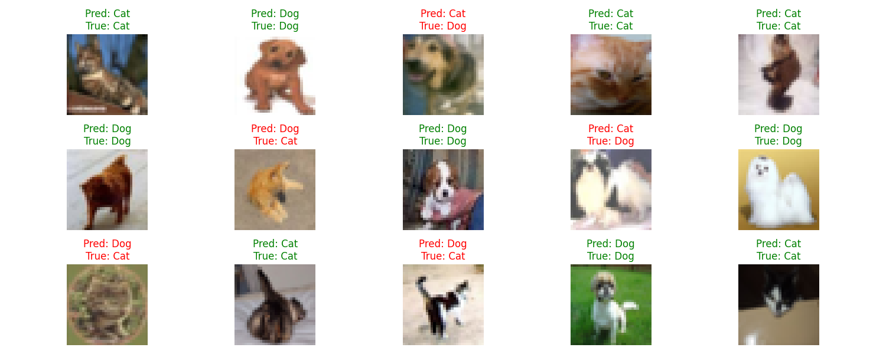

# Day 25: CNN (Convolutional Neural Network) - 貓狗圖片分類

## 0. 歷史小故事/核心貢獻者:
**Yann LeCun (1989)** 發明了 **LeNet-5**，這是 CNN 的鼻祖，成功應用於美國郵局的手寫郵遞區號辨識。
但 CNN 真正爆紅是在 **2012 年 (AlexNet)**，Hinton 的學生 Alex Krizhevsky 用更深的 CNN 在 ImageNet 大賽中以壓倒性優勢奪冠，從此開啟了深度學習的黃金時代。

## 1. 資料集來源
### 資料集來源：[CIFAR-10 Dataset](https://www.cs.toronto.edu/~kriz/cifar.html)
> 備註：Keras 已內建。我們只挑選其中的 **貓 (Cat)** 和 **狗 (Dog)** 兩類來做二元分類。

### 資料集特色與欄位介紹:
*   **圖片格式**：32x32 像素，彩色 (RGB 3 通道)。
*   **數量**：訓練集 10,000 筆 (貓+狗)，測試集 2,000 筆。
*   **目標 (Target)**：0 (貓), 1 (狗)。

## 2. 原理
### 核心概念：為什麼 MLP 看不懂圖片？
MLP 把圖片 **Flatten (拉平)** 了。
試想，把一張貓的照片切成一條條細絲接起來，你還認得出是貓嗎？
**空間結構 (Spatial Structure)** 被破壞了！眼睛和耳朵的相對位置不見了。

### 解決方案：CNN (卷積神經網路)
CNN 像人類的眼睛一樣，**用「掃描」的方式看圖片**，保留了空間特徵。它有兩大法寶：

#### 2.1 卷積層 (Convolution Layer) - 特徵提取器
*   **原理**：用一個小小的 **濾鏡 (Filter/Kernel)**，在圖片上滑動 (Sliding Window)，計算特徵。
*   **功能**：找出圖片中的「線條」、「轉角」、「圓形」等特徵。
*   **圖解**：
    
    > 黃色框框就是濾鏡，它在圖片上滑動，把對應的像素值相乘再相加，得到右邊的特徵圖 (Feature Map)。

#### 2.2 池化層 (Pooling Layer) - 重點整理
*   **原理**：把圖片縮小 (Downsampling)。常用的 **Max Pooling** 是在一個區域內 (例如 2x2) 只取最大值。
*   **功能**：
    1.  **減少運算量**：圖片變小了。
    2.  **抗雜訊**：只保留最明顯的特徵 (例如貓耳朵的尖端)，忽略背景雜訊。
    3.  **平移不變性**：貓稍微移位一點，最大值還是抓得到。

## 3. 實戰
### Python 程式碼實作
完整程式連結：[DL_CNN_CatDog.py](DL_CNN_CatDog.py)

```python
# 關鍵程式碼：建立 CNN 模型

from tensorflow.keras.layers import Conv2D, MaxPooling2D, Flatten, Dense

model = Sequential([
    # 1. 卷積層：32 個濾鏡，抓取初級特徵 (線條)
    Conv2D(32, (3, 3), activation='relu', input_shape=(32, 32, 3)),
    
    # 2. 池化層：圖片縮小一半 (32x32 -> 16x16)
    MaxPooling2D((2, 2)),
    
    # 3. 卷積層：64 個濾鏡，抓取高級特徵 (眼睛、耳朵)
    Conv2D(64, (3, 3), activation='relu'),
    
    # 4. 池化層：圖片再縮小一半 (16x16 -> 8x8)
    MaxPooling2D((2, 2)),
    
    # 5. 接回傳統 MLP 進行分類
    Flatten(),
    Dense(64, activation='relu'),
    Dense(1, activation='sigmoid') # 輸出是狗的機率
])
```

## 4. 模型評估與視覺化
### 1. 訓練過程 (History)

*   **觀察**：準確率 (Accuracy) 隨著訓練上升，但可能會發現 Training Acc 比 Validation Acc 高很多，這代表出現了 **Overfitting (過擬合)**。這是 CNN 常見的問題，可以透過 Dropout 或 Data Augmentation 來解決。

### 2. 預測結果展示 (Predictions)

*   **觀察**：模型能分辨出模糊的貓和狗。
*   **綠字**：預測正確。
*   **紅字**：預測錯誤。

## 5. 戰略總結: CNN 的標準架構

### (影像辨識適用)

#### 5.1 結構公式：C-P-C-P-F-D
一個標準的 CNN 通常長這樣：
*   **C (Conv2D)**：卷積，抓特徵。
*   **P (MaxPooling2D)**：池化，縮小。
*   **C (Conv2D)**：再卷積，抓更細特徵。
*   **P (MaxPooling2D)**：再池化。
*   **F (Flatten)**：拉平。
*   **D (Dense)**：分類。

#### 5.2 濾鏡數量的選擇
*   通常越後面的層，濾鏡數量越多 (例如 32 -> 64 -> 128)。
*   因為前面的層看的是簡單線條 (種類少)，後面的層看的是複雜物體 (組合多)。

## 6. 總結
Day 25 我們學習了 **CNN**。
*   它解決了 MLP 破壞圖片結構的問題。
*   **卷積 (Convolution)** 負責「看」特徵。
*   **池化 (Pooling)** 負責「縮小」並保留重點。
*   這個架構是現代所有影像辨識 (人臉解鎖、自駕車) 的基石。

下一章 (Day 26)，我們將學習 **遷移學習 (Transfer Learning)**。
我們不需要從頭訓練 CNN，而是站在巨人的肩膀上，使用 Google/Microsoft 訓練好的超強模型 (如 VGG16) 來幫我們分類！
