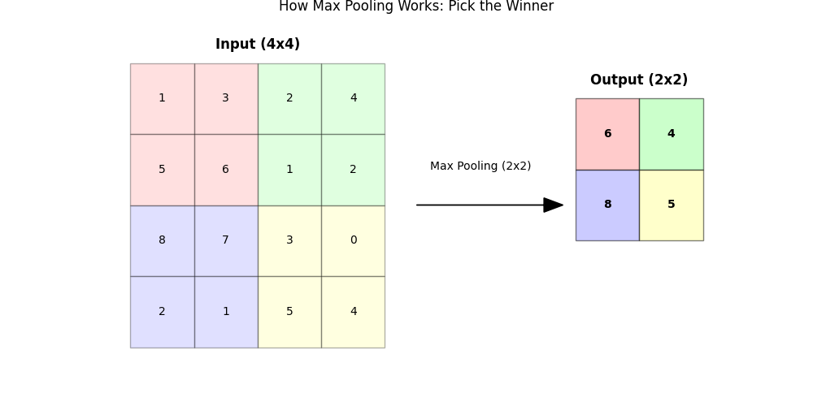
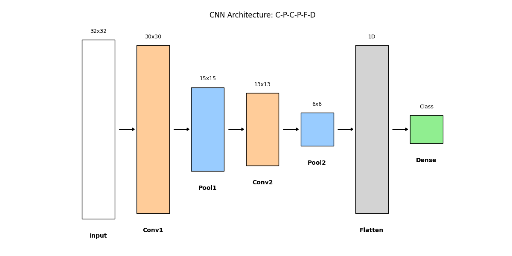

# Day 25: CNN (Convolutional Neural Network) - 貓狗圖片分類

## 0. 歷史小故事/核心貢獻者:
CNN 的發展史就是一部 AI 變強的歷史：
1.  **LeNet-5 (1998, Yann LeCun)**：CNN 的鼻祖，用於辨識手寫數字 (MNIST)。結構簡單 (5層)。
2.  **AlexNet (2012, Alex Krizhevsky)**：深度學習的引爆點！使用了 ReLU 和 GPU 加速，在 ImageNet 大賽中以壓倒性優勢奪冠 (8層)。
3.  **VGG (2014)**：證明了「越深越好」，結構非常規整，全部使用 3x3 卷積核 (16~19層)。
4.  **ResNet (2015, Kaiming He)**：發明了「殘差連接 (Residual Connection)」，解決了梯度消失問題，讓網路可以深達 152 層甚至 1000 層，超越人類辨識能力。


## 1. 資料集來源
### 資料集來源：[CIFAR-10 Dataset](https://www.cs.toronto.edu/~kriz/cifar.html)
> 備註：Keras 已內建。我們只挑選其中的 **貓 (Cat)** 和 **狗 (Dog)** 兩類來做二元分類。

### 資料集特色與欄位介紹:
*   **圖片格式**：32x32 像素，彩色 (RGB 3 通道)。
*   **數量**：訓練集 10,000 筆 (貓+狗)，測試集 2,000 筆。
*   **目標 (Target)**：0 (貓), 1 (狗)。

## 2. 原理
### 核心概念：為什麼 MLP 看不懂圖片？
MLP 把圖片 **Flatten (拉平)** 了。
試想，把一張貓的照片切成一條條細絲接起來，你還認得出是貓嗎？
**空間結構 (Spatial Structure)** 被破壞了！眼睛和耳朵的相對位置不見了。

### 解決方案：CNN (卷積神經網路)
CNN 像人類的眼睛一樣，**用「掃描」的方式看圖片**，保留了空間特徵。它有兩大法寶：

#### 2.1 卷積層 (Convolution Layer) - 特徵提取器 (手電筒)
*   **原理**：用一個小小的 **濾鏡 (Filter/Kernel)**，在圖片上滑動 (Sliding Window)，計算特徵。
*   **比喻 (手電筒)**：
    *   想像濾鏡是一個 **「專門找圓形的手電筒」**。
    *   當它照到圖片上的 **圓形** 區域時，手電筒會 **亮起來 (數值變大)**。
    *   當它照到 **方形** 區域時，手電筒 **不亮 (數值變小)**。
    *   **卷積** 就是拿著手電筒在整張圖片上 **掃描**，找出哪裡有圓形、哪裡有線條。
*   **圖解**：
    
    > 黃色框框就是濾鏡，它在圖片上滑動，把對應的像素值相乘再相加，得到右邊的特徵圖 (Feature Map)。

#### 2.2 池化層 (Pooling Layer) - 重點整理 (馬賽克)
*   **原理**：把圖片縮小 (Downsampling)。就像把一張高畫質照片變成 **「縮圖」** 或打上 **「馬賽克」**。
*   **Max Pooling**：在一個小區域 (例如 2x2) 內，**只選最大的那個數字** 代表這個區域。
*   **圖解**：
    
    > 為什麼選最大值？因為最大值代表這個區域 **「特徵最強」** 的地方 (例如最亮的點、最明顯的邊緣)。其他的雜訊就被過濾掉了。
*   **功能**：
    1.  **減少運算量**：圖片變小了 (4x4 -> 2x2，資料量剩下 1/4)。
    2.  **抗雜訊**：只保留最明顯的特徵。
    3.  **平移不變性**：就算貓稍微移位一點，最大值還是抓得到。

#### 2.3 CNN 架構示意圖 (Architecture)

*   **C-P-C-P-F-D 結構**：
    *   **Conv (橘色)**：圖片變厚了 (濾鏡變多)，但長寬變小一點。
        *   *為什麼變小了？(32 -> 30)*：因為 3x3 濾鏡在邊緣無法置中，所以 **上下左右各被削掉一層皮** (Valid Padding)，這叫做 Valid Padding (不補零)。如果我們希望大小不變 (維持 32)，就需要 Same Padding (在外面補一圈 0)
    *   **Pool (藍色)**：圖片長寬直接砍半。
    *   **Flatten (灰色)**：最後把立體的特徵圖拉成一條線。
    *   **Dense (綠色)**：進行最後的分類。

## 3. 實戰
### Python 程式碼實作
完整程式連結：[DL_CNN_CatDog.py](DL_CNN_CatDog.py)

```python
# 關鍵程式碼：建立 CNN 模型

from tensorflow.keras.layers import Conv2D, MaxPooling2D, Flatten, Dense

model = Sequential([
    # 1. 卷積層：32 個濾鏡，抓取初級特徵 (線條)
    Conv2D(32, (3, 3), activation='relu', input_shape=(32, 32, 3)),
    
    # 2. 池化層：圖片縮小一半 (32x32 -> 16x16)
    MaxPooling2D((2, 2)),
    
    # 3. 卷積層：64 個濾鏡，抓取高級特徵 (眼睛、耳朵)
    Conv2D(64, (3, 3), activation='relu'),
    
    # 4. 池化層：圖片再縮小一半 (16x16 -> 8x8)
    MaxPooling2D((2, 2)),
    
    # 5. 接回傳統 MLP 進行分類
    Flatten(),
    Dense(64, activation='relu'),
    Dense(1, activation='sigmoid') # 輸出是狗的機率
])
```

## 4. 模型評估與視覺化
### 1. 訓練過程 (History)

*   **觀察**：準確率 (Accuracy) 隨著訓練上升，但可能會發現 Training Acc 比 Validation Acc 高很多，這代表出現了 **Overfitting (過擬合)**。這是 CNN 常見的問題，可以透過 Dropout 或 Data Augmentation 來解決。

    > **補充：Dropout (丟棄法)**
    > *   **概念**：在訓練過程中，隨機讓一些神經元「休息」(數值歸零)。例如 `Dropout(0.5)` 代表每一輪都有 50% 的神經元不工作。
    > *   **目的**：強迫模型不要依賴特定的神經元 (防止死背)，讓每個神經元都能獨當一面，從而提升模型的泛化能力 (Generalization)。
    > *   **比喻**：就像球隊練習時，主力球員輪流休息，強迫板凳球員也要學會得分，這樣整支球隊才會強。

### 2. 預測結果展示 (Predictions)

*   **觀察**：模型能分辨出模糊的貓和狗。
*   **綠字**：預測正確。
*   **紅字**：預測錯誤。

### 3. 成果 (Results)
*   **正確率 (Accuracy)**: 約 **75%** (每次訓練會有些微差異)。
*   雖然 75% 不算太高，但考慮到我們只用了簡單的 CNN 且訓練時間很短，這已經證明了 CNN 抓取特徵的能力。明天我們會用 **遷移學習** 讓準確率飆升！

## 5. 戰略總結: CNN 的標準架構

### (影像辨識適用)

#### 5.1 結構公式：C-P-C-P-F-D
一個標準的 CNN 通常長這樣：
*   **C (Conv2D)**：卷積，抓特徵。
*   **P (MaxPooling2D)**：池化，縮小。
*   **C (Conv2D)**：再卷積，抓更細特徵。
*   **P (MaxPooling2D)**：再池化。
*   **F (Flatten)**：拉平。
*   **D (Dense)**：分類。

#### 5.2 濾鏡數量的選擇
*   通常越後面的層，濾鏡數量越多 (例如 32 -> 64 -> 128)。
*   因為前面的層看的是簡單線條 (種類少)，後面的層看的是複雜物體 (組合多)。

## 6. 總結
Day 25 我們學習了 **CNN**。
*   它解決了 MLP 破壞圖片結構的問題。
*   **卷積 (Convolution)** 負責「看」特徵。
*   **池化 (Pooling)** 負責「縮小」並保留重點。
*   這個架構是現代所有影像辨識 (人臉解鎖、自駕車) 的基石。

下一章 (Day 26 我們將介紹 **遷移學習 (Transfer Learning)**。
我們不需要從頭訓練 CNN，而是直接拿別人訓練好的超強模型 (如 VGG16, ResNet) 來用，這才是 AI 工程師的日常！

## 7. IPAS 考題補充 (CNN 相關)
以下彙整了 114 年 IPAS 中級能力鑑定中與 CNN 相關的考題，供複習參考：

| 題目 (關鍵字) | 答案 | 解析 |
| :--- | :--- | :--- |
| **5. CNN 第一層功能** | (A) **提取局部特徵** (如邊緣、紋理) | CNN 淺層抓邊緣，深層抓物體形狀。 |
| **6. CNN vs FCNN** | (C) 區域感知與參數共享降低複雜度 | 卷積核 (Kernel) 的參數共享特性大幅減少了運算量。 |
| **8. Softmax vs Max-Pooling** | (C) Softmax 用於分類，Max-Pooling 用於降維 | Pooling 是為了縮小圖片 (降維)，Softmax 是為了輸出機率。 |
| **9. 資料增強效能下降** | (B) 增強後特徵分佈不一致 | 若增強過頭 (如把數字 6 轉成 9)，會破壞資料分佈，導致模型混亂。 |
| **(第三科) 5. CNN 第一層功能** | (A) **提取局部特徵** | 同上。 |
| **(第三科) 43. VGG16 運算量最多** | (A) 卷積層 (Conv2d) | 卷積層運算量 (FLOPs) 最大，全連接層參數 (Params) 最多。 |
