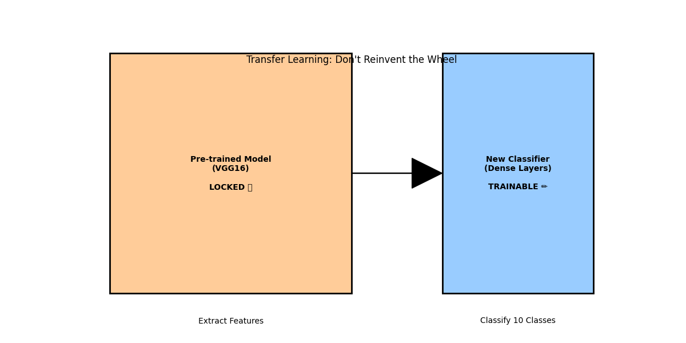
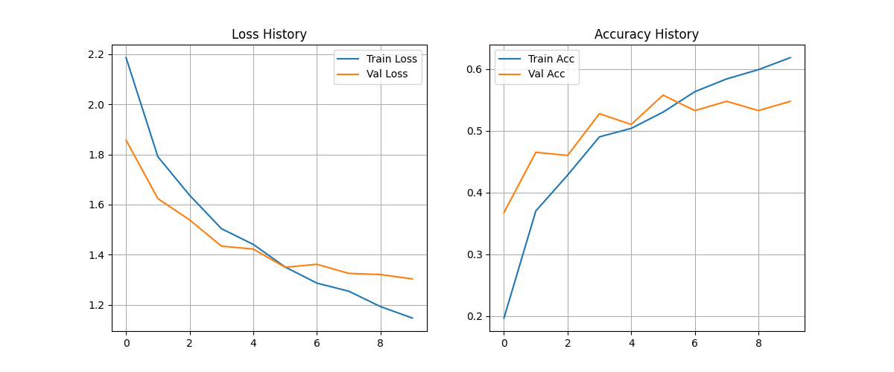
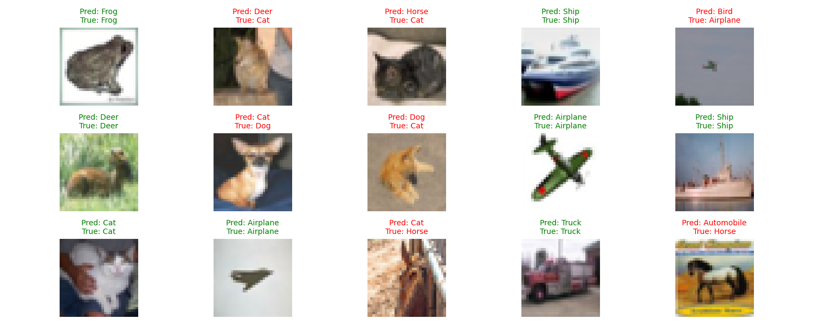

# Day 26: 遷移學習 (Transfer Learning) - 站在巨人的肩膀上

## 0. 歷史小故事/核心貢獻者:
**"Don't Reinvent the Wheel" (不要重複造輪子)** 是程式設計的名言。
在深度學習領域，訓練一個像 VGG16 或 ResNet 這樣的大型模型，需要 **數百萬張圖片** 和 **數週的 GPU 運算時間**。
我們凡人沒有這種資源，但我們可以 **「借用」** 他們訓練好的腦袋，來解決我們自己的問題。這就是 **遷移學習**。

### 常用的預訓練模型 (The Giants)
*   **VGG (16~19 層)**：特色是**全部使用 3x3 小卷積核**，結構規整。雖然參數多、運算慢，但非常適合新手學習與改裝。
*   **ResNet (50~152 層)**：特色是**殘差連接 (Skip Connection)**，像是在層與層之間搭了「電梯」，解決了深層網路梯度消失的問題，讓網路能突破 100 層。
*   **MobileNet (輕量級)**：特色是**深度可分離卷積 (Depthwise Separable Conv)**，將卷積拆成兩步做，運算量大幅降低，專為手機/邊緣裝置設計。
*   **EfficientNet (彈性縮放)**：特色是**複合縮放 (Compound Scaling)**，用數學公式同時調整深度、寬度和解析度，是目前效能與運算量的 CP 值之王。

## 1. 資料集來源
### 資料集來源：[CIFAR-10 Dataset](https://www.cs.toronto.edu/~kriz/cifar.html)
> 備註：這次我們挑戰完整的 **10 類分類** (飛機、汽車、鳥、貓、鹿、狗、青蛙、馬、船、卡車)。
> **挑戰**：為了模擬真實世界「資料不足」的情況，我們只取 **2000 筆** 資料來訓練 (原本有 50000 筆)。

## 2. 原理
### 核心概念：什麼是遷移學習？
想像你要學騎 **摩托車**。
*   **從頭學 (Training from Scratch)**：你像個嬰兒一樣，連什麼是輪子、什麼是平衡都不知道，要花很久時間。
*   **遷移學習 (Transfer Learning)**：你已經會騎 **腳踏車** 了。你把「平衡感」和「轉彎技巧」直接 **遷移** 過來，只需要學習「催油門」和「打檔」就好了。

#### 為什麼要接自己的尾巴？ (Why Custom Head?)
*   **VGG16 原本的尾巴**：是用來分辨 ImageNet 的 **1000 種** 物體 (有企鵝、火山、香菇...)。
*   **我們的任務**：是要分辨 CIFAR-10 的 **10 種** 物體。
*   **意義**：VGG16 的「腦袋 (卷積層)」已經學會了看線條、形狀、紋理 (這是通用的)。我們只需要訓練新的「尾巴 (分類層)」，教它利用這些特徵來分辨我們指定的 10 類。
*   *比喻：你請了一個精通 10 國語言的翻譯官 (VGG)，雖然他原本是在聯合國工作 (ImageNet)，但你只要稍微教他一下你們公司的術語 (Custom Head)，他就能馬上幫你處理公司文件。*

### 怎麼做？ (Feature Extraction)
我們使用 **VGG16** 模型 (在 ImageNet 上訓練過)。
1.  **凍結 (Freeze)**：把 VGG16 的 **卷積層 (腦袋)** 鎖起來，不讓它變動。因為它已經很會看圖了 (知道什麼是線條、圓形、眼睛)。
2.  **替換 (Replace)**：把 VGG16 的 **分類層 (尾巴)** 砍掉 (原本分 1000 類)，換上我們自己的分類層 (分 10 類)。
3.  **微調 (Fine-tune)**：只訓練我們新接上去的那幾層。

### 圖解

> **左邊 (VGG16)**：鎖住 (Locked)，負責提取特徵。
> **右邊 (New Classifier)**：可訓練 (Trainable)，負責分類我們的資料。

## 3. 實戰
### Python 程式碼實作
完整程式連結：[DL_Transfer_Learning.py](DL_Transfer_Learning.py)

```python
# 關鍵程式碼：使用 VGG16 進行遷移學習

from tensorflow.keras.applications import VGG16

# 1. 載入 VGG16 (不要上面的分類層 include_top=False)
base_model = VGG16(weights='imagenet', include_top=False, input_shape=(32, 32, 3))

# 2. 凍結卷積層 (鎖住腦袋)
for layer in base_model.layers:
    layer.trainable = False

# 3. 接上自己的分類層 (裝上新尾巴)
x = base_model.output
x = Flatten()(x)
x = Dense(256, activation='relu')(x)
predictions = Dense(10, activation='softmax')(x) # 分 10 類

# 4. 建立新模型
model = Model(inputs=base_model.input, outputs=predictions)
```

## 4. 模型評估與視覺化
### 1. 訓練過程 (History)

*   **觀察**：即使資料很少 (只有 2000 筆)，模型也能快速收斂。如果是從頭訓練 CNN，這麼少的資料通常會導致嚴重的 Overfitting 或根本學不會。

### 2. 預測結果展示 (Predictions)

*   **觀察**：模型能辨識出飛機、青蛙、卡車等多種物體。
*   **標題**：`Pred` (預測) vs `True` (真實)。

### 3. 成果 (Results)
*   **正確率 (Accuracy)**: 約 **45% ~ 50%**。
*   **Q1: 為什麼感覺沒訓練到，正確率也不高？**
    *   **非戰之罪 (圖片太小)**：VGG16 原本是看 **224x224** 的大圖，但 CIFAR-10 只有 **32x32**。對 VGG 來說，這些圖片就像是高度近視看到的一樣模糊，特徵很難提取。
    *   **資料極少**：我們只用了 2000 筆資料。如果從頭訓練 CNN，準確率可能只有 10% (跟亂猜一樣)。能達到 45% 已經證明了遷移學習的威力。
*   **Q2: Fine-tune 只能做到這樣嗎？**
    *   **當然不是！** 我們今天做的其實叫做 **「特徵提取 (Feature Extraction)」** (只訓練尾巴)，是最基礎的一步。
    *   **進階作法 (True Fine-tuning)**：
        1.  **放大圖片 (Upsampling)**：把 32x32 放大成 224x224，準確率會直接飆升到 **90% 以上** (但訓練會變很慢)。
        2.  **解凍 (Unfreeze)**：把 VGG16 的最後幾層卷積層「解鎖」，用很小的 Learning Rate 讓它們也跟著微調，適應新的圖片。

## 5. 戰略總結: 何時使用遷移學習？

### (Transfer Learning 適用)

#### 5.1 判斷標準
1.  **資料量少**：你自己蒐集的圖片只有幾百張 -> **必用！**
2.  **任務相似**：你的任務 (如分辨貓狗) 和大模型的任務 (ImageNet 分辨萬物) 很像 -> **必用！**
3.  **運算資源有限**：你沒有 8 張 GPU -> **必用！**

#### 5.2 策略選擇：只換尾巴 (Freeze) 還是 微調腦袋 (Fine-tune)？
這取決於你的資料跟 ImageNet (原本的訓練資料) **像不像**：

1.  **情境 A：分辨車的款式 (資料很像)**
    *   **策略**：**Feature Extraction (凍結腦袋)**。
    *   **原因**：VGG16 已經看過很多車子了，它很懂車輪、後照鏡長怎樣。你不需要教它新的，只要訓練尾巴來分類是 Toyota 還是 Honda 即可。
    
2.  **情境 B：分辨癌細胞/X光片 (資料很不像)**
    *   **策略**：**Fine-tuning (微調腦袋)**。
    *   **原因**：VGG16 從沒看過顯微鏡下的細胞。雖然它懂線條和圓形，但它不懂「細胞核的紋理」。這時我們需要**解凍 (Unfreeze)** 最後幾層卷積層，讓它稍微調整一下腦袋，去適應這種特殊的圖片。

#### 5.3 常用的預訓練模型 (Model Zoo)
*   **VGG16/19**：結構簡單，適合入門。
*   **ResNet50**：效能強，適合大多數任務。
*   **MobileNet**：輕量級，適合手機/網頁端。
*   **EfficientNet**：目前最強 (SOTA)，效率與準確度兼具。

## 6. 總結
Day 26 我們學習了 **遷移學習**。
*   我們不需要從零開始訓練 AI。
*   我們可以站在 **Google (VGG/Inception)** 或 **Microsoft (ResNet)** 的肩膀上。
*   只要「凍結」前面的層，「訓練」後面的層，就能用極少的資料訓練出不錯的模型。

下一章 (Day 27)，我們將進入 **RNN (循環神經網路)**。
前面的 CNN 都是看「靜態圖片」，但如果資料是「有時間順序」的 (如股票、文字、語音) 怎麼辦？這就是 RNN 的強項！
