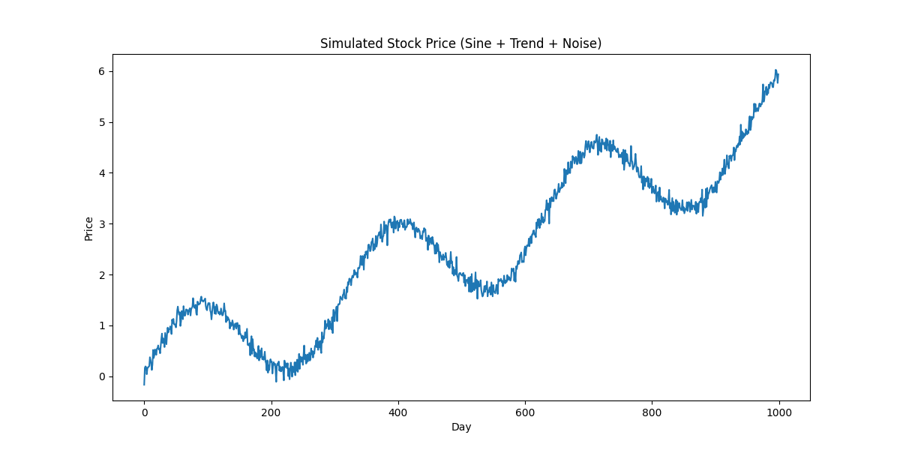
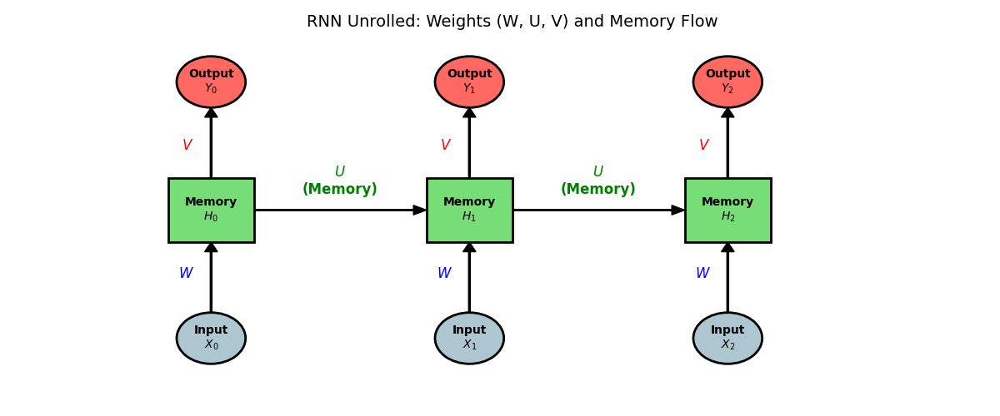
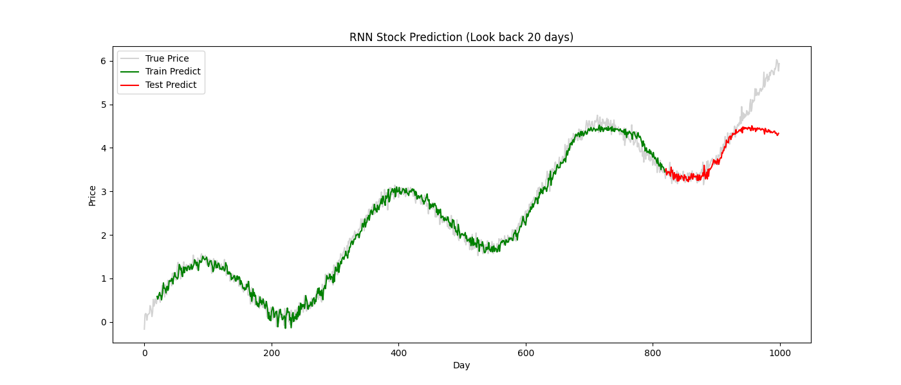

# Day 27: RNN (Recurrent Neural Network) - 股價預測

## 0. 歷史小故事/核心貢獻者:
在 1980 年代，神經網路 (MLP) 只能處理「當下」的輸入，對於「時間序列」束手無策。
**John Hopfield (1982)** 和 **Jordan/Elman (1990)** 等人引入了 **「循環 (Recurrent)」** 的概念，讓神經網路有了 **「記憶」**。
這讓 AI 終於能看懂句子、聽懂語音，甚至預測股票。

## 1. 資料集來源
### 資料集來源：模擬股價資料 (Simulated Stock Data)
> 備註：真實股價受太多外部因素影響 (新聞、政策)，為了單純學習 RNN 原理，我們產生一個 **「正弦波 + 趨勢 + 雜訊」** 的模擬資料。

### 資料集特色:
*   **趨勢 (Trend)**：股價長期緩步上漲。
*   **週期 (Cycle)**：有規律的波浪起伏 (正弦波)。
*   **雜訊 (Noise)**：隨機的波動。
*   **任務**：根據 **過去 20 天** 的價格，預測 **明天** 的價格。



## 2. 原理
### 核心概念：為什麼 MLP 不能預測股票？
*   **MLP (健忘)**：它把每一天的價格都當作獨立事件。它不知道「昨天漲了」，也不知道「前天跌了」。
*   **RNN (有記憶)**：它有一個 **「隱藏狀態 (Hidden State)」**，就像是一個 **「筆記本」**。
    *   當它看到今天的價格時，會參考「筆記本」裡記下的昨天資訊。
    *   看完後，它會更新「筆記本」，把今天的資訊也記下來，傳給明天。

### 圖解：RNN 的時間旅行

*   **核心公式**：`New_Memory = tanh(W * Input + U * Old_Memory + b)`
    *   這公式說明了：今天的記憶，是由 **「今天的輸入」** 加上 **「昨天的記憶」** 混合而成的。
*   **X (Input)**：今天的股價。
*   **H (Memory)**：筆記本 (隱藏狀態)。
*   **Loop (箭頭)**：圖中橫向的箭頭，代表 **「把昨天的記憶 ($H_{t-1}$) 傳給今天 ($H_t$)」**。這就是 RNN 能記住歷史的關鍵！

## 3. 實戰
### Python 程式碼實作
完整程式連結：[RNN_Stock_Prediction.py](RNN_Stock_Prediction.py)

```python
# 關鍵程式碼：建立 SimpleRNN 模型

from tensorflow.keras.layers import SimpleRNN, Dense

model = Sequential([
    # SimpleRNN 層
    # units=32: 32 個記憶單元 (筆記本的大小)
    # input_shape=(20, 1): 回看過去 20 天，每天 1 個價格
    SimpleRNN(32, input_shape=(20, 1), activation='tanh'),
    
    # 輸出層
    Dense(1) # 預測 1 個數值 (明天的價格)
])
```

## 4. 模型評估與視覺化
### 預測結果展示

*   **綠線 (Train)**：模型在訓練集上的表現，幾乎完美貼合。
*   **紅線 (Test)**：模型在沒看過的測試集上的表現。
*   **觀察**：
    *   RNN 成功抓住了 **「週期性 (波浪)」** 和 **「趨勢 (上漲)」**。
    *   它知道「漲久了會跌，跌久了會漲」。

## 5. 戰略總結: RNN 的致命傷

### (RNN 適用與不適用)

#### 5.1 優點
*   處理 **序列資料 (Sequential Data)** 的首選。
*   參數相對少，適合處理短序列。

#### 5.2 缺點：金魚腦與梯度消失 (Vanishing Gradient)
*   **問題**：RNN 雖然有記憶，但它的記憶力很短 (像金魚一樣)。如果是 **很長** 的序列 (例如 100 天前發生的事)，RNN 傳到後面就會 **忘記** 了。
*   **數學原因 (梯度消失)**：
    *   在反向傳播時，誤差需要一層一層往回傳。
    *   因為 RNN 的權重會不斷相乘，如果權重小於 1 (例如 0.9)，乘了 100 次之後 ($0.9^{100} \approx 0.000026$)，梯度就會變得 **微乎其微**。
    *   **比喻**：就像玩「傳話遊戲」，第一個人說的話，傳到第 100 個人時，已經完全走樣或聽不見了。

## 6. 總結
Day 27 我們學習了 **RNN**。
*   它引入了 **「時間」** 的維度。
*   透過 **Hidden State (記憶)**，它能串聯上下文。
*   但普通的 SimpleRNN 記憶力有限 (金魚腦)。

下一章 (Day 28)，我們將引入 **LSTM (長短期記憶網路)**。
它是 RNN 的進化版，專門用來解決「金魚腦」問題，能記住非常長期的資訊！
