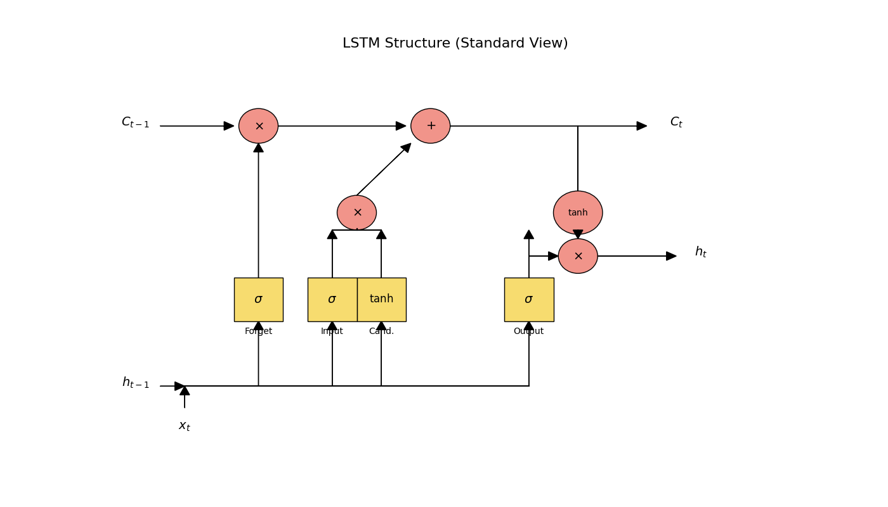
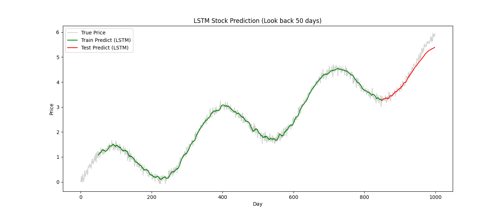

# Day 28: LSTM (Long Short-Term Memory) - 解決金魚腦

## 0. 歷史小故事/核心貢獻者:
RNN 雖然理論上很美好，但實務上因為 **梯度消失 (Vanishing Gradient)**，它記不住長期的資訊 (金魚腦)。
**Sepp Hochreiter** 和 **Jürgen Schmidhuber (1997)** 發明了 **LSTM**。
他們引入了 **「閘門 (Gates)」** 的機制，讓神經網路可以主動選擇 **「該忘記什麼」** 和 **「該記住什麼」**。這讓 AI 終於能讀懂長篇大論，或預測長期的股價趨勢。

## 1. 資料集來源
### 資料集來源：模擬股價資料 (Simulated Stock Data)
> 備註：與 Day 27 相同，但這次我們挑戰 **Look-back = 50 天** (RNN 通常超過 10~20 天就暈了)。

## 2. 原理
### 核心概念：為什麼 LSTM 記性好？
RNN 像是一個 **「傳話遊戲」**，話傳到第 100 個人一定會走樣。
LSTM 像是一條 **「行李輸送帶 (Conveyor Belt)」**。
*   資訊 (行李) 放在輸送帶上，可以一路從頭傳到尾，中間幾乎不會有損耗。
*   只有在經過特定的 **「閘門 (Gates)」** 時，我們才會對行李做操作 (拿走或放上)。

### 圖解：LSTM 的內部構造


#### 2.1 傳送帶 (Cell State) - 藍色線
*   圖中最上面的那條線。
*   它是 LSTM 的核心，負責 **長期記憶**。資訊可以在這裡暢通無阻地流動。

#### 2.2 三個守門員 (Three Gates)
LSTM 透過三個門來控制傳送帶：

1.  **遺忘門 (Forget Gate)** - `sigmoid`
    *   **功能**：決定要 **丟掉** 什麼舊資訊。
    *   **比喻**：考試考完了，把昨天背的「英文單字」忘掉，因為今天要考「數學」。
    *   **數學**：乘上一個 0~1 的數 (0=全忘，1=全記)。

2.  **輸入門 (Input Gate)** - `sigmoid` + `tanh`
    *   **功能**：決定要 **存入** 什麼新資訊。
    *   **比喻**：老師今天教了新的「微積分公式」，把它寫進筆記本裡。

3.  **輸出門 (Output Gate)** - `sigmoid` + `tanh`
    *   **功能**：決定當下要 **輸出** 什麼 (Hidden State)。
    *   **比喻**：雖然筆記本裡有很多東西，但現在題目問的是「極限」，所以我只把跟極限有關的記憶拿出來回答。

## 3. 實戰
### Python 程式碼實作
完整程式連結：[LSTM_Stock_Prediction.py](LSTM_Stock_Prediction.py)

```python
# 關鍵程式碼：建立 LSTM 模型

from tensorflow.keras.layers import LSTM, Dense

model = Sequential([
    # LSTM 層
    # units=50: 50 個 LSTM 單元 (比 RNN 複雜，通常需要多一點單元)
    # input_shape=(50, 1): 這次我們回看 50 天！
    LSTM(50, input_shape=(50, 1), activation='tanh'),
    
    # 輸出層
    Dense(1)
])
```

## 4. 模型評估與視覺化
### 預測結果展示

*   **觀察**：
    *   即使 Look-back 增加到 **50 天**，LSTM 依然能穩定訓練，沒有發生梯度消失。
    *   預測曲線 (紅線) 依然緊緊咬住真實股價 (灰線)。
    *   這證明了 LSTM 具備 **「長期記憶」** 的能力。

## 5. 戰略總結: RNN vs LSTM

| 特性 | Simple RNN | LSTM |
| :--- | :--- | :--- |
| **記憶力** | 短期 (金魚腦) | 長期 (大象腦) |
| **結構** | 簡單 (1 個 tanh 層) | 複雜 (4 個交互層 + 3 個門) |
| **訓練速度** | 快 | 慢 (參數多 4 倍) |
| **適用場景** | 短序列、簡單規律 | 長序列、複雜語意 (NLP)、股票 |
| **致命傷** | 梯度消失 | 運算量大 |

## 6. 總結
Day 28 我們學習了 **LSTM**。
*   它是時間序列領域的霸主 (直到 Transformer 出現之前)。
*   透過 **Cell State (傳送帶)** 和 **Gates (閘門)**，它完美解決了梯度消失問題。

下一章 (Day 29)，我們將進入 **RL (強化學習)**。
這是一個完全不同的領域，AI 不再是「看答案學習」，而是像玩遊戲一樣，透過「獎勵與懲罰」來自我進化！
(我們要教 AI 玩一個簡單的遊戲)。
