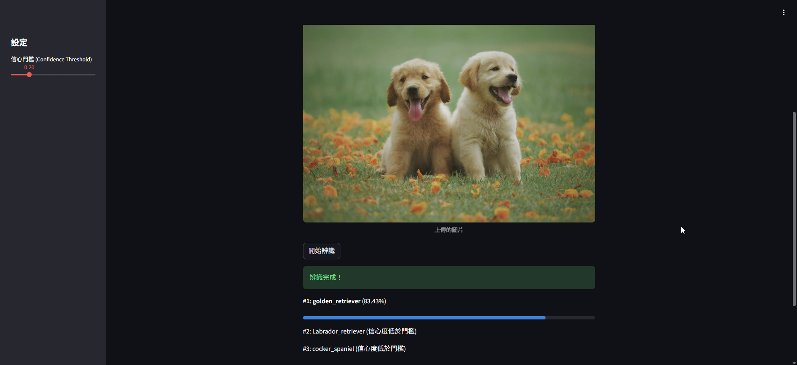

# Day 29: 模型部署 (Model Deployment) - Streamlit Web App

## 0. 歷史小故事/核心貢獻者:
在過去，要將 AI 模型變成一個網頁應用，你需要學會 HTML, CSS, JavaScript, Flask/Django 等一堆繁瑣的技術。
**Streamlit** 的出現改變了一切。它讓資料科學家可以用 **純 Python** 快速打造出漂亮的 Web App，完全不需要懂前端技術。
現在，它是 AI 領域最流行的展示工具 (Demo Tool)。

## 1. 專案目標
### 目標：打造一個 AI 影像辨識 App
我們將使用 **MobileNetV2** (一個輕量級但強大的預訓練模型)，把它包裝成一個網頁。
使用者可以：
1.  上傳圖片。
2.  調整信心門檻。
3.  看到 AI 的辨識結果與信心條。

## 2. 原理

### 2.1 結果分析：為什麼 83% 算高？

*(上圖為使用者實測結果)*

你可能會覺得 **83.43%** 的信心度好像不夠高，但在 ImageNet (1000 類別) 的挑戰中，這其實是非常好的表現！
1.  **千中選一**：模型必須從 1000 種物體中選出正確的那一個，隨機猜對率只有 0.1%。
2.  **相似物種干擾**：黃金獵犬 (Golden Retriever) 和 拉布拉多 (Labrador) 小時候長得很像。模型能有 83% 的把握，代表它捕捉到了關鍵特徵 (如毛髮長度)。
3.  **輕量級模型**：我們使用的是 **MobileNetV2**，它是為了手機/網頁設計的「輕量級」模型。雖然準確度略低於巨型模型 (如 ResNet152)，但它的**速度快非常多**，非常適合 Web App。

### 2.2 Streamlit 架構：為什麼不用寫 HTML？


這就是 Streamlit 最神奇的地方！它採用了 **「腳本式執行 (Script Execution)」** 模式：

1.  **你寫 Python (Backend)**：你只需要寫 `st.button()` 或 `st.image()`。
2.  **Streamlit 翻譯 (Middle)**：Streamlit Server 會把你的 Python 指令翻譯成前端看得懂的訊號 (JSON)。
3.  **瀏覽器渲染 (Frontend)**：瀏覽器收到訊號後，自動畫出漂亮的按鈕和圖片 (這些是預先寫好的 React 元件)。

**流程總結**：
*   **互動即重跑**：當使用者按按鈕，Streamlit 會 **從頭到尾重新執行一次** 你的 Python 腳本。
*   **快取魔法**：為了不讓模型每次都重載，我們使用 `@st.cache_resource` 來記住模型。

## 3. 實戰
### 3.1 安裝 Streamlit
在執行之前，你需要安裝 `streamlit` 套件：
```bash
pip install streamlit
```

### 3.2 Python 程式碼實作
完整程式連結：[Streamlit_App.py](Streamlit_App.py)

```python
# 關鍵程式碼：顯示圖片與進度條
import streamlit as st

st.title("AI 影像辨識 App")
uploaded_file = st.file_uploader("上傳圖片...")

if uploaded_file:
    st.image(uploaded_file)
    # ... 預測代碼 ...
    st.write(f"結果: {label}")
    st.progress(score)
```

### 3.3 如何執行 App？
**注意！** Streamlit App 不能直接用 `python script.py` 執行。
請在終端機 (Terminal) 輸入以下指令：

```bash
streamlit run day29/Streamlit_App.py
```

執行後，瀏覽器會自動打開一個分頁 (通常是 `http://localhost:8501`)，你就可以看到你的 App 了！

## 4. 成果展示
### 預期效果
1.  **介面**：你會看到一個簡潔的標題和上傳區塊。
2.  **互動**：上傳一張貓的照片，AI 會告訴你它是 "tabby (虎斑貓)" 或 "Egyptian_cat (埃及貓)"，並顯示信心分數。
3.  **側邊欄**：你可以滑動側邊欄的 Slider 來過濾掉信心度太低的預測。

## 5. 戰略總結: 從 Lab 到 Production

| 階段 | 工具/環境 | 重點 |
| :--- | :--- | :--- |
| **實驗 (Lab)** | Jupyter Notebook | 快速試錯、視覺化、數據分析。 |
| **開發 (Dev)** | VS Code + Python Scripts | 模組化、重構程式碼、版本控制 (Git)。 |
| **部署 (Prod)** | **Streamlit** / Flask / FastAPI | **使用者介面 (UI)**、API 服務、讓非技術人員也能使用。 |

## 6. 總結
Day 29 我們學習了 **模型部署**。
*   AI 不應該只活在 Notebook 裡。
*   透過 **Streamlit**，我們能在幾分鐘內把模型變成產品。
*   這是讓你的價值被看見的關鍵一步！

下一章 (Day 30)，我們將迎來 **最終章：AI 總結與未來展望**。
我們將回顧這 30 天的旅程，並整理未來的學習資源 (Paper, Kaggle, MLOps)。
