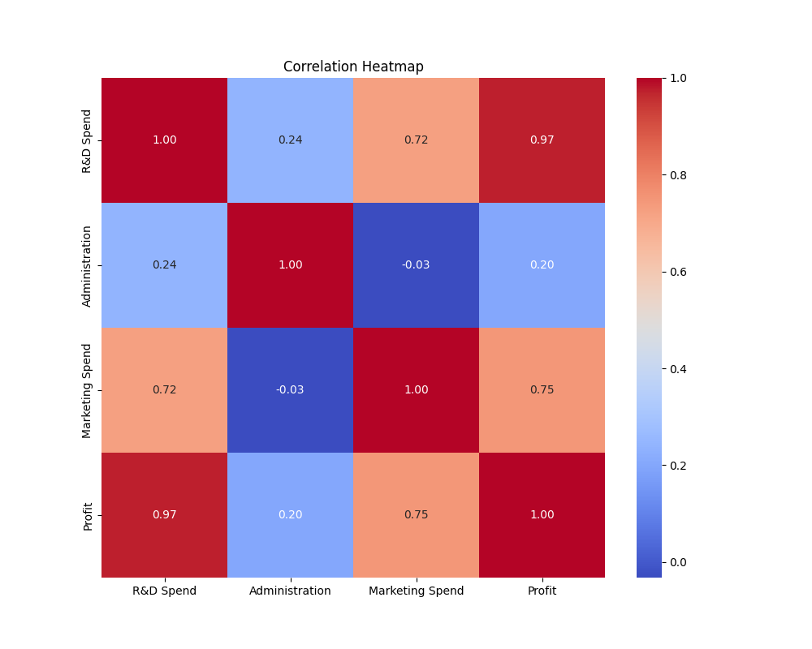

# Day 03: 多元線性回歸 (Multiple Linear Regression)

## 0. 歷史小故事/核心貢獻者:
如果說線性回歸是高斯與勒讓德的結晶，那 **多元線性回歸** 就是統計學家為了應對真實世界複雜性而發展出的自然延伸。早期的統計學家發現，單一因素往往無法解釋複雜的現象（例如農作物產量不只看雨量，還要看溫度、肥料等）。19 世紀末，隨著矩陣代數 (Matrix Algebra) 的發展，處理多個變數的數學運算變得可行，這才讓多元回歸成為現代數據分析的基石。

## 1. 資料集來源
### 資料集來源：[50_Startups.csv](https://github.com/krishnaik06/Multiple-Linear-Regression/blob/master/50_Startups.csv)
> 備註：這是一個經典的虛擬資料集，常用於教學多元回歸與特徵選取。

### 資料集特色與欄位介紹:
這個資料集收集了 50 間新創公司的財務支出與獲利情況，特色如下：
1.  **多維度特徵**：包含研發、行政、行銷等多種支出。
2.  **混合型資料**：包含數值型 (支出) 與類別型 (州別) 資料。
3.  **目標明確**：預測公司的獲利 (Profit)，這是投資人最關心的指標。

**欄位說明**：
*   **R&D Spend (特徵 X1)**: 研發支出 (數值)。
*   **Administration (特徵 X2)**: 行政管理支出 (數值)。
*   **Marketing Spend (特徵 X3)**: 行銷推廣支出 (數值)。
*   **State (特徵 X4)**: 公司所在州別 (類別：New York, California, Florida)。
*   **Profit (目標 y)**: 年獲利 (數值)。

### 資料清理
1.  **類別特徵編碼**：`State` 是文字資料，機器看不懂，必須轉換。我們使用 **One-Hot Encoding** (獨熱編碼)，並設定 `drop_first=True` 以避免 **虛擬變數陷阱 (Dummy Variable Trap)**。
2.  **資料分割**：80% 訓練，20% 測試。
3.  **特徵縮放**：使用 `StandardScaler` 將所有金額標準化。

## 2. 原理
### 核心公式與參數
多元線性回歸將 $y=ax+b$ 擴展為：
$$y = b_0 + b_1 x_1 + b_2 x_2 + ... + b_n x_n$$
*   $b_0$: 截距 (Intercept)。
*   $b_1, b_2...$: 各特徵的回歸係數 (Coefficients)，代表該特徵對 $y$ 的影響力。

**虛擬變數陷阱 (Dummy Variable Trap)**：
當我們把 `State` (NY, CA, FL) 轉成三個變數 (Is_NY, Is_CA, Is_FL) 時，這三個變數加起來永遠等於 1 (因為公司一定在其中一州)。這會導致變數間存在完全共線性 (Multicollinearity)，讓模型無法計算。解決方法是 **少拿一個** (Drop one column)，例如只留 Is_NY 和 Is_CA，若兩個都是 0，那就代表是 FL。

## 3. 實戰
### Python 程式碼實作
完整程式連結：[Multiple_Linear_Regression_Startup.py](Multiple_Linear_Regression_Startup.py)

```python
# 關鍵程式碼：處理類別變數
df_encoded = pd.get_dummies(df, columns=['State'], drop_first=True)
```

## 4. 模型評估
### 若為回歸模型 (Regression)
*   **指標數字**：
    *   **R-Squared (R2)**: `0.8987` (模型解釋了約 90% 的獲利變異，表現優異)
    *   **MSE**: `82010363.0450`
    *   **Intercept/Coefficient**: 
        *   **R&D Spend**: `38102.27` (研發支出影響最大，每增加 1 單位標準化支出，獲利增加最多)
        *   **Administration**: `-1864.75` (行政支出反而與獲利呈微幅負相關)
*   **圖表**：
    *   **相關係數熱力圖**：觀察哪些特徵與 Profit 最相關。
    
    
    *   **預測結果圖**：觀察預測點是否落在紅線上。
    

## 5. 戰略總結:模型訓練的火箭發射之旅

### (回歸與監督式學習適用day2-12)
引用大師-吳恩達教授的 Rocket 進行說明 Bias vs Variance：


#### 5.1 流程一：推力不足，無法升空 (Underfitting 迴圈)
*   **設定**：如果只用單一特徵 (如只看行政支出) 來預測獲利。
*   **第一關：訓練集表現好嗎？** 可能不好，因為獲利受多種因素影響。
*   **行動 (Action)**：引入更多特徵 (如研發、行銷)，這就是我們今天做的事！

#### 5.2 流程二：動力太強，失控亂飛 (Overfitting 迴圈)
*   **設定**：如果我們把所有雜訊 (如公司門牌號碼) 都丟進去訓練。
*   **第一關：訓練集表現好嗎？** 很好。
*   **第二關：測試集表現好嗎？** 很差。
*   **行動 (Action)**：進行特徵篩選 (Feature Selection)，只保留 R&D Spend 等重要特徵 (Day 11 會詳談)。

#### 5.3 流程三：完美入軌 (The Sweet Spot)
*   **設定**：使用 R&D Spend, Marketing Spend 與 State 組合。
*   **結果**：通常 R&D Spend 對新創公司的獲利影響最大，模型能達到很高的 R2 分數。

## 6. 總結
Day 03 我們進階到了 **多元線性回歸**。
*   學會處理 **類別資料 (Categorical Data)**。
*   理解 **虛擬變數陷阱** 的危險與解法。
*   發現並非所有特徵都有用 (例如行政支出通常與獲利關聯較低)。
下一章 (Day 04)，我們將探討如何處理「過擬合」問題，引入 **正則化 (Regularization)**！
