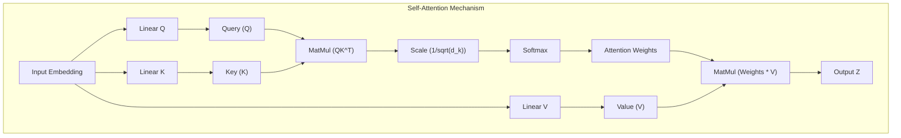
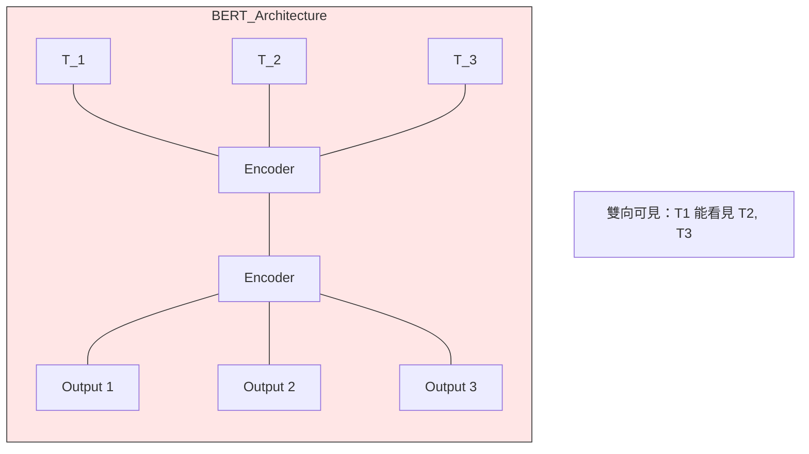
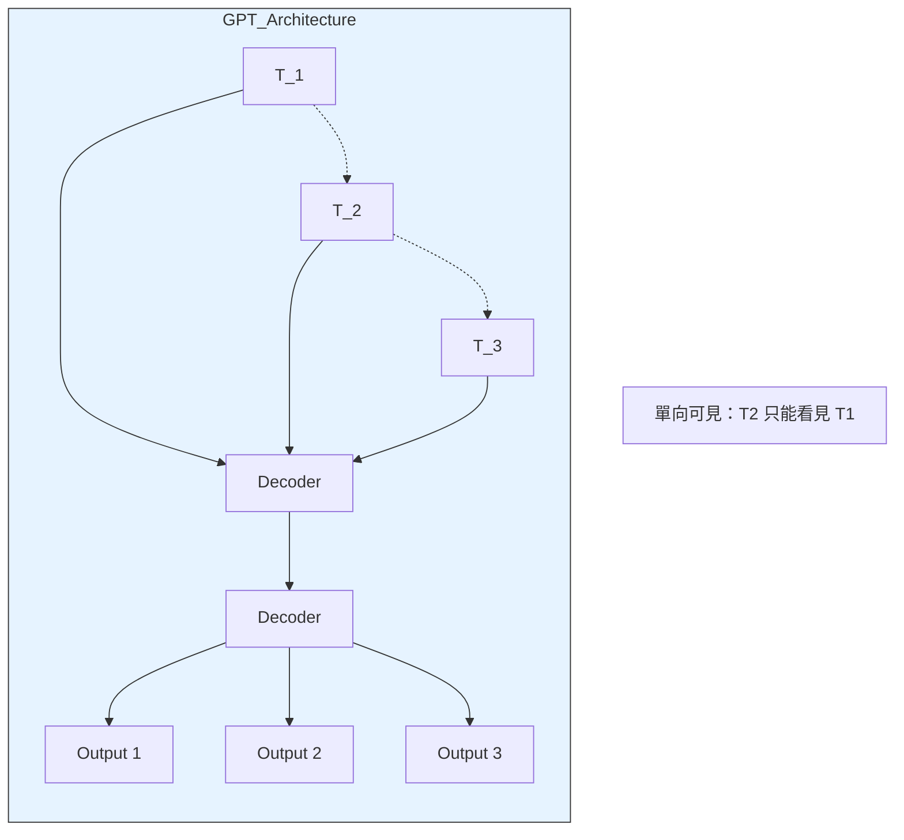

# Day 31: NLP 王者 - Transformer 與 BERT (The Age of LLM)

## 0. 前言：NLP 的工業革命
在 Day 27/28 我們學過了 RNN 和 LSTM。雖然它們能處理序列資料，但有兩個致命缺點，這也是面試常問的「RNN 限制」：
1.  **無法平行運算 (Slow)**：必須等 $t-1$ 算完才能算 $t$，訓練速度慢，無法利用 GPU 的平行優勢。
2.  **長距離遺忘 (Long-term Dependency)**：雖然 LSTM 有改善，但當句子太長 (例如 1000 字) 時，開頭的資訊還是會丟失。

2017 年 Google 發表的論文 **"Attention Is All You Need"** 改變了一切。
**Transformer** 架構完全捨棄了迴圈 (Recurrence)，改用 **Self-Attention (自注意力機制)**。
這就像是從「傳話遊戲 (RNN)」進化到了「視訊會議 (Transformer)」，所有人可以直接跟所有人溝通。

## 1. 核心概念：Self-Attention (自注意力機制)
這是 Transformer 架構的**核心概念**。你必須理解 Q, K, V 的物理意義。

### 1.1 直觀理解
想像你在讀這句話：「**蘋果**因為**它**很好吃所以被我吃了。」
*   當我們讀到「**它**」的時候，我們的大腦會自動把它連結到「**蘋果**」。
*   這就是 Attention！機器在處理每個字時，會去「關注 (Attend to)」句子中其他相關的字，計算它們之間的關聯強度。

### 1.2 Q, K, V 的比喻 (圖書館搜尋)
Transformer 把每個字都變成了三個向量：**Query (Q)**, **Key (K)**, **Value (V)**。

*   **Query (查詢)**：拿著這個字去「找」相關的資訊。(例如：我想找「它」指代什麼？)
*   **Key (索引)**：每個字身上的「標籤」。(例如：「蘋果」的標籤是「食物/水果」)
*   **Value (內容)**：這個字實際包含的「語意資訊」。(例如：「蘋果」的向量表示)

**運作流程 (以「我愛蘋果」為例)**：
1.  **匹配 (Dot Product)**：
    *   計算「我」的 $Q$ 與「蘋果」的 $K$ 的內積。
    *   如果內積很大，代表「我」跟「蘋果」關係很密切（例如主詞與受詞）。
2.  **正規化 (Softmax)**：
    *   將計算出的分數轉成機率（例如：「我」對「蘋果」的關注度是 0.8，「我」對「愛」的關注度是 0.2）。
3.  **加權總合 (Weighted Sum)**：
    *   最後的輸出向量 = $0.8 \times V_{蘋果} + 0.2 \times V_{愛}$。
    *   這樣，「我」這個字的向量裡，就融合了「蘋果」的資訊！

### 1.3 QKV 架構圖 (Encoder/Decoder 的核心零件)
**這張圖展示的是「零件」**。無論是 BERT 用的 **Encoder** 還是 GPT 用的 **Decoder**，它們的內部都是由這個 Self-Attention 機制堆疊而成的。



**圖解翻譯 (雞尾酒派對版)**：
如果這張圖太複雜，請想像你在參加一個**雞尾酒派對**：
1.  **Input X (你)**：你走進派對。
2.  **Query Q (你的興趣)**：你想找人聊「人工智慧」。
3.  **Key K (別人的標籤)**：每個人身上都貼著標籤（例如：A是「廚師」、B是「AI工程師」、C是「司機」）。
4.  **MatMul (配對)**：你拿著你的興趣 (Q) 去掃描大家的標籤 (K)。
    *   跟廚師 (A) -> 沒興趣 (分數低)
    *   跟 AI 工程師 (B) -> **超有興趣 (分數高)**
5.  **Softmax (專注力)**：你決定花 90% 的注意力聽 B 說話，10% 聽其他人。
6.  **Value V (說話內容 = 字的語意)**：在 NLP 中，這就是 B 這個字本身的**向量 (Vector)**。
    *   例如「AI工程師」這個字的向量裡，可能包含了 [科技, 寫程式, 聰明...] 這些特徵。
7.  **Weighted Sum (聽進去多少)**：這就是數學上的「加權」。
    *   因為專注力是 90%，所以你把 B 說的話 ($V_B$) **乘上 0.9**，存進腦袋。
    *   對於沒興趣的 A (專注力 近乎 0%)，你把 A 說的話 ($V_A$) **乘上 0**，等於左耳進右耳出。
8.  **Output Z (最終收穫)**：你腦袋裡的新資訊 = $(0.9 \times V_B) + (0.0 \times V_A) + ...$。

這就是 Self-Attention：**在茫茫字海中，找到對的字，聽它說話，吸收它的資訊。**


> **核心公式**：

>
> $$
> \text{Attention}(Q, K, V) = \text{softmax}\left(\frac{QK^T}{\sqrt{d_k}}\right)V
> $$
>
> *   為什麼要除以 $\sqrt{d_k}$？ **為了避免內積數值過大，導致 Softmax 進入梯度消失區間 (Gradient Vanishing)。**

## 2. Transformer 的家族系譜：BERT vs GPT
這是一個非常重要的觀念：**BERT 和 GPT 其實都是 Transformer 的一部分**。

原始的 Transformer (2017) 是一個設計用來做「翻譯」的模型，它同時擁有：
1.  **Encoder (編碼器)**：負責「聽懂」輸入的句子 (例如：聽懂中文)。
2.  **Decoder (解碼器)**：負責「說出」翻譯後的句子 (例如：說出英文)。

後來研究人員發現，這兩個部分拆開來各自有強大的功能：
*   **只留 Encoder (聽懂)** $\rightarrow$ 變成了 **BERT** (擅長理解、閱讀測驗)。
*   **只留 Decoder (說出)** $\rightarrow$ 變成了 **GPT** (擅長生成、寫作)。

這就是為什麼它們都叫 Transformer，但功能卻大不相同。


| 特性 | **BERT** (Bidirectional Encoder Representations from Transformers) | **GPT** (Generative Pre-trained Transformer) |
| :--- | :--- | :--- |
| **架構** | **Encoder (編碼器)** | **Decoder (解碼器)** |
| **方向** | **雙向 (Bidirectional)** <br> 同時看上下文 (左到右 + 右到左)。 | **單向 (Unidirectional)** <br> 只能看前面 (左到右)，預測下一個字。 |
| **訓練任務** | **克漏字 (Masked LM)** <br> "今天天氣 [MASK] 好" -> 猜 "真" | **文字接龍 (Next Token Prediction)** <br> "今天天氣" -> 猜 "真" |
| **強項** | **理解 (Understanding)** <br> 文本分類、情緒分析、問答、實體辨識。 | **生成 (Generation)** <br> 寫文章、聊天、寫程式、創意發想。 |
| **代表模型** | BERT, RoBERTa, DistilBERT | GPT-3, GPT-4, Claude, LLaMA |

### 2.1 架構圖比較

#### BERT (Encoder only, Bidirectional)


**BERT 架構說明與參數 (BERT-Base)**：
*   **雙向性 (Bidirectional)**：BERT 的最大特點是「同時」看見上下文。例如在理解 "bank" (銀行/河岸) 時，它會同時參考前後文。
*   **關鍵參數**：
    *   **Layers (Transformer Blocks)**: 12 層
    *   **Hidden Size ($d_{model}$)**: 768 維
    *   **Attention Heads**: 12 個頭
    *   **Total Parameters**: 約 1.1 億 (110M) 參數
*   **輸入限制**：最大序列長度通常為 512 tokens。

**BERT 簡單範例 (克漏字填空)**：
BERT 為什麼能填空？全靠 Self-Attention 幫它「作弊」偷看答案。
```text
題目: The capital of France is [MASK].

1. Self-Attention 啟動：
   [MASK] 這個字發出 Query (Q)："誰能告訴我我是什麼？"
   
2. 搜尋上下文 (Matching)：
   它發現 "France" (法國) 和 "capital" (首都) 的 Key (K) 跟它最相關。

3. 吸收資訊 (Weighted Sum)：
   [MASK] 把 "France" 和 "capital" 的 Value (V) 吸收到自己身上。
   現在 [MASK] 的向量變成了：{法國 + 首都} 的混合體。

4. 最終預測：
   BERT 看到 [MASK] 變成了 {法國 + 首都}，於是大喊：答案是 "Paris"！
```

#### GPT (Decoder only, Unidirectional)


**GPT 架構說明與參數 (以 GPT-2 Small 為例)**：
*   **單向性 (Unidirectional)**：GPT 是「自回歸 (Auto-regressive)」模型，只能看見左邊的字。這使它非常適合生成任務（預測下一個字）。
*   **關鍵參數** (與 BERT-Base 對標)：
    *   **Layers (Transformer Blocks)**: 12 層
    *   **Hidden Size ($d_{model}$)**: 768 維
    *   **Attention Heads**: 12 個頭
    *   **Total Parameters**: 約 1.17 億 (117M) 參數
*   **演進**：GPT-3 擴大到了 1750 億參數 (96 層, 12288 維)，展現了湧現能力 (Emergent Abilities)。

**GPT 簡單範例 (文字接龍)**：
GPT 怎麼知道下一個字接什麼？靠 Self-Attention 回頭看前面的線索。
```text
題目: The apple is ... (要猜下一個字)

1. Self-Attention 啟動：
   "is" 這個字發出 Query (Q)："我的主詞是誰？我該接什麼形容詞？"

2. 搜尋上文 (Matching)：
   它回頭看，發現 "apple" (蘋果) 的 Key (K) 跟它最相關。
   (注意：GPT 是單向的，它看不到後面的字，只能看前面)

3. 吸收資訊 (Weighted Sum)：
   "is" 吸收了 "apple" 的 Value (V)。
   現在 "is" 的向量裡包含了 {蘋果, 紅色, 水果, 好吃} 的資訊。

4. 最終預測：
   GPT 根據 {蘋果...} 的資訊，預測下一個字機率最高的是 "red" 或 "delicious"。
```

## 3. 實戰：使用 Hugging Face Transformers
你可能會疑惑：「BERT 只是會做克漏字填空 (Masked LM)，這對我們有什麼用？」

其實，**「填空」只是手段，「理解」才是目的。**
BERT 為了填對空格，被迫學會了人類的文法、詞性、甚至常識。一旦它學會了「理解語言」，我們就可以把它拿來做更實用的任務，例如 **情緒分析 (Sentiment Analysis)**。

這就是 **遷移學習 (Transfer Learning)** 的威力：
1.  **預訓練 (Pre-training)**：先讓 BERT 讀萬卷書 (做克漏字)，學會基本語言能力。
2.  **微調 (Fine-tuning)**：再讓 BERT 判斷幾千條評論 (情緒分析)，它就能瞬間變成情緒專家。

接下來，我們就直接使用 **Hugging Face** (AI 界的 GitHub) 提供的現成模型來體驗這個威力。

### 3.1 安裝
```bash
pip install transformers torch
```

### 3.2 程式碼實作：情緒分析
**為什麼 NLP 第一課總是情緒分析？**
這就像寫程式的 "Hello World"。因為它最直觀，商業價值也最高：
*   **電商**：自動分析產品評論是好評還是差評。
*   **客服**：即時偵測客戶是否生氣，趕快轉接真人安撫。
*   **金融**：分析新聞對股價是利多還是利空。

完整程式連結：[Transformer_Sentiment.py](Transformer_Sentiment.py)

我們使用 `pipeline` API，這是最簡單的高階介面。它會自動幫我們做三件事：
1.  **Tokenization**：把文字切成 Token (數字)。
2.  **Model Inference**：丟進 BERT 模型運算。
3.  **Post-processing**：把模型輸出的 Logits 轉成標籤 (Positive/Negative)。

```python
from transformers import pipeline

# 強制使用 PyTorch (framework="pt")
classifier = pipeline("sentiment-analysis", framework="pt")

result = classifier("IPAS certification is challenging but worth it.")
print(result)
# [{'label': 'POSITIVE', 'score': 0.9998}]
```

### 3.3 執行結果說明 (Result Interpretation)
當你執行 `Transformer_Sentiment.py` 後，會看到類似以下的輸出。這代表模型對每個句子的情緒判讀：

1.  **Label (標籤)**：
    *   `POSITIVE`：正面情緒。
    *   `NEGATIVE`：負面情緒。
2.  **Score (信心度)**：
    *   介於 0 到 1 之間。數值越接近 1，代表模型越確定它的判斷是對的。

**範例輸出解析**：
*   `I love learning machine learning...` -> **POSITIVE** (信心度 0.9998) -> 模型非常確定這是好評。
*   `I am very disappointed...` -> **NEGATIVE** (信心度 0.9991) -> 模型非常確定這是負評。
*   `The food was okay, but...` -> **NEGATIVE** (信心度 0.99...) -> 雖然有 okay，但 but 後面的 noisy 權重較重，被判定為負面。


## 4. 重點複習
1.  **Transformer 優於 RNN 的主因？**
    *   可以**平行運算** (Parallelization)，訓練速度快。
    *   解決了**長距離依賴** (Long-term Dependency) 問題。
2.  **Self-Attention 的計算複雜度？**
    *   與序列長度 $N$ 的平方成正比 ($O(N^2)$)。所以 Transformer 很難處理超長文本 (如整本書)。
3.  **BERT 的預訓練任務？**
    *   Masked Language Model (MLM, 克漏字)。
    *   Next Sentence Prediction (NSP, 預測下一句)。
4.  **什麼是 Fine-tuning (微調)？**
    *   拿 Google 訓練好的通用 BERT (預訓練模型)，接上自己的資料 (例如公司客服紀錄)，稍微訓練一下，讓它變成專用模型。這就是 **遷移學習 (Transfer Learning)** 的極致應用。

## 5. 下一關預告
Day 32 我們將進入電腦視覺的進階領域：**物件偵測 (Object Detection)**。
我們要從「這張圖是什麼 (Classification)」進化到「這東西在哪裡 (Detection)」。
主角是速度極快的 **YOLO (You Only Look Once)**！
