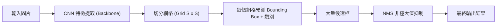

# Day 32: 電腦視覺進階 - 物件偵測與 YOLO (Object Detection)

## 0. 前言：從「是什麼」到「在哪裡」
在 Day 19 (CNN) 我們學會了**影像分類 (Image Classification)**，機器能告訴我們「這張圖是一隻貓」。
但如果圖中有「一隻貓、兩隻狗、三個人」，而且我們想知道它們分別在圖片的**哪個位置**呢？

這就是 **物件偵測 (Object Detection)** 的任務：
1.  **Classification (分類)**：是什麼？(Cat, Dog, Person)
2.  **Localization (定位)**：在哪裡？(畫出 Bounding Box 框起來)

今天的主角是目前業界最流行、速度最快的模型：**YOLO (You Only Look Once)**。

### YOLO 演進史 (v1 - v8)
YOLO 的發展非常迅速，每一代都有顯著的進步：

| 版本 | 年份 | 主要特色 |
| :--- | :--- | :--- |
| **YOLOv1** | 2015 | **開山始祖**。將偵測視為回歸問題，速度極快 (45 FPS)，但對小物件偵測效果差。 |
| **YOLOv2** | 2016 | **Better, Faster, Stronger**。引入 Anchor Boxes (錨點框) 與 Batch Normalization，提升準確度。 |
| **YOLOv3** | 2018 | **集大成者**。引入 FPN (Feature Pyramid Networks) 多尺度偵測，大幅改善小物件偵測能力。 |
| **YOLOv4** | 2020 | **最佳化組合**。由 Alexey Bochkovskiy 接手，整合了大量 Bag of Freebies (BoF) 與 Bag of Specials (BoS) 技巧。 |
| **YOLOv5** | 2020 | **工程化落地**。Ultralytics 發布 (非論文)，改用 PyTorch 實作，極易使用，部署方便，生態系強大。 |
| **YOLOv7** | 2022 | **架構創新**。在速度與準確度上再次取得 SOTA (State-of-the-Art)，專注於模型架構的最佳化 (E-ELAN)。 |
| **YOLOv8** | 2023 | **全面升級**。Ultralytics 最新力作。改用 Anchor-Free 機制，整合了分類、偵測、分割 (Segmentation) 等多種任務。 |

## 1. 核心概念：YOLO (You Only Look Once)
YOLO 的名字非常霸氣：「你只需要看一次」。
早期的物件偵測 (如 R-CNN) 需要看圖片好幾千次 (提取大量候選框)，速度非常慢。
YOLO 將整張圖一次丟進神經網路，直接輸出所有物件的位置和類別，達到了 **Real-time (即時)** 的速度。

### 1.1 核心公式 (Core Formulas)
如果要看懂 YOLO 的數學靈魂，主要有兩個部分：

**1. 損失函數 (Loss Function)**
YOLO 訓練時就是不斷縮小這個 Loss：

$$
Loss = \lambda_{box} Loss_{box} + \lambda_{obj} Loss_{obj} + \lambda_{cls} Loss_{cls}
$$

*   **$Loss_{box}$ (位置誤差)**：預測框跟真實框的差距 (YOLOv8 使用 CIoU Loss + DFL)。
*   **$Loss_{obj}$ (信心度誤差)**：
    *   有物件時：希望 $P_c \approx 1$。
    *   沒物件時：希望 $P_c \approx 0$ (這部分權重 $\lambda$ 通常較低，因為背景太多)。
*   **$Loss_{cls}$ (類別誤差)**：分類準不準 (BCE Loss)。

**2. 邊框解碼 (Bounding Box Decoding)**
神經網路輸出的其實是 $t_x, t_y, t_w, t_h$ (轉換前的數值)，需要透過公式轉回真實座標 $b_x, b_y, b_w, b_h$：

$$
b_x = 2\sigma(t_x) - 0.5 + c_x
$$
$$
b_y = 2\sigma(t_y) - 0.5 + c_y
$$
$$
b_w = p_w (2\sigma(t_w))^2
$$
$$
b_h = p_h (2\sigma(t_h))^2
$$

*(註：這是 YOLOv4/v5 常用的消除網格敏感度公式，v8 改用 Anchor-Free 但概念類似)*
*   $\sigma$ (Sigmoid)：把數值壓縮到 0~1 之間。
*   $c_x, c_y$：網格左上角的座標 (Grid Offset)。
*   $p_w, p_h$：預設框 (Anchor Box) 的寬高。

### 1.2 運作流程圖 (Mermaid)
YOLO 的核心精神就是「端對端 (End-to-End)」的預測。



**流程步驟詳解**：
1.  **Input (輸入)**：將原始圖片 (例如 $640 \times 640$) 丟入模型。
2.  **Backbone (骨幹網路)**：這是一個強大的 CNN (如 CSPDarknet)，負責從圖片中提取特徵 (Feature Maps)。它能「看懂」圖片裡的線條、形狀、紋理。
3.  **Grid (網格切分)**：邏輯上將圖片切分成 $S \times S$ 個格子。每個格子負責偵測「中心點」落在該格內的物件。
4.  **Predict (預測)**：每個格子同時預測三件事：
    *   **Box**：物件在哪？(座標 $x, y, w, h$)
    *   **Confidence**：是不是物件？(機率)
    *   **Class**：是什麼物件？(類別)
5.  **Raw Output (原始輸出)**：這時候會產生**成千上萬個框**。因為一張圖切成幾千個格子，每個格子都在猜，所以會有大量重疊、信心度低的框。

6.  **NMS (非極大值抑制)與 IoU**：這是關鍵的過濾步驟。YOLO 常常會對同一個物件預測出好幾個框。 NMS 的作用就是「去蕪存菁」：
    *   **IoU (Intersection over Union)**：用來判斷兩個框「重疊多少」。
        $$ IoU = \frac{\text{Area of Overlap (交集面積)}}{\text{Area of Union (聯集面積)}} $$
    *   **運作方式**：
        1.  選出信心度 ($P_c$) 最高的框。
        2.  計算它與其他框的 IoU。如果 IoU > 0.5 (代表重疊很高)，就視為重複預測，將其刪除。
        3.  重複直到每個物件只剩下一個框。
    
7.  **Output (最終結果)**：只剩下最精準的幾個框，標示出物件位置與類別。

8.  **Evaluation (效能評估 - mAP)**：
    *   雖然單張圖跑完了，但我們怎麼知道模型整體準不準？這時就要看 **mAP (mean Average Precision)**。
    *   它是物件偵測最權威的成績單，綜合考量了 **Precision (精確率)** 和 **Recall (召回率)**。
    *   mAP 越高，代表模型越強。

### 1.3 輸出向量 (Output Vector)
每個網格會預測一個向量，包含：

$$ \text{Output} = [\underbrace{P_c}_{\text{有沒有東西?}}, \underbrace{b_x, b_y}_{\text{中心在哪?}}, \underbrace{b_w, b_h}_{\text{長寬多少?}}, \underbrace{c_1, c_2, ...}_{\text{是什麼?}}] $$

*   $P_c$ (Confidence)：有沒有物件？(有=1, 無=0)
*   $b_x, b_y$：中心點座標。
*   $b_w, b_h$：寬度與高度。
*   $c_1, c_2...$：是貓？是狗？是車？(類別機率)

### 1.4 深入解密：YOLO 如何「同時」做到這一切？
這就是 YOLO 最神奇的地方。它不是「先找位置、再認東西」，而是**把所有問題變成一個數學回歸問題 (Regression Problem)**。

請想像每個網格 (Grid) 都有一個「多功能儀表板」向量，神經網路一次就把所有指針轉到對的位置：

1.  **定位 (Localization) - $b_x, b_y, b_w, b_h$**：
    *   神經網路透過訓練，學會了預測「偏移量」。
    *   $b_x, b_y$：告訴你中心點相對於這個網格左上角的偏移 (例如 0.5 代表在網格正中間)。
    *   $b_w, b_h$：告訴你框框的大小是網格的幾倍 (或相對於 Anchor Box 的比例)。
    *   **底層原理**：這是一個數值預測問題。如果預測的框跟真實的框 IoU 很低，Loss Function 就會處罰網路，逼它下次修正規格。

2.  **分類 (Classification) - $c_1, c_2...$ (一次測 80 種)**：
    *   每個網格都會**同時算出 80 種物件的機率**。
    *   它不是跑 80 次迴圈，而是直接輸出一個長向量 (例如 [Bus: 99%, Person: 0.1%, ...])。
    *   **關鍵連結**：YOLO 會把「信心度 $P_c$」跟「類別機率 $c_i$」乘在一起。
    
    $$
    \text{最終分數} = P(\text{有物件}) \times P(\text{是貓}|\text{有物件})
    $$
    
    *   如果 $P_c$ 很低 (沒物件)，不管後面猜什麼貓狗，分數都會歸零。

3.  **平行運算 (Parallel Grid Analysis)**：
    *   整張圖的所有網格是**同時 (Simultaneously)** 在運作的。
    *   負責「公車」的網格發現了公車特徵，信心度飆高。
    *   負責「人」的網格也**在同一時間**發現了人，信心度也飆高。
    *   這就是為什麼 YOLO 快！它不用看完公車再看人，而是一眼全看。

**總結**：YOLO 的底層並沒有「抓向量最近單位」這種搜尋過程。它更像是一個**訓練有素的直覺反應**——看到圖像的某個特徵 (Texture/Shape)，神經網路的權重就會自動觸發，直接在輸出層「彈出」對應的座標和類別數值。

### 1.5 YOLO 為什麼這麼快？
這是面試常問的問題。
*   **傳統方法 (Two-stage, 如 Faster R-CNN)**：
    1.  先用一個演算法找出「可能由物件的區域」(Region Proposals)。
    2.  再對每個區域做分類。
    *   缺點：要做兩次工，速度慢。
*   **YOLO (One-stage)**：
    1.  直接把整張圖丟進去，同時預測「位置」和「類別」。
    2.  就像人類看照片一樣，一眼就看完，不用拿放大鏡慢慢掃描。

## 2. 實戰：使用 YOLOv8 (Ultralytics)
現在最流行的版本是 **YOLOv8** (由 Ultralytics 維護)。它封裝得非常好，甚至比 Scikit-Learn 還簡單。

### 2.1 安裝
```bash
pip install ultralytics opencv-python matplotlib
```
*(注意：ultralytics 會自動安裝 PyTorch)*

### 2.2 程式碼實作
完整程式連結：[YOLO_demo.py](YOLO_demo.py)

我們使用最輕量級的 `yolov8n.pt` (Nano版) 模型，它會自動從網路下載。

```python
from ultralytics import YOLO

# 1. 載入模型
model = YOLO('yolov8n.pt')

# 2. 預測圖片 (支援 URL)
results = model('https://ultralytics.com/images/bus.jpg', save=True)

# 3. 查看結果
# 結果會自動儲存在 runs/detect/predict/ 資料夾下
```
###  YOLOv8 模型家族選擇
除了最快的 `yolov8n.pt`，YOLOv8 還提供了一系列不同大小的模型，讓你根據需求做選擇：

| 模型代號 | 名稱 | 參數 (Params) | 速度 (Speed) | 準確度 (mAP) | 建議場景 |
| :--- | :--- | :--- | :--- | :--- | :--- |
| **yolov8n.pt** | **Nano** | 3.2M | **極快** | 普通 | **手機、樹莓派**、即時性要求極高的場景。 |
| **yolov8s.pt** | **Small** | 11.2M | 快 | 佳 | **筆電 CPU**、一般 PC。CP 值最高的選擇。 |
| **yolov8m.pt** | **Medium** | 25.9M | 中 | 優 | **GPU Server**。適合需要較高準確度的商業應用。 |
| **yolov8l.pt** | **Large** | 43.7M | 慢 | 特優 | **高階 GPU**。適合遠距離偵測或小物件偵測。 |
| **yolov8x.pt** | **XLarge** | 68.2M | 極慢 | **最強** | **競賽、學術研究**。不計代價追求最高準確度。 |

### 2.3 執行結果範例
下圖是我們使用 `YOLO_demo.py` 執行的實際結果。
YOLO 成功在圖片中偵測到了公車、多人以及一個不明顯的停車標誌，並精準地畫出了邊框。


**詳細偵測統計**：
*   **Bus (公車)**：信心度 0.87 (非常確定)。
*   **Person (人)**：偵測到 4 位，信心度分別為 0.87, 0.85, 0.83, 0.26。
*   **Stop Sign (停車標誌)**：信心度 0.26 (雖然比較遠，但還是抓到了)。

*(註：這個結果完美展示了 Section 1.4 提到的平行運算能力，模型一次性地抓出了所有不同類別的物件。)*

## 3. 進階補充 (Advanced Supplements)

### 3.1 YOLO 的應用場景 (Why YOLO?)
為什麼 YOLO 這麼受歡迎？因為它在 **速度 (Speed)** 與 **準確度 (Accuracy)** 之間取得了完美的平衡。
這讓它非常適合 **Real-time (即時)** 的應用：
1.  **自駕車 (Autonomous Driving)**：必須在毫秒內偵測到行人、紅綠燈、車輛，慢 0.1 秒都可能出車禍。
2.  **智慧監控 (Smart Surveillance)**：即時偵測入侵者、計算人流、偵測是否戴口罩/安全帽。
3.  **工業瑕疵檢測 (Defect Detection)**：在產線上快速掃描產品是否有裂痕或瑕疵。
4.  **運動分析 (Sports Analytics)**：即時追蹤球員與球的位置，分析戰術。

### 3.2 攝影機部署建議 (Camera Deployment)
如果要將這套系統部署到實際場景 (如工廠、路口)，建議如下：

**程式碼 (Webcam)**：
```python
# source=0 代表使用第一個攝影機 (Webcam)
results = model.predict(source="0", show=True)
```

**硬體與軟體建議**：
| 項目 | **測試階段 (POC)** | **正式部署 (Production)** |
| :--- | :--- | :--- |
| **攝影機硬體** | **USB Webcam** (羅技 C920 等) <br> 便宜、隨插即用，適合快速驗證。 | **IP Camera (RTSP)** <br> 透過網路傳輸，適合遠距離佈線。YOLO 支援直接讀取 RTSP 串流 (`source="rtsp://..."`)。 |
| **運算主機** | **筆電 (含 GPU)** <br> 方便攜帶與展示。 | **Edge Device (Jetson Orin)** <br> 體積小、耐高溫、低功耗，適合掛在電線桿或機台旁。 |
| **軟體優化** | **Python + PyTorch** <br> 開發速度快，但效能普通。 | **C++ + TensorRT** <br> 為了達到 30 FPS 以上的即時速度，通常會將模型轉為 TensorRT 引擎，並用 C++ 呼叫。 |

### 3.3 常見問答 (FAQ)
**Q1: 如果是影片，多久丟一張圖進去？**
這取決於你的**硬體效能**與**需求**：
*   **理想狀況**：每一幀都丟 (Frame-by-Frame)。標準影片是 30 FPS (每秒 30 張)，如果你的 GPU 夠強 (如 RTX 3090)，YOLOv8n 可以輕鬆跑到 100+ FPS，所以全丟沒問題。
*   **硬體不夠強**：跳幀處理 (Frame Skipping)。例如每 5 張圖只測 1 張 (每秒測 6 次)，中間的畫面就假設物件位置沒變，或是用簡單的演算法(Tracking)去補。

**Q2: 模型到底能認得哪些東西？(COCO Dataset)**
我們使用的 `yolov8n.pt` 是預先在 **COCO 資料集** 上訓練好的。
它認得 **80 種** 常見物件，包括：
*   **人與交通**：Person, Bicycle, Car, Motorbike, Bus, Train, Truck...
*   **動物**：Bird, Cat, Dog, Horse, Sheep, Cow, Elephant, Bear...
*   **生活用品**：Backpack, Umbrella, Handbag, Tie, Suitcase...
*   **電子產品**：Laptop, Mouse, Remote, Keyboard, Cell phone...

## 4. 重點複習
1.  **物件偵測 vs 影像分類**：
    *   分類：這張圖是什麼？
    *   偵測：這張圖有什麼？在哪裡？
2.  **YOLO 的核心精神**：
    *   **One-stage**：看一次就解決，速度快，適合即時系統 (如監視器、自駕車)。
3.  **IoU (交集聯集比)**：
    *   用來衡量「框得準不準」。公式：交集 / 聯集。
4.  **NMS (非極大值抑制)**：
    *   用來「刪除重複的框」，只保留最好的一個。

## 5. 下一關預告
Day 33 我們將進入 **生成式 AI (Generative AI)** 的世界。
除了讓 AI 判斷 (Discriminative)，我們還要讓 AI **創造**！
我們將從最經典的 **GAN (生成對抗網路)** 開始，看兩個神經網路如何互相博弈，創造出以假亂真的圖片。
