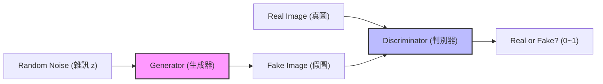
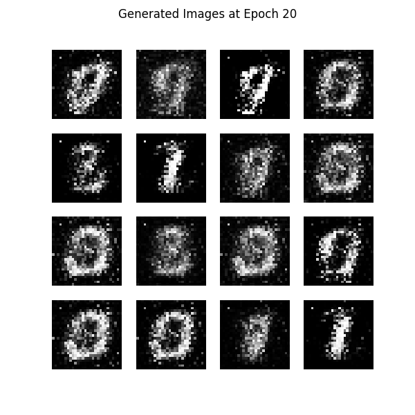
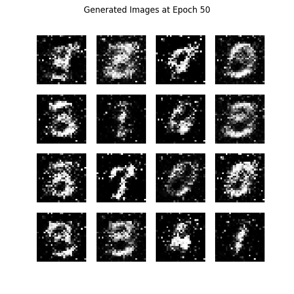

# Day 33: 生成式 AI 的起點 - GAN (Generative Adversarial Networks)

## 1. 前言：從「判斷」到「創造」
在過去的 32 天，我們學的都是 **Discriminative AI (判別式 AI)**：
*   這張圖是貓還是狗？(分類)
*   明天的房價是多少？(回歸)
*   圖中的公車在哪裡？(偵測)

今天，我們要進入一個全新的領域：**Generative AI (生成式 AI)**。
我們不再滿足於讓電腦「看懂」世界，我們希望它能「**創造**」世界。

而這一切的起點，就是 2014 年由 Ian Goodfellow 提出的 **GAN (生成對抗網路)**。

### 1.1 GAN 發展演進史 (Timeline)
GAN 的發展速度極快，從最早的模糊黑白圖，到現在的以假亂真：

| 年份 | 模型 | 重要性 |
| :--- | :--- | :--- |
| **2014** | **GAN** | **誕生**。Ian Goodfellow 提出概念，證明了兩個網路對抗可以生成資料。 |
| **2015** | **DCGAN** | **穩定化**。引入 CNN (卷積網路)，讓生成圖片不再只是雜訊，能生成清晰的人臉與臥室。 |
| **2017** | **CycleGAN** | **風格轉換**。不需要成對的訓練資料，就能把「馬變斑馬」、「照片變油畫」。 |
| **2017** | **ProGAN** | **高解析度**。NVIDIA 提出「漸進式訓練」，成功生成 1024x1024 的高畫質人臉。 |
| **2018** | **StyleGAN** | **逼真巔峰**。NVIDIA 進一步改良，生成的假人臉連毛孔都清晰可見，並能控制「風格」(如髮色、年齡)。 |
| **2020+** | **Diffusion** | **新霸主挑戰**。雖然 Diffusion Model (如 Stable Diffusion) 崛起，但 GAN 在**生成速度**上仍有絕對優勢。 |

## 2. 核心公式 (Min-Max Game)
GAN 的訓練過程可以用一個數學公式來表示，這是一個 **Min-Max** 的博弈過程：

$$
\min_G \max_D V(D, G) = \mathbb{E}_{x \sim p_{data}(x)} [\log D(x)] + \mathbb{E}_{z \sim p_{z}(z)} [\log (1 - D(G(z)))]
$$

> **💡 公式在架構圖的哪裡？**
> *   **左半邊 ( $\log D(x)$ )**：對應架構圖下方的路徑 `Real Image -> D`。警察看真鈔，要給高分。
> *   **右半邊 ( $\log (1 - D(G(z)))$ )**：對應架構圖上方的路徑 `Noise -> G -> Fake Image -> D`。警察看假鈔，要給低分。

> **💡 公式白話文**：
> 這是一個 **零和遊戲 (Zero-Sum Game)**，就像拔河比賽：
> *   **$\max_D$ (警察想拉高分數)**：
>     *   $D$ 的目標是**最大化 (Maximize)** 判別成功率。
>     *   看到真圖要說 Yes，看到假圖要說 No。只要判斷正確，分數就變高。
> *   **$\min_G$ (偽鈔犯想壓低分數)**：
>     *   $G$ 的目標是**最小化 (Minimize)** 警察的成功率。
>     *   它想畫出超像真的假圖，讓警察判斷錯誤 (把假圖當成真圖)。只要警察猜錯，分數就變低。
> *   **$V(D, G)$**：這就是那個「分數」 (Value Function)。兩人一個想拉高、一個想壓低，最後達到平衡。
>     *   看到真圖 ( $x$ )，要說 Yes ( $D(x) \approx 1$ ) $\rightarrow$ $\log D(x)$ 越大越好。
>     *   看到假圖 ( $G(z)$ )，要說 No ( $D(G(z)) \approx 0$ ) $\rightarrow$ $1 - D(G(z))$ 越大越好。
>     *   它控制不了真圖，只能控制假圖。
>     *   它希望 $D$ 認錯，把假圖當成真圖 ( $D(G(z)) \approx 1$ ) $\rightarrow$ 讓 $\log(1 - D(G(z)))$ 越小越好 (負無窮大)。

## 3. 核心概念：GAN 的博弈遊戲
GAN 的靈感來自於「**偽鈔製造者 vs 警察**」的貓捉老鼠遊戲。
它由兩個神經網路組成，彼此對抗 (Adversarial)：

### 3.1 架構圖 (Architecture)


### 3.2 兩個主角
1.  **Generator (生成器 $G$)**：
    *   **角色**：偽鈔製造者。
    *   **任務**：拼命製造「假圖片」，想辦法騙過警察。
    *   **輸入**：一組隨機雜訊 (Random Noise, $z$)。
    *   **輸出**：一張生成的假圖 ( $G(z)$ )。

2.  **Discriminator (判別器 $D$)**：
    *   **角色**：警察 / 鑑識專家。
    *   **任務**：拼命分辨「這是真圖」還是「這是假圖」。
    *   **輸入**：一張圖片 (可能是真的 $x$，也可能是假的 $G(z)$)。
    *   **輸出**：一個機率值 (0~1)，1 代表它是真的，0 代表它是假的。

### 3.3 運作流程 (The Loop)
這兩個網路會同時訓練，互相進步：
1.  **G 隨便畫**：一開始 $G$ 畫得很爛 (像雜訊)。
2.  **D 輕鬆抓**：$D$ 很容易就分出真假。
3.  **G 進步**：$G$ 發現被抓了，調整參數，畫得更像一點。
4.  **D 進步**：$D$ 發現 $G$ 變強了，自己也要提升鑑識能力，抓出更細微的破綻。
5.  **最終平衡 (Nash Equilibrium)**：
    *   $G$ 畫出的圖已經跟真圖一模一樣。
    *   $D$ 再也分不出來，對於任何一張圖都只能猜 50% (0.5)。
    *   這就是我們想要的結果！


## 4. 實戰：用 GAN 生成手寫數字 (MNIST)
我們將使用 PyTorch 建立一個簡單的 GAN，讓它學習寫數字 "0-9"。

### 4.1 安裝
```bash
pip install torch torchvision matplotlib
```

### 4.2 程式碼架構
完整程式碼請參考 `GAN_MNIST.py` (稍後建立)。

1.  **Generator**：Linear -> ReLU -> Linear -> Tanh (輸出 -1~1 的圖片)。
2.  **Discriminator**：Linear -> LeakyReLU -> Linear -> Sigmoid (輸出 0~1 的機率)。
3.  **Training Loop (訓練迴圈)**：
    > **💡 訓練迴圈白話文 (The Training Loop)**：
    > 這就像是兩個人的「回合制」遊戲：
    >
    > **第一回合：訓練警察 (Discriminator)**
    > *   **情境**：警察去上課。
    > *   **教材**：老師拿出一張真鈔 ($x$) 說「這是真的 (Label=1)」，再拿出一張假鈔 ($G(z)$) 說「這是假的 (Label=0)」。
    > *   **目標**：警察要學會分清楚誰真誰假。如果分錯了，就處罰警察 (調整 $D$ 的參數)。
    >
    > **第二回合：訓練偽鈔犯 (Generator)**
    > *   **情境**：偽鈔犯去考試。
    > *   **考試內容**：偽鈔犯畫一張假鈔 ($G(z)$) 拿給警察看。
    > *   **目標**：偽鈔犯**希望**警察說「這是真的 (Label=1)」。
    > *   **關鍵**：如果警察說「這是假的」，偽鈔犯就被扣分 (調整 $G$ 的參數)，他會想：「可惡，下次要把線條畫直一點才能騙過他」。
    > *   *(注意：這回合警察是考官，我們不處罰警察，只處罰偽鈔犯)*

### 4.3 執行結果說明 (Results in `pic/`)
我們將訓練過程生成的圖片存放在 `pic/` 資料夾中，你可以看到模型是如何「從無到有」學會寫字的：

#### **初期 (Epoch 1)**

*   **標準答案 (Real)**：清晰的手寫數字 (如 0, 1, 2...)。
*   **目前猜測 (Fake)**：一堆雜訊 (雪花屏)。
*   **警察反應**：「這 100% 是假的！」(Score $\approx$ 0)。
*   **原因**：生成器 $G$ 還沒學到任何特徵，只是隨機亂畫。判別器 $D$ 也很笨，還在亂猜。

#### **中期 (Epoch 20)**

*   **標準答案 (Real)**：清晰的手寫數字。
*   **目前猜測 (Fake)**：模糊的黑白團塊，隱約有形狀。
*   **警察反應**：「嗯...這有 30% 像真的。」(Score $\approx$ 0.3)。
*   **原因**： $G$ 發現只要畫出「中間白、旁邊黑」的圖案，比較容易騙過 $D$ ，開始掌握筆畫結構。

#### **後期 (Epoch 50)**

*   **標準答案 (Real)**：清晰的手寫數字。
*   **目前猜測 (Fake)**：清晰的 "0", "1", "5", "9"。
*   **警察反應**：「我分不出來了... 50% 是真的吧？」(Score $\approx$ 0.5)。
*   **原因**： $G$ 已經學會了 MNIST 的數據分佈， $D$ 逼迫它畫出細節。雖然是 AI 生成的，但看起來跟手寫的一模一樣。

> **💡 訓練過程白話文 (In Simple Terms)**：
> **Q: 為什麼它知道要畫 0, 1, 5, 9？警察有標準答案嗎？**
> *   **警察 (Discriminator) 有標準答案**：我們在訓練時，會偷偷塞**真的手寫數字 (MNIST 資料集)** 給警察看 (架構圖下方的 `Real Image`)。
> *   **過程是這樣的 (猜猜樂)**：
>     1.  **警察看真圖**：看到真的 "5"，警察說：「這有 **99%** 是真的！」(答對了，警察加分)。
>     2.  **警察看假圖 (初期)**：看到一團雜訊，警察說：「這只有 **1%** 是真的！」(答對了，警察加分)。
>     3.  **警察看假圖 (中期)**：看到一個模糊的黑影，警察猶豫了：「嗯...這有 **40%** 像真的。」(偽鈔犯進步了)。
>     4.  **警察看假圖 (後期)**：看到一個完美的 "5"，警察困惑了：「天啊，這看起來 **50%** 像真的，我分不出來了！」(這就是我們要的結果：以假亂真)。

## 5. 為什麼要學這個？(GAN 的強大應用)
你可能會覺得：「**花這麼久訓練，只生出幾個模糊的數字，這到底有什麼用？**」
這就像剛學寫程式印出 `Hello World` 一樣，雖然無聊，但它是通往偉大的第一步。

一旦你掌握了 GAN 的原理 (對抗生成)，只要把**資料集 (MNIST)** 換掉，就能做出驚人的應用：

### 5.1 從「模糊數字」到「商業價值」
| 應用領域 | 原理 (跟生成數字一模一樣) | 商業價值 |
| :--- | :--- | :--- |
| **老照片修復** | 把「模糊數字」換成「模糊老照片」，讓 AI 猜出清晰版。 | **修復回憶**、電影畫質提升 (4K Remaster)。 |
| **室內設計** | 把「隨機雜訊」換成「房間草圖」，讓 AI 生成精美裝潢圖。 | **快速提案**、讓客戶預覽未來的家。 |
| **醫學影像** | 罕見疾病的照片很少 (資料不足)。用 GAN 生成「假的罕見病照片」來訓練診斷 AI。 | **救人**。解決醫療資料隱私與不足的問題。 |
| **Deepfake (換臉)** | 讓 AI 學習 A 的臉，然後生成出 B 的表情。 | **電影特效** (玩命關頭保羅沃克復活)、娛樂。 |

> **結論**：我們今天學的是**引擎 (GAN 原理)**，雖然現在只裝在**玩具車 (MNIST)** 上跑，但這顆引擎是可以裝在**法拉利 (高階應用)** 上的！

## 6. 下一關預告
GAN 雖然強大，但訓練很不穩定 (容易崩潰)。
Day 34 我們將介紹另一種生成模型：**AutoEncoder (自編碼器)** 與 **VAE (變分自編碼器)**，它們在異常檢測和圖像生成上也有獨特的地位。
