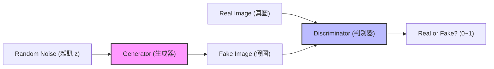

# Day 33: 生成式 AI 的起點 - GAN (Generative Adversarial Networks)

## 1. 前言：從「判斷」到「創造」
在過去的 32 天，我們學的都是 **Discriminative AI (判別式 AI)**：
*   這張圖是貓還是狗？(分類)
*   明天的房價是多少？(回歸)
*   圖中的公車在哪裡？(偵測)

今天，我們要進入一個全新的領域：**Generative AI (生成式 AI)**。
我們不再滿足於讓電腦「看懂」世界，我們希望它能「**創造**」世界。

而這一切的起點，就是 2014 年由 Ian Goodfellow 提出的 **GAN (生成對抗網路)**。

### 1.1 GAN 發展演進史 (Timeline)
GAN 的發展速度極快，從最早的模糊黑白圖，到現在的以假亂真：

| 年份 | 模型 | 重要性 |
| :--- | :--- | :--- |
| **2014** | **GAN** | **誕生**。Ian Goodfellow 提出概念，證明了兩個網路對抗可以生成資料。 |
| **2015** | **DCGAN** | **穩定化**。引入 CNN (卷積網路)，讓生成圖片不再只是雜訊，能生成清晰的人臉與臥室。 |
| **2017** | **CycleGAN** | **風格轉換**。不需要成對的訓練資料，就能把「馬變斑馬」、「照片變油畫」。 |
| **2017** | **ProGAN** | **高解析度**。NVIDIA 提出「漸進式訓練」，成功生成 1024x1024 的高畫質人臉。 |
| **2018** | **StyleGAN** | **逼真巔峰**。NVIDIA 進一步改良，生成的假人臉連毛孔都清晰可見，並能控制「風格」(如髮色、年齡)。 |
| **2020+** | **Diffusion** | **新霸主挑戰**。雖然 Diffusion Model (如 Stable Diffusion) 崛起，但 GAN 在**生成速度**上仍有絕對優勢。 |

## 2. 核心公式 (Min-Max Game)
GAN 的訓練過程可以用一個數學公式來表示，這是一個 **Min-Max** 的博弈過程：

$$
$$
\min_G \max_D V(D, G) = \underbrace{\mathbb{E}_{x \sim p_{data}(x)} [\log D(x)]}_{\text{判別器看真圖 (下半路徑)}} + \underbrace{\mathbb{E}_{z \sim p_{z}(z)} [\log (1 - D(G(z)))]}_{\text{判別器看假圖 (上半路徑)}}
$$

> **💡 公式在架構圖的哪裡？**
> *   **左半邊 ($\log D(x)$)**：對應架構圖下方的路徑 `Real Image -> D`。警察看真鈔，要給高分。
> *   **右半邊 ($\log (1 - D(G(z)))$)**：對應架構圖上方的路徑 `Noise -> G -> Fake Image -> D`。警察看假鈔，要給低分。

> **💡 公式白話文**：
> *   **$D$ (警察) 想最大化 (Max) 分數**：
>     *   看到真圖 ($x$)，要說 Yes ($D(x) \approx 1$) $\rightarrow$ $\log D(x)$ 越大越好。
>     *   看到假圖 ($G(z)$)，要說 No ($D(G(z)) \approx 0$) $\rightarrow$ $1 - D(G(z))$ 越大越好。
> *   **$G$ (偽鈔犯) 想最小化 (Min) 分數**：
>     *   它控制不了真圖，只能控制假圖。
>     *   它希望 $D$ 認錯，把假圖當成真圖 ($D(G(z)) \approx 1$) $\rightarrow$ 讓 $\log(1 - D(G(z)))$ 越小越好 (負無窮大)。

## 3. 核心概念：GAN 的博弈遊戲
GAN 的靈感來自於「**偽鈔製造者 vs 警察**」的貓捉老鼠遊戲。
它由兩個神經網路組成，彼此對抗 (Adversarial)：

### 3.1 架構圖 (Architecture)


### 3.2 兩個主角
1.  **Generator (生成器 $G$)**：
    *   **角色**：偽鈔製造者。
    *   **任務**：拼命製造「假圖片」，想辦法騙過警察。
    *   **輸入**：一組隨機雜訊 (Random Noise, $z$)。
    *   **輸出**：一張生成的假圖 ( $G(z)$ )。

2.  **Discriminator (判別器 $D$)**：
    *   **角色**：警察 / 鑑識專家。
    *   **任務**：拼命分辨「這是真圖」還是「這是假圖」。
    *   **輸入**：一張圖片 (可能是真的 $x$，也可能是假的 $G(z)$)。
    *   **輸出**：一個機率值 (0~1)，1 代表它是真的，0 代表它是假的。

### 3.2 運作流程 (The Loop)
這兩個網路會同時訓練，互相進步：
1.  **G 隨便畫**：一開始 $G$ 畫得很爛 (像雜訊)。
2.  **D 輕鬆抓**：$D$ 很容易就分出真假。
3.  **G 進步**：$G$ 發現被抓了，調整參數，畫得更像一點。
4.  **D 進步**：$D$ 發現 $G$ 變強了，自己也要提升鑑識能力，抓出更細微的破綻。
5.  **最終平衡 (Nash Equilibrium)**：
    *   $G$ 畫出的圖已經跟真圖一模一樣。
    *   $D$ 再也分不出來，對於任何一張圖都只能猜 50% (0.5)。
    *   這就是我們想要的結果！


## 4. 實戰：用 GAN 生成手寫數字 (MNIST)
我們將使用 PyTorch 建立一個簡單的 GAN，讓它學習寫數字 "0-9"。

### 4.1 安裝
```bash
pip install torch torchvision matplotlib
```

### 4.2 程式碼架構
完整程式碼請參考 `GAN_MNIST.py` (稍後建立)。

1.  **Generator**：Linear -> ReLU -> Linear -> Tanh (輸出 -1~1 的圖片)。
2.  **Discriminator**：Linear -> LeakyReLU -> Linear -> Sigmoid (輸出 0~1 的機率)。
3.  **Training Loop**：
    *   先訓練 $D$ (給真圖標 1，給假圖標 0)。
    *   再訓練 $G$ (給假圖標 1，騙 $D$ 說這是真的)。

### 4.3 執行結果說明 (Results in `pic/`)
我們將訓練過程生成的圖片存放在 `pic/` 資料夾中，你可以看到模型是如何「從無到有」學會寫字的：

#### **初期 (Epoch 1)**

*   **現象**：看起來像電視雜訊 (雪花屏)。
*   **原因**：生成器 $G$ 還沒學到任何特徵，只是隨機亂畫。判別器 $D$ 也很笨，還在亂猜。

#### **中期 (Epoch 10-20)**
*   **現象**：開始出現模糊的黑白團塊，隱約看得出是數字的形狀。
*   **原因**： $G$ 發現只要畫出「中間白、旁邊黑」的圖案，比較容易騙過 $D$ ，開始掌握筆畫結構。

#### **後期 (Epoch 50)**

*   **現象**：清晰的 "0", "1", "5", "9" 等數字。
*   **原因**： $G$ 已經學會了 MNIST 的數據分佈， $D$ 逼迫它畫出細節。雖然是 AI 生成的，但看起來跟手寫的一模一樣。

> **💡 訓練過程白話文 (In Simple Terms)**：
> **Q: 為什麼它知道要畫 0, 1, 5, 9？警察有標準答案嗎？**
> *   **警察 (Discriminator) 有標準答案**：我們在訓練時，會偷偷塞**真的手寫數字 (MNIST 資料集)** 給警察看 (架構圖下方的 `Real Image`)。
> *   **過程是這樣的**：
>     1.  警察看了一眼**真圖** (比如真的數字 5)，心想：「喔！原來真的 5 長這樣 (有圓弧、有橫線)」。
>     2.  接著看一眼**假圖** (生成器亂畫的雜訊)，心想：「這什麼鬼？不像剛剛那個，這是假的！」。
>     3.  **生成器 (Generator) 被罵了**：它不知道真的 5 長怎樣 (它看不到真圖)，但它知道「剛剛那樣畫被抓了」。
>     4.  **嘗試錯誤**：生成器下次就試著畫一點圓弧、畫一點橫線。如果警察說「這次比較像真的喔」，生成器就知道「這條路是對的」。
>     5.  **結果**：經過幾萬次被罵、修正後，生成器雖然沒看過真圖，但它**猜**出了真圖的規律，所以畫出了 0, 1, 5, 9。

## 5. GAN 的應用與演進
GAN 開啟了生成式 AI 的大門，後來衍生出非常多強大的變形：

| 模型 | 特色 | 應用 |
| :--- | :--- | :--- |
| **DCGAN** | 使用 CNN 取代全連接層 | 生成高品質的人臉、臥室圖片。 |
| **CycleGAN** | 風格轉換 (不用成對資料) | 把「馬」變成「斑馬」、把「夏天」變成「冬天」。 |
| **StyleGAN** | NVIDIA 開發，超高解析度 | 生成逼真到可怕的假人臉 (ThisPersonDoesNotExist.com)。 |
| **SRGAN** | 超解析度 (Super Resolution) | 把模糊的低畫質影片變 4K 高畫質。 |

## 6. 下一關預告
GAN 雖然強大，但訓練很不穩定 (容易崩潰)。
Day 34 我們將介紹另一種生成模型：**AutoEncoder (自編碼器)** 與 **VAE (變分自編碼器)**，它們在異常檢測和圖像生成上也有獨特的地位。
