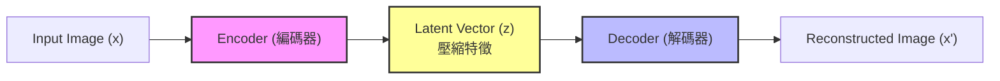

# Day 34: 另一種生成 - AutoEncoder 與 VAE

## 1. 前言：除了對抗，還能怎麼生成？
昨天我們介紹了 **GAN (生成對抗網路)**，它透過「偽鈔犯 vs 警察」的激烈對抗來生成圖片。
雖然 GAN 生成的圖片很逼真，但它有一個缺點：**訓練很不穩定 (Unstable)**。只要一方太強，另一方就會崩潰。

今天我們要介紹另一種生成模型家族：**AutoEncoder (自編碼器)** 與 **VAE (變分自編碼器)**。
它們的哲學完全不同：不是「對抗」，而是「**壓縮與還原**」。

## 2. AutoEncoder (AE)：壓縮與還原
AutoEncoder 的概念非常直觀：
如果你能把一張複雜的圖片，壓縮成短短幾個數字 (編碼)，然後再完美地還原回來 (解碼)，那就代表你真正「理解」了這張圖片的精髓。

### 2.1 架構圖

### 2.2 運作原理
1.  **Encoder (編碼器)**：把圖片 $x$ 壓縮成一個低維度的向量 $z$ (Latent Vector)。
2.  **Bottleneck (瓶頸層)**：這是最窄的地方，強迫模型只保留最重要的資訊 (例如：這是數字 7，有點歪)。
3.  **Decoder (解碼器)**：嘗試從 $z$ 還原回原始圖片 $x'$。
4.  **Loss Function**：比較 $x$ 和 $x'$ 像不像 (Reconstruction Loss)。

> **應用**：
> *   **降維**：類似 PCA，但是非線性的，效果更好。
> *   **去噪 (Denoising AE)**：輸入雜訊圖，要求還原清晰圖。
> *   **異常檢測**：如果一張圖還原不回來 (Loss 很高)，代表它跟平常的圖很不一樣 (異常)。

## 3. VAE (Variational AutoEncoder)：讓生成更平滑
普通的 AutoEncoder 雖然能還原圖片，但它**不能用來生成新圖片**。
因為它的 $z$ 是離散的、不連續的。如果你隨便給一個雜訊 $z$，Decoder 可能會還原出亂碼。

**VAE (變分自編碼器)** 解決了這個問題。它不直接預測 $z$，而是預測 $z$ 的**分佈 (常態分佈)**。

### 3.1 VAE 的關鍵差異
*   **AE**：Encoder 說「這張圖的特徵是座標 (3, 5)」。
*   **VAE**：Encoder 說「這張圖的特徵大概在 (3, 5) 附近，誤差範圍是 1」。

這樣做的好處是，**Latent Space (潛在空間) 變得連續了**。
你可以從 (3, 5) 走到 (4, 6)，中間生成的圖片會慢慢從「數字 1」變形過渡到「數字 7」，而不是突然跳變。

### 3.2 核心公式 (ELBO)
VAE 的 Loss Function 包含兩部分：
$$
Loss = \underbrace{\|x - x'\|^2}_{\text{Reconstruction Loss (還原誤差)}} + \underbrace{KL(q(z|x) \| N(0, 1))}_{\text{KL Divergence (分佈相似度)}}
$$

> **💡 公式白話文**：
> 1.  **還原誤差**：生成的圖要跟原圖很像 (畫得準)。
> 2.  **KL 散度**：編碼出來的分佈，要盡量像標準常態分佈 (讓特徵空間整齊、連續，方便我們隨機取樣來生成新圖)。

## 4. 實戰：用 VAE 生成手寫數字
我們一樣使用 MNIST 資料集，看看 VAE 如何「壓縮」並「生成」數字。

### 4.1 程式碼架構 (`VAE_MNIST.py`)
1.  **Encoder**：輸出兩個向量：Mean ($\mu$) 和 Log Variance ($\log \sigma^2$)。
2.  **Reparameterization Trick**：這是 VAE 最天才的地方。
    *   $z = \mu + \sigma \times \epsilon$ (其中 $\epsilon$ 是隨機雜訊)。
    *   這讓「隨機取樣」這個動作變得可以被微分 (Backpropagation)。
3.  **Decoder**：從 $z$ 還原圖片。

### 4.2 執行結果預期
你會看到兩張圖：
1.  **Reconstruction**：原圖 vs 還原圖 (測試 AE 能力)。
2.  **Generation**：隨機取樣 $z$ 生成的新圖 (測試 VAE 生成能力)。

## 5. GAN vs VAE 比較

| 特性 | GAN (生成對抗網路) | VAE (變分自編碼器) |
| :--- | :--- | :--- |
| **畫質** | **極高** (Sharp)。細節豐富。 | **模糊** (Blurry)。因為是算平均誤差。 |
| **訓練難度** | **難** (Unstable)。容易崩潰。 | **易** (Stable)。Loss 穩定下降。 |
| **生成多樣性** | 容易發生 Mode Collapse (只會畫某幾種圖)。 | 多樣性好，覆蓋完整分佈。 |
| **潛在空間** | 不一定連續。 | **連續且平滑** (適合做變形特效)。 |

## 6. 下一關預告
Day 35 我們將挑戰 **Diffusion Model (擴散模型)** 的前身概念。
雖然我們無法在 30 天內從頭訓練一個 Stable Diffusion (算力需求太高)，但我們會介紹它的核心原理：**如何透過「加噪」與「去噪」來生成高品質圖片**。
