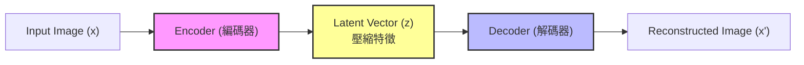
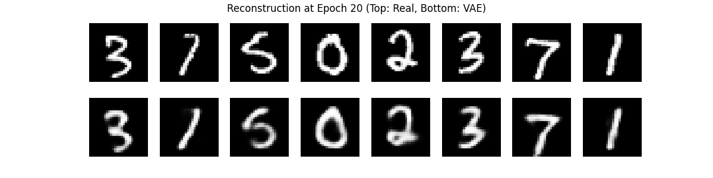
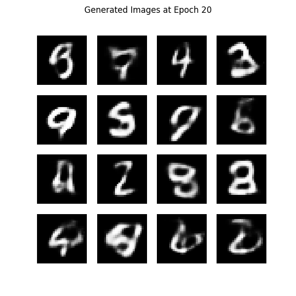

# Day 34: 另一種生成 - AutoEncoder 與 VAE

## 1. 前言：除了對抗，還能怎麼生成？
昨天我們介紹了 **GAN (生成對抗網路)**，它透過「偽鈔犯 vs 警察」的激烈對抗來生成圖片。
雖然 GAN 生成的圖片很逼真，但它有一個缺點：**訓練很不穩定 (Unstable)**。只要一方太強，另一方就會崩潰。

今天我們要介紹另一種生成模型家族：**AutoEncoder (自編碼器)** 與 **VAE (變分自編碼器)**。
它們的哲學完全不同：不是「對抗」，而是「**壓縮與還原**」。

### 1.1 發展演進史 (Timeline)
VAE 的發展雖然沒有 GAN 那麼戲劇化，但它奠定了「機率生成模型」的基礎，更是後來 Diffusion Model 的重要前身。

| 年份 | 模型 | 重要性 |
| :--- | :--- | :--- |
| **2006** | **AutoEncoder (AE)** | **降維始祖**。Geoffrey Hinton 提出，證明神經網路可以做非線性降維 (比 PCA 強)。 |
| **2013** | **VAE** | **生成起點**。Kingma & Welling 提出，引入「機率分佈」，讓 AE 具備了生成新圖片的能力。 |
| **2015** | **VQ-VAE** | **畫質提升**。DeepMind 提出，將特徵離散化 (Vector Quantization)，大幅提升了生成畫質。 |
| **2021** | **Stable Diffusion** | **集大成者**。其實 Stable Diffusion 的核心就是一個超強的 VAE (Latent Diffusion)，它先用 VAE 壓縮圖片，再用 Diffusion 去噪。 |

## 2. AutoEncoder (AE)：壓縮與還原
> **Q: 為什麼要先學 AE？直接學 VAE 不行嗎？**
> **不行**。因為 VAE 是 AE 的改良版。
> *   **AE (基本功)**：教會你什麼是「Encoder (壓縮)」和「Decoder (還原)」。
> *   **VAE (進階)**：在 AE 的基礎上，加入「機率」的概念，讓它能生成新東西。
> *   如果不先懂 AE 的「瓶頸層 (Bottleneck)」概念，就無法理解為什麼 VAE 要預測 Mean 和 Variance。

AutoEncoder 的概念非常直觀：
如果你能把一張複雜的圖片，壓縮成短短幾個數字 (編碼)，然後再完美地還原回來 (解碼)，那就代表你真正「理解」了這張圖片的精髓。

### 2.1 架構圖

### 2.2 運作原理
1.  **Encoder (編碼器)**：把圖片 $x$ 壓縮成一個低維度的向量 $z$ (Latent Vector)。
2.  **Bottleneck (瓶頸層)**：這是最窄的地方，強迫模型只保留最重要的資訊 (例如：這是數字 7，有點歪)。
3.  **Decoder (解碼器)**：嘗試從 $z$ 還原回原始圖片 $x'$。
4.  **Loss Function**：比較 $x$ 和 $x'$ 像不像 (Reconstruction Loss)。

> **應用**：
> *   **降維**：類似 PCA，但是非線性的，效果更好。
> *   **去噪 (Denoising AE)**：輸入雜訊圖，要求還原清晰圖。
> *   **異常檢測**：如果一張圖還原不回來 (Loss 很高)，代表它跟平常的圖很不一樣 (異常)。

## 3. VAE (Variational AutoEncoder)：讓生成更平滑
普通的 AutoEncoder 雖然能還原圖片，但它**不能用來生成新圖片**。
因為它的 $z$ 是離散的、不連續的。如果你隨便給一個雜訊 $z$，Decoder 可能會還原出亂碼。

**VAE (變分自編碼器)** 解決了這個問題。它不直接預測 $z$，而是預測 $z$ 的**分佈 (常態分佈)**。

### 3.1 VAE 的關鍵差異
*   **AE**：Encoder 說「這張圖的特徵是座標 (3, 5)」。
*   **VAE**：Encoder 說「這張圖的特徵大概在 (3, 5) 附近，誤差範圍是 1」。

這樣做的好處是，**Latent Space (潛在空間) 變得連續了**。
你可以從 (3, 5) 走到 (4, 6)，中間生成的圖片會慢慢從「數字 1」變形過渡到「數字 7」，而不是突然跳變。

### 3.2 核心公式 (ELBO)
**Loss Function (損失函數)**：
`Loss = Reconstruction_Loss + KL_Divergence`

$$
Loss = | x - x' |^2 + KL( q(z|x) || N(0, 1) )
$$

> **💡 公式白話文**：
> 1.  **還原誤差 (Reconstruction Loss)**：
>     *   **目標**：生成的圖 ($x'$) 要跟原圖 ($x$) 很像。
>     *   **比喻**：老師給你看一張圖，你要憑記憶畫出來。畫得越像，分數越高。
> 2.  **KL 散度 (KL Divergence)**：
>     *   **目標**：編碼出來的特徵 ($z$) 分佈，要盡量像「標準常態分佈」(平均值 0，標準差 1)。
>     *   **比喻**：整理房間。我們希望把東西歸類好 (常態分佈)，不要亂丟 (雜亂分佈)，這樣下次要找東西 (生成新圖) 才方便。

## 4. 實戰：用 VAE 生成手寫數字
我們一樣使用 MNIST 資料集，看看 VAE 如何「壓縮」並「生成」數字。

### 4.1 程式碼架構 (`VAE_MNIST.py`)
1.  **Encoder**：輸出兩個向量：Mean ($\mu$) 和 Log Variance ($\log \sigma^2$)。
2.  **Reparameterization Trick**：這是 VAE 最天才的地方。
    *   $z = \mu + \sigma \times \epsilon$ (其中 $\epsilon$ 是隨機雜訊)。
    *   這讓「隨機取樣」這個動作變得可以被微分 (Backpropagation)。
3.  **Decoder**：從 $z$ 還原圖片。

### 4.2 執行結果說明 (Results in `pic/`)
我們訓練了 20 個 Epoch，Loss 從 159 降到 105。

> **Q: 為什麼要分「還原」跟「生成」兩種測試？(不同應用情境)**
> *   **還原 (Reconstruction) = 壓縮應用**：
>     *   **情境**：視訊會議 (Zoom/Google Meet)。
>     *   **用途**：把你的畫面壓縮成超小封包 (Encoder) 傳給對方，對方再還原出來 (Decoder)。重點是**省流量**且**畫面不失真**。
> *   **生成 (Generation) = 創作應用**：
>     *   **情境**：遊戲設計、藝術創作。
>     *   **用途**：給 AI 一個隨機靈感 (雜訊 z)，要它畫出一個「不存在但看起來很真」的角色。重點是**多樣性**和**創造力**。

#### **1. 還原能力測試 (Reconstruction)**
這張圖展示了 VAE 的「記憶力」。上排是原圖 (Real)，下排是 VAE 壓縮後再還原的圖 (Guess)。

*   **分數 (Loss)**：105.9 (越低越好)。
    > **Q: 105.9 如何評分？**
    > *   基礎這是因為我們是把 **784 個像素 (28x28)** 的誤差全部加起來 (Sum)。
    > *   **換算一下**：$105.9 \div 784 \approx 0.135$。
    > *   **意思**：平均每個像素的誤差只有 **0.135** (在 0~1 之間)。這其實非常低，代表還原度很高！
*   **標準答案 (Real)**：清晰的數字 7, 2, 1, 0...
*   **目前猜測 (Guess)**：稍微模糊一點，但特徵完全抓到了 (7 還是 7，沒有變形)。
*   **結論**：VAE 成功學會了「壓縮」圖片，雖然細節 (銳利度) 丟失了，但核心結構保留得很完美。

#### **2. 生成能力測試 (Generation)**
這張圖展示了 VAE 的「想像力」。我們給它隨機雜訊，看它能畫出什麼。

*   **標準答案 (Real)**：**沒有標準答案**。
    *   因為這是 AI 從雜訊 ($z$) 中憑空想像出來的，不是模仿某張特定的圖。
*   **現象**：生成的數字看起來很像手寫的，但邊緣有點糊糊的 (Blurry)。
*   **原因**：這就是 VAE 的特性。因為它是算「平均值」，所以畫出來的圖會有一種「夢幻、朦朧」的感覺。

> **Q: 這樣生成有什麼意義？不就是把數字變形而已嗎？**
> **這正是 VAE 最強大的地方：連續性 (Continuity)。**
> *   **不只是變形**：一般的圖片編輯軟體 (Photoshop) 只能做幾何扭曲。但 VAE 是學會了數字的「基因」。
> *   **應用 - 變臉特效 (Morphing)**：
>     *   在 VAE 的潛在空間中，你可以從「數字 1」慢慢走到「數字 7」。
>     *   你會看到 1 的頭慢慢長出來，變成 7 的橫槓。這是一個**平滑的過渡**，而不是硬切。
>     *   這在**電影特效** (人變狼人) 或 **產品設計** (鞋子款式微調) 非常有用，因為它能創造出「中間型態」。
>
> **Q: 為什麼它知道要從 1 變成 7？誤差範圍不會讓它亂跑嗎？**
> *   **方向是你決定的**：不是 VAE 自己決定要變 7。是**我們**告訴它：「起點是 1 的座標，終點是 7 的座標，請走直線過去」。
> *   **VAE 的功勞是「鋪路」**：
>     *   **一般的 AE (路面有洞)**：如果你直接走直線，中間可能會經過「未知區域」，還原出來是亂碼。
>     *   **VAE (路面平滑)**：因為有「誤差範圍 (Variance)」的訓練，它強迫把 1 和 7 之間的地圖「填滿」。
>     *   **結果**：當你從 1 走到 7，中間經過的每一點，VAE 都能解碼出一個「像 1 又像 7」的合理數字，而不是雜訊。這就是為什麼它不會亂跑，而是平滑過渡。

## 5. GAN vs VAE 比較

| 特性 | GAN (生成對抗網路) | VAE (變分自編碼器) |
| :--- | :--- | :--- |
| **畫質** | **極高** (Sharp)。細節豐富。 | **模糊** (Blurry)。因為是算平均誤差。 |
| **訓練難度** | **難** (Unstable)。容易崩潰。 | **易** (Stable)。Loss 穩定下降。 |
| **生成多樣性** | 容易發生 Mode Collapse (只會畫某幾種圖)。 | 多樣性好，覆蓋完整分佈。 |
| **潛在空間** | 不一定連續。 | **連續且平滑** (適合做變形特效)。 |

## 6. 下一關預告
Day 35 我們將挑戰 **Diffusion Model (擴散模型)** 的前身概念。
雖然我們無法在 30 天內從頭訓練一個 Stable Diffusion (算力需求太高)，但我們會介紹它的核心原理：**如何透過「加噪」與「去噪」來生成高品質圖片**。
