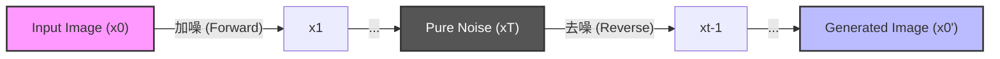
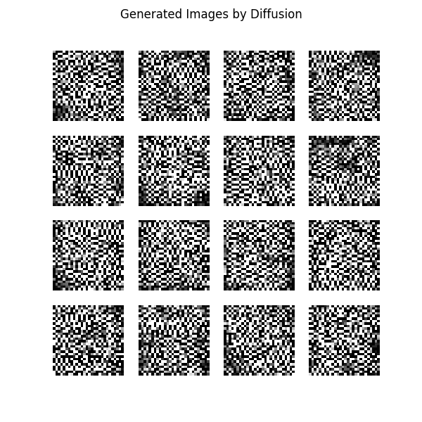

# Day 35: 生成式 AI 的霸主 - Diffusion Model (擴散模型)

## 1. 前言：為什麼 GAN 失寵了？
在前兩天，我們學到了：
*   **GAN (Day 33)**：畫質好，但訓練很不穩定 (容易吵架崩潰)。
*   **VAE (Day 34)**：訓練穩定，但畫質模糊 (因為是算平均)。

2020 年後，一位新霸主橫空出世：**Diffusion Model (擴散模型)**。
它結合了兩者的優點：**畫質極高** 且 **訓練穩定**。
現在最紅的 **Stable Diffusion**、**DALL-E 3**、**Midjourney** 全部都是基於這個原理。

## 2. 核心概念：加噪與去噪
Diffusion 的靈感來自物理學的「擴散現象」(例如一滴墨水滴入水中，慢慢擴散開來)。

### 2.1 兩個過程
1.  **Forward Process (前向過程 - 加噪)**：
    *   **破壞**：把一張清晰的照片，慢慢加入雜訊 (Gaussian Noise)。
    *   **結果**：最後變成一張完全看不出原本長相的「雪花屏」(純雜訊)。
    *   **比喻**：把一塊精緻的積木城堡，慢慢拆散成一堆散落的積木。

2.  **Reverse Process (逆向過程 - 去噪)**：
    *   **創造**：從一張純雜訊開始，讓 AI 猜「原本的樣子」，一步步把雜訊拿掉。
    *   **結果**：最後變回一張清晰的圖片。
    *   **比喻**：**把時間倒流**。看著那堆散落的積木，一步步自動組回城堡。

### 2.2 核心公式 (The Math)
Diffusion 的數學看起來很嚇人，但其實就這兩個核心：

1.  **前向加噪 (Forward)**：

$$
q(x_t | x_{t-1}) = N(x_t; \sqrt{1-\beta_t} x_{t-1}, \beta_t I)
$$

    *   **白話文**：今天的圖 ($x_t$) = 昨天的圖 ($x_{t-1}$) 乘上一點點衰減 + 一點點新的雜訊 ($\beta_t$)。
    *   這是一個**固定過程** (沒有 AI 參與)，我們只是不斷加雜訊。

2.  **逆向去噪 (Reverse)**：

$$
p_\theta(x_{t-1} | x_t) = N(x_{t-1}; \mu_\theta(x_t, t), \Sigma_\theta(x_t, t))
$$

    *   **白話文**：AI ($\theta$) 的任務是看著今天的雜訊圖 ($x_t$)，預測出昨天的圖 ($x_{t-1}$) 長怎樣 (預測平均值 $\mu$ 和變異數 $\Sigma$)。
    *   這就是我們要訓練 **U-Net** 做的事。

### 2.3 架構圖

## 3. 核心原理：AI 到底在學什麼？
你可能會問：「雜訊是隨機的，怎麼可能還原？」
沒錯，數學上我們無法從雜訊還原圖片。但我們可以訓練一個 AI 來**預測雜訊**。

### 3.1 訓練目標 (Training Objective)
我們訓練一個神經網路 (通常是 **U-Net**)，它的任務只有一個：
**「請告訴我，這張圖被加了多少雜訊？」**

1.  **Input**：一張加了雜訊的圖 ($x_t$) + 時間點 ($t$)。
2.  **Output**：預測出的雜訊 ($\epsilon_\theta$)。
3.  **Loss**：預測雜訊 vs 真實雜訊 的差距 (MSE Loss)。

### 3.2 生成過程 (Sampling)
一旦 AI 學會了「預測雜訊」，我們就可以用它來生成圖片：
1.  隨機產生一張純雜訊 ($x_T$)。
2.  問 AI：「這裡面有多少雜訊？」
3.  AI 說：「這裡有一點點雜訊...」。
4.  我們把那點雜訊**減掉** (Denoise)，得到稍微清晰一點的圖 ($x_{T-1}$)。
5.  重複這個步驟 1000 次 (或 50 次)，最後就會浮現出一張全新的圖片！

## 4. 實戰：簡易版 Diffusion (DDPM)
由於完整的 Stable Diffusion 需要龐大的算力，我們將實作一個簡化版的 **DDPM (Denoising Diffusion Probabilistic Models)**，一樣用 MNIST 來示範。

### 4.1 程式碼架構 (`Diffusion_MNIST.py`)
1.  **Noise Scheduler**：負責計算每個時間點 $t$ 該加多少雜訊 (Beta Schedule)。
2.  **U-Net**：這是 Diffusion 的核心大腦。它是一個「輸入圖片，輸出雜訊」的 CNN。
    *   特徵：輸入和輸出大小一樣 (28x28)。
3.  **Training**：隨機選一張圖 -> 隨機選個時間 $t$ -> 加雜訊 -> 叫 U-Net 猜雜訊 -> 算 Loss。
4.  **Sampling**：從純雜訊開始，呼叫 U-Net 逐步去噪。

### 4.2 執行結果說明 (Results in `pic/`)
執行完程式後，你會看到一張 `diffusion_result.png`。

> **Q: 為什麼這張圖看起來像雜訊 (雪花屏)？**
> *   **原因 1：訓練時間太短**。Diffusion 模型非常難訓練。標準的 MNIST 訓練可能需要跑 **200~500 個 Epoch** (數小時)，但為了示範，我們只跑了 **3 個 Epoch** (幾分鐘)。
> *   **原因 2：模型還在「瞎猜」**。因為 AI 還沒學會如何精準預測雜訊，所以它去噪去得不乾淨，留下了很多殘影。
> *   **這很正常**：這證明了 Diffusion 是一個「慢工出細活」的模型。只要給它足夠的時間，它能畫出比 GAN 更細緻的圖。
>
> **預測如果多次 Epoch 的結果**：
> 如果你有足夠的算力跑完訓練，
> *   **特點**：背景完全乾淨 (沒有 GAN 的噪點)，數字筆畫非常紮實 (沒有 VAE 的模糊)。

### 4.3 為什麼比 VAE (壓縮) 好？
你可能會問：「VAE 也是還原圖片，為什麼 Diffusion 會變成霸主？」

| 比較 | VAE (壓縮與還原) | Diffusion (破壞與重建) |
| :--- | :--- | :--- |
| **作法** | 把大圖壓成小圖 (丟失細節)，再放大回來。 | 把圖完全打碎 (變成雜訊)，再重新組裝。 |
| **缺點** | **模糊 (Blurry)**。因為它是算「平均」，細節被抹平了。 | **慢 (Slow)**。因為要組裝幾百次 (Steps)。 |
| **優點** | 快。 | **極致清晰 (Sharp)**。因為它是從雜訊中「無中生有」畫出細節，而不是單純放大。 |
| **比喻** | 把圖檔存成低畫質 JPEG 再打開。 | 請一個畫家看著一堆墨漬，重新畫出一幅畫。 |

## 5. 生成模型三巨頭比較
    
| 特性 | GAN (Day 33) | VAE (Day 34) | Diffusion (Day 35) |
| :--- | :--- | :--- | :--- |
| **原理** | 偽鈔犯 vs 警察 (博弈) | 壓縮 vs 還原 (機率) | 加噪 vs 去噪 (物理) |
| **畫質** | 高 | 低 (模糊) | **極高** |
| **多樣性** | 低 (Mode Collapse) | 高 | **高** |
| **訓練穩定性** | 不穩定 | 穩定 | **穩定** |
| **生成速度** | **快** (一次生成) | **快** (一次生成) | **慢** (要跑幾十步去噪) |

## 6. 下一關預告
恭喜！你已經掌握了當今最強大的生成式 AI 原理。
Day 36 我們將進入 **Reinforcement Learning (強化學習)** 的世界。
這是不一樣的 AI：它不是看資料學習，而是像**玩遊戲**一樣，透過「獎勵與懲罰」來學習策略 (如 AlphaGo)。
