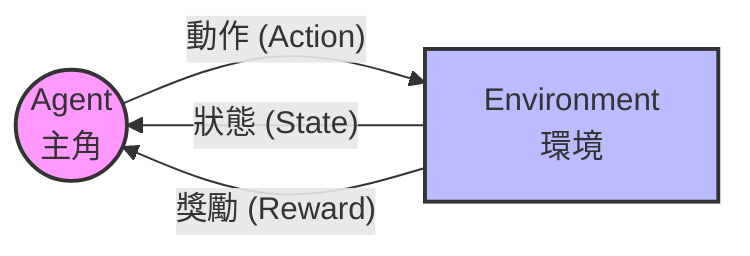
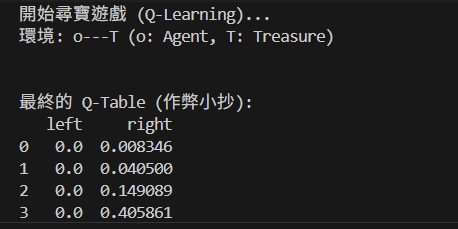

# Day 36: 像玩遊戲一樣學習 - Reinforcement Learning (強化學習)

## 1. 前言：這不是考試，是生存遊戲
前 35 天我們學的 (Supervised/Unsupervised Learning) 像是「考試」：
*   **Supervised**：老師給你考古題和答案，你要死背下來。
*   **Unsupervised**：老師給你一堆資料，你要自己整理歸納。

今天我們要進入一個全新的領域：**Reinforcement Learning (RL，強化學習)**。
它像是**玩馬利歐 (Mario)** 或 **訓練狗狗**：
*   沒人告訴你每一步該怎麼走 (沒有標準答案)。
*   你只能自己嘗試 (Trial and Error)。
*   做得好有糖吃 (Reward +1)，做錯了會受傷 (Reward -1)。
*   目標是：**活下去，並拿到最高分**。

## 2. 核心組件 (The Big 5)
RL 的世界由 5 個核心元素組成：

1.  **Agent (代理人)**：主角 (例如：馬利歐、AlphaGo)。
2.  **Environment (環境)**：遊戲世界 (例如：關卡、棋盤)。
3.  **State (狀態 $S$)**：現在的情況 (例如：馬利歐在位置 (3, 5)，前面有烏龜)。
4.  **Action (動作 $A$)**：你能做什麼 (例如：往左、往右、跳)。
5.  **Reward (獎勵 $R$)**：環境給你的回饋 (例如：吃到金幣 +10，掉進洞裡 -100)。

### 2.1 互動迴圈 (The Loop)

## 3. 核心算法：Q-Learning (Q 表學習)
這是最經典、最簡單的 RL 演算法。
它的核心思想是建立一張 **作弊小抄 (Q-Table)**。

### 3.1 什麼是 Q-Table？
想像你在玩迷宮，你有一本筆記本 (Q-Table)：
*   **行 (Row)**：每個路口 (State)。
*   **列 (Column)**：每個動作 (上下左右)。
*   **值 (Q-Value)**：在這個路口做這個動作，**預期**能拿到多少分。

| 狀態 (State) | 往左 (Left) | 往右 (Right) |
| :--- | :--- | :--- |
| **起點** | -10 (撞牆) | +1 (有路) |
| **中間** | 0 (回頭) | +100 (寶藏!) |

### 3.2 怎麼訓練？(Q-Learning 公式)
$$
Q(S, A) \leftarrow Q(S, A) + \alpha [ R + \gamma \max Q(S', A') - Q(S, A) ]
$$

> **💡 公式白話文**：
> *   **現實與理想的差距**：
>     *   **現實**：我剛剛拿到的獎勵 ($R$) + 下一步最好的預期分數 ( $\max Q(S', A')$ )。
>     *   **舊印象**：我原本以為這個動作值多少分 ( $Q(S, A)$ )。
> *   **更新**：用「現實」來修正「舊印象」。
> *   **$\alpha$ (學習率)**：我多相信新的經驗？(通常 0.1)。
> *   **$\gamma$ (遠見因子)**：我多在乎未來的獎勵？(0.9 代表很有遠見，0 代表只看眼前)。

## 4. 實戰：尋寶遊戲 (Treasure Hunt)
我們不依賴複雜的 `gym` 庫，直接手寫一個簡單的 **1D 世界**：
`o---T`
*   `o`：探險家 (Agent)。
*   `T`：寶藏 (Treasure)。
*   `-`：平地。
*   **目標**：用最少的步數走到 `T`。

### 4.1 程式碼架構 (`RL_Q_Learning.py`)
1.  **Environment**：定義這個 1D 世界，告訴 Agent 移動後會發生什麼事。
2.  **RL Agent**：
    *   **Choose Action**：決定要走哪一步 (有時候隨機探索，有時候看小抄)。
    *   **Learn**：更新 Q-Table。
3.  **Training Loop**：讓 Agent 玩 15 回合，看它變聰明的過程。

## 5. 執行結果預期
*   **Episode 1**：Agent 像無頭蒼蠅，亂走很久才摸到寶藏。
*   **Episode 5**：Agent 開始記得「往右走有好處」。
*   **Episode 10**：Agent 變成老司機，直接衝向寶藏 (步數最少)。

### 5.1 Q-Table 解讀 (那些數字是什麼？)
程式最後會印出一張表，這就是 Agent 的「腦袋」：

*   **行 (0, 1, 2...)**：代表 Agent 所在的**位置 (State)**。
    *   `0` 是起點，`4` 是寶藏前一格。
*   **列 (left, right)**：代表可以做的**動作 (Action)**。
*   **數字 (Q-Value)**：代表**分數 (Score)**。
    *   **怎麼看？** 在位置 `0`，往右走的分數 (0.008) > 往左走 (0.0)。
    *   **結論**：Agent 學會了「在起點要往右走」。
    *   **越靠近寶藏分數越高**：你會發現位置 `3` 的分數比位置 `0` 高，因為離寶藏越近，拿到獎勵的機會越大。

> **Q: 走到 T 就結束了嗎？**
> **對**。
> *   `T` 是終點 (Terminal State)。
> *   一旦 Agent 踩到 `T`，它會得到 **+1 分 (Reward)**，然後這回合 (Episode) 就結束，Agent 會被傳送回起點 `0` 開始下一回合。

## 6. 下一關預告
RL 不只能玩簡單遊戲，還能玩股票、開飛機。
Day 37 我們將介紹 **Deep Q-Network (DQN)**。
當狀態太多 (例如圍棋有 $10^{170}$ 種狀態)，Q-Table 寫不下怎麼辦？
我們用 **神經網路** 來取代 Q-Table！
