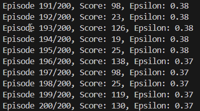
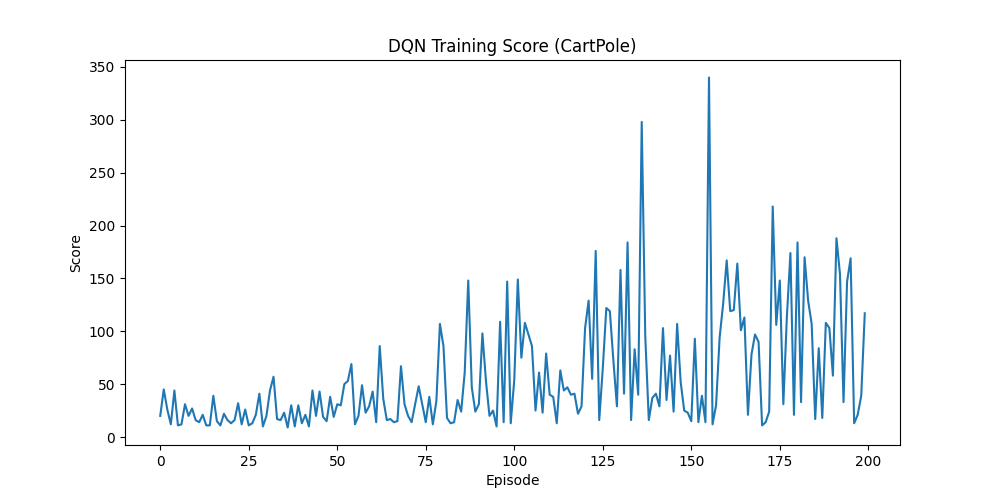

# Day 37: 深度強化學習 - Deep Q-Network (DQN)

## 1. 前言：當 Q 表寫不下的時候
昨天我們學了 **Q-Learning**，用一張表 (Q-Table) 來記錄每個狀態的分數。
這在簡單的迷宮 (6 個狀態) 很有效。但如果是 **圍棋** 呢？
*   圍棋的狀態數：$10^{170}$ (比宇宙原子總數還多)。
*   **問題**：你的記憶體根本存不下這張表！

### 1.1 RL 的發展演進 (Timeline)
RL 的歷史非常悠久，從早期的動物實驗到現在的 AI 霸主：

| 年份 | 模型 | 重要性 |
| :--- | :--- | :--- |
| **1989** | **Q-Learning** | **RL 始祖**。Watkins 提出，用表格 (Table) 來記錄經驗。 |
| **2013** | **DQN** | **深度學習革命**。DeepMind 將 Q-Learning 結合神經網路，成功玩 Atari 遊戲 (超越人類)。 |
| **2016** | **AlphaGo** | **震驚世界**。結合了 RL + MCTS (蒙地卡羅樹搜尋)，擊敗圍棋世界冠軍李世石。 |
| **2017** | **PPO** | **現代標準**。OpenAI 提出，訓練更穩定，現在 ChatGPT 的 RLHF 就是用它。 |

為了解決這個問題，DeepMind 在 2013 年提出了 **DQN (Deep Q-Network)**。
*   **核心想法**：既然存不下表，那我們用一個 **神經網路 (Neural Network)** 來「背」這張表！
*   **輸入**：狀態 (畫面或數值)。
*   **輸出**：每個動作的 Q 值。

## 2. DQN 的三大法寶
要讓神經網路學會玩遊戲並不容易，DQN 用了三個關鍵技術來穩定訓練：

### 2.1 Q-Network (用 AI 取代查表)
*   **以前**：查表 `Q_Table[state][action]`。
*   **現在**：問 AI `model(state)` -> 輸出所有動作的分數 `[Q_left, Q_right]`。

### 2.2 Experience Replay (經驗回放)
*   **問題**：玩遊戲的資料是連續的 (這一秒的畫面跟下一秒很像)。神經網路討厭這種高度相關的資料 (會學壞)。
*   **解法**：把玩過的經驗 $(S, A, R, S')$ 全部丟進一個 **「回憶庫」 (Replay Buffer)**。
*   **訓練時**：從庫裡 **隨機抽樣 (Random Batch)** 出來學習。這樣可以打亂時間順序，讓 AI 學得更全面。

### 2.3 Target Network (固定目標)
*   **問題**：我們用 Q 網路來預測 Q 值，又用同一個 Q 網路來計算目標 (Target)。這就像「左腳踩右腳」想飛起來，很不穩定。
*   **解法**：準備兩個網路。
    *   **Policy Net (學生)**：負責玩遊戲，隨時更新參數。
    *   **Target Net (老師)**：負責算分數，參數固定一段時間 (例如每 100 步) 才從學生那裡複製過來。

### 2.4 架構圖與公式
**DQN 架構圖**：
```mermaid
graph LR
    State[State (畫面)] --> NN[Neural Network <br> (Q-Network)]
    NN --> Q_Values[Q-Values <br> (每個動作的分數)]
    Q_Values --> Action[Action <br> (選分數最高的)]
    
    style NN fill:#f9f,stroke:#333,stroke-width:2px
```

**DQN 核心公式 (Loss Function)**：
我們希望神經網路預測的 Q 值，越接近真實目標越好。
$$
Loss = ( \underbrace{R + \gamma \max Q_{target}(S', A')}_{\text{Target (老師算的目標)}} - \underbrace{Q_{policy}(S, A)}_{\text{Prediction (學生猜的分數)}} )^2
$$
*   這其實就是 **MSE Loss** (均方誤差)。

## 3. 實戰：倒立擺 (CartPole)
我們要挑戰 OpenAI Gym 的經典遊戲：**CartPole-v1**。
*   **目標**：控制小車左右移動，讓桿子保持直立不倒。
*   **狀態 (4 維)**：小車位置、小車速度、桿子角度、桿子角速度。
*   **動作 (2 種)**：往左推、往右推。
*   **獎勵**：桿子每堅持一秒不倒，得 +1 分。

### 3.1 程式碼架構 (`DQN_CartPole.py`)
1.  **QNetwork**：一個簡單的 MLP (4 -> 128 -> 2)。
2.  **ReplayBuffer**：用 `deque` 儲存經驗。
3.  **Agent**：
    *   `act()`: 決定動作 (Epsilon-Greedy)。
    *   `learn()`: 從 Buffer 抽樣並訓練網路。
4.  **Main Loop**：讓 Agent 玩遊戲，並記錄每一回合撐了多久。

## 4. 執行結果預期
*   **一開始**：桿子馬上就倒了 (Score ~10)。
*   **訓練幾百回合後**：Agent 學會了微調平衡。
*   **最終**：桿子可以屹立不搖 (Score > 200)。

### 4.1 訓練日誌解讀 (Log Explanation)


你在終端機看到的 `Episode 195/200, Score: 103, Epsilon: 0.38` 是什麼意思？

*   **Episode 195/200**：現在是第 195 回合 (總共 200 回合)。
*   **Score: 103**：這回合桿子堅持了 **103 秒** 才倒 (分數越高越好)。
*   **Epsilon: 0.38**：目前的**探索率 (Exploration Rate)** 是 38%。
    *   **意思**：Agent 有 38% 的機率會「亂試」(探索新招式)，有 62% 的機率會「用學到的招式」(認真玩)。
    *   **趨勢**：Epsilon 會隨著訓練越來越低 (從 1.0 降到 0.01)，代表 Agent 越來越自信，不再亂走。

### 4.2 結果圖解說 
執行程式後，你會得到這張分數變化圖 (`dqn_score.png`)：



*   **X 軸 (Episode)**：訓練的回合數 (玩了幾次遊戲)。
*   **Y 軸 (Score)**：堅持的時間 (秒)。
*   **趨勢解讀**：
    *   **0~50 回合**：分數很低 (10~20 分)，Agent 還在隨機亂試 (Epsilon 很高)。
    *   **50~150 回合**：分數開始劇烈震盪。這是 DQN 的特性，它正在嘗試不同的策略，有時候會突然開竅 (飆高)，有時候又會忘記 (跌低)。
    *   **150+ 回合**：分數逐漸穩定在高點 (>100)，代表 Agent 已經掌握了平衡的技巧。
    *   *(註：如果你的圖還沒收斂，可以試著把 `NUM_EPISODES` 調大到 300 或 500)*。

## 5. 下一關預告
DQN 是 Value-Based 的方法 (算分數)。
Day 38 我們將介紹 **Policy Gradient (策略梯度)**。
它不看分數，而是直接學習「動作的機率」。
這是現代 LLM (如 ChatGPT) 的 RLHF 基礎喔！
