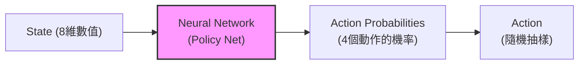
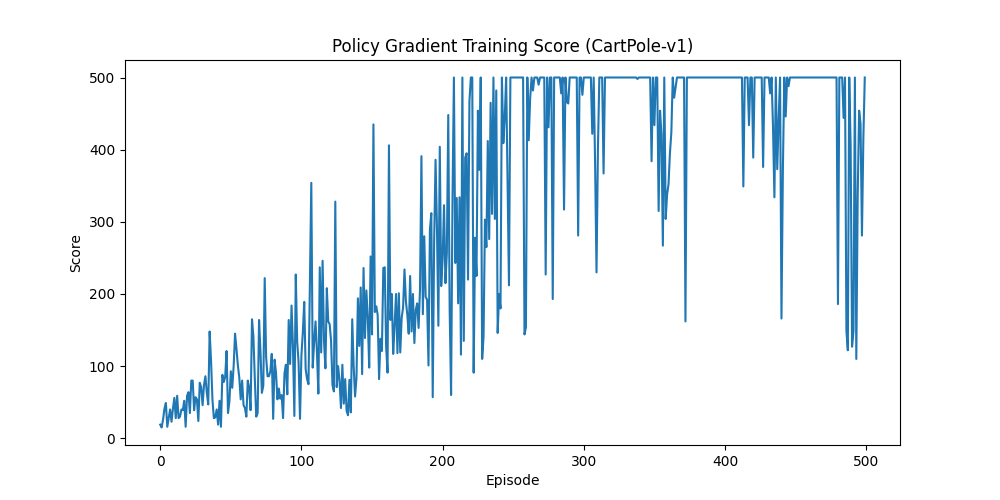

# Day 38: 不算分數，直接學動作 - Policy Gradient (策略梯度)

## 1. 前言：DQN 的缺點
前兩天我們學的 Q-Learning 和 DQN 都是 **Value-Based (基於價值)** 的方法：
*   **核心**：算出每個動作的「分數」(Q-Value)。
*   **決策**：選分數最高的那個動作。

但這有幾個問題：
1.  **無法處理連續動作**：如果動作不是「左、右」，而是「方向盤轉 30.5 度」，DQN 就掛了 (因為你不能窮舉所有角度來算分數)。
2.  **無法學到隨機策略**：有些遊戲 (如剪刀石頭布) 最好的策略是「隨機出」，但 DQN 永遠只會選分數最高的那個 (太死板)。

今天我們要介紹 **Policy Gradient (策略梯度)**，它是 **Policy-Based (基於策略)** 的方法。
*   **核心**：不需算分數，直接學一個神經網路 `Policy(State)` -> `Action Probability`。
*   **直覺**：看到這個畫面，有 70% 機率往左，30% 機率往右。

## 2. 核心概念：REINFORCE 演算法
這是最基礎的 Policy Gradient 演算法。

### 2.1 運作流程
1.  **玩一整場 (Rollout)**：Agent 根據目前的策略玩完一整局遊戲，記錄下所有的 `(State, Action, Reward)`。
2.  **算總帳 (Return)**：計算這場遊戲總共拿了多少分 ($G$)。
3.  **獎懲分明 (Update)**：
    *   如果 $G$ 很高 (贏了)：增加這場遊戲中「所有做過的動作」的機率。
    *   如果 $G$ 很低 (輸了)：減少這些動作的機率。

### 2.2 核心公式
$$
\nabla J(\theta) \approx \sum_{t} \nabla \log \pi_\theta(a_t | s_t) \cdot G_t
$$

> **💡 公式白話文**：
> *   $\pi_\theta(a_t | s_t)$：在狀態 $s_t$ 做動作 $a_t$ 的機率。
> *   $G_t$：做完這個動作後，未來總共拿到的分數 (回報)。
> *   **意義**：如果回報 $G_t$ 是正的，我們就**推一把** (Gradient Ascent)，讓這個動作的機率變大；如果是負的，就拉回來。

## 3. 實戰：登陸月球 (LunarLander)
我們要挑戰比 CartPole 更難的遊戲：**LunarLander-v2**。

*(圖片來源：Gymnasium 官網)*

*   **目標**：控制登月小艇，安全降落在兩個旗幟中間。
*   **狀態 (8 維)**：
    1.  **X 座標** (水平位置)
    2.  **Y 座標** (垂直高度)
    3.  **X 速度** (水平飛多快)
    4.  **Y 速度** (下降多快)
    5.  **角度** (小艇歪了嗎)
    6.  **角速度** (轉動多快)
    7.  **左腳觸地** (是/否)
    8.  **右腳觸地** (是/否)
*   **動作 (4 種)**：
    0.  **什麼都不做** (Do nothing)
    1.  **主引擎噴射** (Fire main engine) - 往上推
    2.  **左引擎噴射** (Fire left engine) - 往右推
    3.  **右引擎噴射** (Fire right engine) - 往左推
*   **獎勵**：安全著陸 +100，墜毀 -100，噴射引擎會扣一點分 (節省燃料)。

> **Q: 這跟 LLM (ChatGPT) 有什麼關係？**
> 關係非常大！現代 LLM 的訓練最後一步叫 **RLHF (Reinforcement Learning from Human Feedback)**。
> *   **ChatGPT 也是一個 Policy Network**：
>     *   **輸入 (State)**：你問的問題 (Prompt)。
>     *   **輸出 (Action)**：它回答的下一個字 (Token Probability)。
> *   **訓練目標**：讓人類覺得好 (Reward 高)。
> *   **Policy Gradient** 就是用來調整 LLM 講話機率的核心演算法 (PPO 是它的進階版)。

### 3.1 架構圖與公式
**Policy Network 架構圖**：

> **💡 實戰舉例：小艇怎麼學會降落？**
> 1.  **看到畫面 (State)**：小艇現在歪了 (角度 30 度)，而且下降速度很快。
> 2.  **神經網路 (Policy Net)**：算出每個動作的建議機率：
>     *   什麼都不做：10%
>     *   主引擎噴射 (往上)：**60%** (因為下降太快)
>     *   左引擎噴射 (往右)：5%
>     *   右引擎噴射 (往左)：**25%** (因為要修正角度)
> 3.  **隨機抽樣 (Action)**：雖然「主引擎」機率最高，但 AI 還是有可能選到「右引擎」(25%)。這就是**探索**。
> 4.  **結果 (Reward)**：
>     *   如果選了「主引擎」，小艇穩住了 -> **好棒！下次看到這個畫面，把「主引擎」的機率調高！**
>     *   如果選了「什麼都不做」，小艇摔爛了 -> **糟糕！下次把「什麼都不做」的機率調低！**

### 3.1 程式碼架構 (`PG_LunarLander.py`)
1.  **PolicyNetwork**：輸入狀態 (8)，輸出動作機率 (4)。(注意最後用 `Softmax`)。
2.  **Agent**：
    *   `select_action()`: 根據機率隨機抽樣動作 (不再是選最大的)。
    *   `update()`: 玩完一局後，根據回報 $G$ 來更新網路。
3.  **Main Loop**：玩很多局，看分數是否變高。

## 4. 執行結果預期
*   **一開始**：小艇會亂噴氣，然後墜毀 (Score ~ -200)。
*   **訓練後**：小艇學會了「平穩下降」，並瞄準旗幟中間。
*   **最終**：安全著陸 (Score > 200)。

### 4.1 結果圖解說 (38-1)
執行程式後，你會得到這張分數變化圖 (`pg_score.png`)：

*   **X 軸 (Episode)**：訓練的回合數。
*   **Y 軸 (Score)**：每回合的總得分。
*   **趨勢解讀**：
    *   **前期 (震盪)**：分數忽高忽低，因為 Policy Gradient 是「隨機抽樣」動作，運氣好就高分，運氣差就墜毀。
    *   **後期 (上升)**：隨著訓練，Agent 發現「平穩下降」的機率能帶來高分，於是它越來越傾向做正確的動作，分數逐漸穩定上升。
    *   *(註：如果你看到分數突然飆到 500，那是因為我們在程式碼中用了 CartPole 作為備案，CartPole 滿分就是 500)*。

## 5. 下一關預告
Policy Gradient 雖然強大，但訓練很慢 (因為要玩完一整場才能更新一次)。
Day 39 我們將介紹 **Actor-Critic (演員-評論家)**。
結合 DQN (Value-Based) 和 Policy Gradient (Policy-Based) 的優點，讓訓練更有效率！
