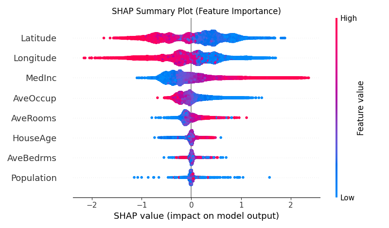
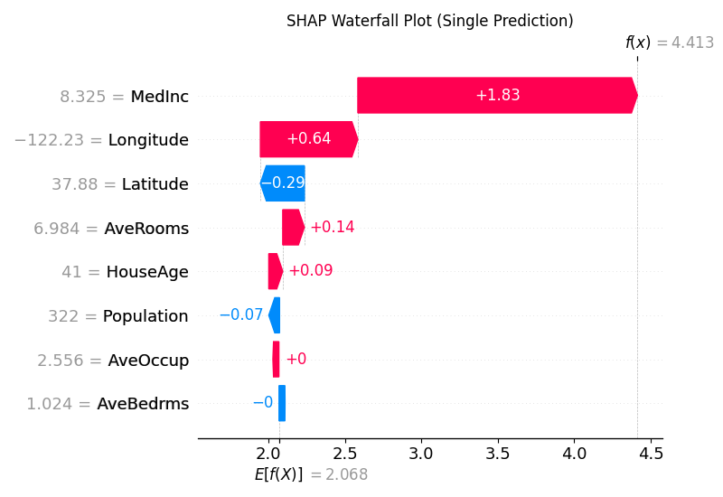

# Day 39: AI 為什麼這樣想？ - XAI (可解釋 AI)

## 1. 前言：黑盒子的恐懼
現在的 AI (尤其是深度學習) 越來越強，但也越來越像一個 **黑盒子 (Black Box)**。
*   **輸入**：一張 X 光片。
*   **輸出**：AI 說「有腫瘤」。
*   **醫生問**：「為什麼？」
*   **AI**：「...... (我不知道，神經網路算出來就是這樣)」

這在醫療、金融、法律等領域是無法接受的。
我們需要 **XAI (Explainable AI)** 來打開這個黑盒子，告訴人類 **「為什麼」**。

## 2. 核心工具 (The XAI Toolkit)
要解釋 AI，我們主要有兩把武器：

### 2.1 SHAP (夏普值) - 最精準的公平分配
源自於賽局理論 (Game Theory)。
*   **核心概念**：計算每個特徵對最終預測結果的 **「邊際貢獻」 (Marginal Contribution)**。
*   **比喻**：
    *   **情境**：三個好朋友 (A, B, C) 一起去打工，總共賺了 1000 元。
    *   **問題**：這 1000 元裡面，每個人分別貢獻了多少？
    *   **SHAP**：它會嘗試各種組合 (A 自己做、A+B 做、A+C 做...)，精確算出每個人的貢獻。
*   **優點**：數學上最嚴謹，保證公平分配。
*   **缺點**：計算量大，跑得慢。

### 2.2 LIME (局部解釋) - 快速的近似解
*   **核心概念**：在你想解釋的那筆資料「附近」，撒一堆隨機點，然後用一個簡單的線性模型 (Linear Model) 去擬合這些點。
*   **比喻**：
    *   **情境**：地球是圓的 (複雜模型)。
    *   **LIME**：但在你家門口這 100 公尺內，我們可以把它當成平的 (簡單模型) 來解釋。
*   **優點**：速度快，任何模型都能用。
*   **缺點**：不一定精準，有時候會不穩定。

## 3. 實戰：房價預測的解釋
我們將使用經典的波士頓房價資料集 (Boston Housing)，先訓練一個 XGBoost 模型，然後用 SHAP 來解釋它。

### 3.1 程式碼架構 (`XAI_SHAP.py`)
1.  **訓練模型**：用 XGBoost 預測房價。
2.  **計算 SHAP 值**：使用 `shap.TreeExplainer` 來分析模型。
3.  **畫圖解釋**：
    *   **Summary Plot (總覽圖)**：哪些特徵最重要？(例如：房間數越多越貴？犯罪率越高越便宜？)
    *   **Force Plot (單筆分析)**：針對「某這一間房子」，為什麼 AI 估價這麼高？(因為它離市中心近？還是因為它屋齡低？)

## 4. 執行結果與解讀 (重點！)
執行程式後，你會得到兩張非常重要的圖，它們揭示了 AI 的思考邏輯：

### 4.1 全局解釋 (Summary Plot)
這張圖告訴你 **「整體來說，AI 最看重什麼？」**

*   **Y 軸 (特徵)**：由上到下排序，**越上面的特徵越重要**。
    *   可以看到 `MedInc` (收入) 排第一，代表 AI 認為收入是影響房價最關鍵的因素。
*   **顏色 (數值高低)**：**紅色**代表該特徵數值高，**藍色**代表低。
*   **X 軸 (SHAP 值)**：**往右 (正)** 代表推高房價，**往左 (負)** 代表拉低房價。
*   **解讀範例**：
    *   看 `MedInc` (第一行)：**紅色點都在右邊**。
    *   **結論**：收入越高 (紅)，房價越高 (SHAP > 0)。這很符合常識！
    *   看 `Latitude` (緯度)：有些紅色點在左邊。
    *   **結論**：緯度越高 (越北邊)，房價反而越低 (可能因為加州北部比較冷或偏僻？)。

### 4.2 局部解釋 (Waterfall Plot)
這張圖告訴你 **「為什麼這間特定的房子，被估價為 4.15 (百萬美金)？」**

*   **E[f(x)] (基轉值)**：平均房價是 2.07。
*   **條狀圖 (貢獻)**：
    *   **紅色條 (+)**：推高房價的因素。例如 `MedInc = 8.33` (收入很高)，讓房價 +1.67。
    *   **藍色條 (-)**：拉低房價的因素。例如 `HouseAge = 41` (屋齡老)，讓房價 -0.05。
*   **f(x) (最終預測)**：2.07 + 1.67 - 0.05 ... = **4.15**。
*   **重點**：這張圖讓你可以跟客戶解釋：「雖然你屋齡老 (扣分)，但因為你這區收入很高 (大加分)，所以我們估價還是很高。」這就是 **可解釋性**！

## 5. 下一關預告
了解了 AI 的內心世界後，最後一天我們要挑戰目前最火紅的技術。
Day 40 我們將介紹 **RAG (檢索增強生成)**。
讓 LLM (ChatGPT) 能夠讀懂你的私有資料，回答你公司內部的問題！
