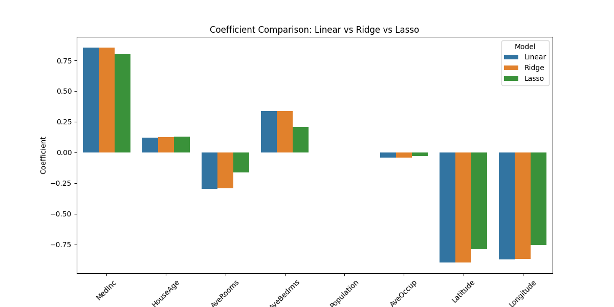
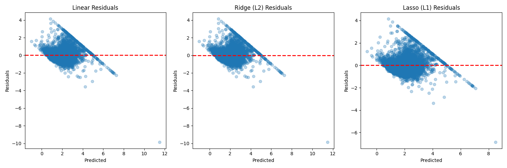

# Day 04: 正則化 (Regularization) - Bias vs Variance

## 0. 歷史小故事/核心貢獻者:
正則化的概念並非由單一人發明，而是源於統計學家與數學家在解決「不適定問題 (Ill-posed problems)」時的智慧結晶。**吉洪諾夫 (Andrey Tikhonov)** 在 1943 年提出的 **Tikhonov Regularization** (即今日的 Ridge Regression) 是為了讓不穩定的解變得穩定。後來，地球物理學家 **Robert Tibshirani** 於 1996 年提出了 **Lasso (Least Absolute Shrinkage and Selection Operator)**，巧妙地結合了模型擬合與特徵選擇，成為現代機器學習不可或缺的工具。

## 1. 資料集來源
### 資料集來源：[California Housing](https://scikit-learn.org/stable/modules/generated/sklearn.datasets.fetch_california_housing.html)
> 備註：這是 Scikit-Learn 內建的經典回歸資料集，源自 1990 年美國人口普查。

### 資料集特色與欄位介紹:
這個資料集比 Salary 或 Startup 更大、更複雜，非常適合用來測試模型的過擬合現象。
1.  **資料量大**：約 20,640 筆數據。
2.  **特徵多樣**：包含收入、房齡、房間數、緯度、經度等 8 個特徵。
3.  **目標**：預測加州各街區的房價中位數 (MedHouseVal)。

**欄位說明**：
*   **MedInc**: 該街區住戶收入中位數。
*   **HouseAge**: 該街區房屋年齡中位數。
*   **AveRooms**: 平均房間數。
*   **AveBedrms**: 平均臥室數。
*   **Population**: 街區人口數。
*   **AveOccup**: 平均入住人數。
*   **Latitude/Longitude**: 街區緯度與經度。
*   **Target (MedHouseVal)**: 房價中位數 (單位：10萬美金)。

### 資料清理
1.  **標準化 (Standardization)**：**這是正則化的關鍵！** 因為 L1/L2 是懲罰係數的大小，如果特徵單位不同 (如收入是幾萬，房間數是幾)，係數大小會天差地遠，導致懲罰不公平。所以必須使用 `StandardScaler`。

## 2. 原理
### 核心公式與參數
當模型太複雜 (Variance 高) 時，容易過擬合。正則化透過在損失函數 (Loss Function) 中加入「懲罰項 (Penalty)」，強迫模型係數變小，讓模型變簡單。

*   **Linear Regression**: $Loss = MSE$
*   **Ridge (L2)**: $Loss = MSE + \alpha \sum \beta_i^2$
    *   特色：係數會變小，但不會變成 0。適合處理共線性。
*   **Lasso (L1)**: $Loss = MSE + \alpha \sum |\beta_i|$
    *   特色：係數可以變成 0 (稀疏性)。適合做**特徵選擇**。

**關鍵參數 $\alpha$ (Alpha)**：
*   $\alpha = 0$：就是一般的 Linear Regression。
*   $\alpha$ 越大：懲罰越重，模型越簡單 (Bias 變大，Variance 變小)。

## 3. 實戰
### Python 程式碼實作
完整程式連結：[Regularization_Housing.py](Regularization_Housing.py)

```python
# 關鍵程式碼：建立三種模型
models = {
    'Linear': LinearRegression(),
    'Ridge (L2)': Ridge(alpha=1.0),
    'Lasso (L1)': Lasso(alpha=0.01)
}
```

## 4. 模型評估
### 若為回歸模型 (Regression)
*   **指標數字**：
    *   **R-Squared (R2)**: 
        *   Linear: `0.5758`
        *   Ridge: `0.5758` (幾乎沒變，代表此資料集共線性問題不嚴重)
        *   **Lasso**: `0.5816` (表現最好！稍微提升了預測力)
    *   **MSE**: 
        *   Linear: `0.5559`
        *   Lasso: `0.5483` (誤差最小)
    *   **Intercept/Coefficient**: 
        *   **Lasso 特性觀察**: 請看 `Population` 的係數，在 Linear 中是 `-0.0023`，但在 Lasso 中變成了 **`-0.0000`**！這代表 Lasso 認為「人口數」對房價沒有幫助，直接把它剔除了。這就是 Lasso 的**特徵選擇**能力。
        *   **係數解讀小撇步**：係數的**絕對值**越大，代表該特徵越重要！
            *   **正數大** (如 `MedInc` +0.85)：正向影響強 (收入越高，房價越高)。
            *   **負數大** (如 `Latitude` -0.89)：負向影響強 (緯度越高/越北邊，房價越低)。
            *   **接近 0** (如 `Population`)：幾乎沒影響，是冗餘特徵。
*   **圖表**：
    *   **係數比較圖**：直觀比較 Linear, Ridge, Lasso 對特徵權重的影響。
    
    
    *   **殘差圖比較**：比較三種模型的誤差分佈。
    

### 💡 思考：為什麼 Linear 與 Regularization 結果差異不大？
你可能會發現 R2 分數只從 0.5758 提升到 0.5816，感覺沒什麼差？
1.  **資料量足夠**：這個資料集有 2 萬筆數據，特徵只有 8 個，Linear Regression 本身就不太容易過擬合，所以正則化的「抑制」效果不明顯。
2.  **Lasso 的真正價值**：雖然分數只進步一點點，但請注意它把 `Population` 係數變成了 **0**。這代表它幫我們**節省了一個特徵**的蒐集成本，模型變得更簡單、更輕量。在真實商業場景中，**「效果一樣但更簡單的模型」永遠是更好的選擇** (奧卡姆剃刀原則)。

## 5. 戰略總結:模型訓練的火箭發射之旅

### (回歸與監督式學習適用day2-12)
引用大師-吳恩達教授的 Rocket 進行說明 Bias vs Variance：


#### 5.1 流程一：推力不足，無法升空 (Underfitting 迴圈)
*   **設定**：$\alpha$ 設得太大 (如 Lasso alpha=100)。
*   **結果**：所有係數都變成 0，模型變成一條水平線，什麼都預測不到。

#### 5.2 流程二：動力太強，失控亂飛 (Overfitting 迴圈)
*   **設定**：使用高階多項式特徵且不加正則化。
*   **結果**：訓練集 R2 很高，但測試集很差。這時就是 **Ridge/Lasso** 登場的最佳時機！

#### 5.3 流程三：完美入軌 (The Sweet Spot)
*   **設定**：調整出最佳的 $\alpha$ 值。
*   **結果**：既保留了重要特徵 (如收入)，又抑制了雜訊 (如人口數的過度解讀)，達到 Bias 與 Variance 的平衡。

## 6. 總結
Day 04 我們學習了對抗過擬合的神器 —— **正則化**。
*   **Ridge (L2)**：讓係數變小，模型更穩健。
*   **Lasso (L1)**：讓係數變 0，自動挑選特徵。
*   **標準化**：是使用正則化的前提。
下一章 (Day 05)，我們將回頭打好地基，深入探討 **數據預處理 (Data Preprocessing)** 的完整流程！
