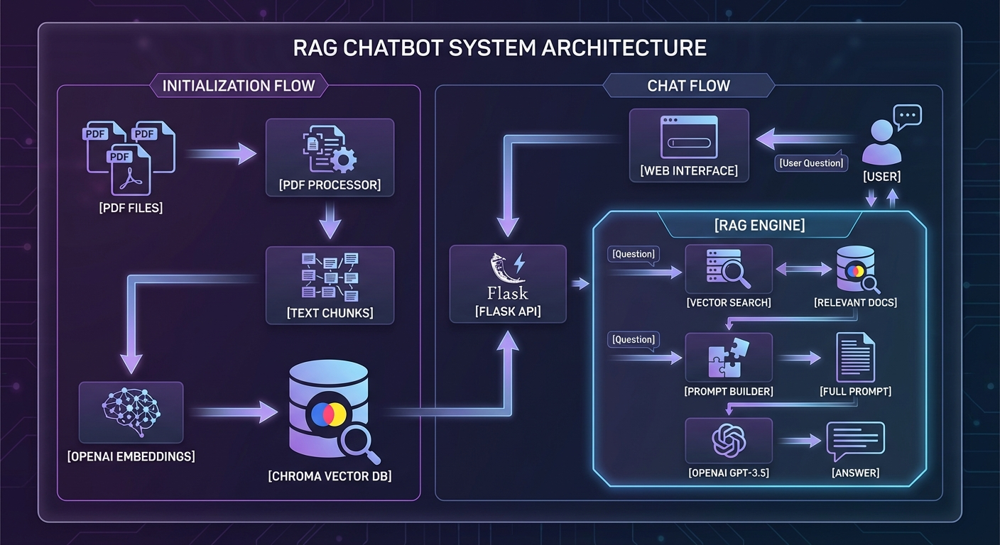

# Day 40: 讓 AI 讀懂你的資料 - RAG (檢索增強生成)

我們從最基礎的線性回歸，一路學到了深度學習、Transformer、強化學習，最後是 XAI。
今天，我們要挑戰目前業界最熱門的技術：**RAG (Retrieval-Augmented Generation)**。

### 為什麼需要 RAG？
LLM (如 ChatGPT) 很強，但有兩個致命傷：
1.  **幻覺 (Hallucination)**：不懂裝懂，亂講一通。
2.  **知識斷層 (Knowledge Cutoff)**：它不知道「你公司昨天的會議記錄」或「最新的即時新聞」。

**RAG 的解法**：
在叫 AI 回答之前，先去你的 **「私有資料庫」** 翻書，把相關的資料找出來，塞給 AI 參考。
> **比喻**：
> *   **Fine-tuning (微調)**：送 AI 去補習班，把知識「背」進腦袋裡。(貴、慢、難更新)
> *   **RAG (檢索增強)**：給 AI 一本「教科書」，讓它考試時可以 **Open Book (開卷)**。(便宜、快、隨時可換書)

## 2. RAG 運作流程 (The Pipeline)
1.  **建立知識庫 (Indexing)**：
    *   **切塊 (Chunking)**：把長文章切成小段落。
    *   **向量化 (Embedding)**：把文字變成向量 (Numbers)，存入向量資料庫。
2.  **檢索 (Retrieval)**：
    *   使用者問：「公司的請假規定？」
    *   系統把問題也變成向量，去資料庫找 **「長得最像」** (距離最近) 的段落。
3.  **生成 (Generation)**：
    *   把「找到的規定」+「使用者的問題」組合成 Prompt。
    *   丟給 LLM 生成最終答案。

### 2.1 RAG 架構圖
這張圖展示了 RAG 如何讓 AI 變得「有腦袋」：

```mermaid
graph TD
    User["User Question <br> (Harry 的貓叫什麼?)"] --> Embed_Q["Embedding Model <br> (轉成向量)"]
    
    subgraph Knowledge Base (私有資料庫)
        Doc1["Doc: Harry 的貓叫 Oreo"] --> Embed_D["Embedding Model"]
        Embed_D --> VectorDB[("Vector Database <br> 向量資料庫")]
    end
    
    Embed_Q --> Search{"Vector Search <br> (找最像的)"}
    VectorDB --> Search
    
    Search --> Context["Retrieved Context <br> (找到: 貓叫 Oreo)"]
    
    Context --> Prompt["Prompt <br> (Context + Question)"]
    User --> Prompt
    
    Prompt --> LLM["LLM <br> (ChatGPT/GPT-2)"]
    LLM --> Answer["Answer <br> (Harry 的貓叫 Oreo)"]
    
    style VectorDB fill:#f9f,stroke:#333,stroke-width:2px
    style LLM fill:#bbf,stroke:#333,stroke-width:2px
```

> **圖解說明**：
> 1.  **右邊 (Knowledge Base)**：我們先把私有資料 (貓的名字) 轉成向量存起來。
> 2.  **左邊 (User)**：使用者問問題，也轉成向量。
> 3.  **中間 (Search)**：用向量比對，找出最相關的資料 (Context)。
> 4.  **下方 (LLM)**：把「問題」和「找到的答案」一起餵給 LLM，讓它用人話講出來。

## 3. 實戰：打造一個 Mini RAG
我們不依賴複雜的框架 (如 LangChain)，直接用 Python 從頭刻一個 RAG，讓你徹底理解原理。

### 3.1 程式碼架構 (`RAG_Demo.py`)
1.  **資料準備**：我們準備一些關於 "30-Days-Of-ML" 的虛構私有資料。
2.  **Embedding 模型**：使用 `sentence-transformers` (輕量級 BERT) 來將文字轉向量。
3.  **向量搜尋**：使用 `numpy` 計算 **餘弦相似度 (Cosine Similarity)**，找出最相關的資料。
4.  **生成回答**：使用 `transformers` (GPT-2) 根據找到的資料回答問題。

## 4. 執行結果與解讀
執行程式後，你會看到類似以下的輸出：

### 4.1 檢索成功 (Retrieval Works!)
當我們問 **「Harry 的貓叫什麼名字？」** 時：
```text
【檢索到的相關資料】 :
1. Harry 的貓叫做 'Oreo'，牠喜歡睡在鍵盤上。 (相似度: 17.1354)
```
*   **分析**：系統成功從知識庫中找到了 **"Oreo"** 這條資訊，證明 Embedding 和向量搜尋是運作正常的。

### 4.2 生成結果 (Generation Limitations)
```text
Question: Harry 的貓叫什麼名字？
Answer: This was the name of the King's residence... (胡言亂語)
```
*   **分析**：你可能會發現 AI 回答得很奇怪 (或是講英文)。
*   **原因**：為了讓大家在個人電腦 (CPU) 也能跑，我們使用的是最迷你的 **GPT-2** 模型。它主要懂英文，且邏輯能力有限。
*   **解決方案**：在真實產品中，我們會把這一段換成 **OpenAI API (GPT-4)** 或 **Llama 3**，那樣回答就會非常完美：「根據資料，Harry 的貓叫 Oreo。」

## 5. 進階 RAG 架構 (Production RAG)
這是我們以前製作的完整 RAG 架構圖，展示了企業級應用是怎麼做的：



### 架構解讀
1.  **Document Loaders (左上)**：讀取各種格式的檔案 (PDF, Word, HTML)。
2.  **Text Splitters (左下)**：把長文章切成小塊 (Chunking)，這是 RAG 最重要的細節之一。
3.  **Vector Store (中間)**：使用專業的向量資料庫 (如 ChromaDB, Pinecone) 來存儲。
4.  **Retriever (右上)**：除了基本的相似度搜尋，還會加上關鍵字搜尋 (Hybrid Search) 或重排序 (Re-ranking) 來提升準確度。
5.  **LLM (右下)**：最後才交給強大的 LLM 生成答案。

## 6. 下一關預告
RAG 是目前企業導入 AI 最重要的技術。
Day 41 我們將進入 **中級考題解析**。
我們會拿真實的考試題目來練習，驗收這 40 天的學習成果！
