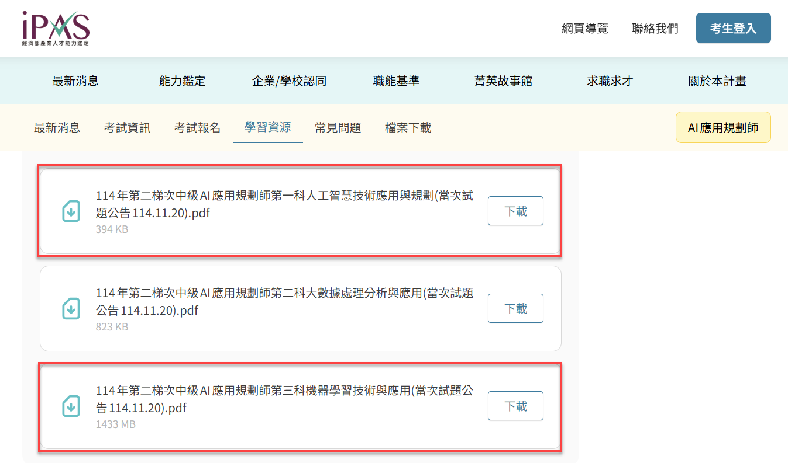

# Day 41: IPAS 中級能力鑑定考題解析 (114年第二次)

## 1. 考試資訊與來源
*   **考試名稱**：114 年第二次 AI 應用規劃師-中級能力鑑定
*   **考試日期**：114 年 11 月 08 日
*   **試題來源**：[IPAS 學習資源專區](https://www.ipas.org.tw/certification/AIAP/learning-resources)
    *   *註：試題中的圖片與完整排版請參考官方公告之 PDF 檔案。*

## 3. 試題彙整 (第一科：人工智慧技術應用與規劃)

| 題目 (關鍵字) | 答案 | 對應天數 (Day) |
| :--- | :--- | :--- |
| **1. 情感分析目的** | (B) 判斷文本中所表達的情感傾向 | Day 31 (NLP) (已補充) |
| **2. Transformer 優勢** | (A) 透過 **自注意力機制** 捕捉長距離依賴 | Day 31 (Transformer) (已補充) |
| **3. BERT MLM 策略** | (B) 隨機遮罩部分詞語並預測 | Day 31 (BERT) (已補充) |
| **4. GloVe vs Word2Vec** | (C) Word2Vec 基於預測，GloVe 基於共現 | Day 31 (NLP) (已補充) |
| **5. TF-IDF 長文本問題** | (A) 常見詞權重被過度放大 | Day 08 (Naive Bayes) |
| **6. N-gram 限制** | (B) 難以捕捉長距離依賴關係 | Day 31 (NLP) (已補充) |
| **7. mAP 高 IoU 意義** | (A) 預測框與真實框重疊度高，越精準 | Day 32 (YOLO) (已補充) |
| **8. Softmax vs Max-Pooling** | (C) Softmax 用於分類，Max-Pooling 用於降維 | Day 25 (CNN) (已補充) |
| **9. 資料增強效能下降** | (B) 增強後特徵分佈不一致 | Day 25 (CNN) (已補充) |
| **10. Precision & Recall 綜合** | (D) F1 分數 | Day 12 (Evaluation) (已補充) |
| **11. DBSCAN 超參數** | (C) 鄰域半徑 (Epsilon) 與最小點數 (MinPts) | Day 15 (DBSCAN) |
| **12. 多重共線性處理** | (B) 使用 PCA 轉換為獨立主成分 | Day 16 (PCA) |
| **13. Kubernetes 功能** | (B) 管理模型服務的部署與擴展 | Day 42 (MLOps) (已補充) |
| **14. 防止過擬合 (超參數)** | (A) 採用交叉驗證 (Cross-Validation) | Day 12 (Evaluation) (已補充) |
| **15. Model Registry 用途** | (C) 集中管理模型版本與部署狀態 | Day 42 (MLOps) (已補充) |
| **16. Seq2Seq 應用** | (D) 自動翻譯或摘要生成 | Day 27 (RNN) |
| **17. RAG 檢索挑戰** | (D) 避免結果僅具語意相似但無實質關聯 | Day 40 (RAG) |
| **18. Attention Collapse 改善** | (D) 施加 **稀疏化約束 (Sparsity Constraint)** | Day 31 (Transformer) (已補充) |
| **19. 低資源語言訓練** | (B) 採用反向翻譯 (Back-Translation) | Day 31 (NLP) (已補充) |
| **20. GAN Mode Collapse** | (B) 採用 Wasserstein 距離 (WGAN) | Day 33 (GAN) (已補充) |
| **21. 多模態缺失處理** | (B) 訓練具備模態缺失感知能力的模型 | Day 33 (GenAI) (已補充) |
| **22. 資料漂移偵測** | (D) 計算 KL 散度 (KL Divergence) | Day 42 (MLOps) (已補充) |
| **23. 漸進式部署** | (A) 從單一專科開始，逐步擴展 | Day 42 (MLOps) (已補充) |
| **24. 對抗性攻擊防禦 (非)** | (D) 強化防火牆 (這是資安層面) | Day 43 (Security) (已補充) |
| **25. 生成內容侵權預防** | (B) 建立訓練資料篩選與授權驗證 | Day 43 (Security) (已補充) |
| **26. 共線性模型選擇** | (D) 含 L1 正則化的 LASSO 迴歸 | Day 04 (Regularization) |
| **27. JSON 日誌特徵提取** | (C) 展開巢狀欄位並基於時間窗口聚合 | Day 42 (MLOps) (已補充) |
| **28. 混合特徵處理** | (C) 連續特徵標準化，類別特徵目標編碼 | Day 11 (Feature Eng) |
| **29. CI 核心實踐** | (B) 提交後自動觸發建置與測試 | Day 42 (MLOps) (已補充) |
| **30. 不可否認性** | (A) 記錄雜湊值並簽署數位簽章 | Day 43 (Security) (已補充) |
| **31. 高流量架構** | (B) 容器化部署並水平擴展 (Auto Scaling) | Day 42 (MLOps) (已補充) |
| **32. 效能衰退預警** | (D) 輸入特徵分佈的 PSI 指數 | Day 42 (MLOps) (已補充) |
| **33. 罕見詞訓練 (Word2Vec)** | (C) Skip-gram 模型 | Day 31 (NLP) (已補充) |
| **34. 個體識別** | (C) 實例分割 (Instance Segmentation) | Day 32 (CV) (已補充) |
| **35. CLIP 特性** | (A) 圖文對比學習，零樣本分類 | Day 33 (GenAI) (已補充) |
| **36. 系統化參數測試** | (B) 網格搜尋 (Grid Search) | Day 22 (Tuning) |
| **37. GPU 記憶體不足** | (B) 較小 Batch Size 搭配資料分片 | Day 24 (Training) |
| **38. Stable Diffusion 清晰度** | (B) 增加 **取樣步數** 並選擇高品質取樣器 | Day 35 (Diffusion) |
| **39. ARIMA 殘差自相關** | (C) 模型配適不足，需調整 p, q 參數 | Day 44 (Time Series) (已補充) |
| **40. 生成模型差異** | (A) VAE 模糊，GAN 不穩，Diffusion 穩定 | Day 33 (GenAI) (已補充) |
| **41. 交叉驗證資料洩漏** | (A) 測試摺參與參數選擇 | Day 12 (Evaluation) (已補充) |
| **42. 新樣本分佈偏移** | (D) 使用 VAE 監控潛在空間分佈 | Day 42 (MLOps) (已補充) |
| **43. 模型比較實驗** | (B) 低資源情境下比較 | Day 12 (Evaluation) (已補充) |
| **44. 預測與生成兼顧** | (C) VAE 或 GAN | Day 33 (GenAI) (已補充) |
| **45. PCA + SVM** | (D) 降維可降低訓練時間並減少過擬合 | Day 10 (SVM) |
| **46. MLOps 漂移偵測** | (A) 建立即時 Data/Concept Drift 監測 | Day 42 (MLOps) (已補充) |
| **47. 多任務學習衝突** | (C) 損失函數未平衡 | Day 24 (Deep Learning) |
| **48. DBSCAN 加速** | (B) 使用 KD-Tree 或 Ball Tree 索引 | Day 15 (DBSCAN) |
| **49. 跨文化情感分析 (非)** | (A) 詞嵌入正規化導致誤差 | Day 43 (Bias) (已補充) |
| **50. 多模態細節錯誤** | (C) CLIP 編碼器在語意空間未充分對齊 | Day 33 (GenAI) (已補充) |

---

## 4. 試題彙整 (第三科：機器學習技術與應用)

| 題目 (關鍵字) | 答案 | 對應天數 (Day) |
| :--- | :--- | :--- |
| **1. 模型穩定性檢驗** | (B) **交叉驗證 (Cross-Validation)** | Day 12 (Evaluation) (已補充) |
| **2. L1 正則化效果** | (C) 產生 **稀疏模型 (Sparse Model)** | Day 04 (Regularization) |
| **3. 非凸函數最佳化** | (C) 局部最優解 (Local Optima) | Day 02 (SGD) |
| **4. DBSCAN 孤立點** | (B) 雜訊點 (Noise Point) | Day 15 (DBSCAN) |
| **5. CNN 第一層功能** | (A) **提取局部特徵** (如邊緣、紋理) | Day 25 (CNN) (已補充) |
| **6. CNN vs FCNN** | (C) 區域感知與參數共享降低複雜度 | Day 25 (CNN) (已補充) |
| **7. LSTM 應用** | (A) 預測電力需求趨勢 (時間序列) | Day 28 (LSTM) |
| **8. 資訊增益應用** | (D) 決策樹模型 | Day 09 (Decision Tree) |
| **9. 距離模型前處理** | (A) 特徵縮放 (Feature Scaling) | Day 07 (KNN) |
| **10. AutoML 適用情境** | (C) 行銷部門需快速比較多種模型 | Day 22 (Tuning) |
| **11. Random Search 優勢** | (D) 更有效率搜尋高維參數空間 | Day 22 (Tuning) |
| **12. 改善收斂不穩** | (C) 調整學習率 (Learning Rate) | Day 24 (Training) |
| **13. 標籤偏差原因** | (B) 標記資料帶有主觀偏見 | Day 43 (Bias) (已補充) |
| **14. 可解釋性關鍵情境** | (C) 醫療診斷 (腫瘤判斷) | Day 39 (XAI) |
| **15. R-Squared 意義** | (B) 85% 的變異可被模型解釋 | Day 02 (Regression) |
| **16. F1 Score 計算** | (A) 2*(0.8*0.6)/(0.8+0.6) ≈ 0.686 | Day 12 (Evaluation) (已補充) |
| **17. 動量優化器** | (B) Adam (結合動量與 RMSProp) | Day 24 (Training) |
| **18. XGBoost 改進** | (A) 引入 **正則化項**、支援缺失值與並行 | Day 20 (XGBoost) |
| **19. 不平衡資料處理 (不適合)** | (C) 使用準確率 (Accuracy) 評估 | Day 11 (Imbalanced) |
| **20. 互動特徵工程** | (C) 特徵乘積或交互組合 | Day 11 (Feature Eng) |
| **21. 多頭注意力優點** | (C) 從不同子空間捕捉多樣化關聯 | Day 31 (Transformer) (已補充) |
| **22. 貝氏定理機制** | (B) 以條件機率計算分類機率 | Day 08 (Naive Bayes) |
| **23. 隨機抽樣模擬** | (A) 蒙地卡羅方法 (Monte Carlo) | Day 36 (RL) |
| **24. 殘差圖彎曲** | (C) 存在非線性關係，違反迴歸假設 | Day 02 (Regression) |
| **25. 信用評分卡 (非)** | (A) 使用生成式模型特徵學習 | Day 06 (Logistic) |
| **26. 防止過擬合 (非)** | (D) 擴增輸入特徵 (增加複雜度) | Day 04 (Regularization) |
| **27. 線性激活問題** | (D) 改用 ReLU 引入非線性 | Day 23 (MLP) |
| **28. 取樣偏差** | (C) 訓練樣本僅涵蓋高活躍顧客 | Day 43 (Bias) (已補充) |
| **29. 長期穩健性** | (D) 時間序列交叉驗證 (Rolling Window) | Day 27 (Time Series) |
| **30. 跨語言效能下降** | (C) 語言轉移造成 Recall 下降 | Day 26 (Transfer) |
| **31. 早停策略** | (B) 監控驗證集損失並設定 Patience | Day 24 (Training) |
| **32. 特徵篩選 (正則化)** | (D) L1 正則化 (Lasso) | Day 04 (Regularization) |
| **33. 全對全比對複雜度** | (B) O(n²) | Day 07 (KNN) |
| **34. 小樣本驗證** | (D) 分層留一法 (Stratified LOOCV) | Day 12 (Evaluation) (已補充) |
| **35. PCA 解釋變異** | (A) 90% > 80%，前兩維足夠 | Day 16 (PCA) |
| **36. 同態加密特性** | (D) 加密狀態下仍可進行運算 | Day 43 (Security) (已補充) |
| **37. 安全多方計算** | (D) 同態加密 + MPC + 雜湊 + 對稱加密 | Day 43 (Security) (已補充) |
| **38. 程式碼指標** | (B) MSE (均方誤差) | Day 02 (Regression) |
| **39. 程式碼正則化** | (C) Dropout (隨機丟棄神經元) | Day 24 (Training) |
| **40. 矩陣運算** | (C) np.dot(v1, v2) 為內積 | Day 01 (Math) |
| **41. 條件機率程式碼** | (D) P(A\|B) = P(A∩B)/P(B) | Day 08 (Prob) |
| **42. VGG16 參數量最多** | (B) 全連接層 (Linear) | Day 26 (VGG16) |
| **43. VGG16 運算量最多** | (A) 卷積層 (Conv2d) | Day 25 (CNN) (已補充) |
| **44. VGG16 敘述正確** | (D) **VGG16** 架構為 13 層卷積 + 3 層全連接 | Day 26 (VGG16) |
| **45. 遷移學習凍結** | (B) 設定 `param.requires_grad = False` | Day 26 (Transfer) |
| **46. PCA 降噪修正** | (B) 需使用 `inverse_transform` 還原 | Day 16 (PCA) |
| **47. KNN 交叉驗證** | (B) 程式碼 A 與 C 正確 | Day 07 (KNN) |
| **48. 資料標準化** | (C) A 與 D 正確 (防止梯度問題) | Day 05 (Scaling) |
| **49. MLP 輸出** | (C) Input=100, Output=110 | Day 23 (MLP) |
| **50. 訓練曲線** | (C) A (藍實線) 與 D (紅虛線) 搭配 | Day 24 (Training) |
