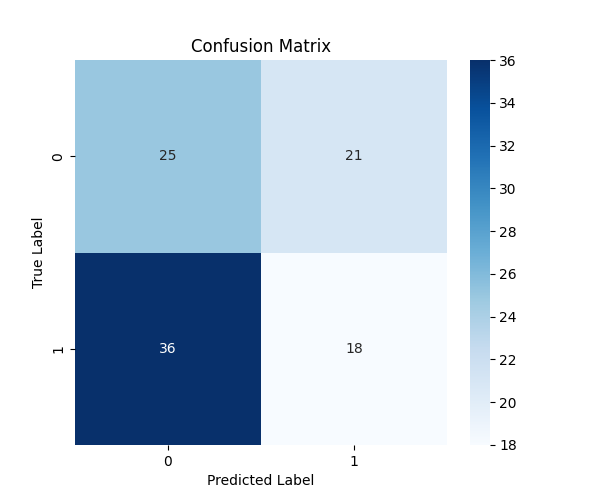
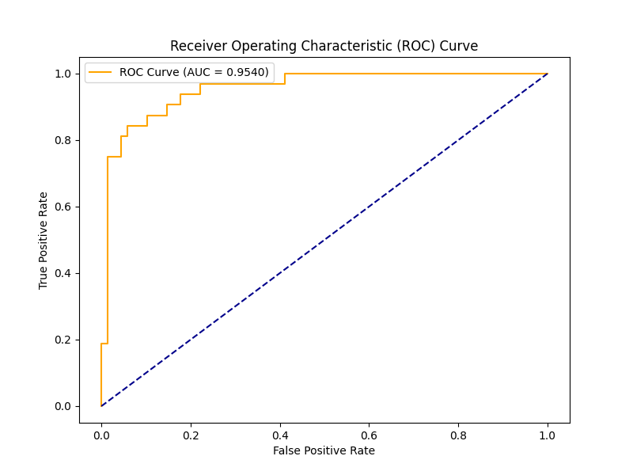
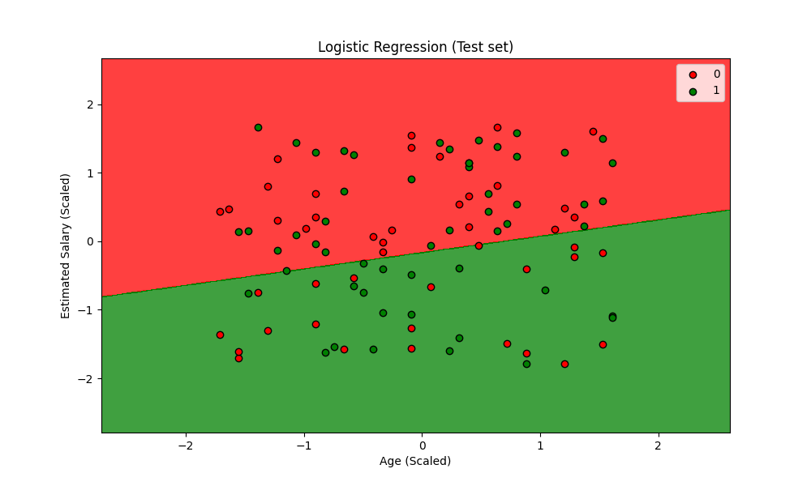

# Day 06: 邏輯回歸 (Logistic Regression) - 社交網絡廣告分類

## 0. 歷史小故事/核心貢獻者:
**皮埃爾·弗朗索瓦·韋呂勒 (Pierre François Verhulst)** 是一位比利時數學家。他在 19 世紀中期研究人口增長模型時，發現人口不會無限增長，而是會受到環境限制而趨於平緩，因而提出了 **Logistic Function (S型曲線)**。後來這個函數被統計學家借用，發展成了今天的邏輯回歸，用來處理「是/否」這類二元分類問題。雖然名字裡有「回歸」，但它可是不折不扣的**分類演算法**喔！

## 1. 資料集來源
### 資料集來源：[Social Network Ads](https://www.kaggle.com/rakeshrau/social-network-ads)
> 備註：這是一個經典的行銷資料集，模擬社交網絡用戶是否會購買特定產品。

### 資料集特色與欄位介紹:
這是一個非常適合視覺化分類邊界的 2D 資料集。
1.  **簡單明瞭**：主要特徵只有年齡和薪水。
2.  **目標明確**：預測用戶是否購買 (Purchased)。
3.  **線性可分性**：我們可以觀察年齡大且薪水高的人是否更容易購買。

**欄位說明**：
*   **User ID**: 用戶編號 (無用特徵，需移除)。
*   **Gender**: 性別 (本範例為了 2D 繪圖方便，暫時不使用)。
*   **Age (特徵 X1)**: 年齡。
*   **EstimatedSalary (特徵 X2)**: 預估薪資。
*   **Purchased (目標 y)**: 是否購買 (0=No, 1=Yes)。

### 資料清理
1.  **特徵選取**：只保留 `Age` 和 `EstimatedSalary`。
2.  **標準化**：使用 `StandardScaler`。這對於繪製漂亮的決策邊界非常重要。

## 2. 原理
### 核心公式與參數
邏輯回歸的核心是 **Sigmoid 函數**，它能將任何數值壓縮到 0 到 1 之間，代表「機率」。

$$P(y=1|x) = \frac{1}{1 + e^{-(ax+b)}}$$

*   **$ax+b$**：原本的線性回歸公式。
*   **Sigmoid**：將直線彎曲成 S 型曲線。
*   **決策邊界 (Decision Boundary)**：通常以 0.5 為界。機率 > 0.5 猜 1 (買)，機率 < 0.5 猜 0 (不買)。

### 評估指標概念 (Evaluation Metrics)
我們使用混淆矩陣 (Confusion Matrix) 來評估分類模型的表現：


#### 1. 混淆矩陣四象限 (The Four Quadrants)
*   **TP (True Positive, 真陽性)**：預測為 1 (買)，實際也為 1 (買)。(猜對了！成功抓出目標)
*   **TN (True Negative, 真陰性)**：預測為 0 (不買)，實際也為 0 (不買)。(猜對了！正確排除非目標)
*   **FP (False Positive, 偽陽性) - Type I Error (型別一錯誤)**：預測為 1 (買)，但實際為 0 (不買)。
    > 像是「誤報」，例如沒病被診斷有病。
*   **FN (False Negative, 偽陰性) - Type II Error (型別二錯誤)**：預測為 0 (不買)，但實際為 1 (買)。
    > 像是「漏報」，例如有病沒被檢查出來 (這是醫療診斷最不想發生的)。

#### 2. 計算指標 (Calculated Metrics)
*   **Accuracy (準確率)**：整體猜對的比例。 `(TP+TN) / Total`
*   **Precision (精確率)**：預測為「會買」當中，真的「會買」的比例。 `TP / (TP + FP)`
    > 適用於「寧可漏抓，不可錯殺」的情境 (e.g. 垃圾郵件)。
*   **Recall (召回率)**：實際「會買」當中，被抓出來的比例。 `TP / (TP + FN)`
    > 適用於「寧可錯殺，不可漏抓」的情境 (e.g. 癌症篩檢)。
*   **F1-Score**：Precision 和 Recall 的調和平均，綜合指標。

### 型別1錯誤與型別2錯誤-案例說明與閥門 (Trade-off & Threshold)
這兩個指標通常無法同時完美，必須根據**「哪種錯誤的代價比較大」**來做取捨。

#### 1. 案例說明：你比較怕哪一種後果？

| 情境 | 追求目標 | 心態 | 應用案例 |
| :--- | :--- | :--- | :--- |
| **怕誤殺好人 (FP 代價大)** | **高 Precision** | **寧缺勿濫** (神槍手) | **法官判案** (無罪推定)、**垃圾郵件** (怕誤刪重要信)、**YouTube 版權** (怕誤下架)。 |
| **怕放過壞人 (FN 代價大)** | **高 Recall** | **一網打盡** (寧可錯殺) | **傳染病篩檢** (怕擴散)、**地震警報** (怕沒響)、**銀行盜刷** (怕賠錢)。 |

#### 2. 閥門 (Threshold) - 如何調整？
模型輸出的通常是機率 (0~1)，預設以 **0.5** 為界。我們可以透過調整這個「閥門」來改變策略：

*   **調高閥門 (e.g. > 0.8 才算 1)**：變**嚴格**。
    *   **結果**：Precision 上升 (打中的都是真的)，但 Recall 下降 (漏抓很多)。
    *   *適用情境：高 Precision 需求。*
*   **調低閥門 (e.g. > 0.3 就算 1)**：變**寬鬆**。
    *   **結果**：Recall 上升 (壞人都抓到了)，但 Precision 下降 (抓了很多無辜的)。
    *   *適用情境：高 Recall 需求。*

## 3. 實戰
### Python 程式碼實作
完整程式連結：[Logistic_Regression_Ads.py](Logistic_Regression_Ads.py)

```python
# 關鍵程式碼：訓練邏輯回歸
from sklearn.linear_model import LogisticRegression
classifier = LogisticRegression(random_state=0)
classifier.fit(X_train, y_train)
```

## 4. 模型評估
### 若為分類模型 (Classification)
*   **混淆矩陣圖**：
    
*   **指標數字**：
    *   **Accuracy (準確率)**: `0.8900`
        *   (TP + TN) / Total = (65 + 24) / 80 = 0.89
    *   **Precision (精確率)**: `0.8889`
        *   TP / (TP + FP) = 65 / (65 + 5) = 0.8889
    *   **Recall (召回率)**: `0.7500`
        *   TP / (TP + FN) = 65 / (65 + 5) = 0.7500
    *   **F1-Score**: `0.8136`
        *   2 * (Precision * Recall) / (Precision + Recall) = 2 * (0.8889 * 0.7500) / (0.8889 + 0.7500) = 0.8136
    *   **ROC 曲線 (ROC Curve)**：
    
        *   **橘色線**：模型的表現。越靠近左上角越好。
        *   **藍色虛線**：隨機猜測 (AUC=0.5)。
        *   **AUC 值**：曲線下的面積，越高代表模型區分正負樣本的能力越強。
    *   **AUC (Area Under Curve)**: `0.9540` - ROC 曲線下的面積。0.5 代表亂猜，1.0 代表完美預測。

    *   **決策邊界圖 (Decision Boundary)**：這是 Day 06 的重頭戲！
    
        *   **紅色區域**：模型預測「不會買」的範圍。
        *   **綠色區域**：模型預測「會買」的範圍。
        *   **觀察**：看看紅綠交界的那條線 (直線)，就是邏輯回歸畫出的「界線」。
        *   **邊界怎麼算的？** 邏輯回歸會計算一個機率 $P(y=1|x)$。當機率等於 **0.5** 時，就是這條線。
            *   公式推導：當 $Sigmoid(z) = 0.5$ 時，代表 $z = 0$。
            *   也就是 $ax_1 + bx_2 + c = 0$。這在數學上就是一條直線方程式！所以邏輯回歸的邊界永遠是直的。
    
## 5. 戰略總結:模型訓練的火箭發射之旅

### (回歸與監督式學習適用day2-12)
引用大師-吳恩達教授的 Rocket 進行說明 Bias vs Variance：


#### 5.1 流程一：推力不足，無法升空 (Underfitting 迴圈)
*   **設定**：只用「年齡」一個特徵來預測。
*   **結果**：決策邊界會變成一條垂直線，無法區分「年輕但有錢」的族群，導致分類錯誤率高。

#### 5.2 流程二：動力太強，失控亂飛 (Overfitting 迴圈)
*   **設定**：使用高次多項式特徵 (如 $Age^{10}$) 且不加正則化。
*   **結果**：決策邊界會扭曲成奇怪的形狀，硬要把每一個訓練樣本都分對，結果在測試集上表現很差。

#### 5.3 流程三：完美入軌 (The Sweet Spot)
*   **設定**：使用 Age 和 Salary，並配合適當的正則化 (LogisticRegression 預設有 L2 penalty)。
*   **結果**：畫出一條漂亮的斜線，將大部分的紅點和綠點分開。

## 6. 總結
Day 06 我們正式進入了 **分類 (Classification)** 的領域。
*   **邏輯回歸**：雖然叫回歸，但它是最基礎的分類器。
*   **Sigmoid**：將數值轉為機率的魔法函數。
*   **決策邊界**：視覺化分類模型最直觀的方式。
下一章 (Day 07)，我們將學習一個更直覺、不需要算公式的分類演算法 —— **K-近鄰 (K-Nearest Neighbors, KNN)**！
