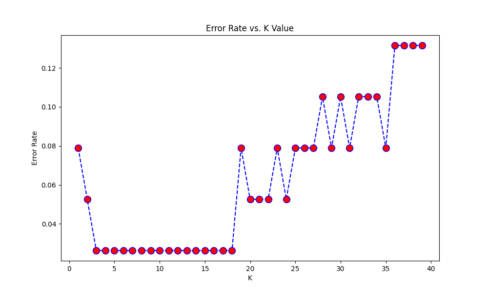

# Day 07: K-近鄰演算法 (K-Nearest Neighbors) - 鳶尾花分類

## 0. 歷史小故事/核心貢獻者:
**Evelyn Fix** 和 **Joseph Hodges** 在 1951 年提出了 KNN 的基礎概念，後來由 **Thomas Cover** 和 **Peter Hart** 在 1967 年進一步發展。KNN 被稱為「懶惰學習 (Lazy Learning)」的代表，因為它在訓練階段幾乎不做事 (只把資料存起來)，直到要預測時才開始計算距離。這就像是一個平時不讀書，考試前才瘋狂翻書找答案的學生！

## 1. 資料集來源
### 資料集來源：[Iris Dataset (鳶尾花資料集)](https://scikit-learn.org/stable/modules/generated/sklearn.datasets.load_iris.html)
> 備註：這是機器學習領域最著名的 "Hello World" 資料集，由統計學家 R.A. Fisher 在 1936 年整理。

### 資料集特色與欄位介紹:
這是一個多類別分類問題 (Multi-class Classification)。
1.  **類別平衡**：三個品種的樣本數一樣多 (各 50 筆)。
2.  **特徵清楚**：使用花萼 (Sepal) 和花瓣 (Petal) 的長寬來區分。
3.  **線性不可分**：其中兩類 (Versicolor 和 Virginica) 有部分重疊，適合用 KNN 這種非線性分類器來切分。

**欄位說明**：
*   **sepal length (cm)**: 花萼長度。
*   **sepal width (cm)**: 花萼寬度。
*   **petal length (cm)**: 花瓣長度 (區分品種的關鍵特徵)。
*   **petal width (cm)**: 花瓣寬度。
*   **target (目標 y)**: 品種 (0=Setosa, 1=Versicolor, 2=Virginica)。

### 資料清理
1.  **無需缺失值處理**：Iris 資料集非常乾淨。
2.  **標準化 (Standardization)**：**非常重要！** 因為 KNN 是計算「距離」的，如果某個特徵數值很大 (e.g. 薪水 50000)，另一個很小 (e.g. 年齡 30)，距離會被大數值主導。但在 Iris 資料集中，雖然單位都是 cm，但標準化仍是好習慣。

## 2. 原理
### 核心公式與參數
KNN 的核心觀念就是：「物以類聚，人以群分」。要判斷你是哪一類，看你鄰居是誰就知道了。

1.  **歐式距離 (Euclidean Distance)**：計算兩點之間的直線距離。
    $$d(x, y) = \sqrt{\sum_{i=1}^n (x_i - y_i)^2}$$
2.  **K 值 (K-Value)**：要參考幾個鄰居？
    *   **K 太小 (e.g. K=1)**：容易受雜訊影響 (Overfitting)。
    *   **K 太大 (e.g. K=100)**：邊界變模糊，分類變遲鈍 (Underfitting)。
3.  **投票機制 (Majority Vote)**：K 個鄰居中，哪個類別最多，就歸為哪一類。

## 3. 實戰
### Python 程式碼實作
完整程式連結：[KNN_Iris.py](KNN_Iris.py)

```python
# 關鍵程式碼：訓練 KNN
from sklearn.neighbors import KNeighborsClassifier
# n_neighbors=5: 參考最近的 5 個鄰居
# metric='minkowski', p=2: 使用歐式距離
classifier = KNeighborsClassifier(n_neighbors=5, metric='minkowski', p=2)
classifier.fit(X_train_scaled, y_train)
```

## 4. 模型評估
### 若為分類模型 (Classification)
*   **混淆矩陣圖**：
    
*   **指標數字**：
    *   **Accuracy (準確率)**: `0.9737` (38 筆測試資料中，只錯了 1 筆)
    *   **Confusion Matrix 觀察**：
        *   Setosa (類別 0) 全部猜對 (13/13)。
        *   Versicolor (類別 1) 猜對 15 筆，錯 1 筆 (被誤判為 Virginica)。
        *   Virginica (類別 2) 全部猜對 (9/9)。
    
*   **決策邊界圖 (Decision Boundary)**：
    
    *   **觀察**：這張圖是用「花瓣長度」和「花瓣寬度」畫出來的。
    *   **非線性邊界**：注意看紅色、綠色、藍色區域的交界處，不再是直線，而是不規則的曲線。這就是 KNN 強大的地方，它可以適應各種形狀的資料分佈。

*   **K 值選擇 (Elbow Method)**：
    
    *   我們測試了 K=1 到 40。
    *   可以發現 K 在 5 到 18 之間錯誤率都最低。通常我們會選一個較小的奇數，例如 K=5。

## 5. 戰略總結:模型訓練的火箭發射之旅

### (回歸與監督式學習適用day2-12)
引用大師-吳恩達教授的 Rocket 進行說明 Bias vs Variance：


#### 5.1 流程一：推力不足，無法升空 (Underfitting 迴圈)
*   **設定**：K 值設得非常大 (例如 K=100，接近訓練集總數)。
*   **結果**：無論新資料在哪，都會被歸類為數量最多的那一類 (Majority Class)。決策邊界消失，模型學不到東西。

#### 5.2 流程二：動力太強，失控亂飛 (Overfitting 迴圈)
*   **設定**：K=1 (只看最近的那一個鄰居)。
*   **結果**：決策邊界會變得非常破碎，包圍住每一個雜訊點。雖然訓練集準確率 100%，但對新資料的預測很不穩定。

#### 5.3 流程三：完美入軌 (The Sweet Spot)
*   **設定**：K=5，並配合適當的距離計算方式。
*   **結果**：決策邊界平滑且合理，能有效區分三個品種，且對少量的雜訊有容錯能力。

## 6. 進階補充 (Advanced Topics)
面試或實務上常被問到的 KNN 細節：

### 6.1 距離的權重 (Weighted KNN)
*   **Uniform (預設)**：票票等值。只要在 K 個鄰居內，無論遠近，影響力都一樣。
*   **Distance**：**距離越近，權重越大** (通常是 1/距離)。
    *   **優點**：解決樣本不平衡問題。例如 K=5，雖然身邊有 3 個 A 類 (遠)、2 個 B 類 (極近)，Weighted KNN 會判斷你是 B 類，這通常更合理。

### 6.2 距離的度量 (Distance Metrics)
*   **歐式距離 (Euclidean, p=2)**：標準的直線距離 (兩點間最短路徑)。
*   **曼哈頓距離 (Manhattan, p=1)**：像在棋盤格子上走路，只能走直角 (絕對值總和)。
*   **Minkowski Distance**：這是上述兩者的通式。在 sklearn 中透過 `p` 參數調整 (p=1 為曼哈頓，p=2 為歐式)。

### 6.3 維度災難 (Curse of Dimensionality)
*   **問題**：KNN 在特徵很少 (低維度) 時效果很好，但當特徵變多 (例如 100 個特徵) 時，空間會變得非常「空曠」。
*   **結果**：點與點之間的距離會變得差不多遠，「最近鄰居」失去意義，導致分類效果急劇下降。
*   **解法**：這也是為什麼我們後面要學 **PCA (Day 16)** 來進行降維。

## 7. 總結
Day 07 我們學習了 **KNN (K-Nearest Neighbors)**。
*   **直覺**：近朱者赤，近墨者黑。
*   **非線性**：能畫出不規則的決策邊界。
*   **懶惰學習**：訓練快 (幾乎不用算)，預測慢 (要算所有距離)。
*   **標準化**：記得一定要做 Feature Scaling！
下一章 (Day 08)，我們將進入 **樸素貝氏 (Naive Bayes)**，這是一個基於機率與統計的強大分類器，特別適合處理文字資料 (如垃圾郵件過濾)！
